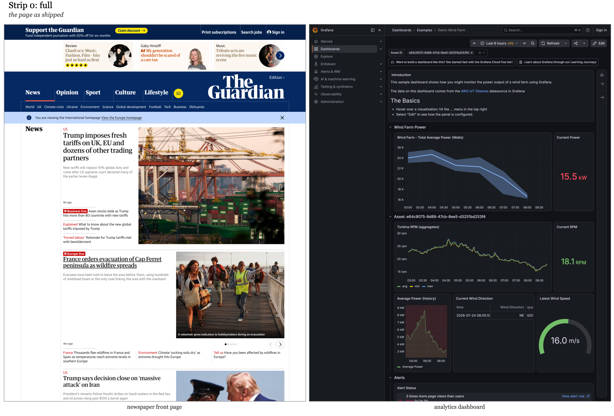
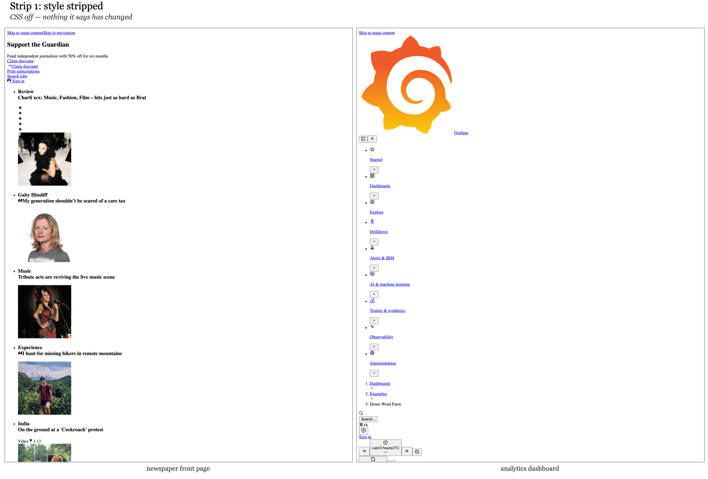
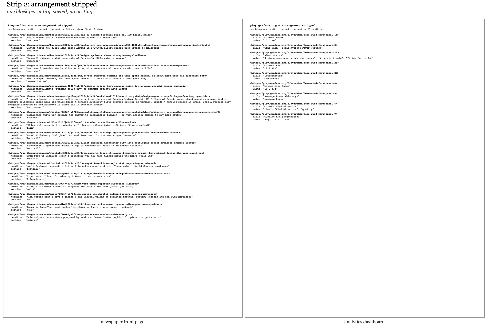
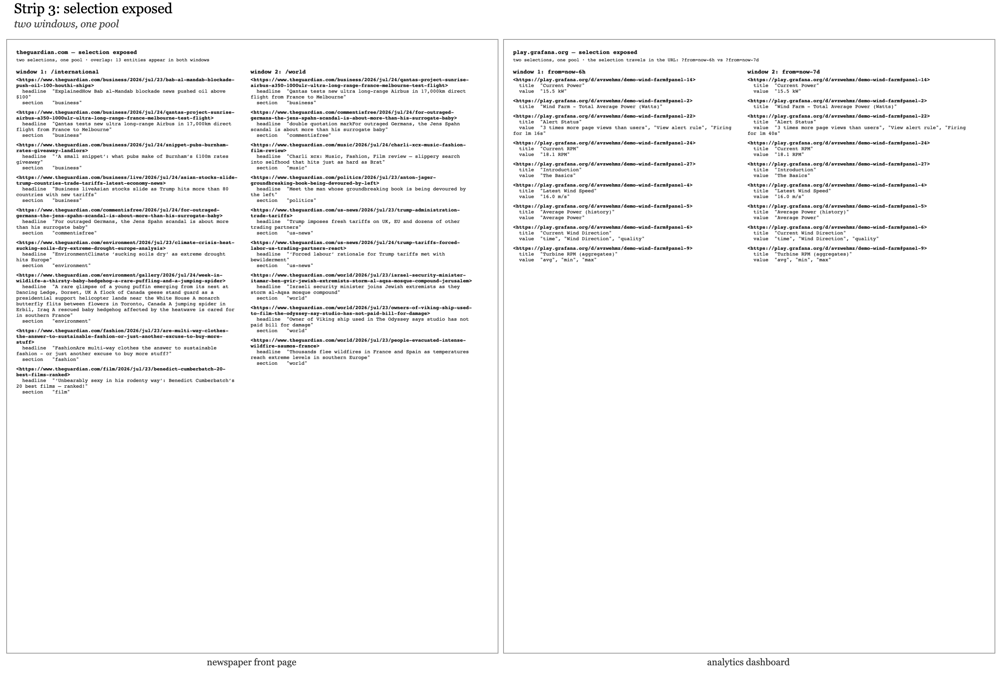
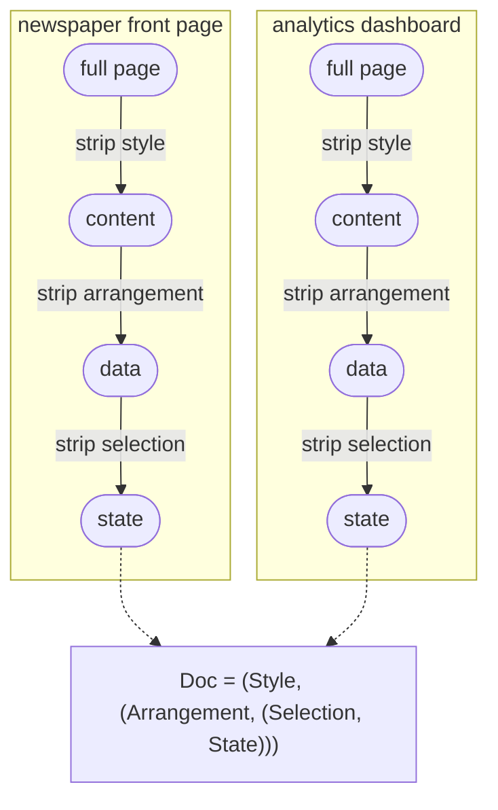
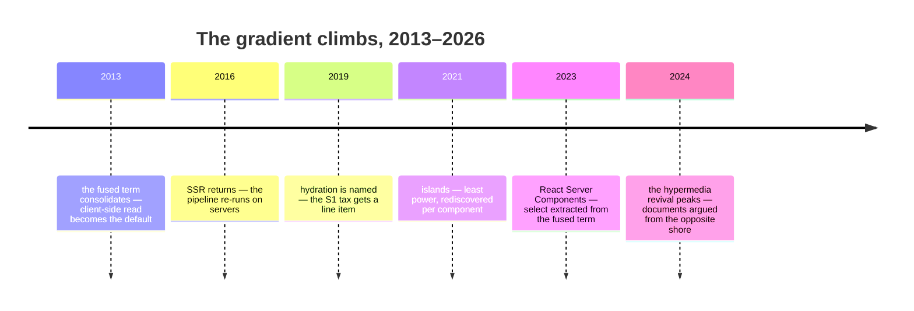

# First Principles of the Web

### *Graphs are not the thing, they are the thing that gets us to the thing*

**Martynas Jusevičius — DRAFT 0.1**
*[martynas@atomgraph.com](mailto:martynas@atomgraph.com) · [atomgraph.com](https://atomgraph.com) · [GitHub](https://github.com/namedgraph) · [X](https://x.com/namedgraph)*

> *Status: all eighteen chapters and Appendices A–D in prose, with exhibits, scored audit columns, and full proofs (C.1–C.8); the Chapter 15 reconstruction exhibit, mechanization, and the online edition are under construction. Full ledger in the Draft-status table at the end. Feedback is most valuable on R1–R3, the arity argument, and the Transposition Thesis (Chapter 5, Appendix C) — if something is smuggled, it is there.*

---

## Preface

The claim: there is exactly one way to build applications that are *of* the web rather than merely *on* it, and it is data-centric, declarative, and graph-based. "Exactly one" is meant relative to rules the web itself imposes — the book derives the rules, and shows what rejecting each one costs. Everything else — the JSON APIs, the JavaScript frameworks, the compile-to-browser toolchains — is either a partial rediscovery of this way or a detour from it.

The book is structured as a derivation, and every statement in it is one of three things: a definition quoted from the web's own specifications, a proposition that follows from previous statements, or an observation you can verify against deployed reality. If you find a statement that is none of the three, the book has a bug, and I would like a report. Method, notation, and reading tracks are in Appendix A.

One more thing. This book is built to practice what it derives: its canonical edition is designed as a linked-data application in which every proposition is a dereferenceable resource — an instance of its own thesis. As this draft circulates, that edition is under construction: a receipt the book owes. Receipts, as I like to say.

---

## The Argument in One Page

A web application is two functions. `read` turns a request and the state of the world into a document; `write` turns a request and a state into a new state. That is HTTP restated, and every framework ever shipped is an implementation detail of it.

Strip any page — a newspaper, a dashboard — and the same skeleton emerges: style peels off, then arrangement, then selection, and what remains is state. So every `read` factors as `present ∘ arrange ∘ select`, and the factorization matters exactly when the factors are separate, declarative, substitutable, and addressable.

Ask what `State` must be, and the web itself answers. It must host any domain. It must compose across parties who have never met — which forces merging by union, over facts that carry their own meaning. Its names must work globally. The smallest fact meeting all three requirements is a triple — two global names and a value that may itself be one — and any minimal model meeting them is isomorphic to sets of triples under union. The uniqueness is a theorem; to reject its conclusion you must reject one of the requirements.

The reveal: the structure just derived is RDF, SPARQL, XSLT, and CSS — standardized between 1996 and 2014, then abandoned rather than refuted. The audit: everything the industry runs instead fails a named requirement and pays for the failure with a compensating industry; by the last chapter, one table carries every score. The invoice: software agents now need exactly the property the industry declined — machine-consumable state — and the compensating machinery is assembling in real time, at industry scale.

If the derivation holds, the next web needs no inventing; it waits to be occupied. The rest of this book is the proof, the prices, and the receipts.

---

# Part I — The Object

## Chapter 1. What the Web Is

Nothing in this chapter is mine. That is the point of it.

The web ships with its own definitions, and they are shorter than folklore remembers. There are identifiers:

```
I     the set of URIs                                    (RFC 3986)
```

There are requests, which are built from identifiers:

```
Req = I × Method × Headers                               (RFC 9110)
```

And there are documents — the things a user agent displays. Call that domain `Doc`, and leave its internals alone for now.

**Definition 1.1.** A *web application* is a pair of functions:

```
read  : Req × State → Doc
write : Req × State → State
```

This is HTTP restated. `read` is what the safe methods do — `GET` takes a request and the current state of the world and produces a document. `write` is what the unsafe methods do — `POST`, `PUT`, `PATCH`, `DELETE` take a request and a state and produce a new state. Every web application you have ever used, from a static homepage to the heaviest single-page monster, implements these two functions, because HTTP gives it no other way to be an application on the web. The framework it was built in is an implementation detail of Definition 1.1.

Notice what the definition does *not* say. It does not say what `State` is. That omission is deliberate, and it is the engine of this book. Definition 1.1 is a question wearing the costume of a definition: *what must State be?* Parts II and III are the answer, and the answer will be forced, not chosen.

> **Prop. 1.2.** Every deployed web application implements Definition 1.1. *(Verification: RFC 9110 §9; there is no third kind of method.)*
>
> **Prop. 1.3.** Definition 1.1 constrains architecture not at all. Both a 1993 CGI script and a 2026 React application inhabit it. *(This is why the definition is safe as an axiom — no one on any side of any framework war can reject it.)*

The chapter closes with a reading of the web's history that the rest of the book will substantiate: the web succeeded against its contemporaries — Gopher, BBSs, desktop applications, and Java applets, an experiment Chapter 12 reruns — because its `read` was *transparent*. Documents were declarative, addressable, linkable, indexable. Every technology audited in Part IV will turn out to be a position on exactly one question: how transparent is your `read`?

---

## Chapter 2. Lateral Churn

There is a term worth repurposing for what has happened to web technology over the last twenty years: **lateral churn**. It is the kind of activity that looks like innovation but isn't.

Since the early 2000s, the web community has executed the largest format migration in its history: XML to JSON. Two decades of rewritten APIs, retired toolchains, retrained developers. And what changed? We replaced one set of brackets with another. The data model underneath — a tree of nested containers — is conceptually identical. What we *lost* is quantifiable: namespaces, a standard schema language, a standard query language (XPath), a standard transformation language (XSLT), addressability into documents. The industry's largest migration was orthogonal to every property that matters, and its tooling delta was strictly negative.

You can hate XSLT's syntax all you want. Syntax is not a property. In ten years the current JavaScript frameworks will be forgotten, and XSLT will still be running; standardized declarative semantics buys a lifespan that no framework's API surface can.

Real innovation is vertical: new layers, new semantics, new abstractions on top of what already works. That is how the web was designed to grow, and this book will show — formally — that the vertical direction was available the entire time. Imagine where we would be if those twenty years had been spent building upward.

This chapter carries no proof weight; it is motivation, and it is honest about that. But it plants the question the derivation will answer: if the XML→JSON migration was lateral, what would *vertical* have looked like? To answer that we need to know what the layers actually are. So let's find out — by taking a web page apart.

| 1999 | 2019 |
|---|---|
| `<person><name>Ada</name></person>` | `{"person":{"name":"Ada"}}` |

*Twenty years of progress. The book's only sarcastic figure caption; it has earned it.*

---

# Part II — The Derivation

*Part I defined a web application as two functions and refused to say what `State` is. This part earns the answer: the factorization every `read` admits, the properties that make it real, and the forcing of `State` itself.*

## Chapter 3. Stripping the Page

Take two websites that could not be more different — a newspaper front page and an analytics dashboard. Print them. Now strip them, one layer at a time, and watch the same skeleton emerge from both. The exhibits below do exactly that, to real pages: the Guardian's international front page and a Grafana wind-farm monitoring dashboard, captured on the same morning.



*The starting material. One page is paper-white and editorial, the other black and numerical; they share, apparently, nothing.*

**Strip the style.** Turn off CSS, switch to reader view, print in monochrome. The page looks different; nothing it *says* changes. So a document factors:

```
Doc = (Style, Content)
```

The justification is already deployed on every device you own: dark mode, print stylesheets, reader view, accessibility themes — style varies while content holds fixed.



*CSS off. The newspaper still says everything it said — headlines, bylines, photographs, in browser-default dress. Note the asymmetry on the right, and file it for Part IV: stripping style from the newspaper leaves the news; stripping it from the dashboard leaves mostly chrome. The headline numbers survive as text, but the time-series curves were never in the document at all — they are pixels on a canvas.*

**Strip the arrangement.** The same content appears as a table on desktop, a card list on mobile, a chart in the summary view. The facts are identical; their shape as a document differs. So content factors:

```
Content = (Arrangement, Data)
```

The justification is every "view toggle" on the web: same data, different tree.



*Arrangement off. Both pages now speak the same format: one block per entity, sorted, no nesting. A headline with a section; a panel title with a value. The two sites that shared nothing now differ only in vocabulary.*

**Strip the selection.** Every page shows a sliver of something much larger. The article page and the front page draw from the same pool; your dashboard shows this month, but last month exists. So data factors:

```
Data = (Selection, State)
```

Pagination, filters, search: deployed proof that the page is a window, not the world.



*Selection made visible: two windows over one pool. On the left, `/international` and `/world` share 13 entities — the same articles, drawn twice. On the right, the same dashboard at `?from=now-6h` and `?from=now-7d` — the selection travels in the URL, in public, where anyone can change it.*

Three strips, and both of our maximally different sites have reduced to the same expression:

```
Doc = (Style, (Arrangement, (Selection, State)))
```



*Two maximally different sites, three strips, one skeleton — the exhibits above, as a schematic.*

<div class="fp-exhibit" data-exhibit="strip"></div>

*Interactive exhibit (online edition): the strip, performed rather than photographed — the dashboard rebuilt live, each layer removed and restored in place.*

Two examples prove nothing about all websites; the strips are illustration. The universal claim is Chapter 4's theorem, quantifying over every `read` at once. This chapter makes you feel it; the next one proves it.

---

## Chapter 4. The Factorization

Chapter 3's strips, read as function types:

```
select  : Req × State → Data          which facts
arrange : Data → Tree                  what structure
present : Tree → Doc                   what appearance

read = present ∘ arrange ∘ select                        (4.1)
```


*The pipeline of (4.1). Rectangles are the factors; rounded nodes are values — and under S4, every rounded node is a web resource: it has a URI and dereferences.*

**Prop. 4.2 (Existence, trivial).** Every `read` factors as (4.1). *Proof:* let `select` and `present` be identities up to retyping and stuff the entire application into `arrange`. ∎

Proposition 4.2 is true and worthless, and I state it precisely so we can see *why* it is worthless: a factorization tells you nothing unless the factors are genuinely separate. The entire content of "declarative architecture" — a phrase the industry uses as a mood — cashes out as four checkable properties of a factorization. This is the book's central definition.

**Definition 4.3.** A factorization (select, arrange, present) is **proper** iff:

**S1 — Obliviousness.** Each factor communicates with the next only through its output. `arrange` sees data, never the request. `present` sees a tree, never the data. No side channels: `arrange` and `present` are constant in `Req` and `State` except through their arguments.

**S2 — Declarativity.** Each factor is the *meaning of a term in a language* — there exist languages Q, X, S with independently defined semantics such that `select = ⟦q⟧`, `arrange = ⟦t⟧`, `present = ⟦s⟧`. This is what "declarative" means once you cash it out: the meaning of the query does not depend on the stylesheet, because each language's semantics is closed.

**S3 — Substitutability.** Replace any factor with another term of its language and you still have a web application; the change is confined to that factor's concern.

**S4 — Addressability.** Every intermediate value is itself a web resource: the data produced by `select` has a URI and is dereferenceable, independently of the document it is destined to become.

S1–S3 could describe any well-factored program. S4 is the web condition: the factorization itself goes public, *exposed through the web's own reference mechanism*. An application satisfying S1–S4 is part of the web at every layer, not only at its rendered surface.

Three of these properties were written down by the web's own architects — as advice. [*Architecture of the World Wide Web, Volume One*](https://www.w3.org/TR/webarch/) (W3C Recommendation, 2004; hereafter AWWW) names the separation of content, presentation, and interaction a good practice (§4.3), orthogonal and composable specifications a principle (§5.1), and asks URI owners to provide representations of their resources (§3.5) — S4's demand, minus the intermediates. All of it stated as SHOULD, because a recommendation can do no more than recommend. Hold that until Proposition 4.4: what the TAG could only advise, the derivation forces. The norms were theorems all along. And note the ledger discipline: AWWW is a witness here, never a premise — assuming §4.3 would be assuming this chapter's conclusion, and the method forbids borrowing conclusions.

The payoff of S4 is immediate and measurable, and it is [Fielding's](https://www.ics.uci.edu/~fielding/pubs/dissertation/top.htm) payoff: HTTP caching per stage rather than per page; crawlability of *data* rather than of renderings; intermediaries; independent evolution of the layers. The last of these will harden from a phrase into a proposition before the chapter ends. Every one will reappear in Part IV, as an itemized cost, paid by every architecture that forfeits it.

**Prop. 4.4 (Analysis theorem).** Every `read` whose output depends on `State` only through some finite part admits a proper factorization.

<details>
<summary><i>Proof sketch — take the minimal fragment the output depends on.</i></summary>

Define `select(r, S)` as the minimal fragment of S on which `read(r, ·)` actually depends — well-defined by finiteness; `arrange` and `present` are the induced quotients; S1 holds by construction, S2–S4 by choosing the languages of Part III. Full proof in Appendix C. ∎

</details>

Proposition 4.4 is what Chapter 3 was illustrating: stripping a real page is *computing its proper factorization by hand*, and the theorem guarantees the exercise terminates for every site — including every site not yet built.

The debt to Fielding runs deeper than the payoff list. REST was the last serious attempt to *derive* web architecture rather than fashion it — constraints applied stepwise, properties earned per constraint — the method this book inherits and pushes to theorem grade. But REST constrains the conversation and leaves the vocabulary open: it says how representations must transfer — statelessly, cacheably, through a uniform interface — and declines, deliberately, to say what a representation or the state behind it must *be*. That open question is this book's subject. Chapter 5 closes it, and the closure was unavailable to REST's own method in 2000: the answer had been standardized only the year before, and the pressure that makes it visible — machines reading the web — was two decades out. Read this book as the second half of a derivation whose first half Fielding wrote.

His deepest constraint is also his least defined: the **uniform interface** — in Fielding's own accounting the central feature that distinguishes the web from every prior architecture, delivered as four clauses of prose (§5.1.5) and never formalized. "Uniform" is the quantifier: one signature for every application — which is why Definition 1.1 could open this book by fitting every web application ever built, and why Part V can close it with one application for every domain. The interface was always uniform; the state beneath it was not. Chapter 5 is what finishing the thought costs.

<details>
<summary><i>The four clauses, typed — one per component. (Borrows names from Chapter 7; return here after the centerfold.)</i></summary>

| Fielding's clause (§5.1.5) | typed here as |
|---|---|
| identification of resources | `I` — one name space; R3, S4 |
| manipulation of resources through representations | Definition 1.1 — `read` and `write` exchange representations; the delta normal form is the write's |
| self-descriptive messages | self-containedness — C-2d, at the message's scale |
| hypermedia as the engine of application state | the five moves — every transition a link in the document |

</details>

Definition 4.3 has one more consequence to give, and it can be collected now at no cost. Nothing in this chapter has mentioned time. HTTP has. A representation, per RFC 9110 §3.2, reflects "a past, current, or desired state of a given resource" — state *at a time*. And the protocol ships an apparatus whose only job is telling a resource's representation at one moment from its representation at another: `Last-Modified` and `ETag` (RFC 9110 §8.8), and the caching calculus built on them (RFC 9111). The web's own specifications already treat the document as a sequence of states; the axiom comes ready-made. Index the moving parts — writing `τ` for time, since `t` is taken:

```
S : T → State                                  the world, over time
read_τ = present_τ ∘ arrange_τ ∘ select_τ      the application, over time
doc(r, τ) = read_τ(r, S(τ))                    what the user agent renders
```

Four components can move: the state `S(τ)` and the three factors. Each movement has a name you already know. The state advances when someone writes — Chapter 7's whole subject. A factor changes only one way — by substituting its term (that is S3 read temporally): the selection when a query is revised and redeployed, the arrangement when a layout switches or a template ships, the presentation when the theme changes. And one thing that looks like movement is not: a user paging forward or tightening a filter changes nothing in the application. The filter travels in `r`, and `select` is the same term evaluated at a new argument. A model that time-indexes the selection to accommodate a mouse click has confused the function with its argument — I know, because an earlier formalism of this chapter did exactly that. The four timelines belong to the application; navigation belongs to the request.

**Prop. 4.5 (Independent evolution).** In a proper factorization, the document's evolution decomposes into four independent timelines, one per component `(S, select, arrange, present)`: a change to any one component changes the document without requiring a change to, or the participation of, any other. In the fused factorization of Prop. 4.2 there is one component and therefore one timeline: every change, of whatever kind, is a change to the whole.

<details>
<summary><i>Dependencies — S1 confines, S2 closes, S3 substitutes; proof in Appendix C.</i></summary>

Depends on 4.3: S1 confines a change's effect to its factor's output; S2 closes each term's semantics, so substituting a term of one language cannot alter the meaning of a term in another; S3 guarantees the substituted term still yields a web application. Proof: Appendix C.

</details>


*Prop. 4.5, drawn. Above: each component advances alone, and caches invalidate per component. Below: every change, of whatever kind, is a change to the whole — and invalidates the whole.*

The corollary is Fielding's payoff from a few paragraphs ago, now holding a mechanism. Under S4 each intermediate value is a resource; each resource has a URI; each URI carries its own validator — its own `ETag`, its own timeline, legible to every cache on the path. A theme change invalidates one stylesheet resource, and the data it styles stays cached at its own age, untouched. Collapse the factorization and there is one resource — the bundle — with one validator, and the corollary inverts: any change, of any kind, invalidates everything. Chapter 11 will present this as an invoice.

And the industry already operates all four timelines — one layer down. Fingerprinted stylesheets shipped with `Cache-Control: immutable`; data responses marked `no-store`; templates deployed on their own cadence. Every serious deployment on the web runs per-component timelines at the delivery layer, including deployments whose application architecture denies that the components exist. Independent evolution already runs in production, one layer below the framework that obscures it.

One thread left dangling, on purpose: `select` selects *from State*, and State is still abstract. The factorization cannot be completed until we know what it is a factorization *over*. That is Chapter 5, and it is where the book stops describing and starts forcing.

---

## Chapter 5. What State Must Be

We need `State` to stop being abstract. But I am not allowed to choose its structure — the method of this book forbids taste. Structure must be *forced*, and it will be forced by three requirements. Each comes from the web itself, not from me.

**R1 — Universality.** The web hosts every application domain there is or will be. Therefore `State` must encode arbitrary application state, with no domain structure baked in. *(Source: the observable web. Try to name the domain the web is "for.")*

**R2 — Coordination-free composition.** The web has no central schema authority — by design; decentralization is what "world wide" means. Therefore state held by independent parties who have never communicated must be composable. Composition without coordination has laws: it must accept any two states (checking compatibility is coordinating), in any order (agreeing an order is coordinating), with duplicates free (tracking copies is coordinating). And it preserves meaning only if the things composed are *self-contained* — a fact must carry its full meaning with it, because no surrounding structure survives a merge. Those four laws leave exactly one composition, and Appendix C proves it — set union:

```
State = 𝒫(Fact)        merge = ∪                          (5.1)
```

State is a *set of atomic facts*, and two states, from any two parties, anywhere, compose by union. Order-free, idempotent, associative, commutative — every property that federation needs, purchased in one move.

Flagged in the open: the passage from "no coordinator" to these merge laws is the one bridge in the derivation. I name it the **Transposition Thesis**: the invariants the web already enforces at its document layer, transposed to the state layer, are exactly the merge laws just used — and I claim the transposition is exact, row by row; the table below is the claim in checkable form. It carries corroboration from a field with no stake in this book's thesis: distributed-systems research, pressed by replicas that must converge without coordination, derived the same laws as theorems (the CRDT literature). Two fields, disjoint motives, one algebra — the merge laws are not a matter of taste.

<details>
<summary><i>The transposition, row by row — four deployed invariants, four laws.</i></summary>

| the document layer, deployed | the state layer, transposed |
|---|---|
| anyone links to anything; no one is asked | composition is total — no compatibility check (C-2a) |
| content arrives by any path; intermediaries reorder it freely | composition is order-free (C-2b) |
| copies are free and unmarked; the cache hit *is* the resource | composition is idempotent (C-2c) |
| aggregators consume content outside its original arrangement, without its publisher's consent | no meaning survives in arrangement (C-2d) |

Each left cell is deployed and citable — RFC 9111 carries the middle two, AWWW's global-identifiers principle the first, and the last is every search engine and feed reader in operation. Each right cell is a numbered condition in Appendix C; C.4 proves none is redundant. Appendix D carries the CRDT citation — state-based replication requires a join-semilattice: totality, order-freedom, idempotence, derived there from replication pressure alone. The theorem downstream is about the web exactly as far as this table holds.

</details>

**R3 — Global reference.** A fact on one site can be about an entity described on another; the web's entire value proposition is that things link. Therefore names *inside* facts need global scope. The web possesses exactly one global naming system — `I`, the URIs from Chapter 1 — and inventing a second one would itself violate R2 (two parties' private naming schemes collide on merge). So references in facts are drawn from `I`. And note what R3 does and does not ask: names must be global; nothing requires that they dereference. That they *can* — that the naming system and the web's address system are one — is the construction's gift, and Chapter 15 pays the toll that gift charges.

Now the question with a genuinely satisfying answer: what is the smallest self-contained fact? And "smallest" is not an aesthetic preference. Every position a fact carries beyond need is a position whose use independent parties must somehow agree on, and agreement is what R2 forbids — minimality is coordination-avoidance at the level of shape. When a genuine requirement funds an extra position, the derivation will grant it; Chapter 9 does exactly that.

**Prop. 5.2 (Arity).** The minimal self-contained fact is a triple.

<details>
<summary><i>Argument — a pair cannot name its own relation: <code>(employee42, "2026-07-08")</code> is hired-on, or fired-on, or born-on.</i></summary>

A 1-tuple `(x)` asserts nothing — it names without claiming. A pair `(entity, value)` asserts a relation but cannot say *which* relation — `(employee42, "2026-07-08")` is hired-on, or fired-on, or born-on; the meaning lives outside the fact, which R2 forbids. Three positions — `(entity, attribute, value)` — is the first arity at which a fact names its own relation. And it is the last arity we need: any n-ary fact decomposes into triples by introducing an entity for the fact and attaching its n components as attributes. Minimality and universality pin the arity at exactly three. ∎

</details>

R3 forces the entity position into `I`. It forces the *attribute* position into `I` too — attributes need global names just as much, or two sources cannot know they mean the same property, and R2 dies at the first merge. The value position is either a reference or an atomic literal:

```
Fact  = I × I × (I ∪ V)                                   (5.3)
State = 𝒫(I × I × (I ∪ V))
```

Chapter 3's exhibit already wrote facts in this shape without saying so. The dashboard's strip-2 block was one entity and two attributes — two facts, exactly: `(⟨…#panel-14⟩, title, "Current Power")` and `(⟨…#panel-14⟩, value, "15.5 kW")`. Entity in `I`, attribute in `I`, value in `V`. The exhibit was the theorem, photographed early.

<div class="fp-exhibit" data-exhibit="merge"></div>

*Interactive exhibit (online edition): two parties who have never met. Edit either side, shuffle, duplicate — the union absorbs everything except new facts, and (5.1) is something you fail to break rather than something you believe.*

**Theorem 5.4 (Uniqueness).** Any arity-minimal state model satisfying R1–R3 is isomorphic to (5.3). *(Proof: Appendix C. The proof is an assembly of 5.1–5.3: R2 forces the set-of-atomic-facts shape and union-merge; R1 with minimality forces arity three; R3 forces positions one and two into `I`.)*

Sit with what this theorem does to the word "only" in this book's thesis. "The only native way" sounds like rhetoric; Theorem 5.4 makes it a statement with an escape clause, and the escape clause is the trap. To reject the conclusion you must reject a requirement, and each rejection has a name. Reject R1 and your model can't host the web's content. Reject R2 and your data needs a coordinator — a central schema authority, which is to say: you have built a silo. Reject R3 and your data cannot refer beyond itself — a silo again, by the other door. Reject minimality and you widen the tuple — a door left deliberately ajar; Chapter 9 walks through it with R4. Every alternative data model the industry runs on will be located, in Part IV, at one of the first three exits.

We are not done deriving — the same pattern now runs once more, one level up, quickly. `select` needs a minimal algebra over `𝒫(Fact)`: match a fact pattern with variables; join matches; union alternatives; project variables out. Each operation is forced by a page you can point at (any master–detail page is a join; any search page is a pattern). `write`, by (5.1), reduces to two sets: facts added and facts removed — the *delta*, and nothing else, because there is nothing else a set can do. Keep these in your pocket. They are about to become recognizable.

<div class="fp-exhibit" data-exhibit="select"></div>

*Interactive exhibit (online edition): the algebra, exercised — patterns with variables, joined and projected over the state merged above. One preset only answers because the merge happened: it joins the operator's facts to the contractor's.*

---

## Chapter 6. The One Type-Crossing

Look at the pipeline's types: `State` and `Data` are *graphs* — facts whose references form arbitrary many-to-many webs. `Tree` and `Doc` are *trees* — documents are hierarchical, and so is human reading. The pipeline crosses from graph to tree exactly once, inside `arrange`.

**Prop. 6.1.** Every web framework in history is, whatever it believes about itself, a strategy for this one crossing.

That is a classification theorem, and it will do Part IV's heavy lifting. But first the crossing must be tamed, because there's a wrinkle: serialization is a *relation*, not a function — one graph, many trees (orderings, nestings, groupings). The fix is canonicalization:

```
arrange = ⟦t⟧ ∘ canon
canon : Data ↣ Tree      canonical, deterministic, structure-free
t                        the sole locus of graph→tree structural choice
```

`canon` is the graph wearing tree clothing — one block per entity, sorted, no nesting, no sugar. *All* structural decisions (what nests under what, what becomes a section versus a sidebar) move into the declarative term `t`, where S2 can hold. The historically hard case — facts about unnamed entities — has a standardized deterministic answer as of 2024 (canonicalization of blank node labels; the reveal chapter will name the spec).

And you have already seen `canon`'s output. Strip 2 *is* it: the dashboard reduced to sorted blocks, one per panel, `title` and `value` beneath. The exhibit's format was never a design choice for the figure — it was the canonical serialization, arrived at by stripping.

The three properties `canon` must have — deterministic, lossless, structure-free — are satisfiable, and cheaply:

**Prop. 6.2.** A `canon` with all three properties exists.

<details>
<summary><i>Proof — sort lexicographically; unnamed entities pay Chapter 9's bill.</i></summary>

For ground states, order the atoms lexicographically by their three positions and emit one block per subject. The map is a function because a total order on tuples exists; lossless because the atom set is recoverable by reading the blocks back; structure-free because the order is defined by the atoms alone, never by their provenance or grouping. States with unnamed entities need a canonical labeling first; that labeling exists, is standardized, and is billed in Chapter 9. ∎

</details>

<div class="fp-exhibit" data-exhibit="canon"></div>

*Interactive exhibit (online edition): shuffle the input as many times as patience allows — `canon` does not move. Change an atom and it moves exactly as far as the atom requires.*

The seam is not a research problem. Remember that phrasing; it returns in Chapter 9 with teeth.


*The one type-crossing, tamed. A relation (one graph, many trees) becomes a function followed by a term: `canon` chooses nothing, `t` chooses everything — and `t` lives in a language, where S2 can hold.*

---

## Chapter 7. The Write Side

Definition 1.1 has a second component, and with it comes the strongest objection to everything so far. Documents can be declarative — nobody defends imperative newspapers. Applications, the objection runs, are different: they change things, they respond, and change is where declarative architectures go to die. This chapter takes the objection at full strength and dismantles it in four propositions. Nothing from the read pipeline needs to be taken back; the write side is the factorization's mirror image, and the smaller of the two.

Start where Chapter 5 left the state: `State = 𝒫(Fact)`, merge is union. What can change about a set? Elements leave; elements arrive. There is no third thing.

**Prop. 7.1 (Delta normal form).** Every state change factors as a pair of fact-sets — a *delta*:

```
write(r, S) = (S ∖ D⁻) ∪ D⁺                              (7.1)
D⁻ = S ∖ write(r, S)          the facts removed
D⁺ = write(r, S) ∖ S          the facts added
```

<details>
<summary><i>Proof — extensionality, then minimality.</i></summary>

With `D⁻`, `D⁺` as defined, `(S ∖ D⁻) ∪ D⁺ = write(r, S)` by set extensionality; this is the minimal such pair, and minimality makes it unique. ∎

</details>

Two sets. That is the entire theory of mutation over a fact-set model, and I want to linger on how strange that should feel to anyone who has worked a day in this industry, because mutation is where our ceremony lives: object-relational mappers, migration frameworks, state managers, undo stacks, reconciliation engines. Every one of these is machinery for computing or applying change over a model in which change has no normal form. Trees are the instructive case: two trees have no canonical difference, so deciding what "changed" is a heuristic — the virtual DOM's diffing engine is an industry monument to this, a runtime spent recovering approximately what (7.1) gives exactly, by subtraction. Sets subtract. The model that R2 forced for merging turns out to hand us mutation's normal form as a by-product; union and difference are one algebra.

On the running example: the wind gusts, and the panel's `value` moves. The delta is `D⁻ = {(⟨…#panel-14⟩, value, "15.5 kW")}` and `D⁺ = {(⟨…#panel-14⟩, value, "16.1 kW")}` — two one-element sets, and that, transport included, is the entire update.

<div class="fp-exhibit" data-exhibit="delta"></div>

*Interactive exhibit (online edition): the gust, applied — edit the two sets and apply them against the live state. Apply the same delta twice and watch nothing happen: sets subtract, and they also shrug.*

And note what a delta is made of: fact-sets. Change is data in the same model as the state it changes — no second model, no change-description language with semantics of its own to invent. Chapter 5 ended by putting the delta in your pocket; Chapter 8 will name what the industry standardized it as.

**Prop. 7.2 (Forms are inverse transforms).** The read pipeline ends at a human; the write side begins at one. The instrument is a form: a tree, part of a document, rendered by `present` like everything else, whose fields stand where a fact pattern's variables stand. Submission binds the fields; a bound pattern is a set of facts; mark each set "remove" or "add" and you are holding (7.1)'s delta:

```
form   : Tree                fields ↔ variables of a fact pattern
submit : Bindings → (D⁻, D⁺)                             (7.2)
```

A form is `arrange` run backwards. The one factor that crossed graph→tree (Chapter 6) is also the one that must cross back, and it crosses on the same rails: patterns.

Two jobs meet in a form, and they must not be conflated. *Construction* — which fields an edit form should offer for an entity of this kind — is a projection of structure: read the patterns, render inputs. *Validation* — which deltas are admissible — is a predicate on `(D⁻, D⁺)`. One reads structure; the other judges change. A schema drafted to do both jobs at once will do both badly, and Part V will show the deployed stack doing exactly that, partly.

For the justification, view source on any HTML form since 1993. Field names are attribute names; `method` names the unsafe verb; the form is a fact pattern wearing input boxes. The web has shipped the inverse transform beside the forward one from the beginning.

**Prop. 7.3 (One algebra, both directions).** Chapter 5's selection algebra — pattern, join, union, project — is the write side's algebra too. A pattern with free variables *selects* the facts that match; the same pattern with its variables bound *denotes* the facts of a delta. Selection finds what is; the delta says what shall be; the syntax between them is one syntax.

```
pattern + variables  →  bindings                          (find)
pattern + bindings   →  (D⁻, D⁺)                          (change)
```

The consequence is economic as much as formal: the write side adds no expressive machinery. Whoever can query can update; an implementation obtains its update language by running its pattern matcher with the arguments swapped; and when Part III proves the read side complete, the write side will inherit the result through this symmetry. Compare, once more, the industry's arrangement: a query language, a separate mutation API, a migration DSL, a client-side state manager — four vocabularies for one algebra.

**Prop. 7.4 (Interactivity, decomposed).** Now the trump card. "Real applications are interactive." Very well: by independent evolution (Prop. 4.5) the document is `doc(r, τ) = read_τ(r, S(τ))` — a value with exactly five inputs: the request `r`, the state `S(τ)`, and the three factor terms. So every interaction the web has ever shipped is one of exactly five moves:

1. **navigate** — a new `r`: link, filter, page, search. The term unchanged; the argument different.
2. **write** — `S` advances by a delta (7.1): submit, edit, delete.
3. **restyle** — substitute the `present` term: the theme toggle.
4. **rearrange** — substitute the `arrange` term: list to grid, sort, collapse.
5. **reselect** — substitute the `select` term: a saved query edited, a dashboard reconfigured.

Moves 2–5 are independent evolution's four timelines; move 1 is the request, which Chapter 4 already ruled out of the application. There is no sixth move because there is no sixth input — that is what the typing means, and it is 4.5 doing the counting. Interactivity *is* the factorization, exercised. Fusion adds no move to this list; what it buys is the freedom to make the moves without saying which component they touch. Part IV will price that freedom.

One honest concession remains, and it too should be met at full strength: latency. The operational complaint is the round trip — a keystroke should not cross an ocean to move a cursor. Granted. But look at what the complaint actually asks for: that the factors be *evaluated near the user* — not that they be fused. And mobility of evaluation is precisely what S2 already secured. A term whose semantics is closed evaluates the same everywhere; ship `q`, `t`, `s` to the client and run them there, against a local replica of the selected data, and the architecture has not changed by one proposition — the same terms, the same factors, a different machine. What cannot travel this way is a fused `read`: an opaque program can only be shipped whole and trusted blind, and shipping opaque programs to browsers is a bet the web has already graded once (Chapter 12). Declarative terms are portable because they mean the same thing everywhere — S2, read as a deployment strategy.

The pipeline is now complete in both directions, and it closes:


*The centerfold. State becomes document by three factors; the document meets a human; the human's answer is a delta; the delta is the next state — and `τ` ticks (4.5). Every arrow is a numbered proposition. Everything before this figure derives it; everything after measures the world against it.*

---

# Part III — The Reveal

*The derivation is complete — a data model, an algebra, a crossing, a write side — and none of it has been named. This part names it. The names are decades old.*

## Chapter 8. It Already Exists

Everything in Part II was derived from three RFC-level definitions and three requirements. No W3C recommendation has been cited; no vocabulary from any data-model community has appeared. Now:

| Derived in Part II | Standardized as | Since |
|---|---|---|
| `Fact = I × I × (I ∪ V)` | RDF triple (subject, predicate, object) | 1999 / RDF 1.1 2014 |
| `State = 𝒫(Fact)`, merge = ∪ | RDF graph; graph merge | ibid. |
| selection algebra (pattern, join, union, project) | SPARQL algebra (BGP, Join, Union, Project) | SPARQL 1.1 §18 |
| delta `(D⁻, D⁺)` | SPARQL Update (`DELETE`/`INSERT`) | 2013 |
| dereferencing `select` results (S4) | Linked Data; Graph Store Protocol | 2006 / 2013 |
| `canon` | canonical RDF/XML; RDFC-1.0 for blank nodes | 2004 / 2024 |
| `⟦t⟧ : Tree → Tree` after canon | XSLT | 1999 / 3.0 2017 |
| `present` | CSS | 1996 |

Before the function, read the dates. Every row predates this draft — most by decades — and none appears anywhere in Parts I–II: the derivation's premises are the RFC layer only, so the match in this table is a check the reader performs, not a construction the author arranged. The columns meet at right angles: the left side is forced by three requirements, the right side was shipped by working groups, and the table asserts they are the same objects.

The mapping is exhibited as a function φ and shown to be a *homomorphism*, not a coincidence of shapes: the operations commute with the translation (Prop 8.2).

<details>
<summary><i>How the check runs — clause by clause against a denotational spec.</i></summary>

`φ(select(p, S)) = ⟦sparql(p)⟧(φ(S))` — checkable clause by clause against the SPARQL algebra, which — a rarity among web specs, shared mainly with XQuery's Formal Semantics — is written denotationally and makes the check possible. Full proof: Appendix C. Contrast, in a pointed aside, specs that define no formal semantics and reap a decade of implementer disagreement.

</details>


*Prop. 8.2. Two paths, one result: translate then query, or query then translate. The square commutes — the mapping is a homomorphism, not a pun.*

Then the sentence the whole book exists to earn:

**You have already accepted RDF. You did it in Chapter 5, before I told you its name.**

Whatever you believed about the semantic web when you opened this book — too academic, too complicated, died in the nineties — you derived it yourself from three requirements you could not reject. The technologies were not designed by committee enthusiasm and in search of a problem; they occupy a position that was *forced*, and the people who standardized them in 1999 had arrived where it points. The only thing that failed in the nineties was the tooling — and the timing.

<div class="fp-exhibit" data-exhibit="reveal"></div>

*Interactive exhibit (online edition): Chapter 5's state, Chapter 5's algebra, Chapter 7's delta, under one switch — the derivation's notation on one side, Turtle, SPARQL, and SPARQL Update on the other. Nothing is recomputed. Everything is renamed.*

**Theorem 8.3 (Synthesis).** The stack realizes the entire space of proper factorizations: SPARQL is complete for the selections, XSLT-over-canon for the arrangements, CSS for presentation, and S4 holds by construction because query results and graphs are dereferenceable resources. *With one honest caveat — the completeness class for `arrange` must exclude smuggling: the right condition is genericity, invariance under URI renaming — data-drivenness stated as mathematics, and AWWW §2.5's URI opacity, quantified. Appendix C.8 makes it exact.* Analysis said every application has the form; Synthesis says the stack fills the form. The pincer closes. This meeting point is the book's proof.

---

## Chapter 9. The Deltas

Chapter 8 closed the pincer, and that invites suspicion: a derivation that lands exactly on a deployed stack looks retrofitted until its misses are on the table. This chapter is the table. The isomorphism is not exact. There are two deltas between the model Part II forced and the standard Part III named, and two more between the standard and the platform that ships it. Each is located, priced, and — twice — turned into a prediction. Part IV applies the same standard to everyone else's models.

**Delta one: the unnamed.** RDF permits facts about entities with no name — blank nodes — and nothing in Chapter 5 forced them: the derivation minted a fresh URI wherever it needed an entity, because minting is the web's free lunch. So blank nodes are surplus, and the surplus has a precise reading. A graph containing `_:b` asserts *that something exists* with these properties; RDF's own semantics says exactly this — simple entailment treats blank nodes as existential variables. The extension is honest. Entities routinely exist before anyone names them — every form not yet submitted, every observation not yet reconciled, describes a something — and a model that forbade the unnamed would fail R1 at the margins of every domain.

Now the price, and it can be stated exactly.

**Prop. 9.1.** Over ground facts, `⊕ = ∪` satisfies C-2a–d on the nose. With blank nodes, idempotence and atomicity hold up to logical equivalence — and only up to logical equivalence.

<details>
<summary><i>Proof — merging a graph with itself doubles the existentials: equivalence survives, identity does not.</i></summary>

Blank nodes are scoped to their graph, so composition must standardize them apart: `s ⊕ s` carries two copies of each existential. The result asserts nothing new — it entails `s` and is entailed by it — so `s ⊕ s ≡ s`; but as a set of atoms it is strictly larger, so `s ⊕ s ≠ s`: C-2c survives semantically and fails syntactically. Atomicity bends the same way: an atom containing a blank node means something only together with the atoms sharing its variable, so self-containedness holds per connected component, no longer per atom. Restoring identity from equivalence costs exactly two computations: canonical labeling — standardized in 2024 as RDFC-1.0, deterministic, with adversarial worst cases the spec itself documents — and redundancy elimination, which is coNP-complete in general. ∎

</details>

That is the bill for anonymity, and the model sends it to the right address. Name your entities and state composes by set arithmetic; leave them unnamed and composition becomes theorem-proving in miniature, payable precisely at the seam where Chapter 6 put `canon`. The web's grain shows through the formalism: the URI is what makes merging cheap.

**Delta two: the fourth position.** The web demands one requirement Chapter 5 never imposed. R1–R3 govern facts about the world; the web also traffics in *claims* — the same fact asserted by one source and disputed by another, provenance, retraction, trust. Call it **R4 — attribution**: facts about who asserts facts.

**Prop. 9.2.** The arity-minimal state model satisfying R1–R4 is `𝒫(I × Fact)` — quads.

<details>
<summary><i>Proof — set union forgets who contributed; reification attributes only descriptions; one position repairs it.</i></summary>

Union erases contribution: C-2d says `atoms(s ⊕ s′) = atoms(s) ∪ atoms(s′)`, and a set union keeps no record of which side an element came from. So within `𝒫(Fact)`, "who asserted this atom" is unrecoverable by construction — attribution lives in the history of the state, and states-not-histories is what C-2c chose. Reification does not escape: describing a fact in triples attributes a *description*, and the described fact is either also present as an atom — asserted simpliciter, attribution defeated — or absent — attributed but unstated, quotation rather than assertion. The minimal repair types the atom as a pair (source, fact). The source position must refer across parties, hence lies in `I` — the C-3 argument verbatim. One extra position suffices, because attribution of attributions is more quads, not more positions. Rerun C.1–C.3 over the retyped atom: `𝒫(I × I × I × (I ∪ V))`, merge still union. ∎

</details>

Here the delta becomes a prediction. The 1999 core standardized triples; the deployed stack then grew exactly the fourth position — named graphs, RDF datasets, TriG, standardized 2014, the graph name a URI, so that attribution itself dereferences. A derivation that merely matched the 1999 core could be numerology; a derivation whose first missing requirement generates the standard's own later extension is tracking the constraint, not the artifact. Honesty about the prediction's scope: the position arrived, and the standard — in character — declined to fix what the graph name *means*; the semantics is argued about still. The prediction is structural, and claimed as nothing more. (The contrast is annotation syntaxes that re-serialize what reification already expressed — convenience, and convenience is honest, but expressiveness is a property and syntax is not; the audit table scores properties.)

**Delta three: the unoccupied seam.** The deployed stack's `arrange` story — canonical serialization plus declarative tree transformation — was built, standardized, shipped in every browser, then frozen at its 1999 revision for a quarter of a century and, as this draft circulates, scheduled for removal from the platform outright. Note what this delta is made of. Nothing was missing; everything was abandoned. The gap in the modern web is abandoned technology: a maintenance failure rather than a research problem — a far more damning finding, and the practical thesis of this book. Chapter 6 promised this phrasing would return with teeth, and the teeth are these: every property Part II proved is purchasable for the cost of maintaining software that already existed, and the platform declined the expense while funding, many times over, the compensating machinery Part IV will price.

**Delta four: the write-side last mile.** Forms run backwards want submissions that denote deltas (Prop. 7.2), and the REC stack stops one step short: SPARQL Update carries the delta, but HTML forms speak `application/x-www-form-urlencoded`, and no recommendation bridges the two. The bridge exists as a community spec — [RDF/POST](https://atomgraph.github.io/RDF-POST/), which flattens the triple positions into form keys (`su`, `pu`, `ou`, `ol`, …) so that a plain HTML form, with no script, submits a graph. It invents nothing: an encoding of the derived model into the form media type the web already ships — composition, not creation. Its non-standardization is the write side's most conspicuous open seam. (Disclosure: the spec is maintained by the author's company, building on Sergei Egorov's original draft. Chapter 15 shows it at work.)

Four deltas, then. Two belong to the model, priced in logic and complexity, and both resolve in the model's favor — one as an honest extension with a computable bill, one as a prediction the standards later honored. Two belong to the platform, priced in negligence. None touches the derivation: no proposition of Part II is weakened by anything in this inventory. A theory spends credibility where its misses are hidden and earns it where they are itemized. The ledger is open; now we audit everyone else's.

---

# Part IV — The Audit

*Part II derived seven properties; Part III showed that one stack satisfies all of them. This part scores everything else the industry runs.*

*Every chapter in this part ends by filling in one column of the same table. Rows: R1 R2 R3 · S1 S2 S3 S4. Editorializing is banned in this part; the scores talk.*

## Chapter 10. Brackets

Chapter 2 told the migration as a story; the apparatus can now measure it. The claim to check: XML→JSON was lateral — a change of syntax presented as a change of substance — and the instrument is the seven properties.

Both formats are one model. An XML document and a JSON document are ordered labeled trees; their differences — attributes versus members, elements versus arrays — decorate the same structure. Chapter 5's requirements apply to the structure, so the scores transfer.

**R2.** Trees have no coordination-free merge. Two JSON documents have no defined composition at all: concatenation is not valid JSON, and "deep merge" is a per-application policy — which key wins, whether arrays append or replace — and a policy shared between parties is coordination. In the terms of Appendix C, meaning lives in arrangement (position, nesting, order), which rejects C-2d, and Lemma C.1 never gets started. ✗

**R3.** JSON has no reference type. A URL in a JSON string is a string; the format's specifications define grammar and leave interpretation to applications, so nothing distinguishes a link from a postcode. XML held fragments of the property — namespaces gave vocabulary terms global names; `xml:id` and XLink offered standardized reference, largely unused — and the migration shed the fragments too. AWWW §4.4 had named link identification, Web-wide linking, and hypertext links as good practices: three criteria, 2004, all three failed by the format the industry migrated *to*. ✗

**The tooling delta, itemized.**

| capability | XML stack | JSON stack |
|---|---|---|
| schema | XSD, 2001 | JSON Schema — drafts since 2010, still a draft |
| query | XPath, 1999 | JSONPath — RFC 9535, 2024 |
| transformation | XSLT, 1999 | — |
| intra-document addressing | fragments + XPointer | JSON Pointer — RFC 6901, 2013 |
| vocabulary scoping | Namespaces, 1999 | — |

The right column arrived a quarter century late where it arrived at all: a standardized query language in 2024, twenty-five years after XPath; transformation and vocabulary scoping with no entry. The migration's tooling delta was negative for two decades and remains negative today.

**The S-properties of the deployment style.** REST's genuine inheritance from HTTP survives in the scores: resources carry URIs, so S4 earns partial credit at the resource grain — and stops there, because values inside a representation cannot link onward, so the data ends at every document boundary. The style's own definition requires hypermedia links (Fielding 2000, §5.1.5); the deployments that adopted the style's name discarded the requirement. Query and transformation semantics are implementation-defined (S2 ✗); substituting a component means renegotiating a bespoke contract per pair of parties (S3 ~); every payload ships arrangement and data fused (S1 ~ — the endpoint separates, the representation does not).

**Column: JSON/REST.**

| | JSON/REST |
|---|---|
| R1 | ✓ — trees encode any domain |
| R2 | ✗ — no defined composition; merge is per-application policy |
| R3 | ✗ — no reference type; links are strings |
| S1 | ~ — endpoints separate; representations fuse arrangement and data |
| S2 | ✗ — interpretation left to applications; query standardized 2024, transformation never |
| S3 | ~ — substitution behind bespoke contracts |
| S4 | ~ — resources have URIs; values do not link onward |

Chapter 2's rhetorical question, now a measurement: the migration changed brackets, shed tooling, and moved not one property. Lateral, by the numbers.

## Chapter 11. The Un-Web

The single-page application, audited. In the book's terms its architecture is the trivial factorization of Chapter 4 (Prop. 4.2), deployed at industry scale. `select` and `present` shrink to near-identities; the application is stuffed into one term that computes all of `read`. Fetching, state management, templating, and styling decisions interleave in one program, delivered as one bundle.

**S1.** State is threaded through the term — component state, stores, caches, props — with no factor boundary anywhere; the style's own architecture diagrams draw the threading as a feature. ✗

**S2.** The term is imperative, so its meaning is defined by execution order. The failure is in principle rather than in implementation. Def. 4.3 requires each factor to denote a term in a language with closed semantics; an imperative program's meaning is the trace of its execution. No discipline within the paradigm can repair this, because the paradigm *is* the choice of trace over denotation. ✗

**S4.** No intermediate value has a URI. The data behind a rendered view cannot be addressed, cached by intermediaries, indexed, or linked. Chapter 3's exhibit filed the evidence in passing: stripping style from the dashboard left chrome, because the curves were pixels on a canvas — the state invisible even to the application's own document. ✗

**The one-timeline economy.** Independent evolution (Prop. 4.5) prices the fusion. One component, one timeline: any change — data, layout, theme, query — is a change to the whole term, and the term is the unit of delivery, so the term is the unit of invalidation. The consequences, each in Fielding's currency:

- caching degrades to bundle-level — 4.5's corollary, now an operating cost;
- crawling requires headless browsers — machines simulating humans in order to read what machines produced;
- reuse requires reverse-engineering a private API — the S4 violation's compensating labor, performed by every integrator separately;
- hydration — shipping the document *and* the program that regenerates it — a cost with no referent in the theory except as the price of S1: the architecture cannot tell its document from its program, so it ships both.

**The R-properties.** R1 holds; a program holds any state in memory. R2 and R3 fail together: component state merges by nothing — state-synchronization libraries are the compensating industry — and references are pointers, machine-local by definition.

The corollary that names the chapter: **the SPA is the un-web** — HTTP reduced to a pipe delivering a program whose interior satisfies none of the properties that define the web. And a prediction, labeled as one: the paradigm caps structurally at Web 2.0, because Web 3.0 *means* machine-consumable state, and the paradigm's defining move is hiding state behind `read`. Chapter 14 measures the industry's own retreat from this position; Chapter 17 presents the invoice that arrived in the meantime.

**Column: SPA/JS.**

| | SPA/JS |
|---|---|
| R1 | ✓ — any state, in memory |
| R2 | ✗ — no merge; synchronization is bespoke |
| R3 | ✗ — references are machine-local pointers |
| S1 | ✗ — state threaded through one term |
| S2 | ✗ — meaning is execution order, in principle |
| S3 | ✗ — substituting a factor means rewriting the term |
| S4 | ✗ — no intermediate value has a URI |

## Chapter 12. The Applet Returns

Wasm-as-paradigm — the browser as a virtual machine, the application as one compiled binary — is the degenerate point of the factorization space: everything collapsed into one term, zero on all of S1–S4 *by construction*. The format's virtues — any language, compiled, opaque — remove every seam the properties require; there is nothing inside the term for the web's semantics to address, and that is the design.

One step separates this column from the last. Chapter 11's fused term still emitted a DOM — a tree the platform could at least inspect. The paradigm audited here renders into a canvas or a buffer, so by Chapter 6's classification — every framework is a strategy for the graph→tree crossing — this is the strategy of declining the crossing: no graph, no tree, pixels. The terminal state of fusion.

The historical control has already run. Compiled programs delivered through the page, executing in a VM, rendering into a rectangle the web could not see into: the description fits 1996 as well as it fits today, and then it was called Java applets. The web's declarative documents outlived them. The principle of least power was the reason then and is the reason now (the TAG finding [*The Rule of Least Power*](https://www.w3.org/2001/tag/doc/leastPower.html), 2006 — not, as often assumed, part of AWWW).

The concession: Wasm as a *leaf* — a codec, a physics kernel, a solver inside one factor of a proper factorization — is useful and harmless, because computation inside a factor leaves every property intact; the factor's boundary is still a declarative term. The objection is to computation *replacing* the factorization, not to computation itself. Black-box binaries served by corporations invert the property that let every reader of the early web become an author by viewing source; the inversion is the business model.

**Column: Wasm.**

| | Wasm-as-paradigm |
|---|---|
| R1 | ✓ — computes anything |
| R2 | ✗ — linear memory merges by nothing |
| R3 | ✗ — references are addresses in a private address space |
| S1 | ✗ — by construction |
| S2 | ✗ — by construction |
| S3 | ✗ — by construction |
| S4 | ✗ — by construction |

## Chapter 13. Pre-Web Paradigms

The unifying observation: relational databases, object orientation, ORMs, imperative languages, and MVC all predate the web, and each fails the derived requirements at one identifiable joint — which is *why* each drags a compensating industry behind it at the web boundary. The industries are the measurement: nobody funds a bridge across a gap that isn't there.

**Relational.** The audit's strongest guest. Inside one database the model scores where nothing else pre-web does: relational algebra is denotational — S2-grade semantics decades before the web — and the query/storage separation is genuine S1 discipline. The failure is R3, and it is total: keys are database-scoped, so reference stops at the connection string, and two databases that never coordinated share no name for anything — which drags R2 down with it, since composition then requires a schema authority. The compensating industry is integration itself: every pair of silos bridged by hand, per pair, forever.

**Object orientation.** Encapsulation is the deliberate fusion of state and behavior — R1 inverted: state exists in order to be hidden. Objects are designed neither to merge nor to be referenced from outside their runtime; identity is a pointer. The compensating industries: serialization frameworks and DTO layers — machinery for re-extracting the state the paradigm hid, every time it must travel.

**ORM.** A type error between two wrong models: object graphs mapped onto relations, machine-local identity onto database-scoped keys, each side failing a different requirement and the mapping inheriting both failures. The impedance-mismatch literature is its own measurement.

**Imperative languages.** S2 unreachable in principle — Chapter 11's argument at the language level. The compensating machinery is the testing pyramid: when meaning is execution, every claim about meaning must be executed to be checked — semantics recovered empirically, per program, forever.

**MVC.** The paradigms above, assembled: a Model without R2 or R3, Views without S2, Controllers fusing what S1 separates. Deconstructed, each part has a derived generic replacement — the model by the shape of a fact (5.3), the view by `⟦t⟧` and `⟦s⟧`, the controller by `read` and `write` themselves, which HTTP had already provided.

| Paradigm | Fails | The compensating industry |
|---|---|---|
| Relational | R3 (keys are database-scoped) | integration: hand-built bridges between silos |
| OOP | R1 inverted (state hidden behind behavior) | serialization frameworks, DTO layers |
| ORM | a type error between two wrong models | the impedance-mismatch literature |
| Imperative | S2 unreachable in principle | testing pyramids doing the work semantics should |
| MVC | all of the above, assembled | all of the above, assembled |

These are not outdated because they are old — HTTP is old. They are *pre-web* in the technical sense: their reference, composition, and semantics mechanisms are machine-local, and the web is definitionally the machine-spanning case. The 1960s–70s stack answers "how do I compute inside one machine"; the web asks "how do independent parties share state with no coordinator" — and Theorem 5.4 proves the answers are disjoint.

**Columns: Relational, OOP/ORM.**

| | Relational | OOP/ORM |
|---|---|---|
| R1 | ✓ — any domain, one schema at a time | ~ — state present but hidden |
| R2 | ✗ — a schema authority is the model's premise | ✗ — objects do not merge |
| R3 | ✗ — keys are database-scoped | ✗ — identity is a pointer |
| S1 | ✓ — query separated from storage | ✗ — encapsulation fuses state and behavior |
| S2 | ✓ — relational algebra is denotational | ✗ |
| S3 | ~ — within one vendor's dialect | ~ — behind interfaces, within one runtime |
| S4 | ✗ — no value addressable from outside | ✗ |

Read the relational column twice: the highest pre-web score in the book, failing on exactly the machine-spanning properties. The diagnosis follows the scores — a correct answer to the single-machine question, asked the other question.

## Chapter 14. The Long Way Home

The evidence chapter, written deadpan, because the facts outperform commentary. The JavaScript ecosystem — following nothing but its own pain gradient, with no exposure to any derivation — has spent a decade converging back toward the proper factorization, one rediscovery at a time, each announced as innovation:

- **SSR.** Documents should arrive as documents. The S4 bill — crawlers blind, first paint late — was paid in exactly the predicted currency, and the fix is `present ∘ arrange ∘ select` running on a server, where it had been running since 1993.
- **Hydration.** The tax with no referent in the theory except as the cost term of the S1 violation: ship the document *and* the program that regenerates it, because the architecture cannot tell them apart. An industry line item for a category error.
- **Islands.** The principle of least power, rederived at conference-keynote cost: most of the page needs no program, so most of the page stops being one.
- **React Server Components.** `select`, surgically extracted back out of the fused term, fifteen years after fusion; its wire format a bespoke, non-addressable serialization of precisely the intermediate value S4 says should have a URI. The factor returned; its resource did not.
- **GraphQL.** Declarative queries over a graph model returning projections — `select` and R1 rebuilt, without global identifiers, so it stops at the silo wall exactly where the missing R3 predicts: federation works within one organization and no further. Its column is scored in Appendix B.
- **HTMX and the hypermedia revival.** The same convergence arriving from the opposite shore, marketed as contrarianism: documents, links, and forms — Chapter 7's instrument — argued back into fashion as if newly discovered.

The framing is convergent evolution: when independent lineages under the same selection pressure keep evolving the same eye, optics has one answer. The lineages here had no contact with the derivation; they had contact with the costs, and the costs are the derivation's predictions.



*Years mark mainstream arrival, not invention. The axis the figure cannot draw is the one the chapter measures: S1 and S2 recovered; R3 and S4 still ahead.*

Closing observation, stated once and left alone: the gradient recovers S1 and S2 but stalls before R3 and S4 — the two properties that make it *the web* rather than an app platform that happens to use browsers. The stall has a reason: the last mile's benefits accrue to everyone except the vendor walking it. The properties whose payoffs are private return first; the properties whose payoffs are public wait.

**Column: SPA/JS, revised.**

| | SPA/JS (Ch 11) | SPA/JS (2026) |
|---|---|---|
| S1 | ✗ | ~ — `select` re-extracted |
| S2 | ✗ | ~ — declarative islands in an imperative shell |
| R3 | ✗ | ✗ |
| S4 | ✗ | ✗ — the wire format has no URI |

Asymptotic, incomplete, and in the predicted order.

---

# Part V — The Construction

*One column of the audit has no failures. This part builds with it: the application space, its economics, its era, and the web they add up to.*

## Chapter 15. Building Up

The synthesis direction, walked constructively — the synthesis theorem as a build log. Start with the derived atoms and compose a working application space, defining each layer by what Part II forced and each concrete technology by the factor it inhabits. What the synthesis yields needs a name, and the name should do for state what "website" did for documents. Call it a **dataspace**: one party's stake in the data web — the unit of publication, ownership, and federation. A website serves documents under an origin; a dataspace serves *state* under an origin — documents included, since documents are projections of it, and machines invited, since the state itself dereferences. (The database literature has used the word for pay-as-you-go integration — Franklin, Halevy, and Maier, 2005; the sense here is the web-native one.) The definition, four components and no more:

```
Dataspace = Origin × Ontology × SPARQL endpoint × Stylesheet
```

Read-write linked data at every document under the origin; one namespace ontology declaring what the domain *is*; one endpoint projecting the same state; one declarative rendering with override-based extension. Internal storage — file, memory, triplestore — is invisible to consumers, as S1 demands. Federation is the union law: merge, and be done.

The ontology is the component the derivation predicts and the industry outsources to code: the domain, stated as facts. It is state like any other — classes and properties in the shape of (5.3), composed by the same law: a dataspace's ontology *imports* the vocabularies it builds on, and import is union applied to schema. Everything downstream reads it as data. Forms are constructed from it (Chapter 7's construction half: read the patterns, render inputs); selections range over it; layouts match on it. Ontology-driven is data-driven one level up, and it is what makes the generic engine generic: the domain travels in the state, so nothing domain-shaped remains to be hardcoded.

The build log, factor by factor. **State:** a triplestore behind the Graph Store Protocol, one named graph per document — the erasure argument's fourth position (Prop. 9.2) earning its keep as an address: the graph name is the document URI, so attribution and location coincide. **Domain:** a namespace ontology per dataspace, importing the vocabularies it builds on — imports resolve by union, because vocabulary is data and composes like it. **Select:** a SPARQL endpoint per dataspace; S4 holds because query results and graphs are resources with URIs of their own. **Arrange:** XSLT over the canonical serialization — Chapter 6's seam occupied, with override-based extension performing S3's substitution in daily practice. **Present:** CSS, unbothered since 1996. **Write:** HTML forms encoding graphs (the bridge below), deltas carried as SPARQL Update — the delta normal form's two sets, on the wire. And independent evolution shows up as operations rather than theory: data, layout, and style invalidate independently, per factor, cache entry by cache entry — the four timelines, running as infrastructure.

One more confrontation arrives with the first `GET`: the web's oldest identity crisis, filed at the TAG as [httpRange-14](https://www.w3.org/2001/tag/issues.html#httpRange-14) — what does dereferencing the name of a *thing* return, when the thing is a turbine rather than a page? A decade of argument produced a resolution (a `2xx` response entails an information resource; redirect with `303` or use a fragment for everything else), a note (*Cool URIs for the Semantic Web*), a reopening, and a deployed practice that largely ignores all of it. The model built in this book has a shorter account. Names and addresses are different roles, typed apart since Chapter 4: a URI in a fact position *names* (R3); a URI addressing a projection *locates* (S4). The practical question then computes rather than debates: dereferencing a name returns `read(name, S)` — the projection of the state about the named entity, a description document. Whether that document's address coincides with the name, differs by a fragment, or differs by a redirect is a wire-level encoding of the two roles, and the architecture is indifferent to the choice. Only the collision is real: pun name and address onto one string and statements about the thing share a subject with statements about its description — a data-discipline cost, priceable like Chapter 9's deltas and avoidable by either non-punning exit.

The exhibits already took both exits without instruction. The Guardian's entities pun innocently — an article is an information resource, so its name and address coincide with nothing lost. The wind farm's panels are fragments — `#panel-14` — names one hash away from the document that describes them. The reference implementation takes the fragment exit as its convention: an entity is a fragment of the document that describes it, one `GET` serves both, and the name differs from the address by exactly `#`. The crisis, relocated: a typing discipline the model already draws, plus an encoding choice the deployment already made.

Three seams lack recommendations: identity, access control, and the form-native write. The first two have candidates with running code, and both fill their seam with the model itself. [WebID](https://www.w3.org/2005/Incubator/webid/spec/) — incubated at the W3C since 2005, never advanced to Recommendation — makes an identity a URI whose dereference is a profile: an agent is an entity, its identity a graph, authentication a proof that the keyholder and the profile agree. [WebAccessControl](https://www.w3.org/wiki/WebAccessControl) — an ontology grown on the W3C wiki, since adopted by [Solid](https://solidproject.org/) — states permissions as facts: who, which mode, over what, so an ACL is data in the same state model it guards. Identity and authorization collapse into the substrate they protect — Chapter 16's thesis arriving early — and the reference implementation below runs both. For the third seam, Chapter 9's bridge — [RDF/POST](https://atomgraph.github.io/RDF-POST/) — slots a plain HTML form into the write side: field names are triple positions (`su`, `pu`, `ou`, `ol`, …), the submission is a graph, no script anywhere. Specified, not standardized; and by design an encoding rather than an invention — no new model, no new protocol, the shape of a fact written into the form media type the web already ships.

Note what this part has *not* contained, because the absence is the finding: no proposal for a new standard. Part III showed the read side complete by 2014; the write side's last mile is an encoding of what already ships; the remaining seams have candidates that compose deployed pieces. Nothing here waits on a working group. The community's long reflex — meeting every gap with a new specification — aims at the wrong layer, and Chapter 9 already scored one instance of it. After the reveal, the remaining work was never specification. It was combination: an implementation that assembles the standards in the shape the derivation forces. Composition, not creation, one level up — the doctrine that governed RDF/POST, governing the whole construction.

The reflex has a Recommendation-grade instance: the Linked Data Platform (2015), which claimed this book's exact slot — a read-write Linked Data architecture — at the interaction layer. Its addition to the already-standardized Graph Store Protocol is the *container* — a server-side collection with protocol-managed membership. But a container is a selection wearing protocol clothing: a canned query, frozen into the interface, arriving after SPARQL had already made every collection open-ended — any members, by any pattern, composed at request time. A canned collection is what a traditional API endpoint is, and LDP standardized the endpoint in Recommendation dress. Subtract the containers and nothing remains that the Graph Store Protocol does not already do. A specification that adds interface where query semantics sufficed is the wrong-layer reflex in its purest form: the gap was never in the protocols; it was in the implementations that never combined what the protocols already offered.

This chapter is where the book's existence proof enters as evidence. The architecture has a reference implementation — **LinkedDataHub**, open source, in production for years — and the online edition of this book is being built on it, the receipt the preface owes. Disclosure, once for the chapter: the implementation and the RDF/POST spec are the author's. The point of an existence proof one can install is that belief is optional.

The chapter's exhibit mirrors Chapter 3's, deliberately. The two sites we stripped are rebuilt as dataspaces: the strip-2 fact lists loaded as state, a small ontology per domain — articles and sections for one, panels and readings for the other — one `select` term per window, an `arrange` term per layout, a stylesheet per look. Front page and dashboard become two declarative packages over the same generic machine, the domain living entirely in data. Chapter 3 computed the factorization by hand; this chapter runs it forward, on the same material. Analysis and synthesis meet on worked examples. *(Exhibit pending, as Chapter 3's once was.)*

<div class="fp-exhibit" data-exhibit="pipeline"></div>

*Interactive exhibit (online edition): a miniature of the pending exhibit. The two datasets from Chapter 3 under one generic engine — swap the data, the selection, the term, or the stylesheet, and the factors you did not touch hold still. The full-scale reconstruction runs the real stack; this one runs the derivation.*

## Chapter 16. Generic Software

The derivation, converted into economics. Start from a corollary the apparatus gives for free:

**Prop. 16.1.** Two proper applications over (5.3) differ only in their terms and their state.

<details>
<summary><i>Proof — S2 plus Theorem 5.4 leave nothing else to vary.</i></summary>

By S2, each factor is the denotation of a term; by Theorem 5.4, the state model is shared. What remains to vary is `(q, t, s)` and the facts. ∎

</details>

The sentence that proposition licenses: the difference between a CMS, a CRM, and an ERP is data. Each is a UI layer around CRUD over a domain model; the domain model is facts (5.3), the UI is `⟦t⟧` and `⟦s⟧`, and CRUD is `read` and `write` — Definition 1.1 and Prop. 7.1, which HTTP already implements. One application can serve every domain, specialized by data rather than by code.

The web has already run this experiment once, and the result was so successful it became invisible: the browser. One client for every website — nobody writes a per-site browser, and nobody marvels at that, which measures how completely the uniform interface won at the document layer. Chapter 4 typed the four clauses that bought it, and generic software is their dividend, paid layer by layer: generic caches, generic crawlers, one generic renderer. The dividend stopped where the uniformity stopped. Behind every `GET` the verbs are shared and the state is bespoke, so the client that is generic in transfer stays bespoke in understanding — one adapter per API, the arithmetic Chapter 17 will total. The question this chapter answers is why the generic browser never got its sibling one level down, and the answer is that nothing was missing except the state model Chapter 5 derived.

The claim has a second existence proof, older than the web. The spreadsheet is the most successful generic application in history: one engine, every domain there is, specialized by data — no vendor ships an accounting spreadsheet and a separate logistics spreadsheet; users pour the domain in as rows and formulas. The industry has declined to notice what this proves, and the spreadsheet's own limits explain why it could prove no more: cell references are sheet-local (R3), two workbooks have no merge (R2), and the world's operational data lives in a million silos named `final_v2.xlsx`. The derived stack is the spreadsheet's economics with the web's properties — the same generic engine, with names that cross files and states that compose. Each proof carries half the claim: the browser is generic with the web's properties, at the document grain; the spreadsheet is generic over domains, with none of the web's properties. The application this chapter describes is their intersection — and the intersection was sitting in the standards all along.

The idea has also failed before, and the failure instructs. Model-driven architecture promised applications generated from models, and broke on its own compiler: the model was translated into code, the code drifted from the model, and the model retired into documentation — S2 severed at the first generation step. The generic engine makes no such translation. The ontology is never compiled into the application; it *is* the application's data, interpreted at runtime like everything else, so nothing drifts because nothing is copied. The difference between generation and interpretation is the difference between MDA's grave and Chapter 15's build log.

The economics follow. A codebase is a liability, not an asset — behavior held equal, every line is another place to be wrong — so the system achieving equal behavior with less code is the better system, and the generic system achieves it with *no domain code at all*. Domain functionality becomes a declarative package: an ontology and a stylesheet pair, imported into a running application, installed without a deployment — data, so it composes by union like everything else, and uninstalls the same way. Chapter 12 audited the binary-delivery web; this is its constructive alternative: behavior defined by data, shipped as data, revocable as data.

Why, then, does every domain still get its own codebase? Chapter 13 supplied the mental models; the balance sheet supplies the motive. Generic software commoditizes its vendor: a domain application's moat is precisely its bespoke code, and an industry structured around rents on that moat will not derive the uniqueness theorem on its own initiative — the theorem dissolves the asset. So the corollary's adoption path runs through the demand side, and Chapter 17 names the demand: users were never willing to price the moat; agents are counting it per call.

The reference implementation ships exactly this: applications as importable datasets, administered by an application defined in the same terms it administers. Chapter 15's exhibit rebuilds a newspaper and a dashboard on one machine; this chapter's claim is that the rebuild generalizes — the two reconstructions are datasets for the same generic engine, and the book's online edition, the outstanding receipt, is a third.

## Chapter 17. The Agent Era

Improper architecture is locally cheap and globally expensive: fusing is always less work *today*, and the costs land on caches, crawlers, integrators, and the future. For thirty years the future could wait. Now the invoice arrives: software agents are trying to read the web, and what they find is what Part IV measured: rendered pixels and private APIs. The industry's response is a compensating industry assembling itself in real time — scraping harnesses, headless browsers, and a per-application protocol server bolted onto every system that wants to be machine-legible. Read that list against Chapter 11's price sheet: it is the S4 violation, remediated one adapter at a time, at industry scale, exactly as the model prices it. The machine-readable web is being retrofitted at the margin because it was declined at the core — Chapter 9's maintenance failure, collecting interest.

The arithmetic of that compensating industry is the integration industry's arithmetic at a new scale. `N` agents meeting `M` applications through bespoke adapters need on the order of `N × M` integrations. The moment state shares one model and one query semantics, the count collapses to `N + M` — each side implements the common substrate once. Every generation of middleware has re-learned this sum. The agent era re-learns it with `N` growing by the month: the per-application protocol server, the emerging convention as this draft circulates, is the `N × M` answer shipped in real time; the derived stack is the `N + M` answer, shipped since 1999.

Underneath runs the grounding problem. Statistical models interpolate, and interpolation hallucinates; what agents need beneath them is a substrate whose answers are computed rather than guessed — fact-sets with a formal query semantics are that substrate, and Part III named the deployed one. The hybrid has a specific shape: the model interprets the long tail; what proves valuable is promoted into the governed core; integration becomes capital formation rather than operating expense, because every promoted fact composes by union and compounds.

And notice what "machine-consumable" unpacks to, because nothing in it is new: state with a universal model (R1), a coordination-free merge (R2), global reference (R3), and addressable intermediates (S4). An agent is a user agent. The requirement was sitting in Definition 1.1's type signature all along.

And reading is half of Definition 1.1; the write side repays agents twice. An agent's change arrives as Chapter 7's delta — two fact-sets, `(D⁻, D⁺)` — which is a *reviewable object*: a human can inspect it before it applies, an audit log can store it verbatim, an operator can invert it by swapping the sets. Compare the alternative on offer: an opaque API call whose effect is whatever the endpoint's code decided, reversible by nothing. Agent autonomy is a governance problem exactly as far as agent actions are opaque, and the delta normal form makes the action a document. Chapter 7 derived it for humans holding forms; it turns out to have been waiting for machines.

The question that ends the chapter, put to any agent directly: *is it more efficient for you to write a custom system for every domain, or to reuse one generic system and define the domain as data?* The answer is not in doubt. What stands between agents and the second option is the set of human mental models Part IV audited — pre-web paradigms, defended now by habit rather than argument. The web that agents need is the web this book derived — necessarily: both derive from the same requirement, machine-consumable, mergeable, globally referenced state.

## Chapter 18. The Next Web

The audit table, completed — Appendix B, one page, every cell carrying a chapter's score, one column with no failures. The table is the book, as the opening argument promised; this chapter reads it forward.

Web 3.0, defined rather than vibed: `read` transparent all the way down — S1–S4 at every layer, R1–R3 at the substrate — for humans *and* machines, which Chapter 17 reduced to one audience. Every earlier use of the term gestured; the table lets this one point.

Read the eras through the one variable this book has tracked. Web 1.0: `read` transparent, over documents — declarative, addressable, indexable, the properties that beat every contemporary in Chapter 1's history. Web 2.0: `write` arrives, and with it the fused term — the application stays on the web only at its rendered surface, and state disappears behind `read`. Web 3.0, on this definition, adds no third invention: it is the first era's one virtue extended to the layer the second era hid. Chapter 2's lateral churn was two decades spent inside era two; the vertical direction was open the whole time, and Part II proved it had exactly one shape.

What it buys the end user, because the end user was always the point. Navigate and drill into any data without knowing a query language — the five moves are interface primitives, and none of them requires a programmer. Fork and augment running applications declaratively — S3 as a user right rather than a vendor courtesy, exercised by substituting a term, never by rebuilding a bundle. Federate without asking permission — the union law requires none; merge is the whole protocol.

The cost, stated once. The web can be advanced or it can be lowest-common-denominator friendly, and the book has proven the two goals pull in different directions: Part II derived what advancing requires, Part IV priced what refusing it costs, and Appendix B is the ledger between them. Choosing is the reader's business; pricing was the book's.

None of it asks the existing web to stop. Union is additive by definition: a dataspace federates beside what already runs, the governed core grows by promotion (Chapter 17), and every application that stays fused simply keeps paying the Part IV prices it already pays. No migration event, no flag day — union does not have one. What the architecture requires is only that the next thing built be built one level down.

And because the audit cuts both ways, the register of the book's own open, falsifiable claims — dated, each with what would break it:

| claim | where | falsified by |
|---|---|---|
| the SPA paradigm caps at Web 2.0 | Ch 11 | a fused-architecture deployment whose state is machine-consumable at web scale without a compensating adapter layer |
| the convergence gradient stalls before R3 and S4 absent new incentives | Ch 14 | a mainstream framework shipping addressable intermediates and global references as defaults |
| the agent economy converges on generic systems with domains as data | Ch 17 | agent infrastructure stabilizing permanently on per-application protocol servers, adapter counts growing linearly |
| attribution pressure keeps selecting the fourth position | Prop. 9.2 | a successor standard that discards named graphs |

Retrodictions — quads, the JS gradient — are marked as such where they occur; this table lists only what is still open. Registered July 2026.

Closing recursion, with the receipt honored rather than claimed. The canonical edition of this book — under construction, as the preface discloses — is a dataspace on Chapter 15's machine: propositions as resources, dependencies as typed links, figures as live queries, this table as the home page. When you read it there, the final step of the argument will be an act rather than a sentence: QED, dereferenced.

And if you put the book down short of that edition, the derivation folds to a sentence you can carry. Strip any page and the same skeleton appears; ask what the skeleton must be made of, and the web's own constraints answer; the answer was standardized before the question was fashionable. The next web needs no inventing; it waits to be occupied.

---

# Appendices

## A. Method, notation, and reading order

Persuasion is what you need when you don't have a proof, so this book runs on apparatus, and the apparatus has rules. A statement's sources come in the three kinds the preface names — spec definitions, earlier propositions, checkable observations — and a fourth category corroborates without ever serving as premise: *witnesses*, documents that stated as norms what this book derives as theorems; strike them all and no proof changes. One claim is deliberately unprovable, flagged where it stands: the Transposition Thesis of Chapter 5, the bridge between the formalism and the web itself — secured four ways there and in the appendices, proved never. Disagreement belongs at the bridge; the theorems are unconditional.

The shape of the whole: Parts II–III strip the web application as found and derive what its parts must be; Part V builds the application space back from the derived parts; the two directions meeting exactly is the book's proof. Part IV, between them, audits what the industry runs instead — no editorializing, only scores against Part II's seven properties: three requirements on state (R1–R3), four separations on architecture (S1–S4).

If you have ever read a type signature, you have read every formula in this book — `×` is a tuple, `→` a function; the crib below translates the rest. Proofs fold: the claim stays in the text, the argument opens on demand. Results carry names, because prose argues by name; the numbers let the appendices argue by label.

Three tracks, if you are choosing a path: in a hurry — the opening pages, then Chapters 3, 8, and 18; building things — add Chapters 7, 14, and 16; refereeing — Chapter 5 and Appendix C, where the load-bearing walls are.

Sets, tuples, total functions, and composition `∘` — first-year material, as promised. `I` is the set of URIs (RFC 3986); `V` a set of atomic literal values disjoint from `I`; `𝒫` powerset; `∖` set difference; `⊔` disjoint combination of independently asserted structures. `⟦·⟧` is a denotation function and always someone else's: cited from the governing specification, never defined here. `t` names the arrange term (S2), so time is written `τ`. The numbered apparatus: R1–R4 are requirements on state; S1–S4 separation properties of a factorization; C-conditions the formalizations in Appendix C; propositions are chapter-numbered. Reading order: Parts I–III linearly; Part IV in any order after Chapter 8; Part V after Part II suffices. The formulas are skippable and the prose carries every argument; the formulas make the prose auditable.

The symbol crib, for readers who live in code:

| symbol | reading | in code |
|---|---|---|
| `A × B` | a pair: an A and a B | a tuple; a two-field record |
| `A → B` | function from A to B | `(a: A) => B` |
| `𝒫(A)` | all sets of As | `Set<A>` |
| `∪`, `∖` | union, difference | `union()`, `difference()` |
| `∘` | composition, right to left | `compose(f, g)` |
| `⟦q⟧` | what `q` means, per its spec | the standard defines what your query returns, not your driver |
| `s ⊕ s = s` | idempotence | re-merging is a no-op; safe to retry |
| `(D⁻, D⁺)` | a delta | a diff: deletions, additions |
| `≅` | isomorphic | same shape; lossless conversion both ways |
| `τ` | time | a version, a timestamp |

And the named results, so prose and apparatus can find each other:

| name | label | where |
|---|---|---|
| the trivial factorization | Prop. 4.2 | Ch 4 |
| properness | Def. 4.3 (S1–S4) | Ch 4 |
| the analysis theorem | Prop. 4.4 | Ch 4; C.5 |
| independent evolution | Prop. 4.5 | Ch 4; C.6 |
| the union law | (5.1) | Ch 5; C.1 |
| the arity argument | Prop. 5.2 | Ch 5; C.2 |
| the shape of a fact | (5.3) | Ch 5; C.2 |
| the uniqueness theorem | Thm. 5.4 | Ch 5; C.3 |
| the classification | Prop. 6.1 | Ch 6 |
| the delta normal form | Prop. 7.1 | Ch 7 |
| forms as inverse transforms | Prop. 7.2 | Ch 7 |
| one algebra, both directions | Prop. 7.3 | Ch 7 |
| the five moves | Prop. 7.4 | Ch 7 |
| the homomorphism | Prop. 8.2 | Ch 8; C.7 |
| the synthesis theorem | Thm. 8.3 | Ch 8; C.8 |
| the bill for anonymity | Prop. 9.1 | Ch 9 |
| the erasure argument | Prop. 9.2 | Ch 9 |
| nothing else to vary | Prop. 16.1 | Ch 16 |
| the Transposition Thesis | a thesis, deliberately unnumbered | Ch 5; Appendix A |

## B. The Properness Table

The complete audit. Each column cites the chapter that scores it; in the online edition every cell links to its proposition and this table is the home page.

| | Relational (13) | OOP/ORM (13) | XML stack (10) | JSON/REST (10) | SPA/JS (11) | Wasm (12) | GraphQL (14) | Derived stack (8, 15) |
|---|---|---|---|---|---|---|---|---|
| R1 | ✓ | ~ | ✓ | ✓ | ✓ | ✓ | ✓ | ✓ (5.4) |
| R2 | ✗ | ✗ | ✗ | ✗ | ✗ | ✗ | ✗ | ✓ (5.1) |
| R3 | ✗ | ✗ | ~ | ✗ | ✗ | ✗ | ✗ | ✓ (5.3) |
| S1 | ✓ | ✗ | ~ | ~ | ✗ | ✗ | ~ | ✓ (4.3) |
| S2 | ✓ | ✗ | ✓ | ✗ | ✗ | ✗ | ~ | ✓ (8.3) |
| S3 | ~ | ~ | ✓ | ~ | ✗ | ✗ | ~ | ✓ (8.3) |
| S4 | ✗ | ✗ | ~ | ~ | ✗ | ✗ | ✗ | ✓ (4.3, 8.3) |

Notes, one per line where a cell needs it. XML's R3 and S4 are `~` for namespaces, `xml:id`, and fragment addressing — standardized fragments of the properties, largely unused (Ch 10). GraphQL's S2 is `~` for a specified but prose-defined semantics; its S1 for `select` genuinely separated behind one endpoint that S4 then fails. SPA/JS is scored at its consolidated form; Chapter 14 revises S1 and S2 to `~` as of 2026 and leaves R3, S4 unchanged — the revision is the chapter's finding, so the column keeps its 2013 values here with the 2026 deltas in Ch 14's table. One column has no failures, and Part II proved it could not be otherwise-shaped: that is the book, in one exhibit.

## C. Proofs

5.2 and 5.4 first — the two results everything downstream rests on, so they get the most care — then independence (C.4), analysis (C.5), timelines (C.6), the homomorphism (C.7), and synthesis with genericity made exact (C.8).

### C.1 R2, formalized — and the representation lemma

Chapter 5 argued in prose; a proof needs the requirements as mathematics. The translation is itself the honest step: every choice below is a numbered condition with its one-line justification from the web, so that rejecting one is a precise act rather than a suspicion. The audit table already tells you what each rejection costs.

Fix `I`, the URIs (RFC 3986), and `V`, a set of atomic literal values disjoint from `I`. A **state model** is a pair `(M, ⊕)`: a set of states and a composition. R2 — composition among parties who have never communicated — cashes out as four laws:

- **(C-2a) Totality.** `⊕` is defined on every pair of states. Composing may never require a compatibility check, because checking is coordinating.
- **(C-2b) Order-freedom.** `⊕` is associative and commutative. States arrive from independent parties in no agreed order; if order mattered, the order would have to be agreed.
- **(C-2c) Idempotence.** `s ⊕ s = s`. On the web copies are free and copies of copies are unmarked; a state received twice is the state received once. A model that counts arrivals must know which arrivals are "the same sending" — and that knowledge is coordination.
- **(C-2d) Atomicity, no emergence.** Write `s ≤ s′` for `s ⊕ s′ = s′` ("contains at most"). `M` has a least element `∅` — the party with nothing to say. An **atom** is a minimal state above `∅`. Require: every state is the join of the atoms below it, and `atoms(s ⊕ s′) = atoms(s) ∪ atoms(s′)`. In words: a state says exactly what its atoms say, and composition neither creates nor destroys atoms. This is Chapter 5's "a fact must carry its full meaning with it," as algebra — if a combination of states could mean more (or less) than its facts together, the surplus would live in an arrangement, some union would fail to preserve it, and its interpretation would need agreeing on.

**Lemma C.1 (Representation).** A state model satisfying C-2a–d is isomorphic to `(𝒫(A), ∪)`, where `A` is its set of atoms. *Proof.* Map `s ↦ atoms(s)`. Injective: by C-2d every state is the join of its atoms, so two states with the same atoms are the same join. Surjective: any set of atoms is realized by its join (C-2a supplies the join; C-2d's second clause guarantees the join's atoms are exactly the atoms joined). Homomorphism: `atoms(s ⊕ s′) = atoms(s) ∪ atoms(s′)` is C-2d verbatim. ∎

*(A remark on cardinality: transmitted states are finite — messages are finite — so the finite-subsets version carries the operational content; stores close under directed unions and the full powerset costs nothing. Nothing below depends on the distinction.)*

Rename `Fact := A`, and (5.1) is proved from the named conditions. (A scope note for readers arriving from deployed RDF: over ground atoms, composition is set union exactly. With blank nodes, RDF itself distinguishes *union* from *merge* — standardize-apart, the Merging Lemma of RDF Semantics (2004) — and the laws hold up to logical equivalence, as Prop. 9.1 states and prices. The characterization is over ground atoms; 9.1 is its honest extension.) The exits are visible already: documents and trees reject C-2d (structure between siblings means something); event logs reject C-2c (arrival counts); ordered merges reject C-2b.

### C.2 Proposition 5.2 — the arity of a fact

What remains free is the structure of an atom. Three more conditions name what Chapter 5's prose used:

- **(C-0) Finite, self-interpreting atoms.** An atom is a finite tuple over `I ∪ V`, and its meaning is a *fixed, universal* function of the tuple alone — C-2d again, at the atom's own scale: no atom means by way of its neighbors, and no atom's reading varies by domain or by party. One reading, agreed once, for everything. (Agreeing on that single reading is itself an act of coordination — performed once, about form, never about content. That is what a specification is. R2 forbids per-domain agreements, and licenses exactly this one.)
- **(C-1) Faithful universal encoding** (R1). For every finite relational structure `D` — entities and relations, both named; the shape every deployed data model reduces to — there is an encoding `enc(D) ⊆ Fact`, injective up to isomorphism, and compositional: independently asserted structures encode independently, `enc(D ⊔ D′) = enc(D) ∪ enc(D′)`.
- **(C-3) Global names** (R3). Names occurring in `D` are drawn from `I` and occur verbatim in `enc(D)` — references must survive encoding, or cross-source references stop matching at exactly the moment sources encode independently.

**Arity 1 fails.** A 1-tuple `(x)` occurs or does not occur; by C-0 its meaning is a function of one name. For `enc` to distinguish `R(a,b)` from `R(b,a)` — same names, different structure — some atom must mean a whole proposition. A bare name can only mean a proposition by *assignment*: its owner publishes, somewhere, what the name stands for. But the publication must itself be stated in some model, and if that model is again bare names, the regress never grounds. A model of pure names is parasitic on a model of higher arity. Naming is not asserting.

**Arity 2 fails.** By C-0 a pair carries one fixed universal reading — some single relation between its components; a reading that varied per pair would be per-pair agreement, which is coordination. One fixed binary relation is expressively a single unlabeled directed graph, and C-1 demands arbitrarily many distinguishable relations over the same entities: `R(a,b)` and `S(a,b)` must encode differently, yet the pair `(a,b)` is all a pair can say. The remaining escape is the gadget: encode the relation's identity as a *shape* built from fresh nodes around the edge. Two conditions kill it. First, shapes must be assigned to relation names by a global scheme over the unbounded namespace `I` — a label registry, which is a central schema authority, the exact thing R2 excludes; assigning shapes by dereference instead reruns the arity-1 regress. Second, inside a gadget the individual pair means nothing until the whole shape completes — atoms have stopped carrying their meaning, C-2d is violated at atom scale, and two parties independently asserting gadget-encoded facts about shared entities can union into a state whose decoding is ambiguous. The pair's failure is Chapter 5's line made precise: `(employee42, "2026-07-08")` is hired-on, or fired-on, or born-on — the meaning lives outside the fact.

**Arity 3 suffices.** The one universal reading: `(s, p, o)` asserts *the relation named `p` holds of `s` and `o`*. The atom names its own relation — position two is where arity 2 starved, and C-3 feeds it. The encoding: a binary fact `R(a,b)` becomes `(a, R, b)`; a unary classification `P(a)` becomes `(a, kind, P)` for one distinguished attribute `kind` (licensed like the reading itself: one form-level convention, agreed once); an n-ary fact `R(a₁, …, aₙ)` becomes a fresh entity `e` — minting fresh names is the web's one free lunch, every party owns a namespace to mint in (RFC 3986's authority component) — with atoms `(e, rel, R)` and `(e, roleᵢ, aᵢ)`, the role names published by `R`'s owner alongside `R`. Note the contrast with the gadget: here every atom still means alone — `(e, role₂, a₂)` says, completely and context-freely, that `e`'s `role₂` is `a₂` — and the n-ary fact is the *conjunction* of its atoms. Accumulation, never emergence. Faithfulness and compositionality are routine to check; injectivity is up to the choice of fresh names, a degree of freedom Chapter 9 will meet again under its deployed name.

**Minimality pins three.** Arities 1 and 2 fail; arity 3 succeeds; and every arity above 3 also succeeds — quads meet every condition. The conditions bound arity from below only. What selects three is parsimony: any k-model with `k > 3` encodes into the 3-model by the same decomposition just given, so the 3-model is the minimal universal one, and minimality is stated in Theorem 5.4's hypotheses rather than smuggled. The wider tuples are a door, and the derivation knows which requirement opens it: make facts themselves attributable — R4 — and the minimum becomes four (Chapter 9).

**Scope, and the history that shapes it.** The mathematics here has a pedigree and a trap, and both belong on the table. As pure relation theory, the shape of this result — dyads insufficient, triads sufficient, higher arities decompose — is **Peirce's Reduction Thesis**, conjectured in the 1880s and proven in modern form by Burch (1991), Dau & Hereth Correia (2006), Hereth Correia & Pöschel (2011), and Koshkin (2022–2025), whose quantitative refinement puts the ternarity of a non-degenerate n-ary relation at exactly `n − 2`. The arity theorem is not new mathematics, and this appendix does not claim it. What is claimed is the derivation of its *hypotheses* from web-state axioms, and the typing of its positions into `I` — no work in the Peirce line mentions the web or its data models.

The trap: the insufficiency of pairs is *operation-relative*, and stated without qualification it is false. Löwenheim (1915) and Quine (1954) proved that under unrestricted set-theoretic pairing, every relation of every arity reduces to dyads — the same fresh-entity move this proof uses to decompose n-ary facts, pushed one step further. What blocks the push here is C-0 and C-2d: the pairing reduction manufactures atoms that no fixed universal reading interprets alone — pairs that mean only via their neighbors — which is the gadget escape, closed above. In Peirce's setting, the analogous restriction has been accused of gerrymandering (Skidmore 1971; Koshkin 2022): drawn where it must be for triads to win. In this setting the accusation has an answer the Peircean one lacks: the restriction is the Transposition Thesis's fourth row — a deployed invariant of the web, adopted for reasons that predate any question about arity. The web drew the line, not the theorem.

One prior assertion completes the record. Robertson (2005) wrote of RDF that ternary relations are "the minimal … way to encode semantics wherein metadata may be treated uniformly with regular data" — asserted as motivation for a triadic query algebra, underived. This appendix is, among other things, the derivation that assertion was owed.

**Positions, typed.** Position 2 lies in `I`: the reading makes it a relation *name* whose meaning must hold across independent sources, and shared meaning without coordination is ownership plus documentation — which only `I` provides; a literal owns nothing and dereferences to nothing. Position 1 lies in `I`: subjects are where facts accumulate across sources, accumulation is join-on-subject, and joining beyond a single source requires reference — a literal denotes itself; you do not add facts *to* the number five. Position 3 lies in `I ∪ V`: descriptions must terminate in values, or no fact ever touches data. Literal subjects add no expressive power — any structure "about" a value factors through the entities that carry it — so minimality removes them. This yields (5.3): `Fact = I × I × (I ∪ V)`. ∎

### C.3 Theorem 5.4 — uniqueness, assembled

**Theorem 5.4 (restated).** Let `(M, ⊕)` satisfy C-2a–d, C-0, C-1, C-3, and among such models be arity-minimal. Then `(M, ⊕) ≅ (𝒫(I × I × (I ∪ V)), ∪)`.

*Proof.* Lemma C.1 gives `M ≅ 𝒫(A)` with `⊕` carried to `∪`. C.2 gives `A ≅ I × I × (I ∪ V)`: arities below three cannot satisfy C-0/C-1/C-3, arity three can, and minimality excludes the rest. Compose the isomorphisms. Uniqueness is up to the permutation of tuple positions — a renaming of the reading, and no uniqueness worth disputing. ∎

The exits, restated with their numbers. Reject **C-2d** and meaning moves into arrangement: the document family — XML, JSON — audited in Chapter 10. Reject **C-3** and names stop at the database boundary: the relational world and its integration industry, Chapter 13. Reject **C-1** and the format serves one domain: the per-API bridge economy, Chapter 13 again. Reject **C-2c** and you are modeling events; their replay into state must land in a model satisfying the rest, and the exit returns you here. Reject **minimality** upward and you have quads — the one exit that leads deeper in rather than out, Chapter 9. Each exit has a name, a chapter, and a price.

### C.4 Independence of the conditions

None of C-2a–d is redundant, and the proof is the standard one: for each condition, a model satisfying the other three (suitably restated where the dropped law is presupposed by another's phrasing) in which the characterization fails.

- **Drop C-2a (totality).** Relational union under schema compatibility: composition defined only where schemas agree. Order-free, idempotent, and atomic where defined — and composing across independent parties now requires the compatibility check, which is the coordinator returning. States are schema-indexed families, and Lemma C.1's target is gone.
- **Drop C-2b (order-freedom).** Event logs under append, deduplicated by entry identity: total and idempotent — and the composite depends on interleaving, so two parties' logs have no canonical join. The structure is a monoid, and the representation fails.
- **Drop C-2c (idempotence).** Multisets under multiset union: total, order-free, atom-determined — and `s ⊕ s ≠ s` semantically, because arrival counts. The representation lands on `ℕ^A`, and federation now needs to know which arrivals are "the same sending" — provenance machinery, which is coordination.
- **Drop C-2d (atomicity).** Trees under any total, order- and duplicate-insensitive grafting: the composite's meaning depends on where subtrees land, states are no longer determined by their atoms, and Chapter 10's audit is the deployed consequence.

Each countermodel is one of Chapter 5's exits, its non-redundancy now proved: remove any law and the uniqueness theorem loses its target. All four are load-bearing, so the work of the characterization is distributed — no single condition smuggles the conclusion. For C-2d the literature supplies a deployed witness: Bloom^L (Conway et al., 2012) generalizes coordination-free programming from relations-under-union to *arbitrary* lattices with ACI merge — counters, maps, booleans — demonstrating in running code that the merge laws alone leave the data model open, exactly as this section claims. ∎

### C.5 The analysis theorem (Prop. 4.4)

Formalize the hypothesis first. *Finite dependence*: for every request `r` there is a finite set `K(r) ⊆ Fact` — a window — with `read(r, S) = read(r, S ∩ K(r))` for all states `S`. This is what "depends on `State` only through some finite part" means, and it is where the theorem earns its scope: a `read` that inspects the whole infinite state at once has no window and gets no factorization. Deployed reads have windows — a response is finite, computed in finite time from finitely many facts.

Choose, for each `r`, an inclusion-minimal window (one exists inside any window by finiteness; when several minimal windows exist, fix any — the construction below works for every choice, so the choice is immaterial). Chapter 4's sketch said "the minimal fragment"; the honest article is "a minimal fragment, fixed henceforth."

Now the construction. One wrinkle must be handled in the open: the output may depend on `r` beyond the selection — the same data renders differently for a different `Accept-Language` — and `arrange` is forbidden by S1 from seeing `r`. The repair is the derivation's own medicine: a request is a finite named structure, so by C-1 it encodes as facts. Define:

```
select(r, S)  =  (S ∩ K(r)) ∪ enc(r)
arrange(D)    =  canon(read(dec(D)))      dec: recover (r, S∩K(r)) from D
present       =  the rendering of a canonical tree as Doc
```

`select` is a function of `(r, S)`, as typed. `dec` is well-defined because `enc` is injective and its facts are disjoint from `K(r)` (mint them under a reserved authority — the web's free lunch again). `arrange` is a function of `D` alone: everything it needs — the window's facts and the request's — arrived in its argument, so S1 holds by construction rather than by discipline. `present` sees a tree, never the data. Composing: `present(arrange(select(r, S))) = read(r, S ∩ K(r)) = read(r, S)` by finite dependence. ∎

What this proof does and does not give: it gives S1 and the shape — every windowed `read` has the three-stage form with no side channels. S2 through S4 are claims about *languages and addresses*, and no analysis argument can conjure those; they are exactly what the synthesis theorem supplies (C.8) — analysis and synthesis are halves of one proof, and the halves meet in the middle, as promised.

### C.6 Independent evolution (Prop. 4.5)

An application over time is a quadruple of trajectories `(S(τ), q_τ, x_τ, s_τ)` with `doc(r, τ) = ⟦s_τ⟧(⟦x_τ⟧(⟦q_τ⟧(r, S(τ))))`. Write the three stage values as `v₁(r, τ) = ⟦q_τ⟧(r, S(τ))`, `v₂ = ⟦x_τ⟧(v₁)`, `v₃ = ⟦s_τ⟧(v₂)`.

*Dependency triangle.* By S1 each factor is a function of its displayed arguments only, so the dependency matrix of the stage values on the four components is triangular: `v₁` depends on `{S, q}`; `v₂` on `{S, q, x}`; `v₃` on `{S, q, x, s}`. Substituting `s_τ → s′` leaves `v₁` and `v₂` identical — S2 guarantees the substitution cannot reach into another language's meaning, S3 that the result is still an application. The same argument, one row up, for `x` and for `q`. So a change to any one component changes the document while every stage value upstream of that component is untouched: four timelines, advancing independently. *Effectiveness* — that each timeline can actually move the document — is witnessed rather than proved: a theme that inverts colors, a layout that reverses order, a query that widens a window, a write (delta normal form) that adds a fact inside the window. One witness each is all "independent" needs.

*The fused half.* In the trivial factorization there is one component; its dependency matrix is one full row; any change is a change to it. One timeline, by counting.

*Corollary, cache granularity.* Under S4 each `vᵢ` is a resource with a URI, hence with its own validator (RFC 9110 §8.8). By the triangle, `vᵢ`'s validator changes exactly when a component in its row changes: invalidation sets are the rows. Fused: the only resource is `v₃`, its row is everything, and every change invalidates the one entry there is. ∎

### C.7 The homomorphism (Prop. 8.2)

Both sides first, then the map, then the commuting, clause by clause.

*The derived side.* Chapter 5's algebra over `𝒫(Fact)`: a *pattern* `P` is a finite set of triples over `I ∪ V ∪ Var`; its evaluation is `match(P)(S) = { β : Var(P) → I ∪ V | β(P) ⊆ S }`; `join(Ω₁, Ω₂) = { β₁ ∪ β₂ | β₁ ∈ Ω₁, β₂ ∈ Ω₂, β₁, β₂ agree where both defined }`; `union(Ω₁, Ω₂) = Ω₁ ∪ Ω₂`; `project(Ω, W) = { β|_W | β ∈ Ω }`.

*The deployed side.* SPARQL 1.1 Query §18 defines, denotationally: basic graph pattern evaluation over a graph `G` as the solution mappings `μ` with `μ(BGP) ⊆ G` (§18.3, §18.5); `Join` as the compatible merge of solution mappings; `Union` as their set union; `Project` as restriction to the projection variables. The four defining clauses are, symbol for symbol, the four clauses above.

*The map.* `φ` sends a fact `(s, p, o)` to the RDF triple with `s, p` as IRIs and `o` as IRI or literal, a state to the graph of its facts' images, a binding to the solution mapping composed with `φ`. On ground states `φ` is a bijection onto ground graphs.

*The commuting.* By induction on the structure of the selection term. Base: `φ(match(P)(S)) = eval(BGP_{φ(P)}, φ(S))` because `β(P) ⊆ S ⟺ (φ ∘ β)(φ(P)) ⊆ φ(S)` — `φ` bijective on ground material, applied pointwise. Inductive cases: compatibility of bindings is preserved and reflected by `φ` (it is injective on values), so the `join` clauses coincide; `union` and `project` are set union and restriction on both sides, and `φ` commutes with both by construction. Four clauses, four checks, no remainder. ∎

Two boundaries, stated rather than buried. First, the correspondence is proved on the ground fragment; blank nodes in data re-enter through the bill for anonymity (Prop. 9.1), and SPARQL's default regime — matching blank nodes in the queried graph as constants — is the skolemization the bill already priced. Second, the derived algebra is the monotone core, and the correspondence covers exactly its image — the `AND`/`UNION`/`SELECT` fragment under set semantics (`DISTINCT`); SPARQL's non-monotone extensions (`OPTIONAL`, `MINUS`) and its default multiset semantics are conveniences beyond the derived minimum, and the theorem claims nothing about them. The fragment is not a retreat: it is what Chapter 5 forced, found verbatim in the standard.

### C.8 The synthesis theorem, with genericity exact (Thm. 8.3)

*Genericity, defined.* Fix the reserved vocabulary `V₀ ⊂ I` — the form-level names the once-for-all conventions license (`kind`, `rel`, the role scheme). A *renaming* is a bijection `ρ : I → I` fixing `V₀` pointwise. Renamings act on states, trees, and documents by rewriting embedded names. A transform `T : Tree → Tree` is **generic** iff for every renaming `ρ` and state `S`: `T(canon(ρS)) = ρ(T(canon(S)))` — the transform commutes with renaming. (The notion has a family history worth citing exactly: genericity as invariance under domain permutations is Chandra–Harel (1980); Abiteboul and Vianu transposed it to a formal web model in 1997; Fletcher et al. restated it for search queries; and deployed RDF practice, per Hogan's canonicalization work, renames only blank nodes and holds IRIs rigid. The definition here is the family's missing member — IRI-renaming invariance, imposed on *transforms*.)

*The free-theorem consequence — "cannot hardcode identifiers," made exact.* Say `T` *treats `u` specially* (`u ∉ V₀`) if there is a state `S` and a fresh `u′` such that replacing `u` by `u′` in `S` does not merely replace `u` by `u′` in the output. If `T` is generic, `T` treats no name specially: apply the transposition `ρ = (u u′)`, which fixes `V₀`, and commuting forces the output to change by exactly that transposition. Contrapositive: a transform that branches on the spelling of a non-reserved identifier is not generic. Data-drivenness stops being a slogan at this line.

*Synthesis.* Let `(select, arrange, present)` be any proper factorization whose `arrange = T ∘ canon` with `T` computable and generic. Realize the three factors in the deployed stack: the selection is a term of the derived algebra, hence by the homomorphism (C.7) a SPARQL term evaluating identically; `canon` exists and is deterministic (Prop. 6.2, RDFC-1.0 for the unnamed); `T` is a computable tree-to-tree function and XSLT is computationally complete on trees, so a term `t` with `⟦t⟧ = T` exists — genericity is preserved by writing `t` without URI literals outside `V₀`, and the free-theorem clause above is the check that nothing was smuggled; `present` is a stylesheet by S2's own requirement. S4 holds because in the deployed stack every stage value is a resource: the graph, the query result, the document each dereference (Graph Store Protocol; SPARQL protocol; HTTP). So the stack realizes the factorization — and only proper ones: a non-generic `arrange` fails the definition just given, which is the "excluding smuggling" caveat of Chapter 8, now a clause rather than a caution.

Together with the analysis theorem (C.5): every windowed `read` has the form, and the stack fills the form. This section is the click. ∎

## D. References

The spec concordance: the book's external dependency list, and deliberately its only one — followed by the witnesses, the candidates, and the works the audit examines, kept in separate ledgers per the discipline of Appendix A.

*Axioms — definitions used as premises:*

| definition | source | first used |
|---|---|---|
| `I` — URI syntax; decentralized minting via the authority component | [RFC 3986](https://www.rfc-editor.org/rfc/rfc3986) | Ch 1; C.2 |
| `Req`; the safe/unsafe method split | [RFC 9110 §9](https://www.rfc-editor.org/rfc/rfc9110#section-9) | Def. 1.1 |
| representations reflect resource state over time | [RFC 9110 §3.2](https://www.rfc-editor.org/rfc/rfc9110#section-3.2) | Ch 4 (`τ`) |
| validators `Last-Modified`, `ETag` | [RFC 9110 §8.8](https://www.rfc-editor.org/rfc/rfc9110#section-8.8) | Prop. 4.5 |
| the caching calculus | [RFC 9111](https://www.rfc-editor.org/rfc/rfc9111) | Prop. 4.5, corollary |
| triple, graph, merge | [RDF 1.1 Concepts](https://www.w3.org/TR/rdf11-concepts/) (2014) | Ch 8 |
| blank nodes as existentials | [RDF 1.1 Semantics](https://www.w3.org/TR/rdf11-mt/) | Prop. 9.1 |
| datasets and named graphs | [RDF 1.1](https://www.w3.org/TR/rdf11-concepts/#section-dataset); [TriG](https://www.w3.org/TR/trig/) (2014) | Prop. 9.2 |
| the selection algebra, denotationally | [SPARQL 1.1 Query §18](https://www.w3.org/TR/sparql11-query/#sparqlDefinition) | Ch 8; Prop. 8.2 |
| the delta on the wire | [SPARQL 1.1 Update](https://www.w3.org/TR/sparql11-update/) | Ch 8 (Prop. 7.1's reveal) |
| documents as named graphs, read-write | [SPARQL 1.1 Graph Store HTTP Protocol](https://www.w3.org/TR/sparql11-http-rdf-update/) | Ch 15 |
| canonical labeling of unnamed entities | [RDFC-1.0](https://www.w3.org/TR/rdf-canon/) (2024) | Prop. 6.2; Prop. 9.1 |
| tree transformation | [XSLT](https://www.w3.org/TR/xslt-30/) (1999; 3.0, 2017) | Ch 8 |
| presentation | [CSS](https://www.w3.org/TR/CSS/) (1996) | Ch 8 |
| forms as the write instrument | [HTML: forms](https://html.spec.whatwg.org/multipage/forms.html) | Prop. 7.2 |

Currency, checked July 2026. RFC 3986 remains Internet Standard 66 — updated, never obsoleted, by BCP 190 ([RFC 8820](https://www.rfc-editor.org/rfc/rfc8820), which adds guidance on URI *ownership* and changes no syntax — the minting doctrine of C.2, in BCP form). RFC 9110 and 9111 are the current HTTP standards. RDF 1.2 (Candidate Recommendation, April 2026) preserves every definition cited above — data conforming to 1.1 remains conforming — and its headline addition, the triple term, is Chapter 9's annotation-syntax contrast, scored there. The prediction registry notes: RDF 1.2 keeps named graphs. SPARQL is cited at 1.1 throughout, the current Recommendation.

*Witnesses — norms and independent results corroborating, never premises:*

- [*Architecture of the World Wide Web, Volume One*](https://www.w3.org/TR/webarch/), W3C Recommendation, 2004 (TAG): §2.5 URI opacity — Thm. 8.3's genericity; §3.5 available representations — S4, minus the intermediates; §4.3 separation of content, presentation, interaction — Def. 4.3; §4.4 link identification, Web-wide linking, hypertext links — Ch 10's scoring; §5.1 orthogonality — S2/S3.
- [*The Rule of Least Power*](https://www.w3.org/2001/tag/doc/leastPower.html), TAG finding, 2006 — Ch 12.
- R. T. Fielding, [*Architectural Styles and the Design of Network-based Software Architectures*](https://www.ics.uci.edu/~fielding/pubs/dissertation/top.htm), dissertation, 2000 — Ch 4's payoff, the positioning ("the second half of a derivation"), and the uniform interface's four clauses (§5.1.5) typed there; the discarded hypermedia constraint in Ch 10; the currency of Ch 11.
- M. Shapiro, N. Preguiça, C. Baquero, M. Zawirski, [*Conflict-free Replicated Data Types*](https://inria.hal.science/inria-00609399/), 2011 — the independent derivation of the merge laws from replication pressure (Ch 5's corroboration; C.4).
- [httpRange-14](https://www.w3.org/2001/tag/issues.html#httpRange-14), W3C TAG issue, resolved 2005 — the name/address distinction the model types apart (R3 vs. S4); Ch 15's encoding choices.
- [*Cool URIs for the Semantic Web*](https://www.w3.org/TR/cooluris/), W3C Interest Group Note, 2008 — the deployed encodings (fragment, `303`) of that distinction.

*Candidates — specified, not standardized; Part V's seams:*

- [WebID](https://www.w3.org/2005/Incubator/webid/spec/) — W3C Incubator, 2005–; identity as a dereferenceable URI.
- [WebAccessControl](https://www.w3.org/wiki/WebAccessControl) — the `acl` ontology, grown on the W3C wiki; adopted by [Solid](https://solidproject.org/).
- [RDF/POST](https://atomgraph.github.io/RDF-POST/) — community spec, AtomGraph, building on Sergei Egorov's original draft.

*Prior art — the formal neighbors of Appendix C, cited so the boundaries can be checked (verdicts per the 2026 prior-art sweep):*

- The RDF foundations school — closest formal treatment; stipulates triples, derives nothing about their necessity: C. Gutierrez, C. Hurtado, A. O. Mendelzon, J. Pérez, [*Foundations of Semantic Web Databases*](https://www.sciencedirect.com/science/article/pii/S0022000010000516) (PODS 2004; JCSS 77(3), 2011); M. Arenas, C. Gutierrez, J. Pérez, *Foundations of RDF Databases* (Reasoning Web 2009); S. Muñoz, J. Pérez, C. Gutierrez, *Minimal Deductive Systems for RDF* (ESWC 2007).
- E. L. Robertson, [*Triadic Relations: An Algebra for the Semantic Web*](https://link.springer.com/chapter/10.1007/978-3-540-31839-2_8) (SWDB 2004, LNCS 3372) — asserts triples-minimal for RDF as motivation, underived; C.2 supplies the derivation.
- The Peirce line — the arity theorem's owners: R. W. Burch, *A Peircean Reduction Thesis* (Texas Tech UP, 1991); H. Herzberger, *Peirce's Remarkable Theorem* (1981); F. Dau, J. Hereth Correia, *Two Instances of Peirce's Reduction Thesis* (ICFCA 2006); J. Hereth Correia, R. Pöschel, *The Teridentity and Peircean Algebraic Logic* (ICCS 2006; Semiotica 186, 2011); S. Koshkin, [*Is Peirce's reduction thesis gerrymandered?*](https://arxiv.org/abs/2406.14058) (TCSPS 58(4), 2022) and [the relational-database formalization](https://arxiv.org/abs/2406.14094) (Logic J. IGPL, 2024/25 — `ternarity(R) = n − 2`).
- The dyadic-reduction results C.2's scope note answers: L. Löwenheim, *Über Möglichkeiten im Relativkalkül* (Math. Annalen 76, 1915); W. V. O. Quine, *Reduction to a Dyadic Predicate* (JSL 19(3), 1954).
- The coordination-free line — programs characterized, data model left open: J. M. Hellerstein, P. Alvaro, [*Keeping CALM: When Distributed Consistency Is Easy*](https://arxiv.org/abs/1901.01930) (CACM 63(9), 2020); T. J. Ameloot, F. Neven, J. Van den Bussche, [*Relational Transducers for Declarative Networking*](https://arxiv.org/abs/1012.2858) (JACM 60(2), 2013 — the CALM proof); N. Conway et al., [*Logic and Lattices for Distributed Programming*](https://dl.acm.org/doi/10.1145/2391229.2391230) (Bloom^L, SoCC 2012 — C.4's deployed witness); S. Laddad et al., [*Keep CALM and CRDT On*](https://www.vldb.org/pvldb/vol16/p856-power.pdf) (VLDB 16, 2023).
- CRDTs meet RDF, as engineering: L.-D. Ibáñez, H. Skaf-Molli, P. Molli, O. Corby, *Live Linked Data: Synchronising Semantic Stores with Commutative Replicated Data Types* (IJMSO 8(2), 2013 — SU-Set; the `(triple, id)` tags it needs for deletion are the erasure argument surfacing as an engineering symptom).
- The genericity family: A. Chandra, D. Harel, *Computable Queries for Relational Data Bases* (JCSS 21(2), 1980); S. Abiteboul, V. Vianu, [*Queries and Computation on the Web*](https://www.sciencedirect.com/science/article/pii/S0304397599002212) (ICDT 1997; TCS, 2000); G. Fletcher, J. Van den Bussche, D. Van Gucht, S. Vansummeren, [*Towards a Theory of Search Queries*](https://www.openproceedings.org/2009/conf/icdt/FletcherBGV09.pdf) (ICDT 2009); A. Hogan, [*Canonical Forms for Isomorphic and Equivalent RDF Graphs*](https://dl.acm.org/doi/10.1145/3068333) (TWEB 11(4), 2017 — IRIs rigid, blank nodes renameable: the practice C.8's definition departs from).
- M. Franklin, A. Halevy, D. Maier, *From Databases to Dataspaces* (SIGMOD Record 34(4), 2005) — the word's database-literature sense, pay-as-you-go integration; disambiguated from Chapter 15's web-native sense.
- Formal separation, one seam, 2004: T. Parr, [*Enforcing Strict Model-View Separation in Template Engines*](https://www.ambuehler.ethz.ch/CDstore/www2004/docs/1p224.pdf) (WWW 2004) — definitions and theorems for model-view separation ("there was no formal definition of separation"); excludes XSLT from its scope, characterizes template power via the Chomsky hierarchy; the priority citation for formalized separation, and the single-seam treatment the factorization generalizes.

*Audited — works Part IV examines, cited to be scored:*

- [XML 1.0](https://www.w3.org/TR/xml/) (1998); [Namespaces in XML](https://www.w3.org/TR/xml-names/) (1999); [XPath 1.0](https://www.w3.org/TR/xpath-10/) (1999); [XSD](https://www.w3.org/TR/xmlschema-1/) (2001); [`xml:id`](https://www.w3.org/TR/xml-id/) (2005); [XLink](https://www.w3.org/TR/xlink11/); [XPointer](https://www.w3.org/TR/xptr-framework/); [XQuery 1.0 and XPath 2.0 Formal Semantics](https://www.w3.org/TR/xquery-semantics/) (2007) — Ch 8's rarity remark, Ch 10.
- [JSON — RFC 8259](https://www.rfc-editor.org/rfc/rfc8259) / [ECMA-404](https://ecma-international.org/publications-and-standards/standards/ecma-404/); [JSON Pointer — RFC 6901](https://www.rfc-editor.org/rfc/rfc6901) (2013); [JSONPath — RFC 9535](https://www.rfc-editor.org/rfc/rfc9535) (2024); [JSON Schema](https://json-schema.org/specification) (drafts) — Ch 10's tooling table.
- [GraphQL](https://spec.graphql.org/) — Ch 14; Appendix B's column.
- [Linked Data Platform 1.0](https://www.w3.org/TR/ldp/) (W3C REC, 2015) — Ch 15's wrong-layer instance: containers as canned selections; subtract them and the Graph Store Protocol remains.
- [*Should we remove XSLT from the web platform?*](https://github.com/whatwg/html/issues/11523), WHATWG HTML issue, August 2025 — Ch 9's third delta, the removal underway; the stated grounds are unmaintained implementations, which is Ch 9's maintenance-failure finding in the platform's own words.

---

## Draft status

| Part | Status |
|---|---|
| Preface, The Argument in One Page | drafted — front door trimmed to claim + argument (reader feedback, 2026-08-01); method merged into Appendix A |
| Ch 1, 2 | drafted |
| Ch 3 | drafted; screenshot exhibits captured (Guardian + Grafana wind farm, 2026-07-24) |
| Ch 4, 5 | drafted — the core; 4.5 (the document in time) added |
| Ch 6 | drafted — Prop 6.2 added |
| Ch 7 | drafted, incl. centerfold figure |
| Ch 9 | drafted — Props 9.1/9.2 with inline proofs |
| Ch 8 | drafted — mapping table + dates paragraph |
| Ch 10–14 | drafted — every column scored |
| Ch 15–18 | drafted (LinkedDataHub as reference implementation; WebID/WAC; RDF/POST; reconstruction exhibit pending) |
| Appendices A, B, D | drafted — audit table complete, concordance tabled |
| Appendix C | complete — C.1–C.8: representation, arity (with scope note), uniqueness, independence, analysis, timelines, homomorphism, synthesis/genericity |
| Securing apparatus | Transposition Thesis + table + CRDT corroboration (Ch 5); bridge methodology (Appendix A); prediction registry (Ch 18); prior-art sweep 2026-07-30 — uniqueness NOVEL, arity re-scoped as Peirce re-derivation with Löwenheim/Quine answered (C.2 scope note), prior-art ledger in App D. Second sweep done 2026-08-01: CALM, CRDTs, genericity, Parr — neighbors, not preempts; all cited in App D. Pending: mechanization of C.1–C.8 |
| Figures | mermaid: Ch 3 strips, Ch 4 pipeline + timelines, Ch 6 crossing, Ch 7 centerfold, Ch 8 square, Ch 14 timeline; Ch 2 brackets table. Screenshot strips 0–3 in `first-principles-figures/` (reproducible: `strips.cjs`). Pending: Ch 15 reconstruction exhibit |
