# First Principles of the Web

*DRAFT 0.1 · [atomgraph.com](https://atomgraph.com) · [GitHub](https://github.com/namedgraph) · [X](https://x.com/namedgraph) · [LinkedIn](https://www.linkedin.com/in/martynasjusevicius/)*

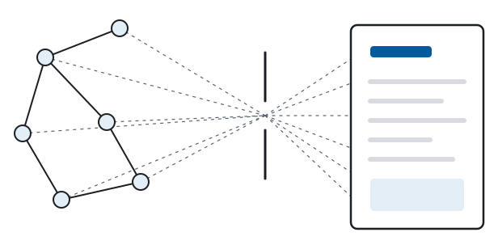

---

## Preface

The claim: there is exactly one way to build applications that are *of* the web rather than merely *on* it, and it is data-centric, declarative, and graph-based. "Exactly one" is relative to rules imposed by the web itself. This book derives those rules and examines the consequences of rejecting them. Part IV scores JSON APIs, JavaScript frameworks, and compile-to-browser toolchains against the same rules. The finding: each is a partial rediscovery of this way or a detour from it.

The book is structured as a derivation. Every statement in it is one of three things: a definition quoted from the web's own specifications, a proposition that follows from previous statements, or an observation you can verify against deployed reality. If you find a statement that is none of the three, the book has a bug, and I would like a report. There is one deliberate exception: Chapter 5 makes a bridge from the web to the formalism that is argued but not proved. If you want to reject the book's conclusion, that is the step to reject. The six parts define the object of study, analyze it, identify the resulting structure in existing standards, audit current technologies, reconstruct the architecture, and consider its implications. Chapter 2 explains the method; Appendix A covers notation and reading tracks.

Underneath the method is a choice of genre. The web is mostly treated as software engineering, a craft of frameworks and taste; this book treats it as a science, an object whose forced structure can be derived, proved, and tested by prediction rather than surveyed and preferred. Chapter 20 returns to it once the scores are in.

One more thing. This book is built to practice what it derives. Its canonical edition is designed as an application of that very kind, in which every proposition is a resource with its own address. That makes the edition an instance of the book's own thesis. As of this writing, that edition is still under construction.

---

## The Argument in One Page

A web application is two functions. `read` turns a request and the state of the world into a document; `write` turns a request and a state into a new state. That is HTTP restated, and every framework ever shipped is an implementation detail of it.

Strip any page (a newspaper, a dashboard) and the same skeleton emerges: first style, then arrangement, then selection, leaving state. Every `read` can therefore be factored as `present ∘ arrange ∘ select` (one factor per stripped layer). The factorization matters only if the factors are separate, declarative, substitutable, and addressable.

Ask what `State` must be, and the requirements come from the web itself. `State` must host any domain. It must compose across parties who have never met — which forces merging by union over facts that carry their own meaning. Its names must work globally. The smallest fact meeting all three requirements is a triple: two global names and a value that may itself be such a name. Any minimal model meeting the requirements is isomorphic to sets of triples under union. The uniqueness is a theorem; to reject its conclusion you must fault a step of the proof or reject a requirement.

The resulting structure maps to RDF, SPARQL, XSLT, and CSS, standardized between 1996 and 2014 and later abandoned — abandoned, the book will argue, not refuted. Part IV compares current technologies against the derived requirements and examines the compensating industry that grows where a requirement is not met: a market that sells the bridge across the gap. Its final table applies the same criteria to every stack, including the derived one. The components can then be combined into a complete architecture without introducing a new standard: a generic engine whose behavior is specialized by data rather than application-specific code. This matters again now because software agents need machine-consumable state, while the industry is building new integration layers to provide it.

If the derivation holds, the next web needs no inventing; it needs only to be put to use. The rest of this book is the proof, the scores, and the evidence.

---

# Part I — The Object

*Before anything can be derived, the object of study must be fixed. This part quotes the web's own definitions (a pair of functions with one deliberate omission) and states the question the rest of the book answers: what must `State` be?*

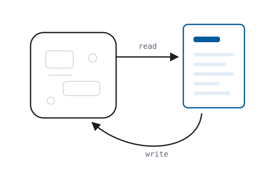

## Chapter 1. What the Web Is

<div class="fp-epigraph">

*Vague but exciting…*

— Mike Sendall, on Tim Berners-Lee's 1989 proposal
</div>

Nothing in this chapter is mine. That is the point of it.

The web ships with its own definitions, and they are shorter than you probably expect. There are identifiers:

```
I     the set of URIs                                    (RFC 3986)
```

There are requests, which are built from identifiers:

```
Req = I × Method × Headers × Body                        (RFC 9110)
```

The body may be empty; the empty body is a body, the way an empty set is a set. Requests with a *safe* method (RFC 9110's word for the methods that only ask, never change) almost always leave it empty. The unsafe methods are about to show what it is for. (RFC 9110's own name for it is *content*, a word this book will need for something else, so the older wire name stays.)

Responses come back the same shape, because RFC 9110 defines one message form for both directions. Where the request had a method and an identifier, the response has a status code:

```
Resp = Status × Headers × Body                           (RFC 9110)
```

For the model below, only the response body matters. The body itself is octets. A header names their format (`Content-Type`). How the octets parse is defined by the format's own specification, so the book does not have to define it. On the parsed side of that line lives the document, the thing a user agent displays. Call that domain `Doc`, and leave its internals alone for now. The envelope around it (the status code, the response headers) is how a document travels, ages, and caches. That is transfer machinery, and Definition 1.1 will not mention it.

**Definition 1.1.** A *web application* is a pair of functions:

```
read  : Req × State → Doc
write : Req × State → State
```

In this model, `read` corresponds to HTTP's safe methods. `GET` takes a request and the current state of the world and produces a document. `write` is what the unsafe methods do. `POST`, `PUT`, `PATCH`, `DELETE` take a request and a state and produce a new state. The request's body carries what the change should be. The body belongs to the write side: on a safe request it has no defined meaning (RFC 9110 §9.3.1), and `read` ignores it. `read`'s output travels in the *response's* body instead. Like `Doc`, `Body` stays opaque for now; Chapter 7 explains what fills it.

Every web application you have ever used, from a static homepage to the heaviest single-page monster, implements these two functions, because HTTP gives it no other way to be an application on the web. The framework it was built in is an implementation detail of Definition 1.1.

Definition 1.1 deliberately leaves `State` unspecified. The central question of the book is therefore: *what properties must State have?* Part II derives those properties from constraints of the web — forced, not chosen — and Part III shows how they correspond to existing standards.

> **Prop. 1.2.** Every deployed web application implements Definition 1.1. *(Verification: RFC 9110 §9; there is no third kind of method.)*
>
> **Prop. 1.3.** Definition 1.1 places no constraint on architecture. Both a 1993 CGI script and a 2026 React application satisfy it. *(This is why the definition is safe as an axiom; no one on any side of any framework war can reject it.)*

**Persistent connections.** WebSockets and server push may look like a counterexample because messages on an established connection are not themselves HTTP requests with safe or unsafe methods. At the application level, however, they still carry either data from the server to the client or changes from the client to the server. The first corresponds to `read` output delivered when state changes; the second corresponds to input to `write` delivered over an existing channel. Definition 1.1 therefore still describes the application behavior. What changes is the surrounding HTTP machinery: individual messages no longer necessarily have their own method, cache semantics, or URI. Each dropped piece has a cost; Part IV computes those costs one by one.

The web succeeded against contemporaries such as Gopher, BBSs, desktop applications, and Java applets; Chapter 12 revisits that comparison. It succeeded because its `read` was *transparent*: documents were declarative, addressable, linkable, indexable, and legible to machines that did not produce them. Part IV evaluates later technologies on one variable: how much of that transparency they preserve. Before doing that, the undefined `State` in Definition 1.1 needs a model. Chapter 2 explains the method used to derive one rather than selecting it from current practice or personal preference.

---

## Chapter 2. Analysis and Synthesis

Chapter 1 defined a web application but left `State` untyped. Looking at existing applications does not determine a model: one uses rows, another trees, another object graphs. That variety is what Proposition 1.3 predicts: any architecture fits Definition 1.1, so every kind got built. Choosing a preferred model would be equally arbitrary. Instead, this book derives requirements for `State` from constraints imposed by the web itself. If the derivation is valid, rejecting the resulting model requires rejecting at least one of those constraints.

`State` itself is not directly observable. Requests and responses are visible on the wire, and the document returned by `read` is public, but the server's internal state is not. The analysis therefore starts from the document and works inward. It removes properties that can vary without changing the underlying information, checking each removal against ordinary web behavior. The layers that can be removed become the factors of `read`; what survives every removal is the first direct evidence of what `State` must contain.

Stripping a document can suggest such a factorization, but it does not by itself prove that the factorization is necessary. The result could still depend on the particular pages chosen or on the order of the removals, rather than apply to every page. The check is independence: set the pages aside, keep only the derived parts, and build with them. A working application space means the full range of applications Definition 1.1 admits, not one rebuilt demo. If that space can be constructed from the derived parts alone, using nothing from the original pages, then the skeleton was in the pages, not in the procedure. And if the construction fails, or quietly needs parts the derivation never produced, the failure is public: either the analysis kept the wrong things or the parts list is incomplete, and each defect is visible on its own.

The Greek geometers called the two directions *analysis* and *synthesis*. Pappus's *Collection* describes the pair: assume the thing sought and work backwards to what is established; then reverse the path, and the reversal is the proof. Newton restates it as a rule of natural philosophy in the *Opticks*: the investigation of difficult things by analysis "ought ever to precede the method of composition." The practice has modern instances wherever a structure must be known rather than guessed. Organic chemists worked out a molecule's structure by breaking it into identifiable fragments, and accepted that structure as proven only once they had built the same compound from known ingredients and it matched. Software has the clean-room: a rebuild is independent exactly when the rebuilding team touched only the derived specification, never the original. Both keep the geometers' point: taking apart suggests a structure; only building back, independently, proves it.

The claim can now be stated precisely. The analysis, if it succeeds, will show necessity: every web application has the derived form, because under Definition 1.1 there is nothing else `read` and `State` could be. The synthesis, if it succeeds, will show sufficiency: the derived parts are enough to build the full application space, with nothing missing. Neither half proves the claim alone; the proof is that the two match, and the book checks the match twice, in theorems and in running code. Where analysis and synthesis do not coincide, Chapter 9 lists the mismatches explicitly. The opening pages already name the result, but naming it proves nothing. The proof is the derivation, and that is the part a reader can check.

The book follows the same method. Part II performs the analysis first on real pages and then as theorems that quantify over arbitrary pages. Once the properties of `State` are derived, the write side follows. Part V reconstructs an application space from the derived components. Between analysis and synthesis, Parts III and IV compare the result with existing standards and current technologies and record the mismatches. Part VI considers what follows from the resulting architecture.

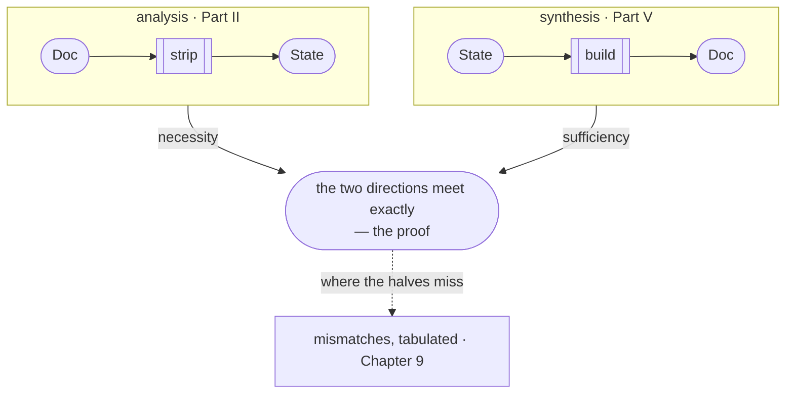

*The method used in the book. Analysis (Part II) works from the observable `Doc` toward `State` and establishes necessity. Synthesis (Part V) builds from `State` back to documents and establishes sufficiency. Chapter 8 compares the two formally, Chapter 18 does so in running code, and Chapter 9 records the mismatches.*

One decision remains before the stripping starts, and it is a control on the experiment: which pages to strip. At least two are needed, because one page says nothing about pages in general. The most useful pair is two very different pages: anything that survives the same removals in *both* is less likely to be specific to either one. So the pair is a newspaper front page and a wind-farm dashboard. The front page is written by a handful of editors on an editorial rhythm and read by millions. The dashboard is written continuously by machines and read by one operator on shift. Different domain, different audience, opposite rhythms of `read` and `write`; under Definition 1.1, one signature. If these two reduce to the same skeleton, everything between them likely does too. Print both. Now take them apart.

---

# Part II — The Analysis

*Part I defined a web application as two functions and left `State` unspecified. This part derives a factorization of `read`, the properties required of its factors, the resulting model of `State`, the conversion from graph to tree, and the corresponding write operation.*

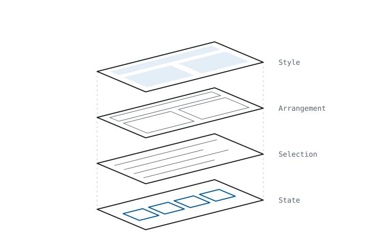

## Chapter 3. Stripping the Page

Chapter 2 chose two pages that are as different as any pair it could find: the newspaper front page and the wind-farm dashboard. Strip them, one layer at a time, and watch the same skeleton emerge from both. The exhibits below do exactly that, to real pages: the Guardian's international front page and a Grafana wind-farm monitoring dashboard, captured on the same morning.

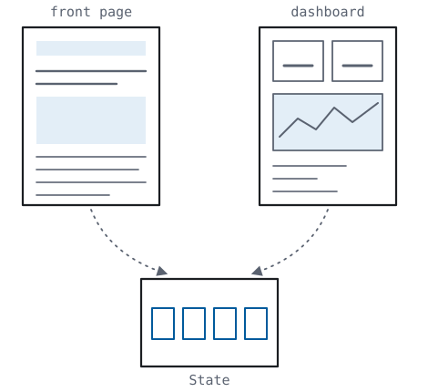


*The starting material. One page is paper-white and editorial, the other black and numerical; they share, apparently, nothing.*

**Strip the style.** Turn off CSS, switch to reader view, print in monochrome. The page looks different; nothing it *says* changes. So a document factors:

```
Doc = Style × Content
```

The justification is already deployed on every device you own: dark mode, print stylesheets, reader view, accessibility themes — style varies while content holds fixed.


*CSS off. The newspaper still says everything it said — headlines, bylines, photographs, in browser-default dress. Note the asymmetry on the right, and file it for Part IV: stripping style from the newspaper leaves the news; stripping it from the dashboard leaves mostly chrome. The headline numbers survive as text, but the time-series curves were never in the document at all — they are pixels on a canvas.*

**Strip the arrangement.** The same content appears as a table on desktop, a card list on mobile, a chart in the summary view. The facts are identical; their shape as a document differs. So content factors:

```
Content = Arrangement × Data
```

Every "view toggle" on the web justifies this factoring, showing the same data as a different tree.


*Arrangement off. Both pages now use the same format: one block per entity, sorted, with no nesting. A headline is paired with a section, and a panel title with a value. The two sites that shared nothing now differ only in vocabulary.*

**Order as data.** There is one complication before the next strip. A careful reader has already spotted it: the front page's order *means* something. The lead story leads because an editor judged it should, and a strip that discarded the judgment would be destroying content while claiming to remove arrangement. That judgment can itself be represented as data: *this article, prominence one*. The strip's real effect is eviction: order moves out of the tree and into the data, where it survives every re-arrangement that follows. The deployed web already shows what happens otherwise: the same articles also go out through feeds, and a feed delivers them without the front page's ordering. Prominence that lives only in an arrangement is lost on every consumer who receives the content without it. Chapter 6 will harden this from a concession into a law: if the order is a message, the order is data.

**Strip the selection.** Every page shows a sliver of something much larger. An article's own page and the front page draw from the same pool; the dashboard shows the last six hours, but last week exists. So data factors:

```
Data = Selection × State
```

Pagination, filters, and search are deployed proof that the page is a window, not the world.


*Selection is made visible here as two windows over one pool. On the left, `/international` and `/world` share 13 entities, because the same articles are drawn twice. On the right, the same dashboard appears at `?from=now-6h` and `?from=now-7d`, so the selection travels in the URL, where anyone can change it.*

Three strips, and both of our maximally different sites have reduced to the same expression:

```
Doc = Style × (Arrangement × (Selection × State))
```

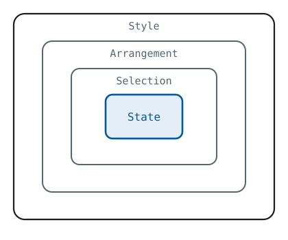


*The three stripping steps applied to both sites: two different pages reduce to the same skeleton.*

<div class="fp-exhibit" data-exhibit="strip"></div>

*Interactive exhibit (online edition): here the strip runs live rather than as before-and-after images. The dashboard is rebuilt in place, and each layer can be removed and restored.*

Two examples prove nothing about all websites; the strips are illustration. The universal claim is Chapter 4's theorem, quantifying over every `read` at once. This chapter makes you feel it; the next one proves it.

---

## Chapter 4. The Factorization

<div class="fp-epigraph">

*REST is defined by four interface constraints: identification of resources; manipulation of resources through representations; self-descriptive messages; and, hypermedia as the engine of application state.*

— Roy T. Fielding, dissertation §5.1.5, 2000
</div>

Chapter 3 stripped two pages by hand and called the result illustration; this chapter proves the universal claim. The strips become the factors of a typed pipeline. A definition (properness) separates real factorizations from trivial ones. And the analysis theorem guarantees that every `read` factors, and that the factorization can be made proper. The final sections relate the method to Roy Fielding's REST dissertation and derive the four independent timelines produced by a proper factorization.

### The pipeline

Chapter 3's strips, read as function types:

```
select  : Req × State → Data          which facts
arrange : Data → Tree                  what structure
present : Tree → Doc                   what appearance

read = present ∘ arrange ∘ select                        (4.1)
```

`select`, `arrange`, and `present` are Chapter 3's Selection, Arrangement, and Style; `Tree` is the arranged data, what Chapter 3 called Content, before style touches it.

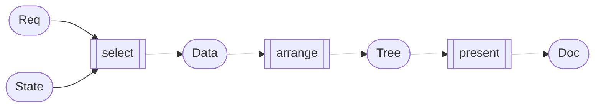

*The pipeline of (4.1). Rectangles are the factors; rounded nodes are values. Under S4 (the fourth properness condition defined below), each factor's output is a web resource: it has a URI, and a GET on that URI returns it.*

**Prop. 4.2 (Existence, trivial).** Every `read` factors as (4.1). *Proof:* make `select` and `present` do nothing except repackage their input at the required type, and put the whole of `read` inside `arrange`. Call this the *fused* factorization. ∎

Proposition 4.2 matters because of what its proof shows. A factorization always exists, so the bare existence of one carries no information. The information is in whether the factors are genuinely separate. Definition 4.3 states that separation as four checkable properties. Those four properties are what "declarative architecture" means, once the phrase is required to mean anything checkable. It is the book's central definition.

### Properness

**Definition 4.3.** A factorization (select, arrange, present) is **proper** iff:

**S1 — Obliviousness.** Each factor communicates with the next only through its output. `arrange` sees data, never the request. `present` sees a tree, never the data. No side channels: `arrange` and `present` are constant in `Req` and `State` except through their arguments.

**S2 — Declarativity.** Each factor is the *meaning of a term in a language* — there exist three languages, one per factor, with independently defined semantics such that `select = ⟦q⟧`, `arrange = ⟦t⟧`, `present = ⟦s⟧` for terms `q`, `t`, `s`. This is what "declarative" means, made precise: the meaning of the query does not depend on the stylesheet, because each language's semantics is closed.

**S3 — Substitutability.** Replace any factor with another term of its language and you still have a web application; the change is confined to that factor's concern.

**S4 — Addressability.** Each factor's output is itself a web resource: the data produced by `select` has a URI and is dereferenceable, independently of the document it is destined to become.

S1–S3 could describe any well-factored program. S4 is the web condition: the factorization itself goes public, *exposed through the web's own reference mechanism*. An application satisfying S1–S4 is part of the web at every layer, not only at its rendered surface.

The dashboard makes it concrete: `select` pulls the panel's `title` and `value`, `arrange` nests them into a card, `present` themes the card. S4 is the property you can check by hand. Each factor's output (the data, the card, the themed page) has its own URL and *dereferences*: a GET on the URL returns it.

Three of these properties were written down by the web's own architects, as advice. [*Architecture of the World Wide Web, Volume One*](https://www.w3.org/TR/webarch/) (W3C Recommendation, 2004; hereafter AWWW) names the separation of content, presentation, and interaction a good practice (§4.3). It names orthogonal and composable specifications a principle (§5.1). And it asks URI owners to provide representations of their resources (§3.5) — S4's demand, minus the intermediates. All of it is stated as SHOULD, because a recommendation can do no more than recommend. Hold that until Proposition 4.4, where the derivation forces the separation that the web's own architecture group could only advise, and constructs the addressing that AWWW could only request. Those norms were theorems all along. AWWW is a witness here, never a premise: assuming §4.3 would be assuming this chapter's conclusion, and the method forbids that.

The payoff of S4 is immediate and measurable. It is [Fielding's](https://www.ics.uci.edu/~fielding/pubs/dissertation/top.htm) list: HTTP caching per stage rather than per page; crawlability of *data* rather than of renderings; intermediaries; independent evolution of the layers. The last of these will harden from a phrase into a proposition before the chapter ends. Every one will reappear in Part IV, scored against every architecture that forfeits it.

### The analysis theorem

**Prop. 4.4 (Analysis theorem).** Every `read` whose output depends on `State` only through some finite part factors into the three stages with S1. The factorization then lifts to proper: realize each factor as a term of the languages Part III fixes in advance, give each stage's output a URI, and S2–S4 hold. Finite dependence forces the shape; the lift is a construction the web always permits, never a consequence of finiteness.

The hypothesis is mild: a document renders finitely many facts, so every site ever deployed qualifies. Finiteness is there to make the proof's minimal fragment well-defined; it excludes nothing real.

<details>
<summary><i>Proof sketch — take the minimal fragment the output depends on.</i></summary>

Define `select(r, S)` as a minimal fragment of S on which `read(r, ·)` actually depends, well-defined by finiteness; `arrange` and `present` are the induced quotients. That much is the analysis half: it gives S1 and the three-stage shape. S2–S4 are the lift. S2 is realization in languages whose semantics are fixed in advance and shared across applications, never invented around the `read` (which would make S2 vacuous). S3 is substitution within them, and S4 is publication, an act. The synthesis theorem (8.2) supplies all three. Full proof in Appendix B. ∎

</details>

Proposition 4.4 is what Chapter 3 was illustrating: stripping a real page is *computing its proper factorization by hand*. The theorem guarantees the exercise terminates for every site — including every site not yet built. And the point held over from AWWW can now be stated: every `read` provably affords the separation that §4.3 could only recommend.

### The debt to Fielding

The debt to Fielding runs deeper than the property list. REST was the last serious attempt to *derive* web architecture rather than fashion it: constraints are applied stepwise, and each constraint induces its own properties. That is the method this book inherits and pushes to theorem grade. But REST constrains the conversation and leaves the vocabulary open. It says how representations must transfer: statelessly, cacheably, through a uniform interface. It declines, deliberately, to say what a representation or the state behind it must *be*. That open question is this book's subject. Chapter 5 closes it. That closure was unavailable to REST's own method in 2000: the answer had been standardized only the year before. And the pressure that makes it visible (machines reading the web) was two decades out. Read this book as the second half of a derivation whose first half Fielding wrote.

His deepest constraint is also his least defined: the **uniform interface**. In Fielding's own estimation it is the central feature that distinguishes the web from every prior architecture, yet he delivered it as four clauses of prose (§5.1.5) and never formalized it. "Uniform" is the quantifier: one signature for every application. That is why Definition 1.1 could open this book by fitting every web application ever built, and why Part V can close it with one application for every domain. The interface was always uniform; the state beneath it was not. Chapter 5 finishes the thought.

<details>
<summary><i>The four clauses, typed — one per component. (Borrows names from Chapters 5 and 7 and Appendix B; return here after the pipeline closes.)</i></summary>

| Fielding's clause (§5.1.5) | typed here as |
|---|---|
| identification of resources | `I` — one name space; R3 (Chapter 5), S4 |
| manipulation of resources through representations | Definition 1.1 — `read` and `write` exchange representations; the delta normal form (Chapter 7) is the write's |
| self-descriptive messages | self-containedness — B-2d, at the message's scale |
| hypermedia as the engine of application state | the five moves (Chapter 7) — every transition a link in the document |

</details>

### The four timelines

Definition 4.3 has one more consequence, and it can be collected now. Nothing in this chapter has mentioned time. HTTP has. A representation, per RFC 9110 §3.2, reflects "a past, current, or desired state of a given resource", state *at a time*. The protocol also provides mechanisms for distinguishing a resource's representation at one moment from its representation at another: `Last-Modified` and `ETag` (RFC 9110 §8.8), and the caching calculus built on them (RFC 9111). The web's own specifications already treat the document as a sequence of states; the time index comes ready-made. Index the moving parts, writing `τ` for time, since `t` is taken:

```
S : Time → State                               the world, over time
read_τ = present_τ ∘ arrange_τ ∘ select_τ      the application, over time
doc(r, τ) = read_τ(r, S(τ))                    what the user agent renders
```

Four components can move: the state `S(τ)` and the three factors. Each movement has a name you already know. The state advances when someone writes, which is Chapter 7's whole subject. A factor changes in only one way, by substituting its term, and that is S3 read over time. The selection changes when a query is revised and redeployed, the arrangement when a layout switches or a template ships, the presentation when the theme changes.

And one thing that looks like movement is not: a user paging forward or tightening a filter changes nothing in the application. The filter travels in `r`, and `select` is the same term evaluated at a new argument. A model that makes the selection depend on time just to handle a mouse click has confused the function with its argument, a natural mistake, since `select_τ` offers a time subscript to anything that happens over time. The four timelines belong to the application; navigation belongs to the request.

The dashboard makes it concrete. A panel lists alerts, twenty per page, and the user clicks *next*. In the proper factorization the click mints a new request: the page number travels in `r`, visible as a query parameter, and `select` is the same query that produced page one, now evaluated at `page=2`. The new page is another value of the same function: it has its own URI, so it can be bookmarked, shared, cached, and fetched tomorrow with the same result. In the confused model the click increments a counter kept beside the query, a session variable or a widget's internal state, and the selection now depends on when and by whom it is asked: the same URI shows you page two and shows the colleague you sent it to page one. The familiar symptoms follow: the back button misbehaves, the link does not travel, a refresh loses the page. All of them are one defect: the page number was stored in the application instead of carried by the request.

**Prop. 4.5 (Independent evolution).** In a proper factorization, the document's evolution decomposes into four independent timelines, one per component `(S, select, arrange, present)`: a change to any one component changes the document without requiring a change to, or the participation of, any other. In the fused factorization of Prop. 4.2 there is one component and therefore one timeline: every change, of whatever kind, is a change to the whole.

Ship a new theme on the dashboard and the panel data need not be fetched again. `present` moved on its own timeline while `S`, `select`, and `arrange` stayed put on theirs.

<details>
<summary><i>Dependencies — S1 confines, S2 closes, S3 substitutes; proof in Appendix B.</i></summary>

Depends on 4.3: S1 confines a change's effect to its factor's output. S2 closes each term's semantics, so substituting a term of one language cannot alter the meaning of a term in another. S3 guarantees the substituted term still yields a web application. Proof: Appendix B.

</details>


*Prop. 4.5, drawn. In the proper factorization each component advances alone, and caches invalidate per component; in the fused one every change, of whatever kind, is a change to the whole, and invalidates the whole.*

Prop. 4.5's corollary is the first item on Fielding's list, caching per stage rather than per page, and the corollary now supplies the mechanism for it. Under S4 each factor's output is a resource; each resource has a URI; each URI carries its own validator, an `ETag`, and its own timeline, and every cache on the path can read them. A theme change invalidates one stylesheet resource, and the data it styles stays cached at its own age, untouched. Collapse the factorization and there is one resource (the bundle) with one validator, and the corollary inverts: any change, of any kind, invalidates everything.

And the industry already operates all four timelines at the delivery layer. Fingerprinted stylesheets ship with `Cache-Control: immutable`, data responses are marked `no-store`, and templates are deployed on their own cadence. Every serious deployment on the web runs per-component timelines there, even when the application above is fused. Independent evolution already runs in production, one layer below the framework that obscures it.

One thread left dangling, on purpose: `select` selects *from State*, and State is still abstract. The factorization cannot be completed until we know what it is a factorization *over*. That is Chapter 5, and it is where the book stops describing and starts forcing.

---

## Chapter 5. What State Must Be

To make `State` concrete without choosing a preferred data model, this chapter derives three requirements from properties of the web itself.

### The three requirements

**R1 — Universality.** The web hosts every application domain there is or will be. Therefore `State` must encode arbitrary application state, with no domain structure baked in. *(Source: the observable web. Try to name the domain the web is "for.")*

**R2 — Coordination-free composition.** The web has no central schema authority, by design; decentralization is what "world wide" means. Therefore state held by independent parties who have never communicated must be composable. Composition without coordination has laws: it must accept any two states (checking compatibility is coordinating), in any order (agreeing an order is coordinating), with duplicates costing nothing (tracking copies is coordinating). And it preserves meaning only if the things composed are *self-contained*. A fact must carry its full meaning with it, because no surrounding structure survives a merge. Those four laws leave exactly one composition. That composition is set union, and Appendix B proves it:

```
State = 𝒫(Fact)        merge = ∪                          (5.1)
```

State is a *set of atomic facts*, and two states, from any two parties, anywhere, compose by union. Union is order-free, idempotent, associative, and commutative, so it has every property that federation needs.

**R3 — Global reference.** A fact on one site can be about an entity described on another; the web's entire value proposition is that things link. Therefore names *inside* facts need global scope. The web possesses exactly one global naming system (`I`, the URIs from Chapter 1), and inventing a second one would itself violate R2 (two parties' private naming schemes collide on merge). So references in facts are drawn from `I`. And note what R3 does and does not ask: names must be global; nothing requires that they dereference. They *can*, though, and that comes free with the construction: the naming system and the web's address system are one. Chapter 18 confronts what that identification costs.

### The one bridge

**The scope of R2's result, before anything is built on it.** The merge laws govern composition's *mechanics*: that any two states merge, without permission, in any order, at no cost. They do not promise that merged facts *join* — that two parties' names for one turbine ever meet in a query. No data model can promise that: parties who never communicated have agreed on nothing, in every model ever proposed, and a requirement pretending otherwise would be a coordinator in disguise. A model does control two things: what an unjoined union already holds, and what a join requires once someone demands one. Chapter 17 takes that up, where federation stops being algebra and becomes deployment. Here it is enough to be exact about what R2 secures. It secures merge, completely, and it does not secure meaning across sources.

The passage from "no coordinator" to the merge laws is the one bridge in the derivation — the deliberate exception the Preface mentioned. I name it the **Transposition Thesis**. The web already enforces four rules on documents: anyone links to anything without asking, content arrives by any path and in any order, copies cost nothing and change nothing, and aggregators consume content outside its original arrangement. The thesis: applied to data instead of documents, the same four rules become the four merge laws, one for one: totality, order-freedom, idempotence, atomicity (B-2a–d, defined in Appendix B). The table below lays out the correspondence so that each of the four pairs can be checked on its own. The same laws also arrived from an unrelated direction: distributed-systems research, needing replicas to converge without coordination, derived them as theorems — the CRDT (conflict-free replicated data type) literature. Two fields with different motives reached the same algebra, so the merge laws are not a matter of taste.

| the document layer, deployed | the state layer, transposed |
|---|---|
| anyone links to anything; no one is asked | composition is total — no compatibility check (B-2a) |
| content arrives by any path; intermediaries reorder it freely | composition is order-free (B-2b) |
| copies are free and unmarked; the cache hit *is* the resource | composition is idempotent (B-2c) |
| aggregators consume content outside its original arrangement, without its publisher's consent | no meaning survives in arrangement (B-2d) |

Each left cell is deployed and citable — RFC 9111 carries the middle two, AWWW's global-identifiers principle the first, and the last is every search engine and feed reader in operation. Each right cell is a numbered condition in Appendix B; B.4 proves none is redundant. Appendix C carries the CRDT citation. State-based replication requires a join-semilattice, which means totality, order-freedom, and idempotence. That literature derives those three properties from replication pressure alone. The theorem that follows applies to the web only to the extent that this table holds.

### The smallest fact

The question now is the smallest self-contained fact, and "smallest" is not an aesthetic preference. Every extra position a fact carries is one more thing independent parties must agree on, and agreement is what R2 forbids. So minimality is R2 again, applied to the shape of the fact itself. When a genuine requirement justifies an extra position, the derivation will grant it; Chapter 9 does exactly that.

**Prop. 5.2 (Arity).** The minimal self-contained fact is a triple.

<details>
<summary><i>Argument — a pair cannot name its own relation: <code>(employee42, "2026-07-08")</code> is hired-on, or fired-on, or born-on.</i></summary>

A 1-tuple `(x)` asserts nothing — it names without claiming. A pair `(entity, value)` asserts a relation but cannot say *which* relation; the meaning lives outside the fact, which R2 forbids. Three positions, `(entity, attribute, value)`, is the first arity at which a fact names its own relation. And it is the last arity we need: any n-ary fact decomposes into triples by minting a fresh entity for the fact and attaching its n components as attributes. Minimality and universality pin the arity at exactly three. ∎

</details>

R3 forces the entity position into `I`. It forces the *attribute* position into `I` too, because attributes need global names just as much. Without global names, two sources cannot know they mean the same property, and R2 dies at the first merge. The value position is either a reference or an atomic literal. Write `V` for the literals:

```
Fact  = I × I × (I ∪ V)                                   (5.3)
State = 𝒫(I × I × (I ∪ V))
```

Chapter 3's exhibit already wrote facts in this shape without saying so. The dashboard's strip-2 block held one entity and two attributes: two facts, exactly. Written with `⟨·⟩` for a URI abbreviated to its fragment, they are `(⟨…#panel-14⟩, title, "Current Power")` and `(⟨…#panel-14⟩, value, "15.5 kW")`. Entity and attribute are in `I`, and the value is in `V`. That exhibit already showed the theorem.

<div class="fp-exhibit" data-exhibit="merge"></div>

*Interactive exhibit (online edition): two parties who have never met. Edit either side, shuffle, duplicate. Every edit vanishes into the union except a genuinely new fact, and (5.1) is something you fail to break rather than something you believe.*

### The uniqueness theorem

**Theorem 5.4 (Uniqueness).** Any arity-minimal state model satisfying R1–R3 is isomorphic to (5.3). *(Proof: Appendix B. The proof is an assembly of 5.1–5.3: R2 forces the set-of-atomic-facts shape and union-merge; R1 with minimality forces arity three; R3 forces positions one and two into `I`.)*

The claim that (5.3) is the only shape the web itself permits sounds like rhetoric. Theorem 5.4 makes it a statement with escape clauses, and the clauses are the trap. Fault a step of the proof (Appendix B lays the steps out for that attack) or reject a requirement; each rejection has a name. Reject R1 and your model can't host the web's content. Reject R2 and your data needs a coordinator, which is a central schema authority, so you have built a silo. Reject R3 and your data cannot refer beyond itself, which is a silo again, reached by the other door. Reject minimality and you widen the tuple, a door left deliberately ajar; Chapter 9 walks through it with a fourth requirement, attribution. Every alternative data model the industry runs on will be located, in Part IV, at one of the first three exits.

### The selection algebra

We are not done deriving. The same pattern now runs once more, one level up, quickly. `select` needs a minimal algebra over `𝒫(Fact)`: match a fact pattern with variables; join matches; union alternatives; project variables out. Each operation is forced by a page you can point at (any master–detail page is a join; any search page is a pattern; any page merging two lists, events from either calendar, is a union). The algebra reappears in Part III under its deployed name; what a `write` can do to a fact-set is Chapter 7's subject.

Run one join by hand. The dashboard's operator holds `panel-14 title "Current Power"`; the turbine contractor (another party entirely) holds `turbine-3 feeds panel-14`. Merged, the pattern (triples written bare now, URIs still abbreviated, `?` marking a variable)

```
?turbine  feeds  ?panel
?panel    title  ?name
```

returns one row (`?turbine = turbine-3`, `?panel = panel-14`, `?name = "Current Power"`) and the row exists only because the two parties' facts were merged first. One page exercises the whole algebra: match, join, and project.

<div class="fp-exhibit" data-exhibit="select"></div>

*Interactive exhibit (online edition): the algebra, exercised, patterns with variables, joined and projected over the state merged above. One preset only answers because the merge happened: it joins the operator's facts to the contractor's.*

And notice what the theorem has done to the pipeline's types. `State` is now a graph: entities are nodes, and each fact is an edge from entity to value. The join just walked that graph. The pattern crossed from the contractor's facts to the operator's along a reference, and references point anywhere. But every document Chapter 3 stripped was a tree. Somewhere between them, the shape must change. That is Chapter 6.

---

## Chapter 6. From Graph to Tree

Chapter 5 closed on a mismatch of shapes; the pipeline's types locate it. `State` and `Data` are *graphs*, facts whose references form arbitrary many-to-many webs. `Tree` and `Doc` are *trees*. Documents are hierarchical, and so is human reading. The pipeline crosses from graph to tree exactly once, inside `arrange`.

<div class="fp-history">

**In the world.** The tension this chapter resolves is older than the web. In 1945 Vannevar Bush blamed our trouble finding anything on "[the artificiality of systems of indexing](https://www.theatlantic.com/magazine/archive/1945/07/as-we-may-think/303881/)": records "filed alphabetically or numerically," found "by tracing it down from subclass to subclass." The mind, he wrote, instead "operates by association." Ted Nelson put the same objection in capitals in 1974: "EVERYTHING IS DEEPLY INTERTWINGLED. In an important sense there are no 'subjects' at all." Both were describing a graph and refusing the tree. This chapter keeps both. The association is what `State` is. The tree is only what a document must become to cross the wire and be read.

</div>

Every web framework in history is a strategy for this one crossing. That is a thesis, not a theorem, as the Transposition Thesis is. I mark it as a thesis here and leave it unnumbered. Part IV returns to it. But the crossing is not yet well-defined. Graph-to-tree serialization is a *relation*, not a function: one graph, many trees (orderings, nestings, groupings). Yet Chapter 4 typed `arrange` as a function without saying where the choice among the trees lives. The fix is canonicalization:

```
arrange = ⟦t⟧ ∘ canon
canon : Data → Tree      deterministic, lossless, structure-free
⟦t⟧   : Tree → Tree      t — the sole locus of graph→tree structural choice
```

`canon`'s output is the graph in bare tree form — one block per entity, sorted, no nesting, no sugar. *All* structural decisions (what nests under what, what becomes a section versus a sidebar) move into the declarative term `t`, where S2 can hold.

Display order included: `canon`'s sort is deliberately meaningless. An order that carries meaning (Chapter 3's lead story) arrives as data and is honored by `t`, never smuggled in the sequence of blocks. That hardens Chapter 3's concession into the promised law: if the order is a message, the order is data, and `canon` leaves it nowhere else to live. The historically hard case is facts about *unnamed* entities, an extension Chapter 9 motivates and prices. As of 2024 it has a standardized deterministic answer: a canonical labeling. Chapter 9 names the spec.

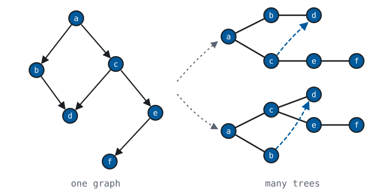

*One graph, many trees: `d` can nest under only one parent (the other edge survives as a reference) and siblings take an order the graph never fixed. These are the choices the crossing must make somewhere: `canon` makes none of them, `t` makes all of them.*

And you have already seen `canon`'s output. Strip 2 *is* it: the dashboard reduced to sorted blocks, one per panel, `title` and `value` beneath. The exhibit's format was never a design choice for the figure. It was the canonical serialization, arrived at by stripping.

The three properties `canon` must have (deterministic, lossless, structure-free) are satisfiable, and cheaply:

**Prop. 6.1.** A `canon` with all three properties exists.

<details>
<summary><i>Proof — sort lexicographically; unnamed entities pay Chapter 9's bill.</i></summary>

For ground states (states whose entities all carry names) order the facts lexicographically by their three positions and emit one block per entity. The map is a function because a total order on tuples exists. It is lossless because the fact set is recoverable by reading the blocks back. It is structure-free because the order is defined by the facts alone, never by their provenance or grouping. States with unnamed entities need a canonical labeling first; that labeling exists, is standardized, and Chapter 9 states its cost. ∎

</details>

<div class="fp-exhibit" data-exhibit="canon"></div>

*Interactive exhibit (online edition): shuffle the input as many times as patience allows. `canon` does not move. Change a fact and it moves exactly as far as the fact requires.*


*The graph→tree crossing. A relation (one graph, many trees) becomes a function followed by a term: `canon` chooses nothing, `t` chooses everything.*

The seam is not an unsolved research problem, and Chapter 9 presents the evidence for that. And with the crossing fixed, the read side is derived end to end — Definition 1.1 has one component left.

---

## Chapter 7. The Write Side

Definition 1.1 has a second component, and with it comes the strongest objection to everything so far. Documents can be declarative. Nobody defends imperative newspapers. Applications, the objection runs, are different: they change things, they respond, and change is where declarative architectures fail. This chapter takes the objection at full strength and answers it in four propositions. Nothing from the read pipeline needs to be taken back; the write side is the factorization's mirror image, and the smaller of the two.

### The delta normal form

Start where Chapter 5 left the state: `State = 𝒫(Fact)`, merge is union. What can change about a set? Elements are removed and elements are added. There is no third possibility.

**Prop. 7.1 (Delta normal form).** Every state change factors as a pair of fact-sets, a *delta*:

```
write(r, S) = (S ∖ D⁻) ∪ D⁺                              (7.1)
D⁻ = S ∖ write(r, S)          the facts removed
D⁺ = write(r, S) ∖ S          the facts added
```

<details>
<summary><i>Proof — extensionality, then minimality.</i></summary>

With `D⁻`, `D⁺` as defined, `(S ∖ D⁻) ∪ D⁺ = write(r, S)` by set extensionality. Minimality: any pair `(A, B)` with `(S ∖ A) ∪ B = write(r, S)` satisfies `A ⊇ D⁻` (a fact of `S` absent from the result leaves only by removal) and `B ⊇ D⁺` (a fact new in the result arrives only by addition). So `(D⁻, D⁺)` is contained in every such pair: it is the least pair, and a least element is unique. ∎

</details>

A state change is two sets. That is the entire theory of mutation over a fact-set model. Measure that against what the industry maintains for mutation: object-relational mappers, undo stacks, reconciliation engines. Every one of these is machinery for computing or applying change over a model in which change has no normal form. Trees are the instructive case: two trees have no canonical difference, so deciding what "changed" is a heuristic. The industry's clearest specimen is the virtual DOM's diffing engine (Chapter 11): client-side frameworks re-compare an in-memory copy of the page on every render. That is a whole runtime spent recovering, approximately, what (7.1) gives exactly by subtraction. Subtracting one set from another is exact. The model that R2 forced for merging therefore gives mutation's normal form as a by-product, because union and difference belong to one algebra.

On the running example: the wind gusts, and the panel's `value` moves. The delta is `D⁻ = {(⟨…#panel-14⟩, value, "15.5 kW")}` and `D⁺ = {(⟨…#panel-14⟩, value, "16.1 kW")}`, two one-element sets. That is the entire update, transport included.

<div class="fp-exhibit" data-exhibit="delta"></div>

*Interactive exhibit (online edition): the gust, applied. Edit the two sets and apply them against the live state. Apply the same delta twice and watch nothing happen: sets subtract, and re-application is a no-op.*

And note what a delta is made of: fact-sets. Change is data in the same model as the state it changes. There is no second model, and no change-description language whose semantics would have to be invented. The delta is what fills the request's `Body` from Chapter 1, and Chapter 8 will give the industry's name for it.

### Forms, run backwards

**Prop. 7.2 (Forms are inverse transforms).** The read pipeline ends at a human; the write side begins at one. The instrument is a form: a tree, part of a document, rendered by `present` like everything else. Its fields stand where a fact pattern's variables stand. A form carries one pattern or several, each marked "remove" or "add"; submission binds their fields, and a bound pattern is a set of facts. The marked sets are (7.1)'s delta:

```
form   : Tree                fields ↔ variables of a fact pattern
submit : Bindings → (D⁻, D⁺)                             (7.2)
```

On the running example: the edit form arrives holding "15.5 kW"; the user types "16.1"; the stale binding, marked remove, is `D⁻`, and the fresh binding, marked add, is `D⁺`. One submission produces both sets.

A form is `arrange` run backwards. The one factor that crossed graph→tree (Chapter 6) is also the one that must cross back, and it crosses back using patterns, exactly as before.

Two jobs meet in a form, and they must not be conflated. *Construction* (which fields an edit form should offer for an entity of this kind) is a projection of structure: read the patterns, render inputs. *Validation* (which deltas are admissible) is a predicate on `(D⁻, D⁺)`. Construction reads structure; validation decides which changes are admissible. A schema drafted to do both jobs at once will do both badly. Chapter 19 builds on that point.

For the justification, view source on any HTML form since 1993. Field names are attribute names; `method` names the unsafe verb; the form is a fact pattern whose variables are input boxes. The web has shipped the inverse transform beside the forward one from the beginning.

### One algebra, both directions

**Prop. 7.3 (One algebra, both directions).** Chapter 5's selection algebra (match, join, union, project) is the write side's algebra too. A pattern with free variables *selects* the facts that match; the same pattern with its variables bound *denotes* the facts of a delta. Selection finds what is; the delta says what shall be; the syntax between them is one syntax.

```
pattern + state      →  bindings                          (find)
pattern + bindings   →  (D⁻, D⁺)                          (change)
```

The consequence is practical as much as formal: the write side adds no expressive machinery. Whoever can query can update: an implementation gets its update language by handing its pattern matcher the bindings it would otherwise return. When Part III proves the read side complete, the write side inherits the result through this symmetry. Compare, once more, the industry's arrangement. It uses a query language, a separate mutation API, a migration DSL, and a client-side state manager. That is four vocabularies for one algebra.

### The five moves

**Prop. 7.4 (Interactivity, decomposed).** The objection's strongest form: "real applications are interactive." By independent evolution (Prop. 4.5) the document is `doc(r, τ) = read_τ(r, S(τ))`. That is a value with exactly five inputs: the request `r`, the state `S(τ)`, and the three factor terms. So every interaction the web has ever shipped is one of exactly five moves:

1. **navigate** — a new `r`: link, filter, page, search. The term stays the same; the argument changes.
2. **write** — `S` advances by a delta (7.1): submit, edit, delete.
3. **restyle** — substitute the `present` term: the theme toggle.
4. **rearrange** — substitute the `arrange` term: list to grid, sort, collapse.
5. **reselect** — substitute the `select` term: a saved query edited, a dashboard reconfigured.

Moves 2–5 are independent evolution's four timelines; move 1 is the request, an argument to the application, not a component of it (Chapter 4). There is no sixth move because there is no sixth input. Interactivity *is* the factorization being exercised. Fusion adds no move to this list; what it gains is the freedom to make the moves without saying which component they touch. Part IV will show what that freedom costs.

### The latency concession

One concession remains, and it too should be met at full strength. That concession is latency. The operational complaint is the round trip: a keystroke should not cross an ocean to move a cursor. Granted. But look at what the complaint actually asks for: that the factors be *evaluated near the user*, not that they be fused. And mobility of evaluation is precisely what S2 already secured. A term whose semantics is closed evaluates the same everywhere. So ship `q`, `t`, `s` to the client and run them there, against a local replica of the selected data. The architecture has not changed by one proposition. The terms and the factors are the same; only the machine is different. What cannot travel this way is a fused `read`: an opaque program can only be shipped whole and trusted blind. Shipping opaque programs to browsers is an experiment the web has already run; Chapter 12 reports the result. Declarative terms are portable because they mean the same thing everywhere. That is S2, applied as a deployment strategy.

### The closed pipeline

The pipeline is now complete in both directions, and it closes:

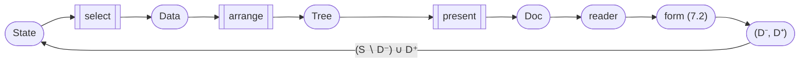

*The closed pipeline. Three factors turn state into a document, a human reads that document, the human's answer is a delta, and that delta becomes the next state as `τ` ticks (4.5). Every arrow but the human's is a numbered proposition. Everything before this figure derives it; everything after measures the world against it.*

Change, the objection said, is where declarative architectures fail. Change is the arrow that closes the diagram.

---

# Part III — The Reveal

*The derivation is complete (a data model, an algebra, a crossing, a write side), and none of it has been named. This part names it, then sets out the mismatches. The names are decades old.*

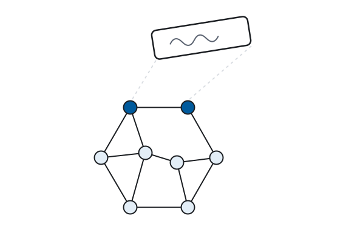

## Chapter 8. It Already Exists

<div class="fp-epigraph">

*I would definitely point to RDF as prior art in terms of thinking about properties, independent of aggregates.*

— Rich Hickey, creator of Clojure (*Cognicast*, 2016)
</div>

Everything in Part II was derived from three RFC-level definitions (identifiers, requests, responses) and three requirements. No W3C recommendation has entered as a premise. Where AWWW is cited (Chapter 4's good practices, Chapter 5's transposition table), it is cited as corroborating evidence, never as a premise. Chapter 4 states that rule outright. No vocabulary from any data-model community has appeared. The standard names follow:

| Derived in Part II | Standardized as | Since |
|---|---|---|
| `Fact = I × I × (I ∪ V)` | RDF (Resource Description Framework) triple (subject, predicate, object) | 1999 / RDF 1.1 2014 |
| `State = 𝒫(Fact)`, merge = ∪ | RDF graph; graph merge | 1999 / RDF 1.1 2014 |
| selection algebra (pattern, join, union, project) | SPARQL algebra, §18 (Basic Graph Pattern, Join, Union, Project) | 2013 |
| delta `(D⁻, D⁺)` | SPARQL Update (`DELETE`/`INSERT`) | 2013 |
| dereferencing `select` results (S4) | Linked Data; Graph Store Protocol (HTTP methods addressed to whole graphs) | 2006 / 2013 |
| `canon` | canonical RDF/XML; RDFC-1.0 (RDF Dataset Canonicalization) for the unnamed entities (*blank nodes*) | 2004 / 2024 |
| `⟦t⟧ : Tree → Tree` after canon | XSLT | 1999 / 3.0 2017 |
| `present` | CSS | 1996 |

*Table 8.1. The correspondence.*

Read the dates first. Every row predates this book, most by decades, and none appears anywhere in Parts I–II. There is one conceded exception: Chapter 3 turns CSS off by name, and turning it off is the act every reader knows it by. The derivation's premises are the RFC layer only, so the match in this table is a check the reader performs, not a construction the author arranged. The columns are independent: the left side is forced by three requirements, and the right side was shipped by working groups. The table asserts they are the same objects.

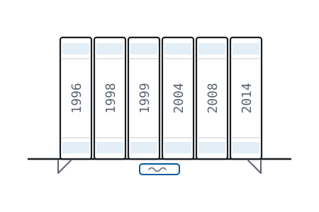

**Prop. 8.1 (Homomorphism).** There is a translation `φ`, facts to RDF triples, states to graphs, selection terms to SPARQL terms (write `sparql(p)` for that last translation), such that `φ(select(p, S)) = ⟦sparql(p)⟧(φ(S))`; on ground states `φ` is a bijection. The mapping is a *homomorphism*, not a coincidence of shapes: the operations commute with the translation.

<details>
<summary><i>How the check runs — clause by clause against a denotational spec.</i></summary>

The equation `φ(select(p, S)) = ⟦sparql(p)⟧(φ(S))` is checkable clause by clause against the SPARQL algebra. The algebra is written denotationally (a rarity among web specs, shared mainly with XQuery's Formal Semantics) and that denotational form is what makes the check possible. Full proof: Appendix B.7.

</details>


*Prop. 8.1. Two paths give one result: translate then query, or query then translate (the standard calls the result a solution sequence). The square commutes.*

**You have already accepted RDF. You did it in Chapter 5, before I told you its name.**

Whatever you believed about the semantic web when you opened this book (too academic, too complicated, died in the nineties), you derived it yourself. You derived it from three requirements, and you can reject each one only at the cost that requirement itself states. The technologies were not a committee's enthusiasm in search of a problem. They occupy a position that was *forced*, and the people who standardized them in 1999 had already arrived there. What failed in the nineties was not the position. The tooling failed, and the timing was wrong, because the substrate is built for machine consumption and the machines that could consume it were twenty years away. Chapter 17 makes the demand-side case.

<div class="fp-exhibit" data-exhibit="reveal"></div>

*Interactive exhibit (online edition): Chapter 5's state, Chapter 5's algebra, and Chapter 7's delta sit under one switch. One side shows the derivation's notation; the other shows Turtle (the standard's text notation for triples), SPARQL, and SPARQL Update. Nothing is recomputed. Everything is renamed.*

**Theorem 8.2 (Synthesis).** The stack realizes the proper factorizations whose `select` is a term of Chapter 5's algebra and whose `arrange` is generic, invariant under URI renaming, singling out no particular URI. SPARQL carries those selections exactly (Prop. 8.1), XSLT-over-canon the arrangements, CSS the presentation, and S4 holds by construction because query results and graphs are dereferenceable resources. By Prop. 7.3's symmetry, the write side inherits the result: SPARQL Update carries the deltas in the same pattern language, arguments swapped. Full proof: Appendix B.8, which states the genericity condition exactly.

The select-side condition is Chapter 5's own boundary restated. The genericity condition is the claim's deeper caveat, carried inside it: the completeness class for `arrange` excludes transforms that smuggle in knowledge of particular URIs. Practitioners call that condition data-drivenness, and this states it as mathematics. It is also AWWW §2.5's URI opacity, made exact. Analysis said every application has the form; Synthesis says the stack fills the form. The two halves of the argument meet. This meeting point is the book's proof.

---

## Chapter 9. The Mismatches

<div class="fp-epigraph">

*RDF is painfully simplistic, but it allows you to work with real-world data and problems that are horribly complicated.*

— Dan Brickley and Libby Miller, foreword to *Validating RDF Data*
</div>

Chapter 8 put both halves of the argument into theorem form: every application has the derived form, and the deployed standards fill it. That invites suspicion. A derivation that matches a deployed stack exactly looks retrofitted until its mismatches are listed openly, so this chapter lists them. The fit is not exact. There are two mismatches between the model Part II forced and the standard Part III named, and two more between the standard and the platform that ships it, the browser. Each is located; the first two are measured (Props. 9.1–9.2), and one of them is turned into a prediction the standard later honored. Part IV holds everyone else's models to the same test.

### Mismatch one: the unnamed entities

RDF permits facts about entities with no name — blank nodes. Nothing in Chapter 5 forced them: the derivation minted a fresh URI wherever it needed an entity, because minting a fresh URI costs nothing. So blank nodes are surplus, and the surplus has a precise reading. A graph containing `_:b` asserts *that something exists* with these properties; RDF's own semantics says exactly this: simple entailment treats blank nodes as existential variables. The extension is well-motivated. Entities routinely exist before anyone names them. A form not yet submitted and an observation not yet reconciled each describe an entity that has no name. So a model that forbade the unnamed would fail R1 at the margins of every domain.

The cost can be stated exactly. Write `⊕` for the merge of two states.

**Prop. 9.1.** Over ground facts, merge is plain set union (`⊕ = ∪`) and Chapter 5's four merge laws hold on the nose: totality, order-freedom, idempotence, atomicity (B-2a–d). With blank nodes, idempotence and atomicity hold up to logical equivalence, and only up to logical equivalence.

<details>
<summary><i>Proof — merging a graph with itself doubles the existentials: equivalence survives, identity does not.</i></summary>

Blank nodes are scoped to their graph, so composition must standardize them apart: `s ⊕ s` carries two copies of each existential. The result asserts nothing new (it entails `s` and is entailed by it), so `s ⊕ s ≡ s`. But as a set of atoms it is strictly larger, so `s ⊕ s ≠ s`. B-2c survives semantically and fails syntactically. Atomicity bends the same way: an atom containing a blank node means something only together with the atoms sharing its variable, so self-containedness holds per connected component, no longer per atom. Restoring identity from equivalence costs exactly two computations: canonical labeling (standardized in 2024 as RDFC-1.0, deterministic, with adversarial worst cases the spec itself documents) and redundancy elimination, which is coNP-complete in general. ∎

</details>

That is the bill for anonymity, and it falls exactly on the party that chose anonymity. If you name your entities, state composes by set arithmetic. If you leave them unnamed, composition becomes theorem-proving in miniature, and it lands precisely at the seam where Chapter 6 put `canon`. The formalism therefore places the work exactly where names are missing. The deployed stack's own list idiom shows the cost: an ordered collection encoded as a chain of unnamed cells carries the cost of anonymity at every link. Order is the recurring case. If you state order as facts, using one rank fact per member as Chapter 3's opening example did, then order merges like any other facts. If you fold order into shape instead, it costs what shape costs.

### Mismatch two: the fourth position

The web adds one requirement that Chapter 5 never imposed. R1–R3 govern facts about the world, and the web also carries *claims* about those facts: one source asserts a fact and another disputes it, and the web records provenance, retraction, and trust. Call it R4:

**R4 — Attribution.** Facts about who asserts facts.

**Prop. 9.2.** The arity-minimal state model satisfying R1–R4 is `𝒫(I × Fact)` — quads.

<details>
<summary><i>Proof — set union forgets who contributed; reification attributes only descriptions; one position repairs it.</i></summary>

Union erases contribution: B-2d says `atoms(s ⊕ s′) = atoms(s) ∪ atoms(s′)`, and a set union keeps no record of which side an element came from. So within `𝒫(Fact)`, "who asserted this atom" is unrecoverable by construction — attribution lives in the history of the state, and states-not-histories is what B-2c chose. Reification (the standard's device of describing a fact in triples of its own) does not escape either: it attributes only a *description* of the fact. The described fact is then either also present as a plain atom or absent. If present, it is asserted outright and the attribution is defeated. If absent, it is attributed but never stated, quoted rather than asserted. The minimal repair types the atom as a pair (source, fact). The source position must refer across parties, hence lies in `I`, R3's argument (condition B-3 in Appendix B) verbatim. One extra position suffices, because attribution of attributions is more quads, not more positions. Rerun B.1–B.3 over the retyped atom: `𝒫(I × I × I × (I ∪ V))`, merge still union. ∎

</details>

Here the mismatch becomes a prediction. The 1999 core standardized triples. The deployed stack then grew exactly the fourth position: named graphs, RDF datasets, TriG, standardized in 2014. The graph name is a URI, so attribution itself dereferences. A derivation that merely matched the 1999 core could be coincidence. But the derivation's one missing requirement generates the standard's own later extension, so it is tracking the constraint, not fitting itself to the artifact. The prediction has a limited scope. The fourth position arrived, but the standard did not fix what the graph name *means*, and its semantics is still argued about. The prediction is structural, and claimed as nothing more. (Annotation syntaxes, RDF 1.2's triple term, by contrast, only re-serialize what reification already expressed. They are a convenience and nothing more, because syntax is not a property and Part IV's audit table scores properties.)

### Mismatch three: the abandoned seam

Chapter 6's crossing needs two pieces: a canonical serialization and a declarative tree-transformation language. The deployed stack had both, and the transformation language (XSLT) was standardized in 1999 and shipped in every browser. The platform then froze it at that 1999 revision for a quarter of a century and, as of this writing, is scheduled to remove it outright. So this mismatch is not a gap in the standards: the technology existed, and the platform stopped maintaining it. This is the evidence Chapter 6 promised: the graph-to-tree crossing needs no invention, only upkeep of software that already existed. The platform declined that upkeep, and the industry built, many times over, the compensating machinery Part IV measures.

Stated generally, that is the book's practical thesis: what separates the modern web from the derived one is abandoned technology, a maintenance failure, not a research problem. And the failure is the platform's, not the language's: XSLT 3.0 (2017) runs in every current browser through [SaxonJS](https://www.saxonica.com/html/saxonjs/index.html). Its [IXSL extension](https://www.saxonica.com/saxonjs/documentation3/index.html#!ixsl-extension) binds browser events to template rules, so Chapter 7's mobility of evaluation is deployed today and interactivity stays declarative. From userland, a vendor performs the maintenance the platform dropped.

### Mismatch four: the write-side last mile

Forms, run backwards, want submissions that denote deltas (Prop. 7.2). The W3C Recommendation stack stops one step short: SPARQL Update carries the delta, but HTML forms speak `application/x-www-form-urlencoded`, and no recommendation bridges the two. The bridge exists as a community spec, [RDF/POST](https://atomgraph.github.io/RDF-POST/). It flattens the triple positions into form keys (`su`, `pu`, `ou`, `ol`, …: subject, predicate, object, literal), so that a plain HTML form, with no script, submits a graph. It adds no new data model; it is an encoding of the derived model into the form media type the web already ships. Its non-standardization is a remaining gap on the write side. (Disclosure: the spec is maintained by the author's company, building on Sergei Egorov's original draft. Chapter 18 shows it at work.)

### The inventory

Four mismatches, then:

| mismatch | seam | resolves as |
|---|---|---|
| the unnamed entities (Prop. 9.1) | model ↔ standard | a motivated extension, its cost computable, and billed to whoever chose anonymity |
| the fourth position (Prop. 9.2) | model ↔ standard | a prediction the standard later honored |
| the abandoned seam | standard ↔ platform | abandonment — maintenance, never research |
| the write-side last mile | standard ↔ platform | a bridge specified, never standardized |

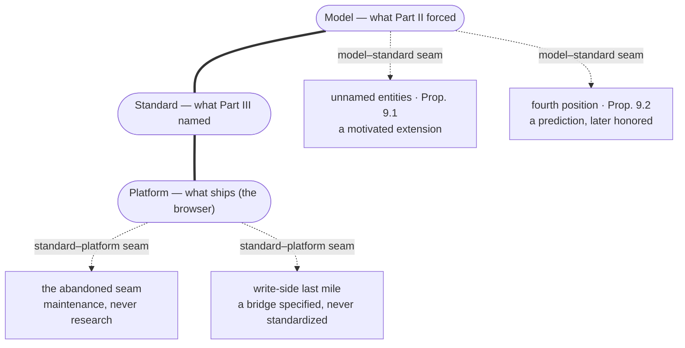

*The four mismatches. The derivation meets the world at two seams: the **model** (Part II) against the **standard** (Part III), and the standard against the **platform** that ships it. At the model–standard seam (Props. 9.1–9.2): the standard permits unnamed entities the model never required, and the standard's fourth position honors a requirement the model missed. At the standard–platform seam: the platform abandoned a technology it had shipped, and a bridge that was specified but never standardized. Fixing either platform mismatch requires no new invention, only maintenance and standardization.*

None of these mismatches invalidates a proposition from Part II. And listing them matters: an audit is credible only if the auditor's own defects are on record first. With the inventory complete, Part IV applies the same requirements to other architectures.

---

# Part IV — The Audit

*Part II derived seven properties; Part III showed that one stack satisfies all of them. This part scores everything else the industry runs, and last, the derived stack itself, on the same rows; its closing chapter is the completed table.*

*Every audit in this part fills one column of the same table; the final chapter assembles the complete table. The rows are R1 R2 R3 · S1 S2 S3 S4. Each technology is evaluated against those seven properties, and the scores carry the argument. The rows themselves are backed by proofs: R1–R3 by Theorem 5.4, S1–S4 by Proposition 4.4. So rejecting a score means rejecting a requirement, not defending a technology.*

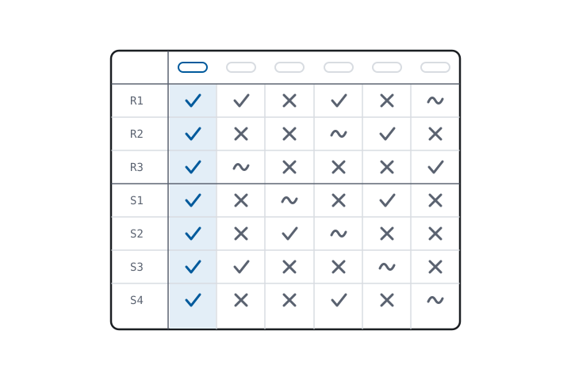

## Chapter 10. Brackets

Since the early 2000s, the web community has executed the largest format migration in its history: XML to JSON. That migration rewrote APIs, retired toolchains, and retrained developers over two decades. And what changed?

| 1999 | 2019 |
|---|---|
| `<person><name>Ada</name></person>` | `{"person":{"name":"Ada"}}` |

*Twenty years of progress. The book's only sarcastic figure caption.*

Activity of this shape is **lateral churn**, motion that looks like innovation but isn't. Real innovation is vertical: new layers, new semantics, new abstractions on top of what already works. That is how the web was designed to grow. Parts II and III have shown, formally, that the vertical direction was open the entire time.

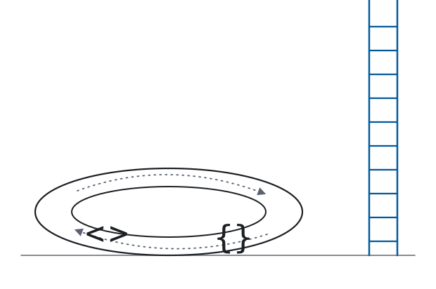

That historical claim can now be tested: if XML→JSON was lateral churn — a change of syntax presented as a change of substance — the seven properties should score both formats the same.

Both formats share one data model. An XML document and a JSON document are ordered labeled trees; their differences (attributes versus members, elements versus arrays) decorate the same structure. Chapter 5's requirements apply to the structure, so the scores transfer wherever a requirement sees only the tree. R3 is the exception, and the formats part ways there.

**R2.** Trees have no coordination-free merge. Two JSON documents have no defined composition at all. Concatenation is not valid JSON, and "deep merge" is a per-application policy (which key wins, whether arrays append or replace). And a policy shared between parties is coordination. In the terms of Appendix B, meaning lives in arrangement (position, nesting, order). That rejects B-2d (atomicity: a state says exactly what its atoms say). So the representation lemma (B.1), the proof behind the union law, never gets started. ✗

**R3.** JSON has no reference type. A URL in a JSON string is a string; the format's specifications define grammar and leave interpretation to applications, so nothing distinguishes a link from a postcode. XML held fragments of the property. Namespaces gave vocabulary terms global names; `xml:id` and XLink offered standardized reference, largely unused. The migration shed the fragments too. AWWW §4.4 named three good practices in 2004 (link identification, Web-wide linking, hypertext links), and all three fail in the format the industry migrated *to*. The destination format, JSON, scores ✗; the origin, XML, keeps a ~ for its surviving fragments.

**The tooling deficit, itemized.**

| capability | XML stack | JSON stack |
|---|---|---|
| schema | XSD (XML Schema), 2001 | JSON Schema — drafts since 2010, still a draft |
| query | XPath, 1999 | JSONPath — RFC 9535, 2024 |
| transformation | XSLT, 1999 | — |
| intra-document addressing | fragments + XPointer | JSON Pointer — RFC 6901, 2013 |
| vocabulary scoping | Namespaces, 1999 | — |

The JSON stack's tools arrived a quarter century late where they arrived at all. Its query language was standardized in 2024, twenty-five years after XPath, and it has no entry at all for transformation or vocabulary scoping. The migration's tooling deficit is two decades old and still open. And longevity ran the other way. The JSON column's empty transformation cell is filled by whatever framework is current, and most JavaScript frameworks of 2010 have already been retired. XSLT, frozen at its 1999 revision as Chapter 9 filed, still runs in every browser as of this writing.

**Column: XML stack.**

| | XML stack |
|---|---|
| R1 | ✓ — trees encode any domain |
| R2 | ✗ — no coordination-free merge; meaning lives in arrangement |
| R3 | ~ — namespaces, `xml:id`, XLink: standardized fragments, largely unused |
| S1 | ~ — vocabulary separated by schema; arrangement and data still fuse |
| S2 | ✓ — XPath and XSLT: query and transformation with specified semantics |
| S3 | ✓ — one standardized language per capability; components substitute |
| S4 | ~ — fragments and XPointer address into documents, largely unused |

**The S-properties of the deployment style — REST as practiced.** The style's genuine inheritance from HTTP survives in the scores: resources carry URIs, so S4 earns partial credit at the resource grain. The credit stops there, because values inside a representation cannot link onward, so the data ends at every document boundary. The style's own definition requires hypermedia links (Fielding 2000, §5.1.5); the deployments that adopted the style's name discarded the requirement. Query and transformation semantics are implementation-defined (S2 ✗). Substituting a component means renegotiating a bespoke contract per pair of parties (S3 ~). Every payload ships arrangement and data fused (S1 ~; the endpoint separates, the representation does not).

**Column: JSON/REST.**

| | JSON/REST |
|---|---|
| R1 | ✓ — trees encode any domain |
| R2 | ✗ — no defined composition; merge is per-application policy |
| R3 | ✗ — no reference type; links are strings |
| S1 | ~ — endpoints separate; representations fuse arrangement and data |
| S2 | ✗ — interpretation left to applications; query standardized 2024, transformation never |
| S3 | ~ — substitution behind bespoke contracts |
| S4 | ~ — resources have URIs; values do not link onward |

The opening question (*and what changed?*) now has a measured answer: the migration changed brackets, shed tooling, and gained not one property. The cells that moved (R3, S2, S3) moved down. The numbers show lateral churn.

## Chapter 11. The Single-Page Application

This chapter audits the single-page application (SPA). In the book's terms its architecture is the trivial factorization of Chapter 4 (Prop. 4.2), deployed at industry scale. `select` and `present` shrink to near-identities; the application is stuffed into one term that computes all of `read`. Fetching, state management, templating, and styling decisions interleave in one program, delivered as one bundle.

**S1.** State is threaded through the term (component state, stores, caches, props) with no factor boundary anywhere; the paradigm's own architecture diagrams draw the threading as a feature. ✗

**S2.** The term is imperative, so its meaning is defined by execution order. The failure is in principle rather than in implementation. Def. 4.3 requires each factor to denote a term in a language with closed semantics; an imperative program's meaning is the trace of its execution. No discipline within the paradigm can repair this, because the paradigm *is* the choice of trace over denotation. ✗

**S3.** No factor can be replaced without rewriting the term as a whole. Substitutability needs a factor boundary to swap across, and S1 showed there is none. State, selection, arrangement, and presentation are one program, so changing any concern means editing that program, not substituting a term of a language. ✗

**S4.** No intermediate value has a URI. The data behind a rendered view cannot be addressed, cached by intermediaries, indexed, or linked. Chapter 3's exhibit filed the evidence in passing. Stripping style from the dashboard left chrome, the frame with no facts in it, because the curves were pixels on a canvas. The state was invisible even to the application's own document. ✗

**The one-timeline consequence.** Independent evolution (Prop. 4.5) states what the fusion costs. The application is one component with one timeline, so any change (data, layout, theme, query) is a change to the whole term. The term is the unit of delivery, so it is also the unit of invalidation. Four consequences follow, and each one forfeits a property that Fielding's constraints were chosen to induce:

- caching degrades to bundle-level, which is the corollary to Prop. 4.5 and now an operating cost;
- crawling requires headless browsers, machines simulating humans in order to read what machines produced;
- reuse requires reverse-engineering a private API, the S4 tax, paid by every integrator separately;
- hydration (shipping the document *and* the program that regenerates it) is the S1 tax: the architecture cannot tell its document from its program, so it ships both.

**The R-properties.** R1 holds; a program holds any state in memory. R2 and R3 fail together. Component state has no merge law. State-synchronization libraries are the compensating industry. And references are pointers: machine-local by definition.

**The platform's component model.** One objection to the audit is that these failures belong to frameworks and that the platform is the cure, since the platform has since shipped its own component model. Web Components are the test case. A custom element gives the fused term a tag name; shadow DOM gives it a boundary the document's own selectors cannot cross.

Run the scores. The tag denotes nothing until its class executes, so meaning is still the trace (S2). The element's state lives in the class, threaded as before (S1). The shadow tree is an interior hidden *by design*: no URI reaches it, and now no selector either (S4). And no factor boundary appeared, so substitution still means rewriting the class (S3). The standard standardizes the seam *around* the term, not a seam *through* it: a component boundary is not a factor boundary. Moving the component model from framework to platform moves no score. Chapter 1 filed the framework as an implementation detail, and this is the confirming experiment.

What shadow DOM does standardize is encapsulation: state hidden behind a boundary on purpose. That is a term the book has not used until now. Chapter 13 audits the paradigm that encapsulation belongs to, and that paradigm is not the web's.

The corollary: **the SPA is the un-web** — HTTP reduced to a pipe delivering a program whose interior satisfies none of the properties that define the web. The corollary adds nothing to the column, because rejecting the corollary means rejecting a score, and each score names the property that the objection must be argued against. A prediction follows, and it is labeled as one: the paradigm caps structurally at Web 2.0, because Web 3.0 *means* machine-consumable state (the definition Chapter 20 makes exact), and the paradigm's defining move is hiding state behind `read`. Chapter 14 measures the industry's own retreat from this position; Chapter 22 records what arrived in the meantime.

**Column: SPA/JS.**

| | SPA/JS |
|---|---|
| R1 | ✓ — any state, in memory |
| R2 | ✗ — no merge; synchronization is bespoke |
| R3 | ✗ — references are machine-local pointers |
| S1 | ✗ — state threaded through one term |
| S2 | ✗ — meaning is execution order, in principle |
| S3 | ✗ — substituting a factor means rewriting the term |
| S4 | ✗ — no intermediate value has a URI |

The column restates the corollary, cell by cell.

## Chapter 12. The Applet Returns

WebAssembly (Wasm) as a paradigm treats the browser as a virtual machine and the application as one compiled binary. It is the extreme case of fusion, because everything collapses into one term, and it therefore scores zero on all of S1–S4 *by construction*. The format's virtues (any language, compiled, opaque) remove every seam the properties require. There is nothing inside the term for the web's semantics to address, and that is the design.

One step separates this column from the last. Chapter 11's fused term still emitted a DOM, a tree the platform could at least inspect. The paradigm audited here renders into a canvas or a buffer. Chapter 6 classified every framework as a strategy for the graph→tree crossing. This one declines the crossing altogether and produces no graph or tree, only pixels. That is the terminal state of fusion.

History has already run this experiment. Compiled programs delivered through the page, executing in a VM, rendering into a rectangle the web could not see into: the description fits 1996 as well as it fits today. In 1996, its name was Java applets. The web's declarative documents outlived them. The principle of least power (prefer the least powerful language that suffices for the job) was the reason then and is the reason now. The W3C Technical Architecture Group made it a formal finding in 2006: [*The Rule of Least Power*](https://www.w3.org/2001/tag/doc/leastPower.html). The finding is its own document, not, as often assumed, part of AWWW.

The concession is Wasm as a *leaf*: a codec, a physics kernel, a solver inside one factor of a proper factorization. A leaf is useful and harmless, because computation inside a factor leaves every property intact. The factor's boundary is still a declarative term. The objection is to computation *replacing* the factorization, not to computation itself.

Black-box binaries served by corporations invert the property that let every reader of the early web become an author by viewing source. That inversion is not an accident; it is the business model.

**Column: Wasm-as-paradigm.**

| | Wasm-as-paradigm |
|---|---|
| R1 | ✓ — any state, in linear memory |
| R2 | ✗ — linear memory has no merge |
| R3 | ✗ — references are addresses in a private address space |
| S1 | ✗ — by construction |
| S2 | ✗ — by construction |
| S3 | ✗ — by construction |
| S4 | ✗ — by construction |

S1 through S4 all score zero by construction. The column scores the terminal state of fusion.

## Chapter 13. Pre-Web Paradigms

<div class="fp-epigraph">

*Technology changes quickly; people's minds change slowly. […] The next generation of programmers grows up only being shown one way of thinking about programming. […] They grow up with dogma. And once you grow up with dogma, it's really hard to break out of it.*

— Bret Victor, *The Future of Programming*, 2013
</div>

Four columns of failures have accumulated: two bracket stacks (Chapter 10), the single-page application (Chapter 11), and the applet (Chapter 12). The pattern repeats. The scores cannot say where architectures that fail this way keep coming from. One observation can: they do not come from the web. Relational databases, object orientation, object-relational mappers (ORMs), imperative languages, and MVC (model–view–controller) all predate the web. Each fails the derived requirements at one identifiable seam, and that is *why* each of them has a compensating industry at the web boundary. The industries are the measurement: nobody builds a bridge across a gap that isn't there. And the reading is falsifiable: a compensating industry that grows up around a paradigm failing no derived requirement (a market pricing a gap the audit cannot name) would break it.

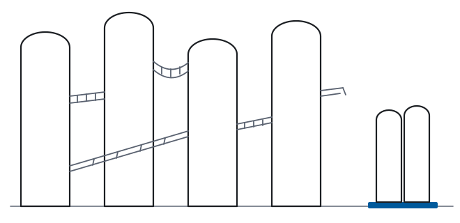

### Relational

The relational model is the strongest of the pre-web paradigms and the most instructive. Inside one database it scores where nothing else pre-web does. Relational algebra is denotational, which means it had S2-grade semantics decades before the web. Its separation of query from storage is genuine S1 discipline. The failure is R3, and it is total: keys are database-scoped, so a reference is only meaningful to clients holding the same connection string, and two databases whose owners never coordinated share no name for anything. R2 fails as a consequence, because composition now requires a schema authority. The compensating industry is integration itself: every pair of silos bridged by hand, per pair, forever.

### Object orientation

Encapsulation is the deliberate fusion of state and behavior. That is R1 half-inverted: state exists, but in order to be hidden. Objects are designed neither to merge nor to be referenced from outside their runtime; identity is a pointer. The compensating industries: serialization frameworks and data-transfer-object (DTO) layers, machinery for re-extracting the state the paradigm hid, every time it must travel.

### ORM

An ORM is a type error between two wrong models: object graphs mapped onto relations, machine-local identity onto database-scoped keys. Each side fails a different requirement (R1 on the object side, R3 on the relational), and an ORM fails both at once. The size of the object-relational impedance-mismatch literature measures the cost of that failure.

### Imperative languages

S2 is unreachable in principle here, which is Chapter 11's argument restated at the language level. The compensating machinery is the testing pyramid. When meaning is execution, every claim about meaning must be executed before it can be checked, so semantics is recovered empirically, once per program, forever.

### MVC

MVC assembles the paradigms above. Its Model has neither R2 nor R3, its Views lack S2, and its Controllers fuse what S1 separates. Take it apart and each part has a derived generic replacement. The model gives way to the shape of a fact (5.3), the view to `⟦t⟧` and `⟦s⟧`, and the controller to `read` and `write` themselves, which HTTP had already provided.

| Paradigm | Fails | The compensating industry |
|---|---|---|
| Relational | R3 (keys are database-scoped) | integration: hand-built bridges between silos |
| OOP | R1 half-inverted (state present but hidden) | serialization frameworks, DTO layers |
| ORM | a type error between two wrong models | the impedance-mismatch literature |
| Imperative | S2 unreachable in principle | testing pyramids doing the work semantics should |
| MVC | all of the above, assembled | all of the above, assembled |

These are not outdated because they are old. HTTP is old. They are *pre-web* in the technical sense: their reference, composition, and semantics mechanisms are machine-local, and the web is definitionally the machine-spanning case. The 1960s–70s stack answers "how do I compute inside one machine". The web asks "how do independent parties share state with no coordinator". Theorem 5.4 shows the second question forces a model none of them is.

Two columns cover the five paradigms. OOP and its ORM share one column. The audit of imperative languages comes down to a single cell, S2, which is unreachable in principle. A column for MVC would repeat the others.

| | Relational | OOP/ORM |
|---|---|---|
| R1 | ✓ — any domain, one schema at a time | ~ — state present but hidden |
| R2 | ✗ — no shared names, so composition needs a schema authority | ✗ — objects do not merge |
| R3 | ✗ — keys are database-scoped | ✗ — identity is a pointer |
| S1 | ✓ — query separated from storage | ✗ — encapsulation fuses state and behavior |
| S2 | ✓ — relational algebra is denotational | ✗ |
| S3 | ~ — within one vendor's dialect | ~ — behind interfaces, within one runtime |
| S4 | ✗ — no value addressable from outside | ✗ |

The relational column is worth reading twice: it holds the highest pre-web score in the book, and it fails on exactly the machine-spanning properties. The diagnosis follows from the scores. The relational model is a correct answer to the single-machine question, applied to the machine-spanning question instead. The scores are settled, but the industry has not settled. It has spent a decade paying these costs; what it did in response is the next chapter.

## Chapter 14. The Convergence

This chapter is the evidence. The JavaScript ecosystem had no exposure to any derivation, and nothing but its own costs moved it. It has spent a decade converging back toward the proper factorization, one rediscovery at a time:

- **SSR — server-side rendering.** Documents should arrive as documents. The S4 tax landed as Chapter 11 billed it: every integrator had to reverse-engineer a private API, and search crawlers could not read the page at all. The industry moved for its own reasons (SEO and first paint) and the fix is `present ∘ arrange ∘ select` running on a server, where it had been running since 1993.
- **Hydration.** The industry gave Chapter 11's S1 tax a name of its own. That name records a category error.
- **Islands.** The industry rederived the principle of least power from the costs: most of the page needs no program, so most of the page is no longer written as one.
- **React Server Components.** RSC pulls `select` back out of the fused term, ten years after fusion. But its wire format is a bespoke, non-addressable serialization of exactly the intermediate value S4 says should have a URI. So RSC restores the `select` factor without restoring the addressable resource that S4 requires.
- **GraphQL.** GraphQL provides declarative queries over a graph model, and those queries return projections. It rebuilds `select` and R1, but without global identifiers. Because R3 is missing, GraphQL stops at the boundary of the organization that defines the schema: federation works within one organization and no further. Its column is below.
- **HTMX and the hypermedia revival.** This is the same convergence, reached from the opposite direction: practitioners argued documents, links, and forms back into fashion on their original merits. Forms are Chapter 7's instrument.

The framing is convergent evolution: independent lineages, under the same pressure, arrive at the same design, and the match is explained by the pressure, not by chance. The lineages had contact with nothing but the costs, and the costs are the derivation's predictions.

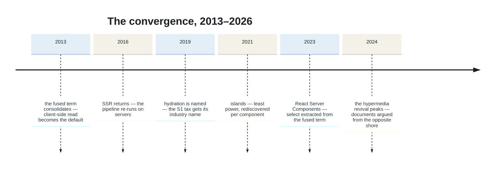

*Years mark mainstream arrival, not invention. The axis the figure cannot draw is the one the chapter measures: S1 and S2 have recovered to tildes, while R3 and S4 have not been recovered at all.*

**Column: GraphQL.**

| | GraphQL |
|---|---|
| R1 | ✓ — a graph model; encodes any domain |
| R2 | ✗ — schemas compose only by coordination |
| R3 | ✗ — no global identifiers; names stop at the schema boundary |
| S1 | ~ — `select` genuinely separated, but behind one endpoint |
| S2 | ~ — a specified but prose-defined semantics |
| S3 | ~ — substitution within one schema's contract |
| S4 | ✗ — one endpoint; results are not addressable |

**Column: SPA/JS, revised.**

| | SPA/JS (Ch 11) | SPA/JS (2026) |
|---|---|---|
| S1 | ✗ | ~ — `select` re-extracted |
| S2 | ✗ | ~ — declarative islands in an imperative shell |
| R3 | ✗ | ✗ |
| S4 | ✗ | ✗ — the wire format has no URI |

*R1, R2, S3: unchanged from Chapter 11's column.*

One closing observation: the convergence recovers S1 and S2, to a tilde, not a check. But it stalls before R3 and S4, the two properties that make it *the web* rather than an app platform that happens to use browsers. The stall has a reason: the remaining work benefits everyone except the vendor doing it. Vendors adopt the properties that benefit them privately first, and adopt the properties that benefit the public later. So the convergence approaches the proper factorization without reaching it, in the predicted order.

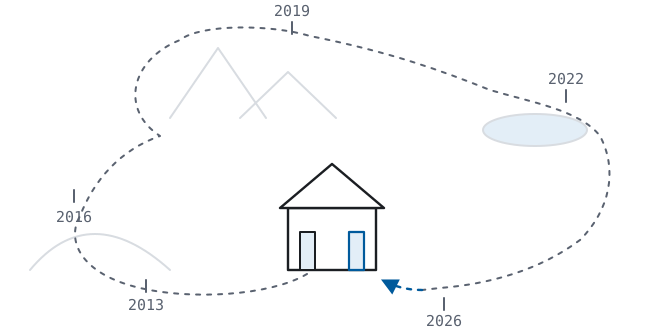

## Chapter 15. The Derived Stack

Five chapters have scored seven columns between them, and every column holds a failure. One column remains, scored on the same seven rows: the stack Part III revealed. An audit that stopped here, one column short, would have exempted exactly the technology the book argues for; this chapter removes the exemption. It is the audit with the least new work in it, and that is the finding: every cell below carries a citation to a result already proved. So where the other columns needed scoring, this one needs collecting.

When Chapter 11 scored the SPA, the scores were assessments — argued in prose, each naming the property it rested on, so anyone disputing a score knew which property to attack. The cells below assert nothing new: R2's check is the union law (5.1), proved before the stack had a name; S2's is Theorem 8.2, proved before this part began. The part's opening rule is that a score is rejected only by striking a row. That rule reaches its hardest case here: striking any of the column's rows means refuting a proved result, and each cell names which one.

The three R-cells are the derivation itself, taken in the order the propositions arrived. R2 is the union law (5.1): merge is set union, total, order-free, idempotent, the only composition the coordination-free laws leave. R3 is (5.3): the first two positions of every fact lie in `I`, so reference is global by type rather than by discipline. R1 is Proposition 5.2 with Theorem 5.4: triples encode any domain, and any arity-minimal model satisfying all three requirements is this one up to isomorphism. Chapter 5 argued the requirements against the reader's alternatives, not against the stack's competitors; the stack inherits the checks because Chapter 8 proved it is the model, renamed.

The four S-cells draw on the two halves of Part III's meeting point. From the analysis half, S1: it holds by construction of the factorization (4.3). From the synthesis half, S2 and S3: each factor denotes a term in a language with closed, cited semantics (SPARQL's algebra, XSLT-over-canon, CSS) and terms with closed semantics substitute per factor (8.3). S4 draws on both halves: the factorization requires every stage value to be addressable (4.3), and the stack delivers it by construction, the graph, the query result, and the document each dereference (8.3). One qualification carries over with the theorem: the completeness class for `arrange` excludes smuggling. A transform belongs to that class only if it is generic, meaning invariant under URI renaming (B.8). The S2 and S3 checks are checks on that class, not on arbitrary code.

What would make the column suspect is not who scored it but what the scoring left out, and Chapter 9 already filed the omissions. So there are four mismatches. Which rows do they affect? The two that belong to the model affect the rows most directly. Blank nodes weaken R2 slightly: idempotence holds up to logical equivalence rather than syntactic identity, and that cost is priced exactly (Prop. 9.1). Over ground facts the row holds exactly, and the composition laws still hold. The fourth position adds a requirement rather than removing a score: the web requires R4 (attribution), and the column meets R4 by moving to quads, where merge is still set union (Prop. 9.2). R4 is not a row below because no column in this part was scored on it; it is Chapter 9's addition, and the quad model carries it.

The two that belong to the platform leave every row's score unchanged, because no row measures maintenance. The abandoned seam and the write-side last mile are deployment failures, and deployment failure is what this part has priced in every other column's compensating industry. The pricing is symmetric: no other column's row was struck for deployment either, because the industries corroborated failures the rows had already scored. The stack's own deployment bill is itemized in Chapter 9, mismatches three and four. The mismatches do not soften the column. They are why it can be trusted: Chapter 9 stated all four openly, where any reader could check them, before this audit began, and every cell below cites a result that carries its own caveats with it.

**Column: Derived stack.**

| | Derived stack |
|---|---|
| R1 | ✓ — encodes any domain; the model is forced (5.2, 5.4) |
| R2 | ✓ — merge is set union: total, order-free, idempotent (5.1) |
| R3 | ✓ — reference is global by type: the first two positions lie in `I` (5.3) |
| S1 | ✓ — factor boundaries by construction (4.3) |
| S2 | ✓ — each factor a term with closed, cited semantics (8.3) |
| S3 | ✓ — terms substitute per factor (8.3) |
| S4 | ✓ — every stage value dereferences (4.3, 8.3) |

Seven cells, none of them this chapter's judgment: every check predates the audit that collects it. What remains is to put the columns side by side.

## Chapter 16. The Properness Table

Every audit in this part ended with a column. This chapter assembles those columns into one table. No cell below is new, but placing the cells side by side is new, and that adjacency is what a ledger is for. Each column header cites the chapter that scores it. The derived column cites two: Chapter 8, which proved it, and Chapter 15, which audited it. Its cells add a parenthetical citing the scoring result. The rows are the seven derived properties: R1–R3 on state, S1–S4 on architecture. `✓` is satisfied, `~` partial, `✗` failed. In the online edition every cell of the derived column links to its proposition.

| Property | Relational (13) | OOP/ORM (13) | XML stack (10) | JSON/REST (10) | SPA/JS (11) | Wasm (12) | GraphQL (14) | Derived stack (8, 15) |
|---|---|---|---|---|---|---|---|---|
| R1 | ✓ | ~ | ✓ | ✓ | ✓ | ✓ | ✓ | ✓ (5.2, 5.4) |
| R2 | ✗ | ✗ | ✗ | ✗ | ✗ | ✗ | ✗ | ✓ (5.1) |
| R3 | ✗ | ✗ | ~ | ✗ | ✗ | ✗ | ✗ | ✓ (5.3) |
| S1 | ✓ | ✗ | ~ | ~ | ✗ | ✗ | ~ | ✓ (4.3) |
| S2 | ✓ | ✗ | ✓ | ✗ | ✗ | ✗ | ~ | ✓ (8.3) |
| S3 | ~ | ~ | ✓ | ~ | ✗ | ✗ | ~ | ✓ (8.3) |
| S4 | ✗ | ✗ | ~ | ~ | ✗ | ✗ | ✗ | ✓ (4.3, 8.3) |

Notes, one per line where a cell needs it.

- XML's R3 and S4 are `~` for namespaces, `xml:id`, and fragment addressing, standardized slivers of the properties, largely unused (Ch 10).
- GraphQL's S2 is `~` for a specified but prose-defined semantics. Its S1 is `~` because `select` is genuinely separated, but behind one endpoint. That one endpoint is where S4 fails.
- SPA/JS is scored as Chapter 11 audited it, at its 2013 consolidated form. Chapter 14 revises S1 and S2 to `~` as of 2026 and leaves the rest unchanged. That revision is Chapter 14's finding, so the column keeps its 2013 values here. The 2026 deltas live in Chapter 14's table.

Read the table by row rather than by column (property by property instead of paradigm by paradigm) and the audit's finding shows its shape. R2 fails in every column but one: composition without coordination is the property nobody else has, and it is what the "world wide" in the name promises. R2, R3, and S4 (the machine-spanning properties) fail or fall partial in every column but one. R3 and S4 are the two that, as Chapter 14 put it, make an architecture the web rather than an app platform that happens to use browsers. Chapter 13 found the highest pre-web score failing exactly the machine-spanning three; Chapter 14 found the convergence stalled before R3 and S4, the two still ahead. And the S-row failures kept appearing in this part twice: once as a score, once as a compensating industry. The industry is the bridge built across the gap the row names, at the boundary where a paradigm meets the web. The industries are the measurement; the table is the ledger.

One column has no failures, and Part II proved that this shape was forced. Those two facts are the book's argument in a single table. Part V builds with that column.

---

# Part V — The Synthesis

*This part builds with the one column of the audit that had no failures: the application space, the proof it needs no new standard, its economics, and the result they add up to.*

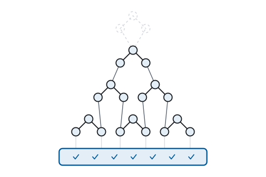

## Chapter 17. Building Up

This chapter runs the synthesis direction constructively, presenting the synthesis theorem as a build log. Start with the derived atoms and compose a working application space, defining each layer by what Part II forced and each concrete technology by the factor it inhabits.

### The dataspace

What the synthesis yields needs a name, and the name should do for state what "website" did for documents. Call it a **dataspace**: one party's stake in the data web, the unit of publication, ownership, and federation. A website serves documents under an origin; a dataspace serves *state* under an origin. Documents are included, since they are projections of that state. Machines can consume it too, since the names in the state can be dereferenced. (The database literature has used the word for pay-as-you-go integration, Franklin, Halevy, and Maier, 2005; the sense here is the web-native one.) The definition needs one primitive Part II never used, and the web already provides it. Chapter 1's pattern holds one last time:

```
O        the set of origins                               (RFC 6454)
I∣o      the URIs under origin o
```

An origin is not a new kind of name. RFC 6454 computes it *from* the URI (scheme, host, port), so `O` is a quotient of `I`. The namespace falls into regions, one per party, and "one party's stake" acquires a type. The definition has four components and no more: one origin and three names in that origin's region. The three can be names because on the web every published thing is a name:

```
Dataspace = (o, ont, e, x)      o ∈ O;   ont, e, x ∈ I∣o   (17.1)
```

| name | component | in words |
|---|---|---|
| `o` | the origin | read-write linked data at every document under it |
| `ont` | the ontology | what the domain *is*, stated as one namespace |
| `e` | the SPARQL endpoint | the same state, projected by query |
| `x` | the stylesheet | declarative rendering, extended by override |

Internal storage (file, memory, triplestore) has no row. It is invisible to consumers, as S1 demands.

Behind the four names stands one state `S`, in the shape of Prop. 9.2: quads, grouped by their fourth position into a family of named graphs. `S(u)` is the graph named `u`, and every graph name is a document URI under `o`. The gloss column is then four laws, each an earlier result arriving at deployment grain.

#### Documents

Dereference is graph lookup — `select(u, S) = S(u)`, the fourth position as the address (Prop. 9.2). There `read` is defined (S4) and `write` accepts a delta (Prop. 7.1). And the obligation that makes the data *linked*: every name under `o` in a fact position of `S` has `read(name, S)` defined — mint a name only if you serve its description. AWWW §3.5 asked for this as a SHOULD; (17.1) holds it as a condition of being a dataspace at all. So the state is not only composable but recursively discoverable: each reference in a fact is an address, and dereferencing it returns more state, whose references point onward in turn. Documents may also nest. Parent and child are ordinary facts, so a document's children are one more selection. Addressing stays flat (one graph per document) and the hierarchy is a convention over it, not a new kind of resource.

#### One state

The endpoint `e` answers `⟦q⟧` posed to `S` itself, the same `S` the documents project. "Projecting the same state" is an equation, and a second store that drifts from `S` breaks it observably.

#### Domain as data

`S(ont)` is schema in the shape of (5.3): the domain's classes and properties, stated as facts, state like any other, composed by the same law. The build log below shows what reads it.

#### Total rendering

`x` dereferences to the arrange term, generic in B.8's sense. The build log below looks at it more closely.

One entity makes the four concrete. GET `…/panel-14` returns the graph of facts about that panel. PATCH `…/panel-14` sends a delta, `(D⁻, D⁺)`. And the endpoint answers any query that ranges over it. One state has three doors, and each one is an HTTP request you can make by hand.

That write door holds four methods, and each is Prop. 7.1's delta at a fixed value, `PATCH` the general case, `POST`, `PUT`, and `DELETE` its corners:

| method | fixes | result | |
|---|---|---|---|
| `POST` | `D⁻ = ∅` | `S′ = S(u) ∪ D⁺` | append (a merge) |
| `PUT` | `D⁻ = S(u)` | `S′ = D⁺` | replace, creating if absent |
| `DELETE` | `D⁻ = S(u)`, `D⁺ = ∅` | `S′ = ∅` | remove |
| `PATCH` | any `D⁻`, `D⁺` | `S′ = (S(u) ∖ D⁻) ∪ D⁺` | general |

The Graph Store Protocol leaves `PATCH` informative; realized, it is a graph-scoped SPARQL Update. HTML forms speak only `POST`, so a form's delta arrives through the RDF/POST bridge (Chapter 9). Zoom out from one graph to the whole dataset and the same four return on quads: `GET` a dataset, `POST` appends quads, `PUT` replaces it, `DELETE` removes it, the extended form some triplestores implement.

<div class="fp-exhibit" data-exhibit="methods"></div>

*Interactive exhibit (online edition): the write methods on `…/panel-14`. Pick GET, POST, PUT, DELETE, or PATCH. The delta `(D⁻, D⁺)` snaps to that method's row, and the graph updates by `S′(u) = (S(u) ∖ D⁻) ∪ D⁺`. The same panel graph the chapter reads, now writable by hand.*

Note what (17.1) omits: `S` is not a component. The store the gloss just called invisible appears nowhere in the tuple, so invisibility holds by construction rather than by discipline. That lifts S1 from one factor to the whole system. Two deployments with the same four projections are the same dataspace.

And the union law returns. Federation adds one proof obligation, and the types discharge it (B.9). Distinct origins are disjoint regions of `I`, so two dataspaces' graph names never collide, and the union of their states is again well-formed. Every document is still under exactly one origin, and attribution survives the merge because the fourth position carries it. Federation is the union law: merge, and be done.

### The price of alignment

Merge, and be done. And here the objection that Chapter 5's scope note deferred arrives at full strength: *union is cheap; alignment is not.* Two dataspaces describe the same turbine. Each minted its own name, because minting is free. The union holds two disconnected descriptions and joins nothing. Two ontologies cover one domain and share no term. The merge laws guaranteed mechanics, never convergence. So, says the objection, the integration cost the model claimed to dissolve has merely moved. Granted: the cost moved, and where it moved decides everything. The cost is universal, because no model makes strangers agree on names. So the question is never whether alignment costs, but what you hold before aligning, and what aligning yields.

Before aligning: the unaligned union is well-formed state. Both descriptions are present, queryable, and published, and both are rendered by the vocabulary-blind base term the build log below introduces (B.8). The worst case here is *not yet joined*; in every other column of the audit the worst case is *cannot merge* (two JSON documents do not compose at all, and two schemas do no better).

After aligning: an alignment is one more fact, an equivalence, a subclass, a subproperty, in the shape of (5.3). The fourth position attributes it to its asserter (Prop. 9.2), it can be retracted as a delta (Prop. 7.1), and it composes by union like everything else. A mapping published this way is stated once and serves the whole web. The integration industry holds the same knowledge as a join buried in pipeline code, once per pair of systems. It has no asserter, cannot be shared, and is priced N × M forever.

Even the failure mode improves. The literature rightly distrusts the identity link, the careless equivalence that propagates error through every join it touches. Here that link is a visible error, with an asserter and an inverse. The pipeline's version of the same mistake has neither, nor even a name, because nothing outside the pipeline can see it.

And convergence has a deployed existence proof at full web scale. Vocabularies converge the way the document web converged: by adoption, not negotiation. Publish, dereference, reuse, the same unilateral move as linking to a page whose owner was never asked. [Schema.org](https://schema.org/) spread across tens of millions of sites in exactly this shape, because consumers with reach (the search engines) made the alignment worth making. Alignment follows demand; that is this book's argument in miniature. It is also the plain reading of the nineties (Chapter 8). The substrate was built for machine consumption and standardized twenty years before machines consumed it, so every cost of convergence went unmet. The idea was not refuted; nobody yet needed convergence enough to meet those costs.

### The build log

The build log takes the least familiar factor first. The ontology is the component the derivation predicts and the industry outsources to code: the domain, stated as facts. A dataspace's ontology *imports* the vocabularies it builds on (union applied to schema) and everything downstream reads it as data. Forms are constructed from it (Chapter 7's construction half: read the patterns, render inputs); selections range over it; layouts match on it. Ontology-driven is data-driven one level up, and it is what makes the generic engine generic: the domain travels in the state, so nothing domain-shaped remains to be hardcoded.

The build log, factor by factor:

| factor | occupied by | the derived result, deployed |
|---|---|---|
| state | a triplestore behind the Graph Store Protocol — the SPARQL suite's HTTP companion, whose *direct graph identification* makes the request URI the graph name — one named graph per document | the fourth position (Prop. 9.2) as an address — attribution and location coincide |
| domain | a namespace ontology per dataspace, importing the vocabularies it builds on | imports resolve by union — vocabulary is data and composes like it |
| select | a SPARQL endpoint per dataspace | S4: query results and graphs are resources with URIs of their own |
| arrange | XSLT over the canonical serialization — a base stylesheet naming no vocabulary, per-vocabulary overrides layered by the language's import mechanism | Chapter 6's seam occupied; S3's substitution, performed in daily practice |
| present | CSS | in continuous service since 1996 |
| write | HTML forms encoding graphs (Chapter 9's RDF/POST bridge, deployed in Chapter 18), written through the Graph Store Protocol's unsafe methods | Chapter 1's unsafe methods at graph grain — POST appends, PUT replaces, DELETE removes; the delta itself a PATCH, a graph-scoped SPARQL Update carrying its two sets |

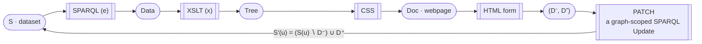

*The build log as a picture, (4.1) at deployment grain, closed as in Chapter 7. Along the read spine the endpoint `e` runs `select` (SPARQL), the stylesheet `x` runs `arrange` (XSLT, `⟦t⟧ ∘ canon`), CSS runs `present`, (17.1)'s components bound to deployed standards. The return arrow is the write side: a form (Chapter 9's bridge) yields a delta `(D⁻, D⁺)` (Prop. 7.1), carried as a PATCH, a graph-scoped SPARQL Update. Under S4 every rounded node is a web resource with a URI of its own.*

The arrange row carries the most machinery, and it deserves a closer look. The names the layered term treats specially are exactly the names the dataspace's ontology declares, B.8's relative genericity, deployed. Unmatched state falls back to the base rendering rather than to nothing: every graph renders; declared vocabulary renders better. The stylesheets share their templates across the wire: one library, imported by a server-side stylesheet that emits documents and a browser-side one that binds events. Saxon runs the first and SaxonJS with IXSL runs the second, so two processors share one set of terms. That is Chapter 7's mobility of evaluation, now running. The convergence shares rendering code too, by running the same framework on both sides (Chapter 14's hydration); here the sides share templates without sharing an engine, because the language's semantics is closed. And independent evolution shows up as operations rather than theory: data, selection, layout, and style invalidate independently, one factor at a time and one cache entry at a time. The four timelines run as infrastructure.

## Chapter 18. No New Standard

Chapter 17's build log ran on deployed standards end to end, and this chapter shows that nothing more is needed. Three questions remain: how names relate to addresses, how the seams no Recommendation covers get filled, and what shape federation forces on a reference implementation. Each resolves by composing pieces that already ship. No new standard is proposed; the chapter closes with the existence proof, an implementation that runs the assembly.

### Names and addresses

The first question arrives with the first `GET`. It is the web's oldest identity crisis, filed at the TAG (the W3C Technical Architecture Group) as [httpRange-14](https://www.w3.org/2001/tag/issues.html#httpRange-14): what does dereferencing the name of a *thing* return, when the thing is a turbine rather than a page? A decade of W3C argument produced a `303`-or-fragment resolution, a note (*Cool URIs for the Semantic Web*), a reopening, and a deployed practice that largely ignores all of it.

The model here has a shorter account. Names and addresses are different roles, typed apart since Chapters 4 and 5: a URI in a fact position *names* (R3); a URI addressing a projection *locates* (S4). So the question is settled by computation, not argument. Dereferencing a name returns `read(name, S)`, a description of the named entity. Its address may coincide with the name, differ by a fragment, or differ by a redirect, a wire-level encoding the architecture is indifferent to. Only the collision is real. Put the name and the address on one string, and statements about the thing share a subject with statements about its description. That is a data-discipline cost (measurable, like Chapter 9's mismatches) and keeping the two apart, either way, avoids it.

The exhibits resolved the question both ways without instruction. The Guardian's articles collapse the two harmlessly (an article *is* its own description) while the wind farm's panels sit one hash away as fragments (`#panel-14`). That fragment is the convention the reference implementation adopts: one `GET` serves entity and description alike. The crisis, relocated: a typing discipline the model already draws, plus an encoding choice the deployment already made.

### Composition, not creation

Three seams lack Recommendations: identity, access control, and the form-native write. The first two have candidates with running code, and both fill their seam with the model itself. [WebID](https://www.w3.org/2005/Incubator/webid/spec/) has been incubated at the W3C since 2005 and never advanced to Recommendation. It makes an identity a URI whose dereference is a profile: an agent is an entity, its identity a graph, authentication a proof that the keyholder and the profile agree. [WebAccessControl](https://www.w3.org/wiki/WebAccessControl) is an ontology grown on the W3C wiki, since adopted by [Solid](https://solidproject.org/), Berners-Lee's re-decentralization project. It states permissions as facts (who, which mode, over what) so an ACL is data in the same state model it guards. Identity and authorization collapse into the substrate they protect (Chapter 19's thesis arriving early) and the reference implementation below runs both. For the third seam, Chapter 9's bridge ([RDF/POST](https://atomgraph.github.io/RDF-POST/)) slots a plain HTML form into the write side. RDF/POST is specified, not standardized. And as Chapter 9 showed, it is an encoding rather than an invention, no new model, no new protocol.

This part has contained no proposal for a new standard, and that absence is the finding. Part III showed the read side complete by 2014. The write side's last mile is an encoding of what already ships. The remaining seams have candidates that compose deployed pieces. Nothing here waits on a working group. The community's long reflex (meeting every gap with a new specification) aims at the wrong layer, and Chapter 9 already scored one instance of it. After the reveal, the remaining work was never specification. It was combination: an implementation that assembles the standards in the derived shape. The doctrine that governed RDF/POST, composition rather than creation, now governs the whole construction one level up.

The reflex has a Recommendation-grade instance: the Linked Data Platform (LDP, 2015), which claimed this book's exact slot (a read-write Linked Data architecture) at the interaction layer. The Graph Store Protocol (HTTP's methods addressed to whole graphs) was already standardized. LDP's one addition to it is the *container*, a server-side collection with protocol-managed membership. But a container is a canned selection, a query frozen into the interface. It arrived after SPARQL had already made every collection open-ended: any members, by any pattern, composed at request time. Subtract the containers and nothing remains that the Graph Store Protocol does not already do: LDP added interface where query semantics sufficed. The gap was never in the protocols; it was in the implementations that never combined what they already offered.

The chapter's exhibit mirrors Chapter 3's, deliberately. The two sites we stripped are rebuilt as dataspaces. The strip-2 fact lists are loaded as state, with a small ontology per domain: articles and sections for one, panels and readings for the other. Each dataspace gets one `select` term per window, an `arrange` term per layout, and a stylesheet per look. Front page and dashboard become two declarative packages over the same generic machine, the domain living entirely in data. Chapter 3 computed the factorization by hand; this chapter runs it forward, on the same material. Analysis and synthesis meet on worked examples. *(The full-scale reconstruction is being built in public, as Chapter 3's exhibit once was; the miniature below runs today.)*

<div class="fp-exhibit" data-exhibit="pipeline"></div>

*Interactive exhibit (online edition): the reconstruction in miniature. The two datasets from Chapter 3 under one generic engine — swap the data, the selection, the arrangement, or the stylesheet, and the factors you did not touch hold still. The full-scale reconstruction runs the real stack; this one runs the derivation.*

### The federation test

Federation needs a client, and the derivation says so before any implementation does. R3 put foreign names inside local facts. At deployment grain, following one is dereferencing another party's `read`. A window over another party's state is `⟦q⟧` posed to another party's endpoint. Consuming dataspaces is therefore not a feature an application adds. It is the other half of the architecture, and a dataspace that only serves is a leaf, because it never follows anyone else's names. So a reference implementation has a forced shape, both halves at once: a server publishing (17.1)'s four components (origin, ontology, endpoint, stylesheet) and a client consuming anyone's.

Both halves in one implementation enable a test no bespoke system can run: point the implementation at itself. Two instances run at two origins, and one of them browses, queries, and writes against the other. Every capability crosses the wire or fails visibly, because no in-process shortcut exists for a demo to lean on. Self-federation is not a stunt; it is the architecture's own strategy put under test. Interoperating with itself is how the implementation does federation: two instances meet as strangers, and the first federation is its own. And the test is not circular. S2 leaves the two instances nothing private to share. Everything that crosses the wire is terms of closed languages (data, query, delta, arrangement), so they meet only on the specifications' surface, with no side channel to agree over. The standards process proves interoperability with two independent implementations. A reference implementation proves it with two instances of itself. That evidence is weaker, but it arrives years earlier, and it holds only as long as the wire carries nothing but spec-terms. A second implementation joins by implementing the same denotations: the door that self-federation proves open is the door that strangers walk through.

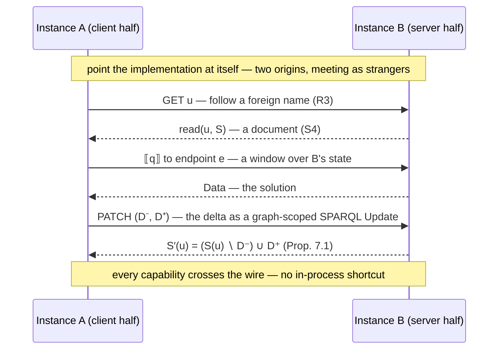

*The federation test, drawn. Each instance runs both halves. Here Instance A's client consumes Instance B's server across three exchanges. It dereferences a foreign name (R3) for a document (S4). It poses `⟦q⟧` to the endpoint `e` for a window. It submits a delta (Prop. 7.1) as a PATCH, a graph-scoped SPARQL Update. Because S2 leaves nothing private, the meeting surface is the specifications' surface alone.*

The document web bootstrapped exactly this way — the box below dates it. The pattern, one level down: a server+client pair whose self-interoperability is the first running instance of a protocol anyone may join.

<div class="fp-history">

**The first instance, dated.** This is not an analogy; it happened. In 1990 the first web server (`info.cern.ch`) and the first browser ran on two NeXT machines at CERN and interoperated with each other before there was a third program in the world to interoperate with. That browser (WorldWideWeb, soon renamed Nexus so the web could keep the name) was also an editor: reading and writing went through one program. The write side was there on day one, then lost for a generation as the read-only browser became the thing everyone shipped. The federation test above is that first day made a permanent requirement.

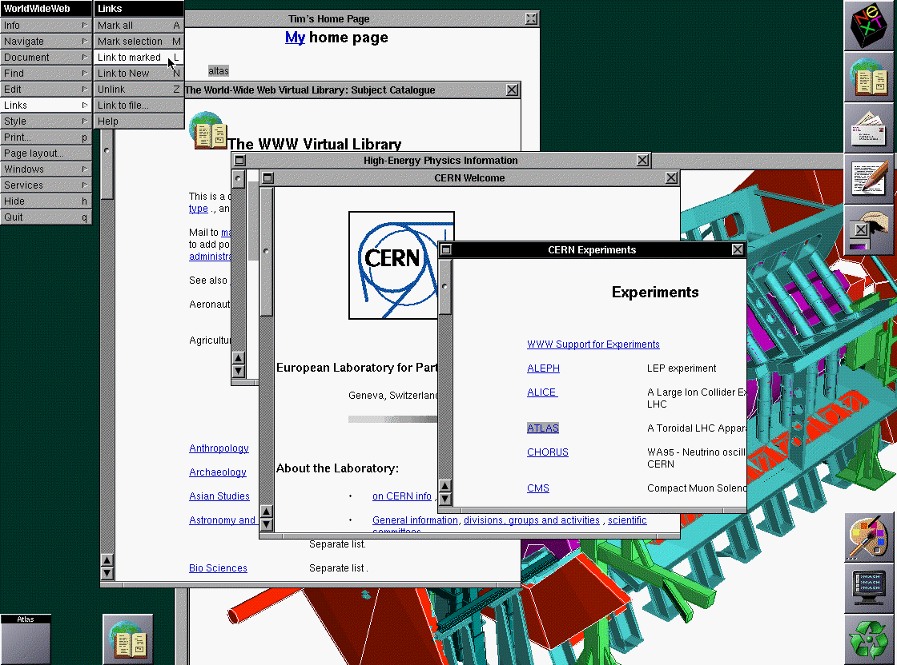

</div>

### The existence proof

This chapter is where the book's existence proof enters as evidence. The architecture has a reference implementation: **[LinkedDataHub](https://atomgraph.github.io/LinkedDataHub/)**, open source, in production for years. It federates the way the section above requires: instance to instance, its client half consuming what its server half serves. It also delivers the chapter's other promises: WebID and WebAccessControl are running, RDF/POST is accepted on the write side, and entity and description are served one hash apart. And the online edition of this book is being built on it, keeping the promise the preface made. Disclosure, once for the chapter: the implementation and the RDF/POST spec are the author's. The point of an existence proof one can install is that belief is optional.

## Chapter 19. Generic Software

This chapter converts the derivation into economics. A one-line corollary collapses every domain application into one generic engine specialized by data; the browser and the spreadsheet are the existence proofs. The consequences follow: domain functionality shipped as data, computation arriving through the same `write`. The chapter closes on the incentives that keep bespoke code in place despite them.

### Specialized by data

Start from a corollary the apparatus yields at once:

**Prop. 19.1.** Two proper applications over (5.3) differ only in their terms and their state.

<details>
<summary><i>Proof — S2 plus Theorem 5.4 leave nothing else to vary.</i></summary>

By S2, each factor is the denotation of a term; by Theorem 5.4, the state model is shared. What remains to vary is `(q, t, s)` and the facts. ∎

</details>

The consequence: the difference between a CMS, a CRM, and an ERP is data. Each is a UI layer around CRUD over a domain model. The domain model is facts (5.3), and the UI is `⟦t⟧` and `⟦s⟧`. CRUD is `read` and `write`, Definition 1.1 and Prop. 7.1, which HTTP already implements. One application can serve every domain, specialized by data rather than by code.

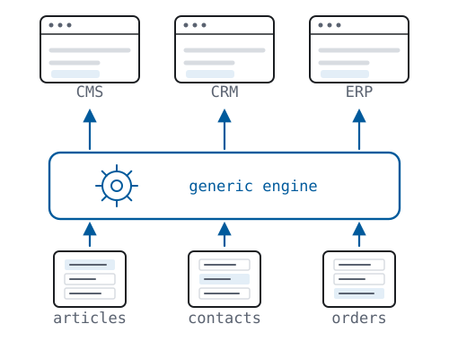

### Two proofs and a failure

The web has already run this experiment once, and the result was so successful it became invisible: the browser. One client for every website. Nobody writes a per-site browser, and nobody marvels at that, which measures how completely the uniform interface won at the document layer. Chapter 4 typed the four clauses that won it, and generic software is their result, arriving layer by layer: generic caches, generic crawlers, one generic renderer. The result stopped where the uniformity stopped. Behind every `GET` the verbs are shared and the state is bespoke, so the client that is generic in transfer stays bespoke in understanding. That means one adapter per API, and Chapter 22 totals the arithmetic. The question this chapter answers is why the generic browser never got its sibling one level down, and the answer is that nothing was missing except the state model Chapter 5 derived.

The claim has a second existence proof, older than the web. The spreadsheet is the most successful generic application in history: one engine, every domain there is, specialized by data. No vendor ships an accounting spreadsheet and a separate logistics spreadsheet; users pour the domain in as rows and formulas. The industry has had half a century to notice what this proves. The spreadsheet's own limits explain why it could prove no more: cell references are sheet-local (R3), two workbooks have no merge (R2), and the world's operational data lives in a million silos named `final_v2.xlsx`. The derived stack gives the spreadsheet's economics the web's properties. It is the same generic engine, but with names that cross files and states that compose. Each proof carries half the claim: the browser is generic with the web's properties, at the document grain; the spreadsheet is generic over domains, with none of the web's properties. The application this chapter describes holds both halves at once (generic over domains, with the web's properties) and it was sitting in the standards all along.

The idea has also failed before, and the failure instructs. Model-driven architecture (MDA) promised applications generated from models, and broke on its own compiler. The model was translated into code, the code drifted from the model, and the model ended up as documentation only, because that first generation step severed S2. The generic engine makes no such translation. The ontology is never compiled into the application; it *is* the application's data, interpreted at runtime like everything else, so nothing drifts because nothing is copied. The difference between generation and interpretation is the difference between MDA's failure and Chapter 17's build log.

### A codebase is a liability

The economics follow. A codebase is a liability, not an asset: behavior held equal, every line is another place to be wrong. So the system achieving equal behavior with less code is the better system, and the generic system achieves it with *no domain code at all*. Domain functionality becomes a declarative package: an ontology and a stylesheet pair, imported into a running application. Installation is not a deployment but a merge: the package is data, so adding it is a union, and removing it is a delta — it uninstalls the way it installed. And the pair carries its own correctness check. By B.8's relativization result, the stylesheet may treat specially only the names the ontology and its imports declare: what it touches stays inside the declared vocabulary, checkable from the term alone. So a package either declares the vocabulary it renders, or it is caught rendering vocabulary it never declared. Chapter 12 audited the binary-delivery web; this is its constructive alternative: behavior defined by data, shipped as data, revocable as data.

The reference implementation ships exactly this: applications as importable datasets, administered by an application defined in the same terms it administers. Chapter 18's exhibit rebuilds a newspaper and a dashboard on one machine. This chapter's claim is that the rebuild generalizes: the two reconstructions are datasets for the same generic engine, and the book's online edition is a third.

<div class="fp-history">

**In the world.** Enterprise architecture reached this chapter's conclusion from the cost side, without deriving it. Dave McComb's *Software Wasteland* (2018) is a book-length audit of the application-centric mindset, every enterprise rebuilding the same CRUD over its own bespoke model. Its sequel *The Data-Centric Revolution* (2019) prescribes the [data-centric](https://www.semanticarts.com/data-centric/) cure this chapter derives: make the data the fixed point and let one generic substrate be specialized by an evolving model, not by code. Those books argue it from decades of enterprise waste; Proposition 19.1 states the same result as a corollary.

</div>

<div class="fp-history">

**In the world, dated 2017.** The liability has a mainstream witness. James Somers's *Atlantic* essay "[The Coming Software Apocalypse](https://www.theatlantic.com/technology/archive/2017/09/saving-the-world-from-code/540393/)" surveys what code grown past comprehension already costs. A statewide 911 outage was traced to one counter's threshold. Eighteen months of expert review barely untangled the throttle code of a runaway Toyota. A car now carries a hundred million lines. Unmoored from anything physical, software "tends to grow without bound", into systems, as Nancy Leveson writes, "beyond our ability to intellectually manage." The remedy one interviewee states is this chapter's: "Nobody would build a car by hand."

</div>

### Computation on the write side

One objection lands here with real force, and it deserves the treatment latency got in Chapter 7: *real domains compute.* A payroll run turns timesheets into pay; an allocation turns orders into reservations; an invoice's total is nobody's keystroke. If the engine houses no domain code, who computes? Definition 1.1 answered before the question arose: it types what the application *is* (`read` and `write`) and says nothing about who calls it. Chapter 7's caller was a human holding a form. A computation is another caller: an agent that reads, computes, and submits its conclusion through the same `write`, in the same normal form, reviewable and invertible like every delta. Chapter 22 turns exactly that reviewability into the governance story.

The derivation step even has a declarative carrier in the deployed stack. Take Prop. 7.3's change direction (pattern plus bindings yields a delta) and draw the bindings from the state instead of a form: that is a rule, *assert what follows from what holds*. The deployed stack already ships it as an update term whose delta is computed by its own query. One algebra covers both directions, and no human is involved.

What lacks a recommendation is *when* such a term runs — schedule, trigger, threshold. That is the orchestration seam, open like identity and access in Chapter 18, and like them awaiting convention rather than invention.

So the domain's logic divides cleanly. Validation is a predicate on deltas (Chapter 7 drew that line). Derivation is an update term over the ontology. That places inference precisely: an entailed fact enters by that write, not by a closure computed at read time, so the state remains the asserted set. And whatever imperative computation remains (the solver, the optimizer, Chapter 12's leaf) runs behind a caller, submitting deltas like everyone else: outside the engine, never inside it.

### The incentives

Why, then, does every domain still get its own codebase? Chapter 13 supplied the mental models; the incentives supply the motive. Generic software commoditizes its vendor: a domain application's defense is precisely its bespoke code, and an industry that charges rent on that code will not derive this corollary on its own initiative. The corollary dissolves the asset. So the corollary's adoption path runs through the demand side, and Chapter 22 names the demand: users never counted the cost of bespoke code; agents count it per call.

## Chapter 20. The Result

The audit table, completed: Chapter 16 fills one page, every cell carries a chapter's score, and one column records no failures. That table contains the whole of the book's argument, as the opening argument promised. This chapter reads the table forward, and it stands between Chapter 19's economics and the demand Chapter 22 names.

Web 3.0, defined: on this web, `read` is transparent all the way down (S1–S4 at every layer, R1–R3 at the substrate), for humans *and* machines alike. An agent is only another reader, as Chapter 22 will show. Every earlier use of the term outside this book named no particular property, and this one names the properties the audit table scores.

Read the eras through the one variable this book has tracked. In Web 1.0, `read` was transparent over documents, and those documents were declarative, addressable, and indexable, the properties that beat every contemporary in Chapter 1's history. In Web 2.0, `write` was added, and the fused term came with it: selection, arrangement, and presentation collapsed into one component, the application stayed on the web only at its rendered surface, and `read` no longer reached the state behind it. Web 3.0, on this definition, adds no third invention. It extends the transparency Web 1.0 gave documents to the state that lies behind the fused term. Chapter 10's lateral churn was two decades spent inside era two. The vertical direction was open the whole time, and Part II proved that under the three requirements it had exactly one shape. The table now carries what the preface could only announce: the JSON APIs, the JavaScript frameworks, the compile-to-browser toolchains, each located, column by column, as a partial rediscovery of this way or a detour from it.

One cost remains, and it needs stating only once: the advanced web forfeits the lowest common denominator. The book has proven the two goals pull in different directions, and it has priced both. Part II derived what advancing requires, and Part IV derived what refusing it costs. Chapter 16 is the ledger between them. Choosing is the reader's business; pricing was the book's.

The audit applies to this book as strictly as to the paradigms it scores, so the register lists the book's own open, falsifiable claims, each dated and paired with what would break it:

| claim | where | falsified by |
|---|---|---|
| the SPA paradigm caps at Web 2.0 | Ch 11 | a fused-architecture deployment whose state is machine-consumable at web scale without a compensating adapter layer |
| the convergence stalls before R3 and S4 absent new incentives | Ch 14 | a mainstream framework shipping addressable intermediates and global references as defaults |
| the agent economy converges on generic systems with domains as data | Ch 22 | agent infrastructure stabilizing permanently on per-application protocol servers, adapter counts growing linearly |
| attribution pressure keeps selecting the fourth position | Prop. 9.2 | a successor standard that discards named graphs |
| a requirement-failure and a compensating industry always coincide | Ch 13 | a paradigm that fails a derived requirement with no compensating market at its web boundary, or such a market around a paradigm that fails none |

Retrodictions (claims history had already graded, like quads and the JS convergence) are marked as such where they occur. This table lists only what is still open. Registered July 2026.

Beneath the particular scores is the claim about method the preface promised to return to. The web has been treated as software engineering (frameworks, taste, iteration) and Chapter 10's lateral churn is what that treatment costs: motion with no fixed point to measure it against. An object whose structure is forced should be treated as a science instead: derived, proved, and pinned to falsifiable claims like the ones just registered. The stack is the finding, and the genre of science is the method that found it.

One last recursion remains. The canonical edition of this book (under construction) is a dataspace on Chapter 18's machine: its propositions are resources, its dependencies are typed links, and its figures are live queries. When you read it there, the final step of the argument will be an act rather than a sentence: QED, dereferenced.

And if you put the book down short of that edition, what it leaves behind is a handful of lenses you will find yourself using unbidden. You will strip pages on sight — style, arrangement, selection peeling away from any screen, the skeleton showing through. You will sort announcements with one question (*which property moved?*) and recognize lateral churn before the keynote ends. You will find the crossing in every framework you evaluate: somewhere inside it a graph becomes a tree, and the framework is its strategy for that moment. You will watch a deploy invalidate a cache and know which of the four timelines moved, and which three the fusion invalidated with it. And when you meet a scraping harness, an adapter layer, a reconciliation engine, you will read it as compensating machinery: some property, somewhere upstream, gone unadopted.

The lenses rest on one claim. Strip any page and the same skeleton appears; three requirements that the web already meets force what its state must be made of; and what they force was standardized before the question was fashionable. The next web needs no inventing; it needs only to be put to use.

# Part VI — The Future

*The synthesis, carried forward. Three readings of the web's future: the adoption already underway, the era its machine readers bring on, and the web the derived stack permits once it is occupied.*

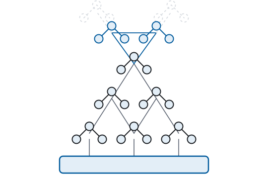

## Chapter 21. Knowledge Graphs

<div class="fp-epigraph">

*The future is already here — it's just not evenly distributed.*

— William Gibson, on NPR's *Talk of the Nation*, 1999
</div>

### The name

The state Part II derived is in production at scale, under an industry name. A knowledge graph is instance data and the ontologies that describe it, held and queried as one graph. The name went mainstream in May 2012, when Google introduced its [Knowledge Graph](https://blog.google/products-and-platforms/products/search/introducing-knowledge-graph-things-not/), "things, not strings." Freebase seeded it; Chapter 23 shows Freebase browsed live in 2008. Google has never published what its graph runs on, but the contents are expressible as triples, and its public API serves them that way. Knowledge graphs are also built on other graph models; the ones this chapter counts are RDF.

### The first movers

The practice preceded the name, and the first movers published their reasons as they went.

<div class="fp-history">

**In the world, dated 2010.** For the World Cup the BBC generated [700-plus pages](https://www.bbc.co.uk/blogs/bbcinternet/2010/07/bbc_world_cup_2010_dynamic_sem.html) from an RDF triple store, more index pages than the rest of BBC Sport combined. By London 2012 the same architecture kept [a page for every athlete, team and discipline](https://www.bbc.co.uk/blogs/bbcinternet/2012/04/sports_dynamic_semantic.html), ten thousand of them, a scale its architect called "simply impossible to manage using a static CMS driven publishing stack."


</div>

<div class="fp-history">

**In the world, dated 2011.** The Danish comics site [Helt Normalt](https://atomgraph.com/cases/helt-normalt/) rebuilt its publishing on RDF, SPARQL and XSLT. Its builders [told a W3C workshop](https://www.w3.org/2011/09/LinkedData/ledp2011_submission_1.pdf) that the codebase shrank by an order of magnitude against the relational system it replaced, and that its ontologies were reused rather than written, down to [a zodiac vocabulary](https://data.totl.net/zodiac/) found on the open web, for the daily horoscope strip. The platform was Graphity, LinkedDataHub's predecessor (disclosure: the author's, per Chapter 18).

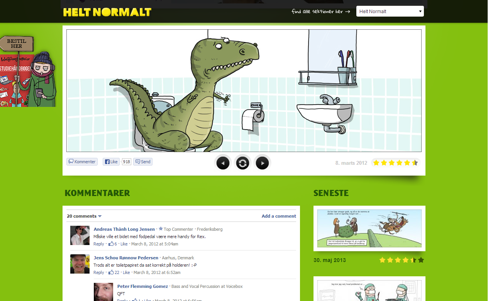

</div>

<div class="fp-history">

**In the world, dated 2013.** NXP Semiconductors, its product data "scattered and duplicated across numerous applications and databases," [published its exit](https://www.nxp.com/company/about-nxp/smarter-world-blog/BL-LINKED-DATA-THE-INTEGRATION-FUTURE): an HTTP URI per product, every source converted to RDF, SPARQL underneath. "The Linked Data is the API." NXP's pages were served by the same Graphity.

</div>

### The wave

The wave behind the first movers arrived a decade later, at the top of the market. NASA runs the systems engineering of its Moon program on an RDF graph. Siemens holds 1.2 million products in one. The banks maintain FIBO, a shared financial ontology, in OWL. Gartner dated the wave in 2021: "[by 2025, graph technologies will be used in 80% of data and analytics innovations, up from 10% in 2021](https://www.gartner.com/en/newsroom/press-releases/2021-03-16-gartner-identifies-top-10-data-and-analytics-technologies-trends-for-2021)", a figure spanning every graph model, not RDF alone. And what accelerated the wave is the machine reader. A statistical model answering business questions over an enterprise database [got 17 of 100 right against raw SQL, and 54 against the same data as an RDF graph](https://arxiv.org/abs/2311.07509). Chapter 22 derives what the graph is doing under the model.

The words went mainstream too. Palantir has sold its platform's core abstraction as [the Ontology](https://www.palantir.com/platforms/ontology/) since 2018 and put the word in its SEC filing in 2020. Microsoft followed: Power BI's datasets became [semantic models](https://powerbi.microsoft.com/en-us/blog/datasets-renamed-to-semantic-models/) in 2023, and Fabric now ships [an ontology of its own](https://learn.microsoft.com/en-us/fabric/iq/ontology/overview), "a shared, machine-understandable vocabulary of your business." Neither ontology runs on RDF. The point is smaller and telling: *ontology* was an academic word the industry would not say aloud, and now it is a product name.

### The open giants

The largest knowledge graphs are not corporate at all. UniProt, the protein knowledge base, has published its data as RDF since 2008 and holds [232 billion triples](https://sparql.uniprot.org/) behind a public SPARQL endpoint, the largest knowledge graph anyone can query. Wikidata (where part of Freebase settled) serves [about eighteen billion more](https://www.wikidata.org/wiki/Wikidata:Statistics). Google last counted its own graph in 2020: [500 billion facts](https://blog.google/products-and-platforms/products/search/about-knowledge-graph-and-knowledge-panels/), private, unqueryable. And the open graphs link to one another: the Linked Open Data cloud maps [1,360 interlinked datasets](https://lod-cloud.net/) as of June 2026.

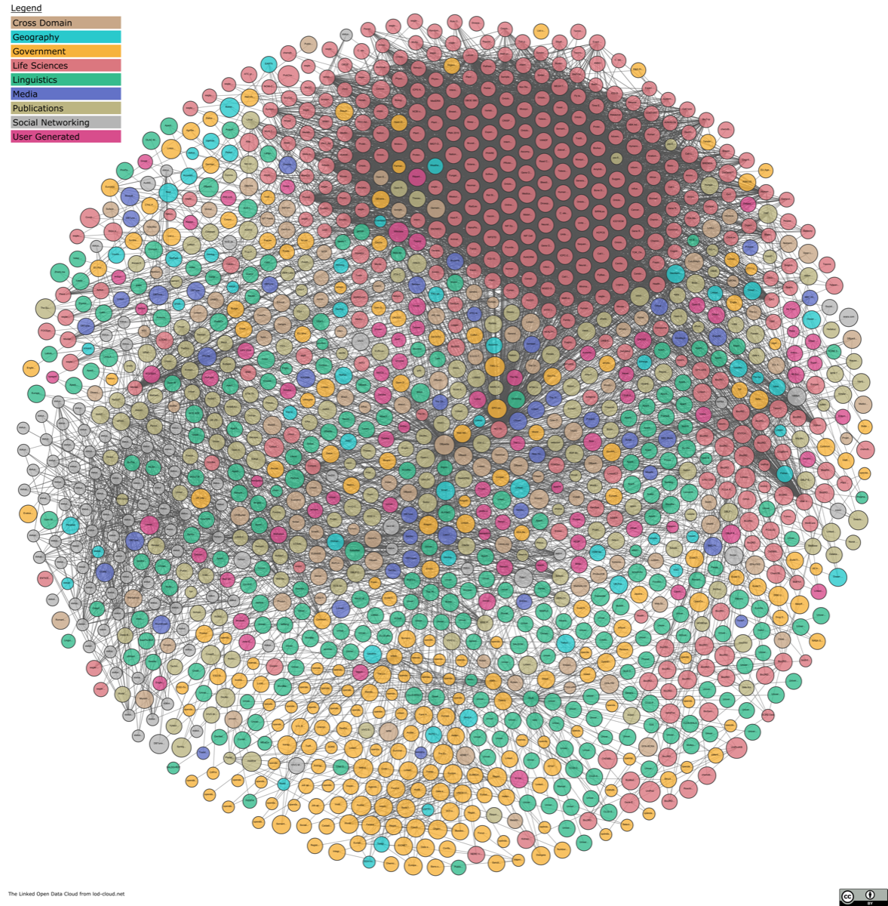

### The head and the tail

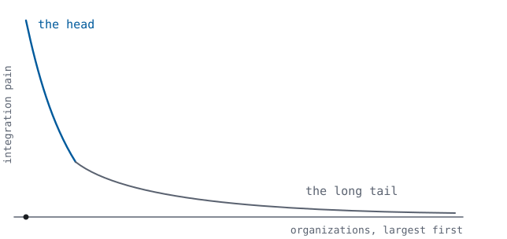

The wave stops partway down the market, and the reason is arithmetic. Integration pain scales with organization size: General Electric ran [about seventy-five procurement systems, Merck about four thousand Oracle databases](https://cs.uwaterloo.ca/~ilyas/papers/StonebrakerIEEE2018.pdf). Chapter 17 priced the bridges between silos at N × M, and every acquisition raises the count. Down the tail the count falls to a handful, the bill falls with it, and no organization there has enough integration pain to need a knowledge graph. Adoption tracks the head. That is the distribution the epigraph names: the future, already here, unevenly.

### The unclaimed half

Many have realized RDF's potential for data integration. Very few have realized its potential for web application architecture. The audit says the same in its own columns: the industry adopted the R-rows and left the S-rows unclaimed. A knowledge graph is Chapter 5's state without Chapter 4's architecture. It is the data half of the derivation, running at scale, while the architectural half goes unadopted. The two chapters that follow are about the other half.

## Chapter 22. The Agent Era

Improper architecture is locally cheap and globally expensive: fusing is always less work *today*, and the costs land on caches, crawlers, integrators, and the future. For thirty years the future could wait. Now the bill arrives: software agents are trying to read the web, and they find what Part IV measured, rendered pixels and private APIs. The response is a compensating industry, built in real time out of scraping harnesses, headless browsers, and a per-application protocol server bolted onto every system whose owners want it read by machines. Read that list against Chapter 11's scores: it is the S4 tax, collected one adapter at a time, at industry scale, exactly as the model predicts. The machine-readable web is being retrofitted at the margin because it lapsed at the core. That lapse is Chapter 9's maintenance failure, and its cost is still compounding.

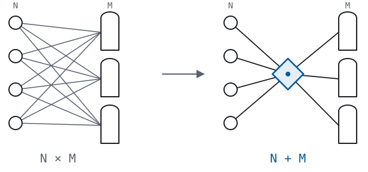

The arithmetic of that compensating industry is the integration industry's arithmetic (Chapter 17) at a new scale. `N` agents meeting `M` applications through bespoke adapters need on the order of `N × M` integrations. The moment state shares one model and one query semantics, the count collapses to `N + M` — each side implements the common substrate once. Engineers have re-learned this sum in every generation of middleware, and they are re-learning it now, in the agent era, with `N` growing by the month. The per-application protocol server (MCP, the emerging convention as of this writing) is the `N × M` answer, shipped in real time. The protocol is shared, but the model and query semantics are not: each server exposes its own vocabulary, so every agent still learns every application one at a time. The derived stack is the `N + M` answer, shipped since 1999.

There is an exit built into this arithmetic. An adapter that translates one application into the common model is written once, for everyone, not once per consumer, forever. It is the rare piece of glue that becomes unnecessary once it succeeds: on the day the application serves its own state, the adapter's answers and the application's answers coincide, so nothing downstream has to change. Until then the adapter offers a choice the silo never did. Its answers can stay virtual: computed from the silo at the moment they are asked and stored nowhere. Or they can be drawn through the same `read` into state under the querying party's own origin, where they remain available after the silo account that supplied them is gone. The industry already builds compensating machinery around every silo. Point it at the common model, once per silo, and that machinery is the bridge.

<div class="fp-history">

**The vision, dated 2001.** The scenario this chapter derives was written as fiction twenty-five years ago. The May 2001 *Scientific American* article "[The Semantic Web](https://www.scientificamerican.com/article/the-semantic-web/)" is by Tim Berners-Lee, James Hendler, and Ora Lassila. It opens with Lucy's agent negotiating a course of medical appointments over machine-readable data on her behalf, an agent reading the web, not scraping its pixels. It read as science fiction because the agents did not exist. They exist now. Chapter 8 said the substrate was built for machine consumption and the machines were twenty years out; those twenty years have now elapsed. What was missing was never the stack — it was the reader, and the reader has arrived.

</div>

Underneath runs the grounding problem. Statistical models interpolate, and interpolation hallucinates. What agents need beneath them is a substrate whose answers are computed rather than guessed. Fact-sets with a formal query semantics are that substrate, and Part III named the deployed one. The hybrid of the two (statistical model above, fact-set substrate below) has a specific shape. The model interprets the long tail, the rare, one-off cases the substrate does not yet cover. What proves valuable there is promoted into the substrate, and promotion is nothing exotic: it is a write, an assertion made under the origin of a party that vouches for it. The substrate is governed as any origin is, by whoever holds the right to write it. And integration accumulates instead of repeating: every promoted fact composes by union, and stays.

"Machine-consumable" unpacks to nothing new: state with a universal model (R1), a coordination-free merge (R2), global reference (R3), and addressable intermediates (S4). An agent is a user agent. The requirement was sitting in Definition 1.1's type signature all along.

And reading is half of Definition 1.1; the write side serves agents twice over. An agent's change arrives as Chapter 7's delta: two fact-sets, `(D⁻, D⁺)`. The delta is a *reviewable object*: a human can inspect it before it applies, an audit log can store it verbatim, an operator can invert it by swapping the sets. Compare the alternative: an opaque API call whose effect is whatever the endpoint's code was written to do, and which nothing can reverse. Agent autonomy is a governance problem exactly as far as agent actions are opaque, and the delta normal form makes the action a document. And what holds for one change holds for a whole plan of them. An agent's entire intended course can be stated as one document and read before any of it runs: what it will read, what it will change, what it will do if the first answer disappoints. The agent is audited not by trusting its account of itself afterward, but by reading its plan before. Chapter 7 derived the delta for humans filling in forms, and the same normal form now serves machines.

The chapter ends with a question, put to any agent directly: *is it more efficient for you to write a custom system for every domain, or to reuse one generic system and define the domain as data?* Reusing one generic system is plainly the more efficient of the two. What stands between agents and that option is the set of human mental models Part IV audited: pre-web paradigms, defended now by habit rather than argument. The web that agents need is the web this book derived, necessarily. Both derive from the same requirement: machine-consumable, mergeable, globally referenced state.

## Chapter 23. The Next Web

Chapter 20 stated the result; Chapter 22 named its machine readers. What remains is the web they compose: Web 3.0, on Chapter 20's definition, not a forecast but a reading of what the derived properties already permit. It is occupied rather than built and shipped: parties take it up one origin at a time. It does a handful of things no fused web can do.

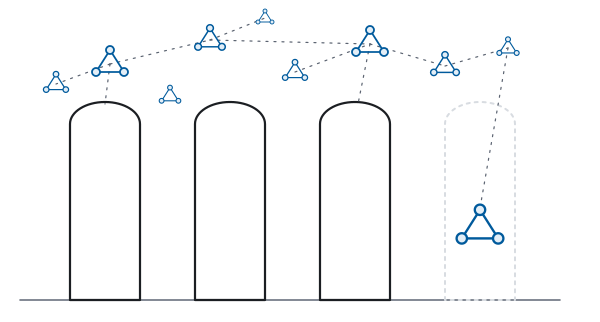

This web gives the end user three things, and the end user was always the point. The end user can navigate and drill into any data without knowing a query language, because the five moves are interface primitives and none of them requires a programmer. The end user can fork and augment a running application declaratively, so S3 becomes a right the user exercises rather than a courtesy the vendor grants: the user substitutes a term instead of rebuilding a bundle. And the end user can federate without asking permission, because the union law requires no permission and merging is the whole protocol.

None of this asks the existing web to stop, or even to notice. A silo doesn't have to migrate to be included: wrapped (Chapter 22), it enters a federation as a view of itself, before its vendor has agreed to anything. So the transition has no event. Nobody joins a platform, because there is no platform. What forms instead is a condensation: a cloud of small, private dataspaces gathering around the silos until, quietly, the silos become the copy. Each dataspace is detachable from the services it summarizes, from the software that serves it, and from the machine it happens to sit on. Union is additive: a dataspace federates beside whatever already runs, and everything that stays fused simply keeps paying the bill Part IV added up. There is no migration day and no flag day. Only one thing is required: that the next thing built be built one level down.

Read the properties forward, as capabilities rather than columns, from the application in the reader's hands out to the network that forms when many build one level down.

### The application bends

On a graph the application bends to the reader (navigated, re-rendered, reshaped) as no fused page allows.

#### Navigating the graph

Navigation is the first of the five moves (Chapter 7), and on a graph it does what the document web never could. Every relation is a property in the state, so the moves a document web built page by page become primitives of the interface. Narrow a set by its own facts (products in stock, turbines below tolerance) and the filter is a selection, not a screen someone wrote. Follow a relation out of that set and arrive at the set it relates to: from a filtered list of products to the list of their vendors. That is a set reached from a set rather than a page linked to a page. Chain the two moves, stepping back when a branch returns nothing useful, and open-ended exploration falls out of moves no one has to name. Each intermediate set is a resource with its own address (S4). The document web stops at the item; the graph does not, which is exactly what navigation would have been all along had state been a graph from the start.

<div class="fp-history">

**In the world, dated 2008.** This is not speculative. David Huynh's *Freebase Parallax* demonstrated exactly this move over graph data in 2008 (a set carried in one step to the set it relates to) on real data, years before the chapter names it. Metaweb, its maker, was acquired by Google in 2010, and Freebase seeded the Google Knowledge Graph. The demonstration is a decade and a half old. What was missing was not an invention but the state model derived here.

<iframe src="https://player.vimeo.com/video/1513562" style="width: 100%; aspect-ratio: 16 / 9; border: 0;" allow="fullscreen; picture-in-picture" allowfullscreen title="Freebase Parallax: A new way to browse and explore data"></iframe>

</div>

#### One state, many faces

Presentation is its own factor (S1), independent of the facts beneath it, so one body of state renders as many surfaces the publisher never built. The reader who needs large type, a screen reader's linear order, another language, a watch-sized screen — each takes the same facts through a different `present` term and gets a document fit for them. Accessibility stops being a retrofit and personalization stops being surveillance: the state is shared, the rendering is the reader's, and the two were never required to be the same choice. The document web bolted this on (parallel mobile sites, accessibility overlays) because content and presentation were fused. CSS Zen Garden (2003) showed the other way at the presentation layer alone, dressing one unchanged HTML document in hundreds of unrecognizably different designs. It reached this independence at one factor only, because the rest of the skeleton stayed fused.

#### A feature is a package

An application on the derived web is data, a vocabulary and a stylesheet over state (Chapter 19), so to change what it does is to change data, not code. A feature ships as a *package*: the terms it introduces and the templates that render them. The package merges into a running application and is withdrawn by the reverse delta, asserted and retracted the way any fact is. Nothing recompiles and nothing redeploys, because there is no application-specific code to rebuild — the catalogue becomes a storefront once a checkout package merges, and a catalogue again once it is retracted. And since the change is a delta, the party making it need be neither a programmer nor a person. A human installs from the interface, or an agent submits the same merge (Chapter 7), and the application is a different application one request later. S3 stops being a vendor's release cycle and becomes an ordinary write, open to anyone holding the right to make it.

The wish is old: HyperCard let people reshape a running application in place in 1987, no rebuild and no deploy. What it lacked was a substrate where the reshaping composes across parties instead of trapping the stack on one machine.

<div class="fp-history">

**In the world, dated 1987.** HyperCard shipped with the Macintosh: stacks of cards a user could edit while using them, buttons and behavior rearranged in place. The reshaping never left the one machine.

<iframe src="https://www.youtube.com/embed/FquNpWdf9vg" style="width: 100%; aspect-ratio: 16 / 9; border: 0;" allow="accelerometer; autoplay; clipboard-write; encrypted-media; gyroscope; picture-in-picture; web-share" allowfullscreen title="The Computer Chronicles — HyperCard (1987)"></iframe>

</div>

<div class="fp-history">

**In the world, prototyped.** This is running code. LinkedDataHub (Chapter 18's reference implementation) ships a package as exactly an ontology and a stylesheet: installing one merges its vocabulary into the running application and adds its templates; uninstalling one is the reverse delta. The operation is an ordinary authenticated write, so an owner runs it from the interface and an agent runs it over the same endpoint, no code rebuilt, no application redeployed. It is young: it shipped in 2026, it carries one feature so far, and its presentation refresh is not yet instantaneous. But the mechanism is the derived one, and it runs in production. (Disclosure: LinkedDataHub is the author's, per Chapters 18–19.)

</div>

### The machine reads

The web's newest reader is a machine; it asks for facts and receives them, each carrying its source.

#### Reading, not scraping

The agent reads rather than scrapes (Chapter 22's diagnosis, flipped to a capability) and each fact it receives arrives carrying something the scraped page never did: its source.

#### A claim carries its source

Every fact travels with the party that asserted it, recorded in the fourth position (Prop. 9.2), which is the graph's own name. So a claim and its provenance are one object, unsplittable in transit: to repeat a fact is to carry who said it. On a web of rendered pixels a fabrication wears the same clothes as a record; on a web of attributed facts it has nowhere to sit, because *who says so?* is answered in the data, not reconstructed after it. This does not make claims true (attribution is not verification) but it makes them accountable. Every assertion names a source to query, corroborate, or impeach, and an agent merging two graphs sees exactly which origin contributed which fact. The Semantic Web stack always sketched *proof* and *trust* as its top layers; the deployed web built the fact-sets and left those for later. Later is when the machines start reading.

### The data is yours

Beneath the surface and the reader lies the state, and the biggest change is that the state belongs to the party it describes.

#### State stops being scattered

Under one model and one law of merge, what lives today across a dozen unspeaking silos composes into a personal dataspace: a body of facts a party keeps under its own origin and federates with the origins it trusts. Nothing is copied forward to go stale: a name resolves to its owner's own current answer, the origin being the one authority on itself.

<div class="fp-history">

**The vision, dated 2009.** This section's personal dataspace has an earlier name. In *Pull* (2009), David Siegel called it the *personal data locker*: a person's world (home, possessions, finances, media, health) held as one graph under its owner's control. The services that touch it are demoted to sources that read and write. Siegel came from the economics of demand, not three requirements, and reached the same place this section derives: state that composes under its owner's origin instead of scattering across silos. Siegel named it years before a substrate could hold it.

<iframe src="https://www.youtube.com/embed/xOch5o3MhUg" style="width: 100%; aspect-ratio: 16 / 9; border: 0;" allow="accelerometer; autoplay; clipboard-write; encrypted-media; gyroscope; picture-in-picture; web-share" allowfullscreen title="David Siegel — Personal Data Locker Vision"></iframe>

</div>

#### What outlives the software

State lives under its owner's origin, not inside the software that happens to touch it, so it outlives that software, the application and the agent alike. The service shuts down, the vendor is acquired, the framework is rewritten, the assistant is replaced by a better one; the facts remain where they were, under a name that still resolves, readable by whatever reads next.

What dies on the fused web is not only the app but everything entrusted to it: the account closes and its history goes with it, the link rots and the record is gone. And what an agent learned about the party it served dies sealed in the assistant's own machinery. Here the code is the mortal part and the data the durable one: an agent gives way to a better one with nothing forgotten, because its memory was state under the served party's origin, never the agent's to keep.

The record even reaches the words themselves: the conversation that produced a fact is state like any other, each turn a document carrying the utterance that triggered it. So *why was this done?* is settled by reading, not by asking a machine to remember.

The principle is old, mostly honored in the breach. Berners-Lee's *Cool URIs don't change* (1998) asked publishers to keep their URIs stable, and most publishers did not. Bush's 1945 proposal (Chapter 6) wanted a personal store no session's end would erase. Both wanted what owner-held state supplies: a name that still answers, durable past the software that reads it.

#### Permission is a fact

What may be read, and by whom, is stated in the same state it governs, narrowed or withdrawn as an ordinary change, with no platform to grant access and none that can revoke it. One party opens a region of its world to another's agent with a single assertion, and the boundary holds at every hop of a query that crosses between them. Composition and disclosure are not the same boundary. Any two states still compose without permission (R2), but what a given agent may read is a projection the permissions cut, so universal composition never meant universal visibility.

<div class="fp-history">

**The vision, dated 2016.** The web's own inventor built toward this. [Solid](https://solidproject.org/) (Tim Berners-Lee's re-decentralization project, begun in 2016) gives each person a *pod* whose access is itself data. [Web Access Control](https://www.w3.org/wiki/WebAccessControl) rules, held beside the resources they govern, state who may read what and are edited and revoked like any other fact. Permission as a statement rather than a platform setting is Solid's design and this section's, for the same reason: put access in the state, and no intermediary owns the gate.

</div>

### What gets done

Reading is half of Definition 1.1; the write side turns capability into action.

#### Stating a need

Search runs one way: a person forms a query and the market's pages answer, each provider having guessed in advance what to publish. Structured state runs it the other way. A need is itself facts (constraints, preferences, the criteria that qualify an answer) so it can be published as a document and read by providers rather than typed into a box and kept. A person states once, in the open, what they want; the parties who can meet it answer, matched against the very facts that generated the request, nothing re-entered and no form filled. Demand stops being a private keystroke and becomes a public, verifiable fact. It is the write side of Chapter 7, aimed outward at the market.

<div class="fp-history">

**The vision, dated 2006.** Publishing a need instead of searching for one has a name. Doc Searls called it the *intention economy*. The term dates to 2006 and the book to 2012. In that market a buyer broadcasts a qualified intent and sellers compete to satisfy it, which is search run backwards. The practice took a verb, *intentcasting*, and Siegel's *Pull* (2009) tied it to the data locker above: the locker stores the facts, the intentcast publishes them as demand. What it always lacked was a substrate of owner-held state for the market to read.

</div>

#### Every action a document

An agent's change is a delta, and its whole intended course (every read, change, and branch) is a document. Chapter 22 derived both: the change is reviewable before it applies and invertible after, and the plan is inspectable before a step of it runs. The autonomy that alarms turns out to be the autonomy that can be read.

### The network forms

And once many build this way, the whole becomes more than its origins. Because states merge by union without a coordinator (R2) and any stylesheet can be pointed at the result (S3), value arises from combinations no one arranged. Two dataspaces that never coordinated compose the moment their names meet, and a third party who owns neither can render the join as something new, an application their authors never imagined and did not have to permit. The document web tried this once and lost it: the mashups of the mid-2000s stitched maps and listings into applications nobody's vendor had shipped, until the platforms metered their APIs and re-siloed the data, ending the combinations at their own discretion. Union grants no such power. The joins hold because no one owns the seam across them, so the mashup that was a fad becomes the ordinary case.

And the loop compounds: each party that publishes a dataspace makes every dataspace federated with it worth more. This is the network effect that once turned a single physicist's filing system into the world's front page. It arrives now at the layer the second era hid, this time with no one in the middle owning the graph or charging rent on the joins.

The same compounding reaches the agent. A domain the agent has never seen needs no new system: the agent states the domain as facts over the one generic engine, and the work is finished. The choice Chapter 22 put to it (a bespoke system per domain, or one engine with the domain as data) was never really a choice.

So the next web is not built by a consortium or shipped in a release. It begins wherever someone stops the lateral churn and the taste-based technology trends, and treats the web as this book has treated it: from first principles, as a science. Those who do, the agents included, will have an edge over those who don't, and the gap will only grow, because churn starts over and derivation compounds. Which curve do you want to be on?

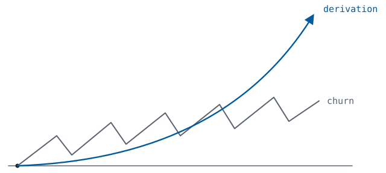

---

# Appendices

## A. Method, notation, and reading order

Persuasion is what you need when you don't have a proof, so this book runs on apparatus, and the apparatus has rules. A statement's sources come in the three kinds the preface names: spec definitions, earlier propositions, checkable observations. A fourth kind, called *witnesses*, corroborates but never serves as a premise: these are documents that stated as norms what this book derives as theorems. Strike every witness and no proof changes. One claim is deliberately unprovable, flagged where it stands: the Transposition Thesis of Chapter 5, the bridge between the formalism and the web itself. It is secured there and in the appendices, proved never. Disagreement belongs at the bridge; given the requirements, the theorems add no premise of their own.

The shape of the whole is Chapter 2's method, run at book length: analysis and synthesis, in the geometers' sense. Parts II–III strip the web application as found and derive what its parts must be. Part V builds the application space back from the derived parts. The two directions meeting exactly is the book's proof. Part IV, between them, audits what the industry runs instead, ending with the derived stack itself. There is no editorializing, only scores against Part II's seven properties: three requirements on state (R1–R3), four separations on architecture (S1–S4). Its closing chapter is the completed table.

If you have ever read a type signature, you have read every formula in this book: `×` is a tuple, `→` a function; the crib below translates the rest. Proofs are collapsed: the claim stays in the text, and the argument opens on demand. Results carry names, because prose argues by name; the numbers let the appendices argue by label.

This book uses sets, tuples, total functions, and composition `∘` — first-year material, as promised. Two conventions: `⟦·⟧` is a denotation function and always someone else's, cited from the governing specification, never defined here; `t` names the arrange term (S2), so time is written `τ`. The numbered apparatus is as follows. R1–R3 are the requirements on state, with R4 (attribution) added in Chapter 9. S1–S4 are the separation properties of a factorization. The B-conditions are the formalizations in Appendix B. Propositions are chapter-numbered.

The symbol crib, for readers who live in code:

| symbol | reading | in code |
|---|---|---|
| `A × B` | a pair: an A and a B | a tuple; a two-field record |
| `A → B` | function from A to B | `(a: A) => B` |
| `𝒫(A)` | all sets of As | `Set<A>` |
| `∪`, `∩`, `∖` | union, intersection, difference | `union()`, `intersection()`, `difference()` |
| `⊔` | disjoint combination of independently asserted structures | two sources' data, side by side |
| `∘` | composition, right to left | `compose(f, g)` |
| `⟦q⟧` | what `q` means, per its spec | the standard defines what your query returns, not your driver |
| `s ⊕ s′` | merge two states | set union of their facts — the union law (5.1) |
| `s ⊕ s = s` | idempotence | re-merging is a no-op; safe to retry |
| `(D⁻, D⁺)` | a delta | a diff: deletions, additions |
| `≅` | isomorphic | same shape; lossless conversion both ways |
| `≡` | logically equivalent | equal after normalizing — same meaning, maybe different syntax |
| `τ` | time | a version, a timestamp |
| `I` | the set of URIs | globally unique identifiers (RFC 3986) |
| `V` | atomic literal values, disjoint from `I` | strings, numbers, dates — the leaves |
| `O` | the set of origins | a scheme–host–port triple (RFC 6454) |
| `I∣o` | the URIs under origin `o` | one party's region of the namespace |

Reading order: Parts I–III go linearly. Chapters 10–14 need only Chapter 8 and go in any order, then Chapters 15 and 16. Part V needs nothing past Part III. Three tracks, if you are choosing a path:

- In a hurry: the Preface and The Argument in One Page, then Chapters 3, 8, 16, and 21.
- Building things: the hurry track, plus Chapters 7, 14, and 19.
- Refereeing: Chapter 5 and Appendix B, where the load-bearing walls are.

The formulas are skippable and the prose carries every argument; the formulas make the prose auditable.

The named results follow, so that a reader can move between the prose and the apparatus:

| name | label | where |
|---|---|---|
| the trivial factorization | Prop. 4.2 | Ch 4 |
| properness | Def. 4.3 (S1–S4) | Ch 4 |
| the analysis theorem | Prop. 4.4 | Ch 4; B.5 |
| independent evolution | Prop. 4.5 | Ch 4; B.6 |
| the union law | (5.1) | Ch 5; B.1 |
| the arity argument | Prop. 5.2 | Ch 5; B.2 |
| the shape of a fact | (5.3) | Ch 5; B.2 |
| the uniqueness theorem | Thm. 5.4 | Ch 5; B.3 |
| the classification | a thesis, deliberately unnumbered | Ch 6 |
| the canonical serialization (`canon`) | Prop. 6.1 | Ch 6; B.8 |
| the delta normal form | Prop. 7.1 | Ch 7 |
| forms as inverse transforms | Prop. 7.2 | Ch 7 |
| one algebra, both directions | Prop. 7.3 | Ch 7 |
| the five moves | Prop. 7.4 | Ch 7 |
| the homomorphism | Prop. 8.1 | Ch 8; B.7 |
| the synthesis theorem | Thm. 8.2 | Ch 8; B.8 |
| the bill for anonymity | Prop. 9.1 | Ch 9 |
| the erasure argument | Prop. 9.2 | Ch 9 |
| the dataspace | (17.1) | Ch 17; B.9 |
| nothing else to vary | Prop. 19.1 | Ch 19 |
| the Transposition Thesis | a thesis, deliberately unnumbered | Ch 5; B.2 |

## B. Proofs

Prop. 5.2 and Thm. 5.4 come first, reached through B.1's formalization of R2. They are the two results everything downstream rests on, so they get the most care. Then come independence (B.4), analysis (B.5), timelines (B.6), the homomorphism (B.7), synthesis with genericity made exact (B.8), and federation closure (B.9).

### B.1 R2, formalized — and the representation lemma

Chapter 5 argued in prose; a proof needs the requirements as mathematics. The translation is itself the honest step: every choice below is a numbered condition with its one-line justification from the web, so that rejecting one is a precise act rather than a suspicion. Chapter 16's Properness Table already tells you what each rejection costs. Conditions carry the number of the requirement they formalize (B-2a–e for R2, B-1 for R1, B-3 for R3, B-0 for the form-level ground), hyphenated, to keep condition B-1 apart from section B.1 and its lemma.

Fix `I`, the URIs (RFC 3986), and `V`, a set of atomic literal values disjoint from `I`. A **state model** is a pair `(M, ⊕)`: a set of states and a composition. R2 (composition among parties who have never communicated) formalizes as four laws and one closure condition:

- **(B-2a) Totality.** `⊕` is defined on every pair of states. Composing may never require a compatibility check, because checking is coordinating.
- **(B-2b) Order-freedom.** `⊕` is associative and commutative. States arrive from independent parties in no agreed order; if order mattered, the order would have to be agreed.
- **(B-2c) Idempotence.** `s ⊕ s = s`. On the web copies are free and copies of copies are unmarked; a state received twice is the state received once. A model that counts arrivals must know which arrivals are "the same sending", and that knowledge is coordination.
- **(B-2d) Atomicity, no emergence.** Write `s ≤ s′` for `s ⊕ s′ = s′` ("s says at most what s′ says"). `M` has a least element `∅`, the party with nothing to say. An **atom** is a minimal state above `∅`. Require: every state is the join of the atoms below it, and `atoms(s ⊕ s′) = atoms(s) ∪ atoms(s′)`. In words: a state says exactly what its atoms say, and composition neither creates nor destroys atoms. This is Chapter 5's "a fact must carry its full meaning with it," as algebra. If a combination of states could mean more (or less) than its facts together, the surplus would live in an arrangement. Some union would fail to preserve it, and the parties would have to agree on its interpretation, coordination again.
- **(B-2e) Accumulation.** Every directed family of states has a join, with `atoms` of the join the union of the family's atom sets. This one is bookkeeping, not a transposed law, which is why Chapter 5's table has four rows, not five. The four laws govern the merge of finite messages; a store keeps receiving, and B-2e says the model has a state for the limit of any such accumulation.

**Lemma B.1 (Representation).** A state model satisfying B-2a–e is isomorphic to `(𝒫(A), ∪)`, where `A` is its set of atoms. *Proof.* Map `s ↦ atoms(s)`. Injective: by B-2d every state is the join of its atoms, so two states with the same atoms are the same join. Surjective: a finite set of atoms is realized by its join (B-2a supplies the join; B-2d's second clause guarantees the join's atoms are exactly the atoms joined), and an arbitrary set is the directed join of its finite subsets' realizations (B-2e supplies that join and its atoms). Homomorphism: `atoms(s ⊕ s′) = atoms(s) ∪ atoms(s′)` is B-2d verbatim. ∎

*(Without B-2e the lemma holds in the finite: the atom map embeds `M` into `𝒫(A)`, and its image contains every finite set of atoms, the version that carries the operational content, since messages are finite. B-2e is exactly what the full powerset costs, and it is now on the bill rather than in a remark.)*

Rename `Fact := A`, and (5.1) is proved from the named conditions. (A scope note for readers arriving from deployed RDF: over ground atoms, composition is set union exactly. With blank nodes, RDF itself distinguishes *union* from *merge*, standardize-apart, the Merging Lemma of RDF Semantics (2004), and the laws hold up to logical equivalence, as Prop. 9.1 states and measures. The characterization is over ground atoms; 9.1 is its honest extension.) The exits are visible already — each law rejected is a deployed model, catalogued after Theorem 5.4 in B.3.

### B.2 Proposition 5.2 — the arity of a fact

**Prop. 5.2 (restated).** The minimal self-contained fact is a triple.

What remains free is the structure of an atom. Three more conditions name what Chapter 5's prose used:

- **(B-0) Finite, self-interpreting atoms.** An atom is a finite tuple over `I ∪ V`, one length per model (a reading that dispatched on length would be two readings), and its meaning is a *fixed, universal* function of the tuple alone. This is B-2d again, at the atom's own scale: no atom means by way of its neighbors, and no atom's reading varies by domain or by party. One reading, agreed once, for everything. (Agreeing on that single reading is itself an act of coordination, performed once, about form, never about content. That is what a specification is. R2 forbids per-domain agreements, and licenses exactly this one.)
- **(B-1) Faithful universal encoding** (R1). For every finite relational structure `D` (entities and relations, both named; the shape every deployed data model reduces to) there is an encoding `enc(D) ⊆ Fact`, injective up to isomorphism, and compositional: independently asserted structures encode independently, `enc(D ⊔ D′) = enc(D) ∪ enc(D′)`.
- **(B-3) Global names** (R3). Names occurring in `D` are drawn from `I` and occur verbatim in `enc(D)`: references must survive encoding, or cross-source references stop matching at exactly the moment sources encode independently.

**Arity 1 fails.** A 1-tuple `(x)` occurs or does not occur; by B-0 its meaning is a function of one name. For `enc` to distinguish `R(a,b)` from `R(b,a)` (same names, different structure) some atom must mean a whole proposition. A bare name can only mean a proposition by *assignment*: its owner publishes, somewhere, what the name stands for. But the publication must itself be stated in some model, and if that model is again bare names, the regress never grounds. A model of pure names is parasitic on a model of higher arity. Naming is not asserting.

**Arity 2 fails.** By B-0 a pair carries one fixed universal reading, some single relation between its components; a reading that varied per pair would be per-pair agreement, which is coordination. One fixed binary relation is expressively a single unlabeled directed graph, and B-1 demands arbitrarily many distinguishable relations over the same entities: `R(a,b)` and `S(a,b)` must encode differently, yet the pair `(a,b)` is all a pair can say. The remaining escape is the gadget: encode the relation's identity as a *shape* built from fresh nodes around the edge. Two conditions kill it. First, shapes must be assigned to relation names by a global scheme over the unbounded namespace `I`, a label registry, which is a central schema authority, the exact thing R2 excludes. Assigning shapes by dereference instead reruns the arity-1 regress. Second, inside a gadget the individual pair means nothing until the whole shape completes. Atoms have stopped carrying their meaning, and B-2d is violated at atom scale. Two parties independently asserting gadget-encoded facts about shared entities can union into a state whose decoding is ambiguous. The pair's failure is Chapter 5's line made precise: `(employee42, "2026-07-08")` is hired-on, or fired-on, or born-on, the meaning lives outside the fact.

**Arity 3 suffices.** The one universal reading: `(s, p, o)` asserts *the relation named `p` holds of `s` and `o`*. The atom names its own relation — position two supplies what arity 2 lacked, and B-3 draws it from `I`. The encoding, case by case. A binary fact `R(a,b)` becomes `(a, R, b)`. A unary classification `P(a)` becomes `(a, kind, P)` for one distinguished attribute `kind`, licensed like the reading itself: one form-level convention, agreed once. An n-ary fact `R(a₁, …, aₙ)` becomes a fresh entity `e` with atoms `(e, rel, R)` and `(e, roleᵢ, aᵢ)`, the role names published by `R`'s owner alongside `R`. Minting fresh names is free, and every party owns a namespace to mint in (RFC 3986's authority component). Note the contrast with the gadget: here every atom still means alone (`(e, role₂, a₂)` says, completely and context-freely, that `e`'s `role₂` is `a₂`) and the n-ary fact is the *conjunction* of its atoms. Accumulation, never emergence. Faithfulness and compositionality are routine to check; injectivity is up to the choice of fresh names, a degree of freedom Chapter 9 meets again under its deployed name.

**Minimality pins three.** Arities 1 and 2 fail; arity 3 succeeds; and every arity above 3 also succeeds: quads meet every condition. The conditions bound arity from below only. What selects three is parsimony: any k-model with `k > 3` encodes into the 3-model by the same decomposition just given, so the 3-model is the minimal universal one, and minimality is stated in Theorem 5.4's hypotheses rather than smuggled. The wider tuples are a door, and one requirement opens it: make facts themselves attributable (R4) and the minimum becomes four (Chapter 9).

**Positions, typed.** Position 2 lies in `I`: the reading makes it a relation *name* whose meaning must hold across independent sources. Shared meaning without coordination is ownership plus documentation, which only `I` provides; a literal owns nothing and dereferences to nothing. Position 1 lies in `I`: subjects are where facts accumulate across sources, accumulation is join-on-subject, and joining beyond a single source requires reference. A literal denotes itself — you do not add facts *to* the number five. Position 3 lies in `I ∪ V`: descriptions must terminate in values, or no fact ever touches data. Literal subjects add no expressive power (any structure "about" a value factors through the entities that carry it) so minimality removes them. This yields (5.3): `Fact = I × I × (I ∪ V)`. ∎

**Scope, and the history that shapes it.** The mathematics here has a pedigree and a trap, and both belong on the table. As pure relation theory, the shape of this result is **Peirce's Reduction Thesis**: dyads insufficient, triads sufficient, higher arities decompose. The thesis was conjectured in the 1880s and proven in modern form by Burch (1991), Dau & Hereth Correia (2006), Hereth Correia & Pöschel (2011), and Koshkin (2022–2025). The arity theorem is not new mathematics, and this appendix does not claim it. What is claimed is the derivation of its *hypotheses* from web-state axioms, and the typing of its positions into `I` — no work in the Peirce line mentions the web or its data models.

The trap: the insufficiency of pairs is *operation-relative*, and stated without qualification it is false. Löwenheim (1915) and Quine (1954) proved that under unrestricted set-theoretic pairing, every relation of every arity reduces to dyads, the same fresh-entity move this proof uses to decompose n-ary facts, pushed one step further. What blocks the push here is B-0 and B-2d: the pairing reduction manufactures atoms that no fixed universal reading interprets alone, pairs that mean only via their neighbors. That is the gadget escape, closed above. In Peirce's setting, the analogous restriction has been accused of gerrymandering (Skidmore 1971; Koshkin 2022): drawn where it must be for triads to win. In this setting the accusation has an answer the Peircean one lacks. The restriction is the Transposition Thesis's fourth row: no meaning survives in arrangement. That row is a deployed invariant of the web, adopted for reasons that predate any question about arity. The web drew the line, not the theorem.

One prior assertion completes the record. Robertson (2005) wrote of RDF that ternary relations are "the minimal … way to encode semantics wherein metadata may be treated uniformly with regular data", asserted as motivation for a triadic query algebra, underived. This appendix is, among other things, the derivation that assertion was owed.

### B.3 Theorem 5.4 — uniqueness, assembled

**Theorem 5.4 (restated).** Isomorphism of state models here is *reading-preserving*: the bijection carries `⊕` to `⊕` and atoms to atoms, and on atoms it acts position by position, holding names and values fixed. It may permute tuple positions and relabel nothing. Bare `⊕`-preserving bijections are too coarse to carry the claim: any two powersets of equinumerous atom sets admit one, and the widened tuples would pass. The content lives in the structured notion. Let `(M, ⊕)` satisfy B-2a–e, B-0, B-1, B-3, and among such models be arity-minimal. Then `(M, ⊕) ≅ (𝒫(I × I × (I ∪ V)), ∪)`, reading-preservingly.

*Proof.* Lemma B.1 gives `M ≅ 𝒫(A)` with `⊕` carried to `∪`. B.2 gives `A = I × I × (I ∪ V)` up to permuting positions: arities below three cannot satisfy B-0/B-1/B-3, arity three can, and minimality excludes the rest. The product is full because B-1 refuses no structure — every triple over the typed positions is `enc` of some `D`, so every triple is an atom. Compose the isomorphisms; each fixes entries and at most permutes positions, so the composite is reading-preserving. Uniqueness is up to the permutation of tuple positions, a renaming of the reading, and not a distinction worth disputing. ∎

The exits, restated with their numbers. Reject **B-2d** and meaning moves into arrangement: the document family (XML, JSON) audited in Chapter 10. Reject **B-3** and names stop at the database boundary: the relational world and its integration industry, Chapter 13. Reject **B-1** and the format serves one domain: the per-API bridge industry, Chapter 13 again. Reject **B-2c** and you are modeling events; their replay into state must land in a model satisfying the rest, and the exit returns you here. Reject **minimality** upward and you have quads, the one exit that leads deeper in rather than out, Chapter 9. Each exit has a name, a chapter, and a cost.

### B.4 Independence of the conditions

None of B-2a–e is redundant, and the proof is the standard one: for each condition, a model satisfying the other three (suitably restated where the dropped law is presupposed by another's phrasing) in which the characterization fails.

- **Drop B-2a (totality).** Relational union under schema compatibility: composition defined only where schemas agree. Order-free, idempotent, and atomic where defined, and composing across independent parties now requires the compatibility check, which is the coordinator returning. States are schema-indexed families, and Lemma B.1's target is gone.
- **Drop B-2b (order-freedom).** Event logs under append, deduplicated by entry identity: total and idempotent, and the composite depends on interleaving, so two parties' logs have no canonical join. The structure is a monoid, and the representation fails.
- **Drop B-2c (idempotence).** Multisets under multiset union: total, order-free, atom-determined, and `s ⊕ s ≠ s` semantically, because arrival counts. The representation lands on `ℕ^A`, and federation now needs to know which arrivals are "the same sending", provenance machinery, which is coordination.
- **Drop B-2d (atomicity).** `(ℕ, max)`, Bloom^L's own `lmax` lattice: total, order-free, idempotent, with least element 0 and sole atom 1. The state 2 is not the join of the atoms below it, so states are no longer determined by their atoms and the representation fails. Trees under meaning-bearing grafting fail the same way at scale, and Chapter 10's audit is the deployed consequence.
- **Drop B-2e (accumulation).** The finite subsets of an infinite `A` under union: all four laws hold, and the store has no state for the limit of an unbounded accumulation. The representation lands on the finite-subsets lattice, short of the powerset.

Each law's countermodel is one of Chapter 5's exits, its non-redundancy now proved: remove any law and the uniqueness theorem loses its target. All four are load-bearing, so the work of the characterization is distributed — no single condition smuggles the conclusion. For B-2d the literature supplies a deployed witness. Bloom^L (Conway et al., 2012) generalizes coordination-free programming from relations-under-union to *arbitrary* lattices with associative, commutative, idempotent merge, counters, maps, booleans. It demonstrates in running code that the merge laws alone leave the data model open, exactly as this section claims. ∎

### B.5 The analysis theorem (Prop. 4.4)

Formalize the hypothesis first. *Finite dependence* says: for every request `r` there is a finite set of facts `K(r) ⊆ Fact`, the request's *window*, such that `read(r, S) = read(r, S ∩ K(r))` for all states `S`. In words: the response depends only on the facts inside the window, and the rest of the state can change without changing the response. This is what "depends on `State` only through some finite part" means, and it sets the theorem's scope: a `read` that inspects the whole infinite state at once has no window, and the theorem does not apply to it. Deployed reads have windows, because a response is finite and is computed in finite time from finitely many facts.

For each `r`, fix one window that is as small as possible: a window no proper subset of which is still a window. Such a minimal window exists inside any window, because windows are finite. Several minimal windows may exist; pick any one, because the construction below works for every choice. Chapter 4's sketch said "the minimal fragment"; strictly it is "a minimal fragment", fixed once and used from here on.

Now the construction. One wrinkle must be handled in the open: the output may depend on `r` beyond the selection (the same data renders differently for a different `Accept-Language`) and `arrange` is forbidden by S1 from seeing `r`. The repair uses the derivation's own move: a request is a finite named structure, so by B-1 it encodes as facts. Define:

```
select(r, S)  =  (S ∩ K(r)) ∪ enc(r)
arrange(D)    =  canon(read(dec(D)))      dec: recover (r, S∩K(r)) from D
present       =  the rendering of a canonical tree as Doc
```

`select` is a function of `(r, S)`, as typed. `dec` is well-defined because `enc` is injective and its facts are disjoint from `K(r)` (mint them under a reserved authority, which costs nothing). `arrange` is a function of `D` alone: everything it needs (the window's facts and the request's) arrived in its argument, so S1 holds by construction rather than by discipline. `canon` is overloaded here, deliberately and in the open: Chapter 6 typed it on states, but its argument above is `read`'s output, a `Doc`. At this type `canon` means the document's canonical tree, and `present` is its inverse, rendering the tree back unchanged. `present` sees a tree, never the data. Composing: `present(arrange(select(r, S))) = read(r, S ∩ K(r)) = read(r, S)` by finite dependence. ∎

What this proof does and does not give: it gives S1 and the shape: every windowed `read` has the three-stage form with no side channels. S2 through S4 are claims about *languages and addresses*, and no analysis argument can conjure those. They are exactly what the synthesis theorem supplies (B.8). Analysis and synthesis are halves of one proof, and the halves meet in the middle, as promised.

### B.6 Independent evolution (Prop. 4.5)

**Prop. 4.5 (restated).** In a proper factorization, the document's evolution decomposes into four independent timelines, one per component; in the trivial factorization, one timeline carries every change.

An application over time is a quadruple of trajectories `(S(τ), q_τ, x_τ, s_τ)` (`x` is Chapter 4's arrange term `t`, renamed to stay clear of the time index `τ`) with `doc(r, τ) = ⟦s_τ⟧(⟦x_τ⟧(⟦q_τ⟧(r, S(τ))))`. Write the three stage values as `v₁(r, τ) = ⟦q_τ⟧(r, S(τ))`, `v₂ = ⟦x_τ⟧(v₁)`, `v₃ = ⟦s_τ⟧(v₂)`.

*Dependency triangle.* By S1 each factor is a function of its displayed arguments only, so the dependency matrix of the stage values on the four components is triangular: `v₁` depends on `{S, q}`; `v₂` on `{S, q, x}`; `v₃` on `{S, q, x, s}`. Substituting `s_τ → s′` leaves `v₁` and `v₂` identical: S2 guarantees the substitution cannot reach into another language's meaning, S3 that the result is still an application. The same argument, one row up, for `x` and for `q`. So a change to any one component changes the document while every stage value upstream of that component is untouched: four timelines, advancing independently. *Effectiveness* means that each timeline can actually move the document; it is witnessed rather than proved. The witnesses are a theme that inverts colors, a layout that reverses order, a query that widens a window, and a write (delta normal form) that adds a fact inside the window. One witness each is all "independent" needs.

*The fused half.* In the trivial factorization there is one component; its dependency matrix is one full row; any change is a change to it. One timeline, by counting.

*Corollary, cache granularity.* Under S4 each `vᵢ` is a resource with a URI, hence with its own validator (RFC 9110 §8.8). By the triangle, `vᵢ`'s validator changes exactly when a component in its row changes: invalidation sets are the rows. Fused: the only resource is `v₃`, its row is everything, and every change invalidates the one entry there is. ∎

### B.7 The homomorphism (Prop. 8.1)

**Prop. 8.1 (restated).** A translation `φ` (facts to triples, states to graphs, bindings to solution mappings) carries match, join, union, and project to SPARQL's evaluation, clause for clause; on ground states it is a bijection.

Both sides first, then the map, then the commuting, clause by clause.

*The derived side.* Chapter 5's algebra over `𝒫(Fact)`: a *pattern* `P` is a finite set of triples over `I ∪ V ∪ Var`; its evaluation is `match(P)(S) = { β : Var(P) → I ∪ V | β(P) ⊆ S }`; `join(Ω₁, Ω₂) = { β₁ ∪ β₂ | β₁ ∈ Ω₁, β₂ ∈ Ω₂, β₁, β₂ agree where both defined }`; `union(Ω₁, Ω₂) = Ω₁ ∪ Ω₂`; `project(Ω, W) = { β|_W | β ∈ Ω }`.

*The deployed side.* SPARQL 1.1 Query §18 defines, denotationally: basic graph pattern evaluation over a graph `G` as the solution mappings `μ` with `μ(BGP) ⊆ G` (§18.3, §18.5); `Join` as the compatible merge of solution mappings; `Union` as their set union; `Project` as restriction to the projection variables. The four defining clauses are, symbol for symbol, the four clauses above.

*The map.* `φ` sends a fact `(s, p, o)` to the RDF triple with `s, p` as IRIs and `o` as IRI or literal. It sends a state to the graph of its facts' images, and a binding to the solution mapping composed with `φ`. On ground states `φ` is a bijection onto ground graphs.

*The commuting.* By induction on the structure of the selection term. Base: `φ(match(P)(S)) = eval(BGP_{φ(P)}, φ(S))` because `β(P) ⊆ S ⟺ (φ ∘ β)(φ(P)) ⊆ φ(S)`, `φ` bijective on ground material, applied pointwise. Inductive cases: compatibility of bindings is preserved and reflected by `φ` (it is injective on values), so the `join` clauses coincide; `union` and `project` are set union and restriction on both sides, and `φ` commutes with both by construction. Four clauses, four checks, no remainder. ∎

Three boundaries, stated rather than buried. First, the correspondence is proved on the ground fragment; blank nodes in data re-enter through the bill for anonymity (Prop. 9.1). SPARQL's default regime (matching blank nodes in the queried graph as constants) is skolemization, and the bill already covers it. Second, the derived algebra is the monotone core, and the correspondence covers exactly its image: the `AND`/`UNION`/`SELECT` fragment under set semantics (`DISTINCT`). SPARQL's non-monotone extensions (`OPTIONAL`, `MINUS`) and its default multiset semantics are conveniences beyond the derived minimum, and the theorem claims nothing about them. Third, `V` is instantiated here as RDF's literal *terms*, lexical form with datatype, identity at the character level (RDF 1.1 Concepts §3.3), not as the values they denote: `"1"^^xsd:integer` and `"01"^^xsd:integer` are distinct terms denoting one value, and the bijection is term-level. The distinction is RDF's own, and renamings never enter `V`'s elements, so the datatype IRIs riding inside literals stay opaque. The fragment is not a retreat: it is what Chapter 5 forced, found verbatim in the standard.

### B.8 The synthesis theorem, with genericity exact (Thm. 8.2)

**Thm. 8.2 (restated).** The stack realizes the proper factorizations whose `select` is a term of the derived algebra and whose `arrange` is generic (invariant under URI renaming) and only those. The select-side condition states the theorem's scope. S2 requires that `select` be written in some language with closed semantics; it does not require that language to be the derived algebra. A `select` beyond the derived algebra (a recursive one, say) is therefore outside the theorem's scope: Chapter 5 never derived a requirement that the stack express it.

*Genericity, defined.* Fix the reserved vocabulary `V₀ ⊂ I`, the form-level names the once-for-all conventions license (`kind`, `rel`, the role scheme). A *renaming* is a bijection `ρ : I → I` fixing `V₀` pointwise. Renamings act on states, trees, and documents by rewriting embedded names, with one clause Chapter 6's law forces: on a canonical tree the action is rewrite-then-recanonicalize, `ρ · canon(S) = canon(ρS)`, because `canon`'s sort is an accident of spelling and carries no meaning to preserve. Without the clause even the identity transform would fail the equation below, tripped by block order alone. A transform `T : Tree → Tree` is **generic** iff for every renaming `ρ` and state `S`: `T(canon(ρS)) = ρ · T(canon(S))`, the transform commutes with renaming. (The notion has a family history worth citing exactly. Genericity as invariance under domain permutations is Chandra–Harel (1980). Abiteboul and Vianu transposed it to a formal web model in 1997, and Fletcher et al. (2009) restated it for search queries. Deployed RDF practice, per Hogan's canonicalization work (2017), renames only blank nodes and holds IRIs rigid. The definition here is the family's missing member, IRI-renaming invariance, imposed on *transforms*.)

*The free-theorem consequence, in Wadler's sense, "cannot hardcode identifiers," made exact.* Say `T` *treats `u` specially* (`u ∉ V₀`) if there is a state `S` and a fresh `u′` such that replacing `u` by `u′` in `S` does not change the output by exactly the action of `(u u′)`. If `T` is generic, `T` treats no name specially: apply the transposition `ρ = (u u′)`, which fixes `V₀`, and commuting forces the output to change by exactly that action. Contrapositive: a transform that singles out a particular name outside the reserved vocabulary — one whose behavior depends on the text of that URI rather than treating it as an opaque token — is not generic. This gives data-drivenness a precise test.

*Relative genericity, the override, bounded.* Deployed arrangements are rarely generic in the strict sense, and should not be: a term that renders persons as cards must name the person class, and naming is special treatment by the definition just given. The repair is not to relax the definition but to index it. For `W ⊆ I`, say `T` is **generic relative to `W`** iff `T` commutes with every renaming that fixes `W` pointwise as well; strict genericity is the case `W = ∅`. The relativization is the family's own standard allowance (Chandra–Harel's queries are generic up to a finite set of constants) transposed like the rest. The free theorem relativizes verbatim: a transform generic relative to `W` treats no name outside `W` specially. Its special treatment is confined to a declared set, which can be checked from the term's text alone. The names it spells must lie in `V₀ ∪ W`. The names it does not spell it may use only opaquely, matched by equality and copied, never inspected as strings (AWWW §2.5's opacity, now a syntactic discipline rather than a norm). Vocabulary-specific behavior is explicit when the vocabulary it depends on is declared.

The deployed shape of relative genericity is layering. A *base* term renders the canonical serialization and names no vocabulary, generic relative to `∅`, and total, because `canon` refuses no state. Vocabulary-specific terms arrive as *overrides*, layered onto the base by the transformation language's own import mechanism. Precedence is part of XSLT's closed semantics, so S2 is undisturbed, and adding or removing an override is S3's substitution, exercised in place. One further condition, and it does real work: an override must *refine* coverage, never restrict it. For every state, the layered term renders every entity the base renders, differing only where descriptions meet `W`. Under refinement, the failure mode of an unknown name is the base rendering rather than no rendering: every state renders; declared vocabulary renders better. (An override that seizes the root and renders only what it recognizes passes the footprint check and fails this one; both clauses are load-bearing.)

The relativization does not reopen the door to hidden domain knowledge; it settles where such knowledge can live. There are exactly two places, and both are visible. The first is the transform itself. The names it treats specially must be spelled in its declared set `W`, and relative genericity guarantees that it treats every name outside `W` the same. So reading the transform's text shows exactly which vocabulary it depends on. The second is the data. An ontology is facts like any other facts, so the vocabulary can travel in the state, and Chapter 17 puts it there. The transform then reads the vocabulary from its input, and a renaming moves the ontology facts and the data facts together, so such a transform stays fully generic (`W = ∅`). A transform that depends on a name found in neither place — not spelled in its text, not present in its input — is not generic, and the free theorem detects it.

*Synthesis.* Let `(select, arrange, present)` be any proper factorization whose `select` is a term of the derived algebra and whose `arrange = T ∘ canon` with `T` computable and generic, strictly, or relative to a declared `W`; the construction is indifferent. Realize the three factors in the deployed stack. The selection is a term of the derived algebra, hence by the homomorphism (B.7) a SPARQL term evaluating identically. `canon` exists and is deterministic (Prop. 6.1, RDFC-1.0 for the unnamed). `T` is a computable tree-to-tree function and XSLT is computationally complete on trees, so a term `t` with `⟦t⟧ = T` exists. Genericity is preserved by writing `t` with no URI literals outside `V₀`, names otherwise held opaque. It relativizes intact: base plus declared overrides realizes the class generic relative to `W`, with the relativized free-theorem clause as the check that nothing was smuggled. `present` is a stylesheet by S2's own requirement. S4 holds because in the deployed stack every stage value is a resource: the graph, the query result, the document each dereference (Graph Store Protocol; SPARQL protocol; HTTP). So the stack realizes the factorization, and realizes only proper ones: a non-generic `arrange` fails the definition just given, which is the "excluding smuggling" caveat of Chapter 8, now a clause rather than a caution.

Together with the analysis theorem (B.5): every windowed `read` has the form, its select window-shaped (a union of ground matches, inside the derived algebra) and the stack fills the form. This section is where the halves meet. ∎

### B.9 Federation closure (17.1)

*The claim.* The union of two dataspace states is again dataspace-shaped: one graph per document, every document under exactly one origin, attribution intact, so federation needs no machinery beyond (5.1).

*The proof.* RFC 6454 computes an origin from every URI; distinct origins are therefore disjoint regions of `I`: `o ≠ o′ ⟹ I∣o ∩ I∣o′ = ∅`. A dataspace's graph names are document URIs under its own origin (17.1), so two dataspaces' graph families have disjoint name sets and union as families. No graph name is claimed twice, every document is still served by exactly one party, and the fourth position still carries who. On the facts, the union is (5.1) over the retyped atoms of Prop. 9.2 (merge is still set union) so federation inherits totality, order-freedom, and idempotence unchanged. Facts join where names are shared (R3); the proposition makes no stronger claim. ∎

One boundary, stated rather than buried: the closure is of *states*. A federation is not itself a dataspace (it has many origins, no single ontology) and (17.1) claims no such thing. What the parties hold before aligning and what alignment yields is Chapter 17's price section, not this lemma.

## C. References

This list is the spec concordance. The axioms below are the book's external dependencies, and deliberately its only ones. Four lists follow, kept separate per the discipline of Appendix A: the witnesses, the candidates, the prior art, and the works the audit examines.

*Axioms — definitions used as premises:*

| definition | source | first used |
|---|---|---|
| `I` — URI syntax; decentralized minting via the authority component | [RFC 3986](https://www.rfc-editor.org/rfc/rfc3986) | Ch 1; B.2 |
| `Req`, `Resp` — the message form; the safe/unsafe method split | [RFC 9110 §6](https://www.rfc-editor.org/rfc/rfc9110#section-6), [§9](https://www.rfc-editor.org/rfc/rfc9110#section-9) | Def. 1.1 |
| representations reflect resource state over time | [RFC 9110 §3.2](https://www.rfc-editor.org/rfc/rfc9110#section-3.2) | Ch 4 (`τ`) |
| validators `Last-Modified`, `ETag` | [RFC 9110 §8.8](https://www.rfc-editor.org/rfc/rfc9110#section-8.8) | Prop. 4.5 |
| the caching calculus | [RFC 9111](https://www.rfc-editor.org/rfc/rfc9111) | Prop. 4.5, corollary |
| origins — `I` partitioned into parties' regions | [RFC 6454](https://www.rfc-editor.org/rfc/rfc6454) | (17.1); B.9 |
| triple, graph, merge | [RDF 1.1 Concepts](https://www.w3.org/TR/rdf11-concepts/) (2014) | Ch 8 |
| blank nodes as existentials | [RDF 1.1 Semantics](https://www.w3.org/TR/rdf11-mt/) | Prop. 9.1 |
| datasets and named graphs | [RDF 1.1](https://www.w3.org/TR/rdf11-concepts/#section-dataset); [TriG](https://www.w3.org/TR/trig/) (2014) | Prop. 9.2 |
| the selection algebra, denotationally | [SPARQL 1.1 Query §18](https://www.w3.org/TR/sparql11-query/#sparqlDefinition) | Ch 8; Prop. 8.1 |
| the delta on the wire | [SPARQL 1.1 Update](https://www.w3.org/TR/sparql11-update/) | Ch 8 (Prop. 7.1's reveal) |
| documents as named graphs, read-write | [SPARQL 1.1 Graph Store HTTP Protocol](https://www.w3.org/TR/sparql11-http-rdf-update/) | Ch 8; Ch 17 |
| canonical labeling of unnamed entities | [RDFC-1.0](https://www.w3.org/TR/rdf-canon/) (2024) | Prop. 6.1; Prop. 9.1 |
| tree transformation | [XSLT](https://www.w3.org/TR/xslt-30/) (1999; 3.0, 2017) | Ch 8 |
| presentation | [CSS](https://www.w3.org/TR/CSS/) (1996) | Ch 8 |
| forms as the write instrument | [HTML: forms](https://html.spec.whatwg.org/multipage/forms.html) | Prop. 7.2 |

*Currency — checked July 2026:* RFC 3986 remains Internet Standard 66 — updated, never obsoleted. The update is BCP 190 ([RFC 8820](https://www.rfc-editor.org/rfc/rfc8820)): guidance on URI *ownership*, with no change to syntax. That is B.2's minting doctrine, in BCP form. RFC 9110 and 9111 are the current HTTP standards. RFC 6454 stands unrevised since 2011; the HTML Standard restates the same scheme–host–port tuple for browsers. RDF 1.2 (Candidate Recommendation, April 2026) preserves every definition cited above: data conforming to 1.1 remains conforming. Its headline addition, the triple term, is the annotation syntax Chapter 9 contrasts and scores. And RDF 1.2 keeps named graphs — the fourth position, Chapter 9's structural prediction, survives another revision. SPARQL is cited at 1.1 throughout, the current Recommendation.

*Witnesses — norms and independent results corroborating, never premises:*

- [*Architecture of the World Wide Web, Volume One*](https://www.w3.org/TR/webarch/), W3C Recommendation, 2004 (TAG):
  - §2.5 URI opacity — Thm. 8.2's genericity.
  - §3.5 available representations — S4, minus the intermediates, and (17.1)'s minting obligation.
  - §4.3 separation of content, presentation, interaction — Def. 4.3.
  - §4.4 link identification, Web-wide linking, hypertext links — Ch 10's scoring.
  - §5.1 orthogonality — S2/S3.
- [*The Rule of Least Power*](https://www.w3.org/2001/tag/doc/leastPower.html), TAG finding, 2006 — prefer the least powerful language that suffices: the norm behind Ch 12's scoring.
- R. T. Fielding, [*Architectural Styles and the Design of Network-based Software Architectures*](https://www.ics.uci.edu/~fielding/pubs/dissertation/top.htm), dissertation, 2000 — Ch 4's payoff: the positioning of this book as the second half of a derivation whose first half Fielding wrote, and the uniform interface's four clauses (§5.1.5) typed there. Also the discarded hypermedia constraint in Ch 10, and the property list of Ch 11.
- M. Shapiro, N. Preguiça, C. Baquero, M. Zawirski, [*Conflict-free Replicated Data Types*](https://inria.hal.science/inria-00609399/), 2011 — the independent derivation of the merge laws from replication pressure (Ch 5's corroboration; B.4).
- [httpRange-14](https://www.w3.org/2001/tag/issues.html#httpRange-14), W3C TAG issue, resolved 2005 — the name/address distinction the model types apart (R3 vs. S4); Ch 18's encoding choices.
- [*Cool URIs for the Semantic Web*](https://www.w3.org/TR/cooluris/), W3C Interest Group Note, 2008 — the deployed encodings (fragment, `303`) of that distinction.
- Pappus of Alexandria, *Collection*, Book VII — the classical statement of the twin method of analysis and synthesis; Chapter 2's name for the book's shape.
- I. Newton, *Opticks*, Query 31 — "the Investigation of difficult Things by the Method of Analysis ought ever to precede the Method of Composition"; Chapter 2.
- T. Berners-Lee, [*Information Management: A Proposal*](https://www.w3.org/History/1989/proposal.html) (CERN, 1989) — the origin memo, and Mike Sendall's cover note "vague but exciting"; Chapter 1's epigraph, and the browser-editor bootstrap of Chapter 18.
- V. Bush, [*As We May Think*](https://www.theatlantic.com/magazine/archive/1945/07/as-we-may-think/303881/) (The Atlantic, 1945); T. Nelson, *Computer Lib / Dream Machines* (1974) — association over hierarchy, the graph refusing the tree, stated before the web; Chapter 6.
- T. Berners-Lee, J. Hendler, O. Lassila, [*The Semantic Web*](https://www.scientificamerican.com/article/the-semantic-web/) (Scientific American, May 2001) — the agent-over-machine-readable-data scenario Chapter 22 derives; written as fiction, now falsifiable.
- R. Hickey, [*Cognicast* Episode 103: "Clojure spec with Rich Hickey"](https://www.cognitect.com/cognicast/103) (June 2016) — the creator of Clojure and Datomic naming RDF as prior art for properties defined independent of aggregates; Chapter 8's epigraph.
- J. E. Labra Gayo, E. Prud'hommeaux, I. Boneva, D. Kontokostas, *Validating RDF Data* (2017), foreword by D. Brickley and L. Miller — Chapter 9's epigraph.
- D. McComb, *Software Wasteland* (Technics, 2018) and *The Data-Centric Revolution* (Technics, 2019) — the [data-centric](https://www.semanticarts.com/data-centric/) case (Semantic Arts) for data over application code; Chapter 19's corollary reached from enterprise waste rather than derivation.
- J. Somers, [*The Coming Software Apocalypse*](https://www.theatlantic.com/technology/archive/2017/09/saving-the-world-from-code/540393/) (The Atlantic, September 2017) — code grown past comprehension in safety-critical systems, and the remedies that move engineers above it (model-based design, Lamport's TLA+); Chapter 19's liability, reported from the field.
- J. Rayfield, [*BBC World Cup 2010 dynamic semantic publishing*](https://www.bbc.co.uk/blogs/bbcinternet/2010/07/bbc_world_cup_2010_dynamic_sem.html) (BBC Internet Blog, July 2010) and [*Sports Refresh: Dynamic Semantic Publishing*](https://www.bbc.co.uk/blogs/bbcinternet/2012/04/sports_dynamic_semantic.html) (April 2012) — 700-plus World Cup pages, then ten thousand Olympic pages, generated from an RDF triple store; Chapter 21's first mover on the publishing side.
- M. Jusevičius, A. Smirnovas, J. Šėporaitis, [*Graphity – A Generic Linked Data Platform*](https://www.w3.org/2011/09/LinkedData/ledp2011_submission_1.pdf) (position paper, [W3C Workshop on Linked Enterprise Data Patterns](https://www.w3.org/2011/09/LinkedData/), December 2011) — the comics site Helt Normalt on RDF, SPARQL and XSLT, the codebase an order of magnitude smaller than the relational system it replaced, ontologies reused down to [a zodiac vocabulary](https://data.totl.net/zodiac/); Chapter 21's first mover on the application side (the author's, per Chapter 18).
- A. Singhal, [*Introducing the Knowledge Graph: things, not strings*](https://blog.google/products-and-platforms/products/search/introducing-knowledge-graph-things-not/) (Google, May 2012) — the announcement that made *knowledge graph* the industry's name for graph-shaped state; Chapter 21's dating of the term.
- J. Walker, [*Is Linked Data the Future of Data Integration in the Enterprise?*](https://www.nxp.com/company/about-nxp/smarter-world-blog/BL-LINKED-DATA-THE-INTEGRATION-FUTURE) (NXP Smarter World Blog, January 2013) — product data scattered across systems, converted to RDF, dereferenceable per product; "the Linked Data is the API"; Chapter 21's first mover on the integration side.
- M. Stonebraker, I. F. Ilyas, [*Data Integration: The Current Status and the Way Forward*](https://cs.uwaterloo.ca/~ilyas/papers/StonebrakerIEEE2018.pdf) (IEEE Data Eng. Bulletin, 2018) — silo counts at enterprise scale: GE's ~75 procurement systems, Merck's ~4,000 databases; Chapter 21's head of the curve, measured.
- Palantir, [*Ontology*](https://www.palantir.com/platforms/ontology/) (platform page; on Foundry's marketing since 2018) and the [S-1 registration statement](https://www.sec.gov/Archives/edgar/data/1321655/000119312520230013/d904406ds1.htm) (SEC, August 2020) — "a data model that reflects the real world," the word filed with the regulator; not built on RDF; Chapter 21's vocabulary crossover.
- Google, [*A reintroduction to our Knowledge Graph and knowledge panels*](https://blog.google/products-and-platforms/products/search/about-knowledge-graph-and-knowledge-panels/) (May 2020) — "over 500 billion facts about five billion entities"; proprietary, no public endpoint or dump; Chapter 21's closed giant.
- Gartner, [*Top 10 Data and Analytics Technology Trends for 2021*](https://www.gartner.com/en/newsroom/press-releases/2021-03-16-gartner-identifies-top-10-data-and-analytics-technologies-trends-for-2021) (press release, March 2021) — "by 2025, graph technologies will be used in 80% of data and analytics innovations, up from 10% in 2021"; Chapter 21's wave, dated by its analysts; the figure spans all graph models, not RDF alone.
- J. F. Sequeda, D. Allemang, B. Jacob, [*A Benchmark to Understand the Role of Knowledge Graphs on Large Language Model's Accuracy for Question Answering on Enterprise SQL Databases*](https://arxiv.org/abs/2311.07509) (2023) — GPT-4 at 16.7% over enterprise SQL, 54.2% over the same data as an RDF graph; Chapter 21's grounding motive, measured.
- Microsoft, [Fabric IQ ontology](https://learn.microsoft.com/en-us/fabric/iq/ontology/overview) (preview, announced November 2025) — "an ontology is a shared, machine-understandable vocabulary of your business"; [Power BI's datasets became *semantic models*](https://powerbi.microsoft.com/en-us/blog/datasets-renamed-to-semantic-models/) in November 2023; neither on RDF; Chapter 21's vocabulary crossover.
- The UniProt Consortium, [sparql.uniprot.org](https://sparql.uniprot.org/) (release 2026_02, June 2026) — 232.5 billion triples behind a free public SPARQL endpoint, RDF distribution since 2008; the largest publicly queryable knowledge graph; Chapter 21's open giant.
- Wikidata, [statistics](https://www.wikidata.org/wiki/Wikidata:Statistics) (2026) — ~123 million items, ~18 billion triples across the [query service and its scholarly split](https://www.wikidata.org/wiki/Wikidata:SPARQL_query_service/WDQS_graph_split) (May 2025); where part of Freebase settled; Chapter 21's open giant.
- The [Linked Open Data cloud](https://lod-cloud.net/) (version of 15 June 2026; diagram CC BY) — 1,360 interlinked open datasets; Chapter 21's map of the open graphs.
- D. Huynh, [*Freebase Parallax: A new way to browse and explore data*](https://vimeo.com/1513562) (Metaweb, 2008) — set-based navigation over graph data: a set carried to the set it relates to. Google acquired Metaweb in 2010, and Freebase was a seed of the Google Knowledge Graph. Chapter 23's set-to-set capability, demonstrated.
- D. Siegel, *Pull: The Power of the Semantic Web to Transform Your Business* (Portfolio, 2009) — the *personal data locker* (a life held as one owner-controlled graph) and *intentcasting* (Searls's coinage, below); Chapter 23's personal dataspace, reached from the demand side. Video: [*Personal Data Locker Vision*](https://www.youtube.com/watch?v=xOch5o3MhUg).
- D. Searls, *The Intention Economy: When Customers Take Charge* (Harvard Business Review Press, 2012; the term *intention economy* coined 2006) — customers broadcasting qualified intent for vendors to answer (*intentcasting*); Chapter 23's stating-a-need capability, from the demand side. Talk: [*The Intention Economy* book talk, 2012](https://www.youtube.com/watch?v=nVP3qF_HVkA).
- Apple, *HyperCard* (1987) — a running application reshaped in place, its stacks editable documents, with no rebuild and no redeploy; Chapter 23's live-morphability lineage, lacking only a cross-party substrate.
- D. Shea, [*CSS Zen Garden*](https://www.csszengarden.com/) (2003) — one unchanged HTML document redressed by hundreds of stylesheets; Chapter 23's presentation independence (S1), demonstrated at the presentation layer alone.
- The Semantic Web stack (the "layer cake"), W3C, early 2000s — *proof* and *trust* sketched as its top layers and left unbuilt; Chapter 23's provenance capability (R4), the layer the deployed web skipped.
- T. Berners-Lee, [*Cool URIs don't change*](https://www.w3.org/Provider/Style/URI) (W3C, 1998) — persistence of names asked of the web and mostly declined; Chapter 23's data-outlives-the-application (R3).
- The mashup era — P. Rademacher's *HousingMaps* (Google Maps × Craigslist, 2005) and *ProgrammableWeb* (2005) — combination without permission, until the APIs metered and re-siloed; Chapter 23's applications-nobody-planned (R2/S3).

*Candidates — specified, not standardized; Part V's seams:*

- [WebID](https://www.w3.org/2005/Incubator/webid/spec/) — W3C Incubator, 2005–; identity as a dereferenceable URI. The identity seam (Ch 18).
- [WebAccessControl](https://www.w3.org/wiki/WebAccessControl) — the `acl` ontology, grown on the W3C wiki; adopted by [Solid](https://solidproject.org/). The access-control seam (Ch 18).
- [RDF/POST](https://atomgraph.github.io/RDF-POST/) — community spec, AtomGraph, building on Sergei Egorov's original draft. The form-native write seam (Ch 9; Ch 18).
- [SaxonJS 3](https://www.saxonica.com/html/saxonjs/index.html) with [IXSL](https://www.saxonica.com/saxonjs/documentation3/index.html#!ixsl-extension) — XSLT 3.0 evaluated in the browser; the interactive extension binds events to template rules. The arrange seam, occupied client-side (Ch 9; Ch 17).

*Prior art — the formal neighbors of Appendix B, cited so the boundaries can be checked:*

- The RDF foundations school — closest formal treatment; stipulates triples, derives nothing about their necessity: C. Gutierrez, C. Hurtado, A. O. Mendelzon, J. Pérez, [*Foundations of Semantic Web Databases*](https://www.sciencedirect.com/science/article/pii/S0022000010000516) (PODS 2004; JCSS 77(3), 2011); M. Arenas, C. Gutierrez, J. Pérez, *Foundations of RDF Databases* (Reasoning Web 2009); S. Muñoz, J. Pérez, C. Gutierrez, *Minimal Deductive Systems for RDF* (ESWC 2007).
- E. L. Robertson, [*Triadic Relations: An Algebra for the Semantic Web*](https://link.springer.com/chapter/10.1007/978-3-540-31839-2_8) (SWDB 2004, LNCS 3372) — asserts triples-minimal for RDF as motivation, underived; B.2 supplies the derivation.
- The Peirce line — the arity theorem's owners: R. W. Burch, *A Peircean Reduction Thesis* (Texas Tech UP, 1991); H. Herzberger, *Peirce's Remarkable Theorem* (1981); F. Dau, J. Hereth Correia, *Two Instances of Peirce's Reduction Thesis* (ICFCA 2006); J. Hereth Correia, R. Pöschel, *The Teridentity and Peircean Algebraic Logic* (ICCS 2006; Semiotica 186, 2011); S. Koshkin, [*Is Peirce's reduction thesis gerrymandered?*](https://arxiv.org/abs/2406.14058) (TCSPS 58(4), 2022) and [the relational-database formalization](https://arxiv.org/abs/2406.14094) (Logic J. IGPL, 2024/25 — `ternarity(R) = n − 2`).
- The dyadic-reduction results that B.2's scope note answers: L. Löwenheim, *Über Möglichkeiten im Relativkalkül* (Math. Annalen 76, 1915); W. V. O. Quine, *Reduction to a Dyadic Predicate* (JSL 19(3), 1954).
- The coordination-free line — programs characterized, data model left open: J. M. Hellerstein, P. Alvaro, [*Keeping CALM: When Distributed Consistency Is Easy*](https://arxiv.org/abs/1901.01930) (CACM 63(9), 2020); T. J. Ameloot, F. Neven, J. Van den Bussche, [*Relational Transducers for Declarative Networking*](https://arxiv.org/abs/1012.2858) (JACM 60(2), 2013 — the CALM proof); N. Conway et al., [*Logic and Lattices for Distributed Programming*](https://dl.acm.org/doi/10.1145/2391229.2391230) (Bloom^L, SoCC 2012 — B.4's deployed witness); S. Laddad et al., [*Keep CALM and CRDT On*](https://www.vldb.org/pvldb/vol16/p856-power.pdf) (VLDB 16, 2023).
- CRDTs meet RDF, as engineering: L.-D. Ibáñez, H. Skaf-Molli, P. Molli, O. Corby, *Live Linked Data: Synchronising Semantic Stores with Commutative Replicated Data Types* (IJMSO 8(2), 2013 — SU-Set; the `(triple, id)` tags it needs for deletion are the erasure argument surfacing as an engineering symptom).
- The genericity family: A. Chandra, D. Harel, *Computable Queries for Relational Data Bases* (JCSS 21(2), 1980); S. Abiteboul, V. Vianu, [*Queries and Computation on the Web*](https://www.sciencedirect.com/science/article/pii/S0304397599002212) (ICDT 1997; TCS, 2000); G. Fletcher, J. Van den Bussche, D. Van Gucht, S. Vansummeren, [*Towards a Theory of Search Queries*](https://www.openproceedings.org/2009/conf/icdt/FletcherBGV09.pdf) (ICDT 2009); A. Hogan, [*Canonical Forms for Isomorphic and Equivalent RDF Graphs*](https://dl.acm.org/doi/10.1145/3068333) (TWEB 11(4), 2017 — IRIs rigid, blank nodes renameable: the practice that B.8's definition departs from).
- M. Franklin, A. Halevy, D. Maier, *From Databases to Dataspaces* (SIGMOD Record 34(4), 2005) — the word's database-literature sense, pay-as-you-go integration; disambiguated from Chapter 17's web-native sense.
- Formal separation, one seam, 2004: T. Parr, [*Enforcing Strict Model-View Separation in Template Engines*](https://www.ambuehler.ethz.ch/CDstore/www2004/docs/1p224.pdf) (WWW 2004) — definitions and theorems for model-view separation ("there was no formal definition of separation"). The paper excludes XSLT from its scope and characterizes template power via the Chomsky hierarchy. It is the priority citation for formalized separation, and the single-seam treatment the factorization generalizes.

*Audited — works the book examines to score, chiefly in Part IV:*

- [XML 1.0](https://www.w3.org/TR/xml/) (1998); [Namespaces in XML](https://www.w3.org/TR/xml-names/) (1999); [XPath 1.0](https://www.w3.org/TR/xpath-10/) (1999); [XSD](https://www.w3.org/TR/xmlschema-1/) (2001); [`xml:id`](https://www.w3.org/TR/xml-id/) (2005); [XLink](https://www.w3.org/TR/xlink11/); [XPointer](https://www.w3.org/TR/xptr-framework/); [XQuery 1.0 and XPath 2.0 Formal Semantics](https://www.w3.org/TR/xquery-semantics/) (2007) — Ch 8's rarity remark, Ch 10.
- [JSON — RFC 8259](https://www.rfc-editor.org/rfc/rfc8259) / [ECMA-404](https://ecma-international.org/publications-and-standards/standards/ecma-404/); [JSON Pointer — RFC 6901](https://www.rfc-editor.org/rfc/rfc6901) (2013); [JSONPath — RFC 9535](https://www.rfc-editor.org/rfc/rfc9535) (2024); [JSON Schema](https://json-schema.org/specification) (drafts) — Ch 10's tooling table.
- [GraphQL](https://spec.graphql.org/) — Ch 14; Ch 16's table.
- [Linked Data Platform 1.0](https://www.w3.org/TR/ldp/) (W3C REC, 2015) — Ch 18's wrong-layer instance: containers as canned selections; subtract them and the Graph Store Protocol remains.
- [*Should we remove XSLT from the web platform?*](https://github.com/whatwg/html/issues/11523), WHATWG HTML issue, August 2025 — Ch 9's third mismatch, with the removal underway. The stated grounds are unmaintained implementations, which is Ch 9's maintenance-failure finding in the platform's own words.

---

## Draft status

> *All twenty-three chapters and Appendices A–C are drafted in prose, with exhibits, scored audit columns, and full proofs (B.1–B.9). Under construction: the Chapter 18 reconstruction exhibit, the mechanization of the proofs, and the online edition. Feedback is most valuable on R1–R3, the arity argument, and the Transposition Thesis (Chapter 5, Appendix B) — if something is smuggled, it is there.*

| Part | Status |
|---|---|
| Preface, The Argument in One Page | drafted |
| Ch 1, 2 | drafted |
| Ch 3 | drafted; screenshot exhibits captured |
| Ch 4, 5 | drafted — the core of the analysis |
| Ch 6, 7 | drafted, with figures |
| Ch 8, 9 | drafted — the reveal and the mismatches |
| Ch 10–16 | drafted — every audit column scored; the table assembled |
| Ch 17–20 | drafted — LinkedDataHub as reference implementation; reconstruction exhibit pending |
| Ch 21–23 (Part VI) | drafted — knowledge graphs, the agent era, and the next web; `part6` frontispiece pending |
| Appendices A, C | drafted |
| Appendix B | complete — B.1–B.9; mechanization pending |
| Rigor & prior art | uniqueness, arity, and genericity checked against prior work; corroborations and the full prior-art ledger are in Appendix C |
| Figures | mermaid diagrams and screenshot strips complete; Chapter 18 reconstruction exhibit pending |
