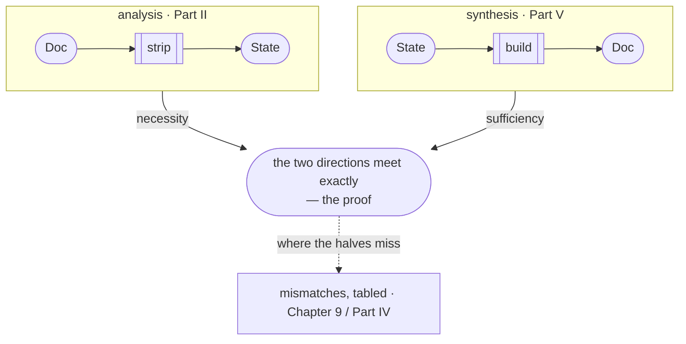
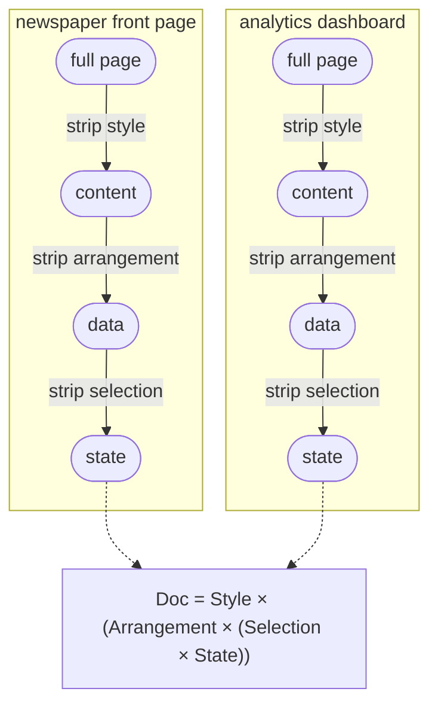
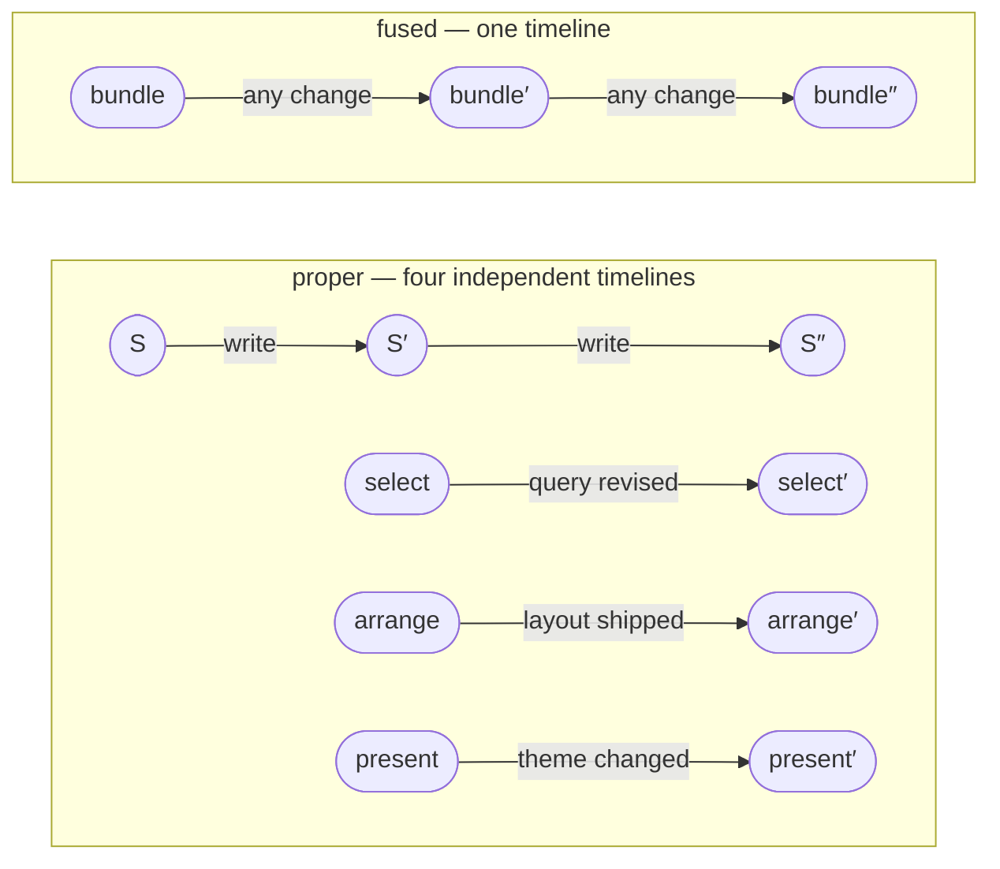
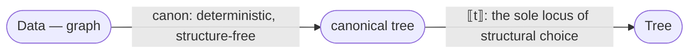
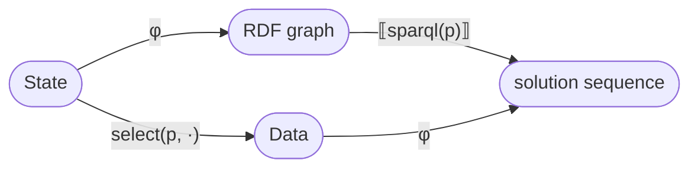
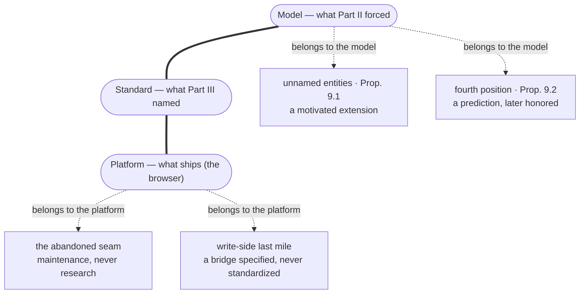
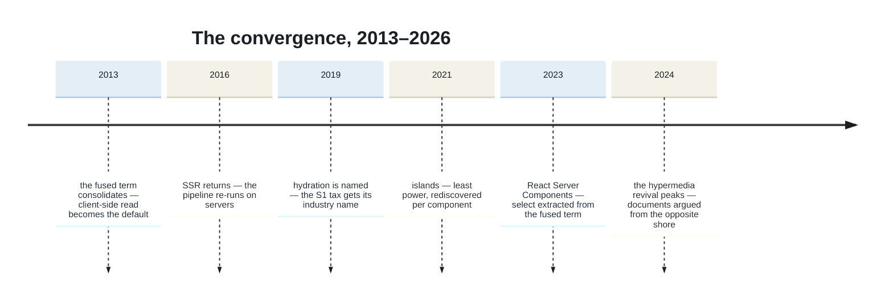
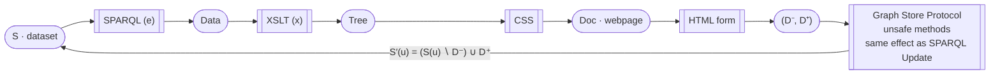
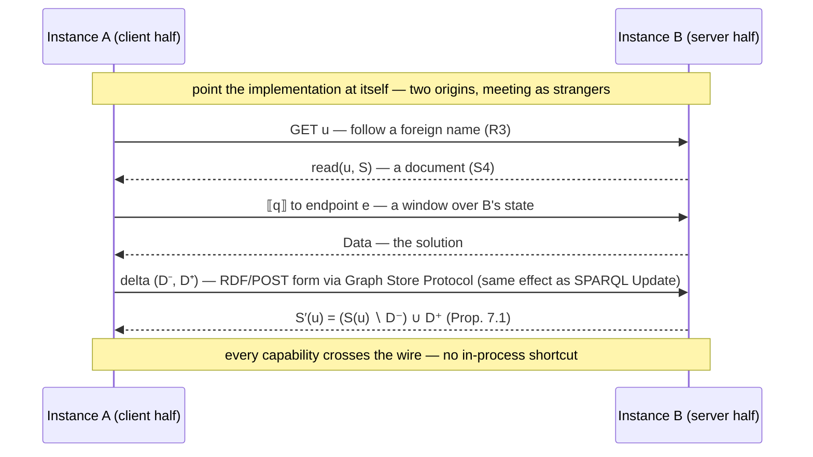

# First Principles of the Web

*DRAFT 0.1 · [atomgraph.com](https://atomgraph.com) · [GitHub](https://github.com/namedgraph) · [X](https://x.com/namedgraph)*


---

## Preface

The claim: there is exactly one way to build applications that are *of* the web rather than merely *on* it, and it is data-centric, declarative, and graph-based. "Exactly one" is meant relative to rules the web itself imposes — the book derives the rules, and shows what rejecting each one costs. Everything else — the JSON APIs, the JavaScript frameworks, the compile-to-browser toolchains — gets scored against those rules in Part IV; the book's finding, stated here and argued there, is that each is a partial rediscovery of this way or a detour from it.

The book is structured as a derivation, and every statement in it is one of three things: a definition quoted from the web's own specifications, a proposition that follows from previous statements, or an observation you can verify against deployed reality. If you find a statement that is none of the three, the book has a bug, and I would like a report. The method itself is Chapter 2's subject; notation and reading tracks are in Appendix A.

One more thing. This book is built to practice what it derives: its canonical edition is designed as an application of the very kind the book derives, in which every proposition is a resource with its own address — an instance of its own thesis. As of this writing, that edition is under construction: a promise the book has yet to keep.

---

## The Argument in One Page

A web application is two functions. `read` turns a request and the state of the world into a document; `write` turns a request and a state into a new state. That is HTTP restated, and every framework ever shipped is an implementation detail of it.

Strip any page — a newspaper, a dashboard — and the same skeleton emerges: style peels off, then arrangement, then selection, and what remains is state. So every `read` factors as `present ∘ arrange ∘ select`, and the factorization matters exactly when the factors are separate, declarative, substitutable, and addressable.

Ask what `State` must be, and the requirements come from the web itself. `State` must host any domain. It must compose across parties who have never met — which forces merging by union, over facts that carry their own meaning. Its names must work globally. The smallest fact meeting all three requirements is a triple — two global names and a value that may itself be one — and any minimal model meeting them is isomorphic to sets of triples under union. The uniqueness is a theorem; to reject its conclusion you must reject one of the requirements.

The reveal: the structure just derived is RDF, SPARQL, XSLT, and CSS — standardized between 1996 and 2014, then abandoned; abandoned, the book will argue, not refuted. The audit: everything the industry runs instead fails a named requirement and pays for the failure with a compensating industry; the derived stack, audited last on the same rows, fails nothing; by the audit's last chapter, one table carries every score. The bill: software agents now need exactly the property the industry never adopted — machine-consumable state — and the compensating machinery is assembling in real time, at industry scale.

If the derivation holds, the next web needs no inventing; it waits to be occupied. The rest of this book is the proof, the scores, and the evidence.

---

# Part I — The Object


## Chapter 1. What the Web Is

<div class="fp-epigraph">

*Vague but exciting…*

— Mike Sendall, on Tim Berners-Lee's 1989 proposal
</div>

Nothing in this chapter is mine. That is the point of it.

The web ships with its own definitions, and they are shorter than you probably expect. There are identifiers:

```
I     the set of URIs                                    (RFC 3986)
```

There are requests, which are built from identifiers:

```
Req = I × Method × Headers × Body                        (RFC 9110)
```

The body may be empty — the empty body is a body, the way an empty set is a set — and on *safe* requests — RFC 9110's word for the methods that only ask, never change — it almost always is. The unsafe methods are about to show what it is for. (RFC 9110's own name for it is *content* — a word this book will need for something else, so the older wire name stays.)

Responses come back the same shape — RFC 9110 defines one message form for both directions, a status code standing where the method and identifier stood:

```
Resp = Status × Headers × Body                           (RFC 9110)
```

The model keeps only what the response body carries. The body itself is octets; a header names their format (`Content-Type`), and the format's specification — not this book — defines how they parse. `Doc` lives on the parsed side of that line: the document, the thing a user agent displays. Call that domain `Doc`, and leave its internals alone for now. The envelope around it — the status code, the response headers — is how a document travels, ages, and caches: transfer machinery, and Definition 1.1 will not mention it.

**Definition 1.1.** A *web application* is a pair of functions:

```
read  : Req × State → Doc
write : Req × State → State
```

This is HTTP restated. `read` is what the safe methods do — `GET` takes a request and the current state of the world and produces a document. `write` is what the unsafe methods do — `POST`, `PUT`, `PATCH`, `DELETE` take a request and a state and produce a new state, the request's body carrying what the change should be. The body belongs to the write side: on a safe request it has no defined meaning (RFC 9110 §9.3.1), and `read` ignores it — `read`'s output travels in the *response's* body instead. Like `Doc`, `Body` stays opaque for now; Chapter 7 says what fills it. Every web application you have ever used, from a static homepage to the heaviest single-page monster, implements these two functions, because HTTP gives it no other way to be an application on the web. The framework it was built in is an implementation detail of Definition 1.1.

Notice what the definition does *not* say. It does not say what `State` is. That omission is deliberate, and it is the engine of this book. Definition 1.1 is a question stated as a definition: *what must State be?* Parts II and III are the answer, and the answer will be forced, not chosen.

> **Prop. 1.2.** Every deployed web application implements Definition 1.1. *(Verification: RFC 9110 §9; there is no third kind of method.)*
>
> **Prop. 1.3.** Definition 1.1 constrains architecture not at all. Both a 1993 CGI script and a 2026 React application inhabit it. *(This is why the definition is safe as an axiom — no one on any side of any framework war can reject it.)*

**The standing connection.** One apparent counterexample is worth settling while the definition is fresh. WebSockets and server push carry traffic that is neither a safe nor an unsafe method — no method at all — and the applications built on them, the live dashboard, the collaborative editor, can look like a third kind of thing. They are the same two functions at a different rhythm. Whatever flows on such a channel is one of two things: `read`'s output, arriving as the state changes rather than when it is requested, or `write`'s argument, arriving without a fresh envelope. Either way, the typing of Definition 1.1 is unchanged. What the channel sheds is not the definition but HTTP's machinery around it — methods, caches, a URI per exchange — and what that shedding costs, Part IV computes exit by exit — Chapter 5 names the exits. (Part II will even name the standing connection's honest cargo: change turns out to have a normal form, and a stream of it is something a machine can read. A socket is a pipe; the question — this book's only question, really — is whether what flows through it is transparent: legible to machines that did not produce it.)

The chapter closes with a reading of the web's history that the rest of the book will substantiate: the web succeeded against its contemporaries — Gopher, BBSs, desktop applications, and Java applets, an experiment Chapter 12 reruns — because its `read` was *transparent*. Documents were declarative, addressable, linkable, indexable. Every technology audited in Part IV will turn out to be a position on exactly one question: how transparent is your `read`? But no audit can begin, and no history can be checked, while Definition 1.1's omission stands. And how to fill that omission honestly is a question of method — answered by neither a survey of the industry nor the author's taste. The method is old, it has a name, and it is the next chapter.

---

## Chapter 2. Analysis and Synthesis

Chapter 1 defined a web application and deliberately left `State` untyped. Now the omission has to be filled, and the two easy ways fail on inspection. Survey fails. The deployed industry holds answers — rows behind one application, trees behind the next, object graphs behind a third — and they contradict one another. That contradiction is Proposition 1.3 in deployment: the definition constrains architecture not at all, so architecture went in every direction at once. Preference fails harder: an author's favorite model binds nobody. What is left is derivation: `State` must follow from constraints the web itself imposes, so that rejecting the conclusion means rejecting a constraint. The question is where a derivation like that can begin.

It cannot begin at `State`, because `State` is the one component of Definition 1.1 that nobody can see. Every other part of the signature is on the wire: requests are readable, responses are readable, and the document — `read`'s output — is the most public object in computing. The state behind them is each server's private business; no request returns it directly. So the investigation has to start at the observable end and work inward: take the document and strip it. Remove whatever can vary while the page still says what it says — each removal checkable against deployed reality — and keep only what no removal can touch. What is left at the end is not decoration and not arrangement; it is what the document could not have been made without — the first direct view of `State`.

Stripping alone, though, proves less than it seems to. What remains after the removals could be a fact about the pages chosen, or about the order of the removals, rather than about every page. The check is independence: set the pages aside, keep only the derived parts, and build with them. If a working application space can be constructed from the derived parts alone — using nothing from the original pages — then the skeleton was in the pages, not in the procedure. And if the construction fails, or quietly needs parts the derivation never produced, the failure is public: either the analysis kept the wrong things or the parts list is incomplete, and each defect is visible on its own.

The method is old enough to have a name. The Greek geometers called the two directions *analysis* and *synthesis* — Pappus's *Collection* describes the pair: assume the thing sought and work backwards to what is established; then reverse the path, and the reversal is the proof. Newton restates it as a rule of natural philosophy in the *Opticks*: the investigation of difficult things by analysis "ought ever to precede the method of composition." The practice has modern instances wherever a structure must be known rather than guessed. Organic chemists worked out a molecule's structure by breaking it into identifiable fragments, and accepted that structure as proven only once they had built the same compound from known ingredients and it matched. Software has the clean-room: a rebuild is independent exactly when the rebuilding team touched only the derived specification, never the original. Both keep the geometers' point: taking apart suggests a structure; only building back, independently, proves it.

Stated in advance, then, so the reader can hold the book to it: the analysis, if it succeeds, will show that every web application has a certain form — that under Definition 1.1 there is nothing else `read` and `State` could be: necessity. The synthesis, if it succeeds, will show that the derived form is enough to build with — a full application space, nothing missing: sufficiency. Where the two directions meet exactly, the argument closes from both ends; that meeting, not either half, will be the book's proof — and it happens twice, once in theorems and once in running code. And the method carries one obligation more: wherever the halves fail to meet *exactly*, the mismatches go on the table, itemized, not under it — that is Chapter 9's only job. The opening pages have already stated where the derivation ends; stating a result is not deriving it, and the derivation is the part a reader can check.

The shape of the book follows from the method. Part II is the analysis: first performed by hand on real pages, then re-run as theorems that quantify over every page, including the ones not yet built. Part V is the synthesis: the application space rebuilt from the derived parts and nothing else. Between them, the book does what the method obligates — holds the derived structure up against the world, scores everything the industry runs instead, and tables every mismatch.



*The method of this chapter, and the shape of the book. Analysis (Part II) strips the observable `Doc` inward to the hidden `State` — necessity; synthesis (Part V) builds `State` back out to a full `Doc` space — sufficiency. Where the two meet exactly is the proof, and it happens twice: in theorems (Chapter 8) and in running code (Chapter 18). Where the halves miss, the gap is not hidden but tabled — Chapter 9's one job.*

One decision remains before the stripping starts, and it is a control on the experiment: which pages to strip. Two, at least — one page's layers prove nothing beyond that page — and the honest pair is the most different pair available, because whatever survives the removals in *both* is unlikely to be an accident of either. So the pair is a newspaper front page — written by a handful of editors on an editorial rhythm, read by millions — and a wind-farm dashboard — written continuously by machines, read by one operator on shift. Different domain, different audience, opposite rhythms of `read` and `write`; under Definition 1.1, one signature. If these two reduce to the same skeleton, everything between them likely does too. Print both. Now take one apart.

---

# Part II — The Analysis

*Part I defined a web application as two functions and refused to say what `State` is. This part derives the answer: the factorization every `read` admits, the properties that make it real, and the forcing of `State` itself.*


## Chapter 3. Stripping the Page

The two pages are on the table — the newspaper front page and the wind-farm dashboard, as different a pair as Chapter 2 could find. Strip them, one layer at a time, and watch the same skeleton emerge from both. The exhibits below do exactly that, to real pages: the Guardian's international front page and a Grafana wind-farm monitoring dashboard, captured on the same morning.


*The starting material. One page is paper-white and editorial, the other black and numerical; they share, apparently, nothing.*

**Strip the style.** Turn off CSS, switch to reader view, print in monochrome. The page looks different; nothing it *says* changes. So a document factors:

```
Doc = Style × Content
```

The justification is already deployed on every device you own: dark mode, print stylesheets, reader view, accessibility themes — style varies while content holds fixed.


*CSS off. The newspaper still says everything it said — headlines, bylines, photographs, in browser-default dress. Note the asymmetry on the right, and file it for Part IV: stripping style from the newspaper leaves the news; stripping it from the dashboard leaves mostly chrome. The headline numbers survive as text, but the time-series curves were never in the document at all — they are pixels on a canvas.*

**Strip the arrangement.** The same content appears as a table on desktop, a card list on mobile, a chart in the summary view. The facts are identical; their shape as a document differs. So content factors:

```
Content = Arrangement × Data
```

The justification is every "view toggle" on the web: same data, different tree.


*Arrangement off. Both pages now speak the same format: one block per entity, sorted, no nesting. A headline with a section; a panel title with a value. The two sites that shared nothing now differ only in vocabulary.*

**Order, evicted.** One catch should be conceded before the next strip, because a careful reader has already spotted it: the front page's order *means* something. The lead story leads because an editor judged it should, and a strip that discarded the judgment would be destroying content while claiming to remove arrangement. The answer is that the judgment is a fact — *this article, prominence one* — and the strip's real effect is eviction: order moves out of the tree and into the data, where it survives every re-arrangement that follows. The deployed web already shows what happens otherwise: the same articles travel by feed, and the front page's judgment does not travel with them, because prominence that lives only in an arrangement is lost on every consumer who receives the content without it. Chapter 6 will harden this from a concession into a law: if the order is a message, the order is data.

**Strip the selection.** Every page shows a sliver of something much larger. The article page and the front page draw from the same pool; your dashboard shows this month, but last month exists. So data factors:

```
Data = Selection × State
```

Pagination, filters, search: deployed proof that the page is a window, not the world.


*Selection made visible: two windows over one pool. On the left, `/international` and `/world` share 13 entities — the same articles, drawn twice. On the right, the same dashboard at `?from=now-6h` and `?from=now-7d` — the selection travels in the URL, in public, where anyone can change it.*

Three strips, and both of our maximally different sites have reduced to the same expression:

```
Doc = Style × (Arrangement × (Selection × State))
```




*Two maximally different sites, three strips, one skeleton — the exhibits above, as a schematic.*

<div class="fp-exhibit" data-exhibit="strip"></div>

*Interactive exhibit (online edition): the strip, performed rather than photographed — the dashboard rebuilt live, each layer removed and restored in place.*

Two examples prove nothing about all websites; the strips are illustration. The universal claim is Chapter 4's theorem, quantifying over every `read` at once. This chapter makes you feel it; the next one proves it.

---

## Chapter 4. The Factorization

<div class="fp-epigraph">

*REST is defined by four interface constraints: identification of resources; manipulation of resources through representations; self-descriptive messages; and, hypermedia as the engine of application state.*

— Roy T. Fielding, dissertation §5.1.5, 2000
</div>

Chapter 3 stripped two pages by hand and called the result illustration; this chapter proves the universal claim. The strips become the factors of a typed pipeline; a definition — properness — separates real factorizations from trivial ones; and the analysis theorem guarantees that every `read` admits a proper one. The chapter closes with the method's debt to Roy Fielding — author of the REST dissertation — and with the four timelines a proper factorization gives the document.

### The pipeline

Chapter 3's strips, read as function types:

```
select  : Req × State → Data          which facts
arrange : Data → Tree                  what structure
present : Tree → Doc                   what appearance

read = present ∘ arrange ∘ select                        (4.1)
```


*The pipeline of (4.1). Rectangles are the factors; rounded nodes are values — and under S4, the fourth properness condition defined below, every rounded node is a web resource: it has a URI, and a GET on that URI returns it.*

**Prop. 4.2 (Existence, trivial).** Every `read` factors as (4.1). *Proof:* let `select` and `present` be identities up to retyping and stuff the entire application into `arrange`. ∎

Proposition 4.2 matters for what its proof shows: a factorization always exists, so the bare existence of one carries no information. The information is in whether the factors are genuinely separate. Definition 4.3 states that separation as four checkable properties — what "declarative architecture" means, once it is required to mean anything checkable. It is the book's central definition.

### Properness

**Definition 4.3.** A factorization (select, arrange, present) is **proper** iff:

**S1 — Obliviousness.** Each factor communicates with the next only through its output. `arrange` sees data, never the request. `present` sees a tree, never the data. No side channels: `arrange` and `present` are constant in `Req` and `State` except through their arguments.

**S2 — Declarativity.** Each factor is the *meaning of a term in a language* — there exist three languages, one per factor, with independently defined semantics such that `select = ⟦q⟧`, `arrange = ⟦t⟧`, `present = ⟦s⟧` for terms `q`, `t`, `s`. This is what "declarative" means, made precise: the meaning of the query does not depend on the stylesheet, because each language's semantics is closed.

**S3 — Substitutability.** Replace any factor with another term of its language and you still have a web application; the change is confined to that factor's concern.

**S4 — Addressability.** Every intermediate value is itself a web resource: the data produced by `select` has a URI and is dereferenceable, independently of the document it is destined to become.

S1–S3 could describe any well-factored program. S4 is the web condition: the factorization itself goes public, *exposed through the web's own reference mechanism*. An application satisfying S1–S4 is part of the web at every layer, not only at its rendered surface.

The dashboard makes it concrete: `select` pulls the panel's `title` and `value`, `arrange` nests them into a card, `present` themes the card. S4 is the property you can check by hand — each of those three intermediate values has its own URL and *dereferences*: a GET on the URL returns it as data, before it is ever a page.

Three of these properties were written down by the web's own architects — as advice. [*Architecture of the World Wide Web, Volume One*](https://www.w3.org/TR/webarch/) (W3C Recommendation, 2004; hereafter AWWW) names the separation of content, presentation, and interaction a good practice (§4.3), orthogonal and composable specifications a principle (§5.1), and asks URI owners to provide representations of their resources (§3.5) — S4's demand, minus the intermediates. All of it stated as SHOULD, because a recommendation can do no more than recommend. Hold that until Proposition 4.4: what the web's own architecture group could only advise, the derivation forces. The norms were theorems all along. AWWW is a witness here, never a premise: assuming §4.3 would be assuming this chapter's conclusion, and the method forbids that.

The payoff of S4 is immediate and measurable, and it is [Fielding's](https://www.ics.uci.edu/~fielding/pubs/dissertation/top.htm) list: HTTP caching per stage rather than per page; crawlability of *data* rather than of renderings; intermediaries; independent evolution of the layers. The last of these will harden from a phrase into a proposition before the chapter ends. Every one will reappear in Part IV, scored against every architecture that forfeits it.

### The analysis theorem

**Prop. 4.4 (Analysis theorem).** Every `read` whose output depends on `State` only through some finite part admits a proper factorization.

<details>
<summary><i>Proof sketch — take the minimal fragment the output depends on.</i></summary>

Define `select(r, S)` as the minimal fragment of S on which `read(r, ·)` actually depends — well-defined by finiteness; `arrange` and `present` are the induced quotients; S1 holds by construction, S2–S4 by choosing the languages of Part III. Full proof in Appendix B. ∎

</details>

Proposition 4.4 is what Chapter 3 was illustrating: stripping a real page is *computing its proper factorization by hand*, and the theorem guarantees the exercise terminates for every site — including every site not yet built.

### The debt to Fielding

The debt to Fielding runs deeper than the property list. REST was the last serious attempt to *derive* web architecture rather than fashion it: constraints applied stepwise, properties induced per constraint. That is the method this book inherits and pushes to theorem grade. But REST constrains the conversation and leaves the vocabulary open: it says how representations must transfer — statelessly, cacheably, through a uniform interface — and declines, deliberately, to say what a representation or the state behind it must *be*. That open question is this book's subject. Chapter 5 closes it, and the closure was unavailable to REST's own method in 2000: the answer had been standardized only the year before, and the pressure that makes it visible — machines reading the web — was two decades out. Read this book as the second half of a derivation whose first half Fielding wrote.

His deepest constraint is also his least defined: the **uniform interface**. In Fielding's own estimation it is the central feature that distinguishes the web from every prior architecture, yet he delivered it as four clauses of prose (§5.1.5) and never formalized it. "Uniform" is the quantifier: one signature for every application — which is why Definition 1.1 could open this book by fitting every web application ever built, and why Part V can close it with one application for every domain. The interface was always uniform; the state beneath it was not. Chapter 5 finishes the thought.

<details>
<summary><i>The four clauses, typed — one per component. (Borrows names from Chapters 5 and 7 and Appendix B; return here after the pipeline closes.)</i></summary>

| Fielding's clause (§5.1.5) | typed here as |
|---|---|
| identification of resources | `I` — one name space; R3, S4 |
| manipulation of resources through representations | Definition 1.1 — `read` and `write` exchange representations; the delta normal form is the write's |
| self-descriptive messages | self-containedness — B-2d, at the message's scale |
| hypermedia as the engine of application state | the five moves — every transition a link in the document |

</details>

### The four timelines

Definition 4.3 has one more consequence, and it can be collected now. Nothing in this chapter has mentioned time. HTTP has. A representation, per RFC 9110 §3.2, reflects "a past, current, or desired state of a given resource" — state *at a time*. And the protocol ships an apparatus whose only job is telling a resource's representation at one moment from its representation at another: `Last-Modified` and `ETag` (RFC 9110 §8.8), and the caching calculus built on them (RFC 9111). The web's own specifications already treat the document as a sequence of states; the time index comes ready-made. Index the moving parts — writing `τ` for time, since `t` is taken:

```
S : Time → State                               the world, over time
read_τ = present_τ ∘ arrange_τ ∘ select_τ      the application, over time
doc(r, τ) = read_τ(r, S(τ))                    what the user agent renders
```

Four components can move: the state `S(τ)` and the three factors. Each movement has a name you already know. The state advances when someone writes — Chapter 7's whole subject. A factor changes only one way: by substituting its term — this is S3, read over time. The selection changes when a query is revised and redeployed, the arrangement when a layout switches or a template ships, the presentation when the theme changes. And one thing that looks like movement is not: a user paging forward or tightening a filter changes nothing in the application. The filter travels in `r`, and `select` is the same term evaluated at a new argument. A model that makes the selection depend on time just to handle a mouse click has confused the function with its argument — a natural mistake, since the notation invites it. The four timelines belong to the application; navigation belongs to the request.

**Prop. 4.5 (Independent evolution).** In a proper factorization, the document's evolution decomposes into four independent timelines, one per component `(S, select, arrange, present)`: a change to any one component changes the document without requiring a change to, or the participation of, any other. In the fused factorization of Prop. 4.2 there is one component and therefore one timeline: every change, of whatever kind, is a change to the whole.

On the dashboard, that independence is one line of daily practice: ship a new theme and the panel data never re-fetches — `present` moved on its own timeline while `S`, `select`, and `arrange` stayed put on theirs.

<details>
<summary><i>Dependencies — S1 confines, S2 closes, S3 substitutes; proof in Appendix B.</i></summary>

Depends on 4.3: S1 confines a change's effect to its factor's output; S2 closes each term's semantics, so substituting a term of one language cannot alter the meaning of a term in another; S3 guarantees the substituted term still yields a web application. Proof: Appendix B.

</details>



*Prop. 4.5, drawn. Above: each component advances alone, and caches invalidate per component. Below: every change, of whatever kind, is a change to the whole — and invalidates the whole.*

The corollary is from Fielding's list a few paragraphs back, now holding a mechanism. Under S4 each intermediate value is a resource; each resource has a URI; each URI carries its own validator — its own `ETag`, its own timeline, legible to every cache on the path. A theme change invalidates one stylesheet resource, and the data it styles stays cached at its own age, untouched. Collapse the factorization and there is one resource — the bundle — with one validator, and the corollary inverts: any change, of any kind, invalidates everything.

And the industry already operates all four timelines — one layer down. Fingerprinted stylesheets shipped with `Cache-Control: immutable`; data responses marked `no-store`; templates deployed on their own cadence. Every serious deployment on the web runs per-component timelines at the delivery layer, including deployments whose application architecture denies that the components exist. Independent evolution already runs in production, one layer below the framework that obscures it.

One thread left dangling, on purpose: `select` selects *from State*, and State is still abstract. The factorization cannot be completed until we know what it is a factorization *over*. That is Chapter 5, and it is where the book stops describing and starts forcing.

---

## Chapter 5. What State Must Be

We need `State` to stop being abstract. But its structure is not mine to choose — the method forbids taste. It will be forced by three requirements, each drawn from the web itself.

### The three requirements

**R1 — Universality.** The web hosts every application domain there is or will be. Therefore `State` must encode arbitrary application state, with no domain structure baked in. *(Source: the observable web. Try to name the domain the web is "for.")*

**R2 — Coordination-free composition.** The web has no central schema authority — by design; decentralization is what "world wide" means. Therefore state held by independent parties who have never communicated must be composable. Composition without coordination has laws: it must accept any two states (checking compatibility is coordinating), in any order (agreeing an order is coordinating), with duplicates free (tracking copies is coordinating). And it preserves meaning only if the things composed are *self-contained* — a fact must carry its full meaning with it, because no surrounding structure survives a merge. Those four laws leave exactly one composition, and Appendix B proves it — set union:

```
State = 𝒫(Fact)        merge = ∪                          (5.1)
```

State is a *set of atomic facts*, and two states, from any two parties, anywhere, compose by union. Order-free, idempotent, associative, commutative — every property that federation needs, in one move.

**The scope of this result, before anything is built on it.** These laws govern composition's *mechanics*: that any two states merge, without permission, in any order, at no cost. They do not promise that merged facts *join* — that two parties' names for one turbine ever meet in a query. No data model can promise that: parties who never communicated have agreed on nothing, in every model ever proposed, and a requirement pretending otherwise would be a coordinator in disguise. A model does control two things: what an unjoined union already holds, and what a join takes once someone demands it. Chapter 17 takes that up, where federation stops being algebra and becomes deployment. Here it is enough to be exact about what R2 secures: merge, not meaning across sources; and it secures that completely.

Flagged in the open: the passage from "no coordinator" to these merge laws is the one bridge in the derivation. I name it the **Transposition Thesis**: the invariants the web already enforces at its document layer, transposed to the state layer, are exactly the merge laws just used — and I claim the transposition is exact, row by row; the table below is the claim in checkable form. And it is corroborated by a field with no stake in this book's thesis. Distributed-systems research, forced to make replicas converge without coordination, derived the same laws as theorems (the CRDT — conflict-free replicated data type — literature). Two fields, disjoint motives, one algebra — the merge laws are not a matter of taste.

<details>
<summary><i>The transposition, row by row — four deployed invariants, four laws.</i></summary>

| the document layer, deployed | the state layer, transposed |
|---|---|
| anyone links to anything; no one is asked | composition is total — no compatibility check (B-2a) |
| content arrives by any path; intermediaries reorder it freely | composition is order-free (B-2b) |
| copies are free and unmarked; the cache hit *is* the resource | composition is idempotent (B-2c) |
| aggregators consume content outside its original arrangement, without its publisher's consent | no meaning survives in arrangement (B-2d) |

Each left cell is deployed and citable — RFC 9111 carries the middle two, AWWW's global-identifiers principle the first, and the last is every search engine and feed reader in operation. Each right cell is a numbered condition in Appendix B; B.4 proves none is redundant. Appendix C carries the CRDT citation — state-based replication requires a join-semilattice: totality, order-freedom, idempotence, derived in that literature from replication pressure alone. The theorem downstream is about the web exactly as far as this table holds.

</details>

**R3 — Global reference.** A fact on one site can be about an entity described on another; the web's entire value proposition is that things link. Therefore names *inside* facts need global scope. The web possesses exactly one global naming system — `I`, the URIs from Chapter 1 — and inventing a second one would itself violate R2 (two parties' private naming schemes collide on merge). So references in facts are drawn from `I`. And note what R3 does and does not ask: names must be global; nothing requires that they dereference. That they *can* — that the naming system and the web's address system are one — comes free with the construction; Chapter 18 confronts what that identification costs.

### The smallest fact

The question now is the smallest self-contained fact, and "smallest" is not an aesthetic preference. Every extra position a fact carries is one more thing independent parties must agree on — and agreement is what R2 forbids. So minimality is R2 again, applied to the shape of the fact itself. When a genuine requirement justifies an extra position, the derivation will grant it; Chapter 9 does exactly that.

**Prop. 5.2 (Arity).** The minimal self-contained fact is a triple.

<details>
<summary><i>Argument — a pair cannot name its own relation: <code>(employee42, "2026-07-08")</code> is hired-on, or fired-on, or born-on.</i></summary>

A 1-tuple `(x)` asserts nothing — it names without claiming. A pair `(entity, value)` asserts a relation but cannot say *which* relation — `(employee42, "2026-07-08")` is hired-on, or fired-on, or born-on; the meaning lives outside the fact, which R2 forbids. Three positions — `(entity, attribute, value)` — is the first arity at which a fact names its own relation. And it is the last arity we need: any n-ary fact decomposes into triples by minting a fresh entity for the fact and attaching its n components as attributes. Minimality and universality pin the arity at exactly three. ∎

</details>

R3 forces the entity position into `I`. It forces the *attribute* position into `I` too — attributes need global names just as much, or two sources cannot know they mean the same property, and R2 dies at the first merge. The value position is either a reference or an atomic literal:

```
Fact  = I × I × (I ∪ V)                                   (5.3)
State = 𝒫(I × I × (I ∪ V))
```

Chapter 3's exhibit already wrote facts in this shape without saying so. The dashboard's strip-2 block was one entity and two attributes — two facts, exactly — writing `⟨·⟩` for a URI, abbreviated to its fragment: `(⟨…#panel-14⟩, title, "Current Power")` and `(⟨…#panel-14⟩, value, "15.5 kW")`. Entity in `I`, attribute in `I`, value in `V`. The exhibit was the theorem, photographed early.

<div class="fp-exhibit" data-exhibit="merge"></div>

*Interactive exhibit (online edition): two parties who have never met. Edit either side, shuffle, duplicate — the union absorbs everything except new facts, and (5.1) is something you fail to break rather than something you believe.*

### The uniqueness theorem

**Theorem 5.4 (Uniqueness).** Any arity-minimal state model satisfying R1–R3 is isomorphic to (5.3). *(Proof: Appendix B. The proof is an assembly of 5.1–5.3: R2 forces the set-of-atomic-facts shape and union-merge; R1 with minimality forces arity three; R3 forces positions one and two into `I`.)*

That this is the only native way sounds like rhetoric; Theorem 5.4 makes it a statement with an escape clause, and the escape clause is the trap: to reject the conclusion you must reject a requirement, and each rejection has a name. Reject R1 and your model can't host the web's content. Reject R2 and your data needs a coordinator — a central schema authority, which is to say: you have built a silo. Reject R3 and your data cannot refer beyond itself — a silo again, by the other door. Reject minimality and you widen the tuple — a door left deliberately ajar; Chapter 9 walks through it with a fourth requirement, attribution. Every alternative data model the industry runs on will be located, in Part IV, at one of the first three exits.

### Selection and the delta

We are not done deriving — the same pattern now runs once more, one level up, quickly. `select` needs a minimal algebra over `𝒫(Fact)`: match a fact pattern with variables; join matches; union alternatives; project variables out. Each operation is forced by a page you can point at (any master–detail page is a join; any search page is a pattern). `write`, by (5.1), reduces to two sets: facts added and facts removed — the *delta*. Both reappear in Part III under their deployed names. And notice what the theorem has done to the pipeline's types: `State` is now a graph — facts whose references point anywhere — while every document Chapter 3 stripped was a tree. Somewhere between them, the shape must change. That is Chapter 6.

A join, by hand. The operator holds `panel-14 title "Current Power"`; the contractor holds `turbine-3 feeds panel-14`. Merged, the pattern

```
?turbine  feeds  ?panel
?panel    title  ?name
```

returns one row — `?turbine = turbine-3`, `?panel = panel-14`, `?name = "Current Power"` — and the row exists only because the two parties' facts were merged first. Match, join, project: the algebra on one page.

<div class="fp-exhibit" data-exhibit="select"></div>

*Interactive exhibit (online edition): the algebra, exercised — patterns with variables, joined and projected over the state merged above. One preset only answers because the merge happened: it joins the operator's facts to the contractor's.*

---

## Chapter 6. From Graph to Tree

Look at the pipeline's types: `State` and `Data` are *graphs* — facts whose references form arbitrary many-to-many webs. `Tree` and `Doc` are *trees* — documents are hierarchical, and so is human reading. The pipeline crosses from graph to tree exactly once, inside `arrange`.

<div class="fp-history">

**In the world.** The tension this chapter resolves is older than the web. In 1945 Vannevar Bush blamed our trouble finding anything on "the artificiality of systems of indexing" — records "filed alphabetically or numerically," found "by tracing it down from subclass to subclass" — where the mind instead "operates by association." Ted Nelson put the same objection in capitals in 1974: "EVERYTHING IS DEEPLY INTERTWINGLED. In an important sense there are no 'subjects' at all." Both were describing a graph and refusing the tree. This chapter keeps both — the association is what `State` is; the tree is only what a document must become to cross the wire and be read.

</div>

Every web framework in history is a strategy for this one crossing. That is a thesis, not a theorem — like the Transposition Thesis, flagged where it stands and left unnumbered; Part IV returns to it. But the crossing is not yet well-defined: serialization is a *relation*, not a function — one graph, many trees (orderings, nestings, groupings). The fix is canonicalization:

```
arrange = ⟦t⟧ ∘ canon
canon : Data → Tree      deterministic, lossless, structure-free
t                        the sole locus of graph→tree structural choice
```

`canon` is the graph in bare tree form — one block per entity, sorted, no nesting, no sugar. *All* structural decisions (what nests under what, what becomes a section versus a sidebar) move into the declarative term `t`, where S2 can hold. Display order included: `canon`'s sort is deliberately meaningless, and an order that carries meaning — Chapter 3's lead story — arrives as data and is honored by `t`, never smuggled in the sequence of blocks. The historically hard case — facts about *unnamed* entities, an extension Chapter 9 motivates and prices — has a standardized deterministic answer as of 2024 (a canonical labeling; the reveal chapter will name the spec).


*One graph, many trees: `d` can nest under only one parent — the other edge survives as a reference — and siblings take an order the graph never fixed. These are the choices the crossing must make somewhere: `canon` makes none of them, `t` makes all of them.*

And you have already seen `canon`'s output. Strip 2 *is* it: the dashboard reduced to sorted blocks, one per panel, `title` and `value` beneath. The exhibit's format was never a design choice for the figure — it was the canonical serialization, arrived at by stripping.

The three properties `canon` must have — deterministic, lossless, structure-free — are satisfiable, and cheaply:

**Prop. 6.1.** A `canon` with all three properties exists.

<details>
<summary><i>Proof — sort lexicographically; unnamed entities pay Chapter 9's bill.</i></summary>

For ground states — states whose entities all carry names — order the atoms lexicographically by their three positions and emit one block per entity. The map is a function because a total order on tuples exists; lossless because the atom set is recoverable by reading the blocks back; structure-free because the order is defined by the atoms alone, never by their provenance or grouping. States with unnamed entities need a canonical labeling first; that labeling exists, is standardized, and Chapter 9 states its cost. ∎

</details>

<div class="fp-exhibit" data-exhibit="canon"></div>

*Interactive exhibit (online edition): shuffle the input as many times as patience allows — `canon` does not move. Change an atom and it moves exactly as far as the atom requires.*



*The graph→tree crossing. A relation (one graph, many trees) becomes a function followed by a term: `canon` chooses nothing, `t` chooses everything — and `t` lives in a language, where S2 can hold.*

The seam is not a research problem; Chapter 9 brings the evidence.

---

## Chapter 7. The Write Side

Definition 1.1 has a second component, and with it comes the strongest objection to everything so far. Documents can be declarative — nobody defends imperative newspapers. Applications, the objection runs, are different: they change things, they respond, and change is where declarative architectures fail. This chapter takes the objection at full strength and answers it in four propositions. Nothing from the read pipeline needs to be taken back; the write side is the factorization's mirror image, and the smaller of the two.

### The delta normal form

Start where Chapter 5 left the state: `State = 𝒫(Fact)`, merge is union. What can change about a set? Elements leave; elements arrive. There is no third thing.

**Prop. 7.1 (Delta normal form).** Every state change factors as a pair of fact-sets — a *delta*:

```
write(r, S) = (S ∖ D⁻) ∪ D⁺                              (7.1)
D⁻ = S ∖ write(r, S)          the facts removed
D⁺ = write(r, S) ∖ S          the facts added
```

<details>
<summary><i>Proof — extensionality, then minimality.</i></summary>

With `D⁻`, `D⁺` as defined, `(S ∖ D⁻) ∪ D⁺ = write(r, S)` by set extensionality; this is the minimal such pair, and minimality makes it unique. ∎

</details>

Two sets. That is the entire theory of mutation over a fact-set model. Measure that against what the industry maintains for mutation: object-relational mappers, migration frameworks, state managers, undo stacks, reconciliation engines. Every one of these is machinery for computing or applying change over a model in which change has no normal form. Trees are the instructive case: two trees have no canonical difference, so deciding what "changed" is a heuristic. The virtual DOM's diffing engine — the machinery client-side frameworks run to re-compare an in-memory copy of the page on every render (Chapter 11) — is the industry's clearest case of this — a whole runtime spent recovering, approximately, what (7.1) gives exactly by subtraction. Sets subtract. The model that R2 forced for merging turns out to hand us mutation's normal form as a by-product; union and difference are one algebra.

On the running example: the wind gusts, and the panel's `value` moves. The delta is `D⁻ = {(⟨…#panel-14⟩, value, "15.5 kW")}` and `D⁺ = {(⟨…#panel-14⟩, value, "16.1 kW")}` — two one-element sets, and that, transport included, is the entire update.

<div class="fp-exhibit" data-exhibit="delta"></div>

*Interactive exhibit (online edition): the gust, applied — edit the two sets and apply them against the live state. Apply the same delta twice and watch nothing happen: sets subtract, and re-application is a no-op.*

And note what a delta is made of: fact-sets. Change is data in the same model as the state it changes — no second model, no change-description language with semantics of its own to invent. Chapter 5 ended by deriving the delta; it is what fills the request's `Body` from Chapter 1, and Chapter 8 will name what the industry standardized it as.

### Forms, run backwards

**Prop. 7.2 (Forms are inverse transforms).** The read pipeline ends at a human; the write side begins at one. The instrument is a form: a tree, part of a document, rendered by `present` like everything else, whose fields stand where a fact pattern's variables stand. Submission binds the fields; a bound pattern is a set of facts; mark each set "remove" or "add" and you are holding (7.1)'s delta:

```
form   : Tree                fields ↔ variables of a fact pattern
submit : Bindings → (D⁻, D⁺)                             (7.2)
```

A form is `arrange` run backwards. The one factor that crossed graph→tree (Chapter 6) is also the one that must cross back, and it crosses on the same rails: patterns.

Two jobs meet in a form, and they must not be conflated. *Construction* — which fields an edit form should offer for an entity of this kind — is a projection of structure: read the patterns, render inputs. *Validation* — which deltas are admissible — is a predicate on `(D⁻, D⁺)`. One reads structure; the other judges change. A schema drafted to do both jobs at once will do both badly.

For the justification, view source on any HTML form since 1993. Field names are attribute names; `method` names the unsafe verb; the form is a fact pattern wearing input boxes. The web has shipped the inverse transform beside the forward one from the beginning.

### One algebra, both directions

**Prop. 7.3 (One algebra, both directions).** Chapter 5's selection algebra — pattern, join, union, project — is the write side's algebra too. A pattern with free variables *selects* the facts that match; the same pattern with its variables bound *denotes* the facts of a delta. Selection finds what is; the delta says what shall be; the syntax between them is one syntax.

```
pattern + variables  →  bindings                          (find)
pattern + bindings   →  (D⁻, D⁺)                          (change)
```

The consequence is practical as much as formal: the write side adds no expressive machinery. Whoever can query can update: an implementation gets its update language by running its pattern matcher with the arguments swapped. When Part III proves the read side complete, the write side inherits the result through this symmetry. Compare, once more, the industry's arrangement: a query language, a separate mutation API, a migration DSL, a client-side state manager — four vocabularies for one algebra.

### The five moves

**Prop. 7.4 (Interactivity, decomposed).** The objection's strongest form: "real applications are interactive." By independent evolution (Prop. 4.5) the document is `doc(r, τ) = read_τ(r, S(τ))` — a value with exactly five inputs: the request `r`, the state `S(τ)`, and the three factor terms. So every interaction the web has ever shipped is one of exactly five moves:

1. **navigate** — a new `r`: link, filter, page, search. The term unchanged; the argument different.
2. **write** — `S` advances by a delta (7.1): submit, edit, delete.
3. **restyle** — substitute the `present` term: the theme toggle.
4. **rearrange** — substitute the `arrange` term: list to grid, sort, collapse.
5. **reselect** — substitute the `select` term: a saved query edited, a dashboard reconfigured.

Moves 2–5 are independent evolution's four timelines; move 1 is the request, which Chapter 4 already ruled out of the application. There is no sixth move because there is no sixth input. The document has exactly five inputs — the request, the state, and the three factor terms — as Prop. 4.5 counts them. Interactivity *is* the factorization, exercised. Fusion adds no move to this list; what it gains is the freedom to make the moves without saying which component they touch. Part IV will show what that freedom costs.

One honest concession remains, and it too should be met at full strength: latency. The operational complaint is the round trip — a keystroke should not cross an ocean to move a cursor. Granted. But look at what the complaint actually asks for: that the factors be *evaluated near the user* — not that they be fused. And mobility of evaluation is precisely what S2 already secured. A term whose semantics is closed evaluates the same everywhere; ship `q`, `t`, `s` to the client and run them there, against a local replica of the selected data, and the architecture has not changed by one proposition — the same terms, the same factors, a different machine. What cannot travel this way is a fused `read`: an opaque program can only be shipped whole and trusted blind, and shipping opaque programs to browsers is an experiment the web has already scored once (Chapter 12). Declarative terms are portable because they mean the same thing everywhere — S2, read as a deployment strategy.

### The closed pipeline

The pipeline is now complete in both directions, and it closes:


*The closed pipeline. State becomes document by three factors; the document meets a human; the human's answer is a delta; the delta is the next state — and `τ` ticks (4.5). Every arrow is a numbered proposition. Everything before this figure derives it; everything after measures the world against it.*

---

# Part III — The Reveal

*The derivation is complete — a data model, an algebra, a crossing, a write side — and none of it has been named. This part names it. The names are decades old.*


## Chapter 8. It Already Exists

Everything in Part II was derived from three RFC-level definitions and three requirements. No W3C recommendation has been cited; no vocabulary from any data-model community has appeared. Now:

| Derived in Part II | Standardized as | Since |
|---|---|---|
| `Fact = I × I × (I ∪ V)` | RDF (Resource Description Framework) triple (subject, predicate, object) | 1999 / RDF 1.1 2014 |
| `State = 𝒫(Fact)`, merge = ∪ | RDF graph; graph merge | ibid. |
| selection algebra (pattern, join, union, project) | SPARQL algebra, §18 (Basic Graph Pattern, Join, Union, Project) | 2013 |
| delta `(D⁻, D⁺)` | SPARQL Update (`DELETE`/`INSERT`) | 2013 |
| dereferencing `select` results (S4) | Linked Data; Graph Store Protocol | 2006 / 2013 |
| `canon` | canonical RDF/XML; RDFC-1.0 for the unnamed entities (*blank nodes*) | 2004 / 2024 |
| `⟦t⟧ : Tree → Tree` after canon | XSLT | 1999 / 3.0 2017 |
| `present` | CSS | 1996 |

*Table 8.1. The correspondence.*

Read the dates first. Every row predates this book, most by decades, and none appears anywhere in Parts I–II — one conceded exception: Chapter 3 turns CSS off by name, the act every reader knows it by. The derivation's premises are the RFC layer only, so the match in this table is a check the reader performs, not a construction the author arranged. The columns are independent: the left side is forced by three requirements, the right side was shipped by working groups, and the table asserts they are the same objects.


**Prop. 8.2 (Homomorphism).** There is a translation `φ` — facts to RDF triples, states to graphs, selection terms to SPARQL terms — such that `φ(select(p, S)) = ⟦sparql(p)⟧(φ(S))`; on ground states `φ` is a bijection. The mapping is a *homomorphism*, not a coincidence of shapes: the operations commute with the translation.

<details>
<summary><i>How the check runs — clause by clause against a denotational spec.</i></summary>

`φ(select(p, S)) = ⟦sparql(p)⟧(φ(S))` — checkable clause by clause against the SPARQL algebra, which — a rarity among web specs, shared mainly with XQuery's Formal Semantics — is written denotationally and makes the check possible. Full proof: Appendix B.7. Contrast the specs that define no formal semantics and reap a decade of implementer disagreement.

</details>



*Prop. 8.2. Two paths, one result: translate then query, or query then translate (the standard calls the result a solution sequence). The square commutes — the mapping is a homomorphism, not a pun.*

**You have already accepted RDF. You did it in Chapter 5, before I told you its name.**

Whatever you believed about the semantic web when you opened this book — too academic, too complicated, died in the nineties — you derived it yourself from three requirements you can reject only at a cost each one names. The technologies were not a committee's enthusiasm in search of a problem; they occupy a position that was *forced*, and the people who standardized them in 1999 had arrived where it points. What failed in the nineties was not the position. The tooling failed, and the timing did: the substrate is built for machine consumption, and the machines were twenty years out — a reading Chapter 17 grounds in demand.

<div class="fp-exhibit" data-exhibit="reveal"></div>

*Interactive exhibit (online edition): Chapter 5's state, Chapter 5's algebra, Chapter 7's delta, under one switch — the derivation's notation on one side, Turtle (the standard's text notation for triples), SPARQL, and SPARQL Update on the other. Nothing is recomputed. Everything is renamed.*

**Theorem 8.3 (Synthesis).** The stack realizes the entire space of proper factorizations: SPARQL is complete for the selections, XSLT-over-canon for the arrangements, CSS for presentation, and S4 holds by construction because query results and graphs are dereferenceable resources. *With one honest caveat: the completeness class for `arrange` excludes smuggling. A transform qualifies only if it is generic — invariant under URI renaming, singling out no particular URI. That is what practitioners call data-drivenness, stated as mathematics, and AWWW §2.5's URI opacity made exact; Appendix B.8 gives the condition.* Analysis said every application has the form; Synthesis says the stack fills the form. The two halves of the argument meet. This meeting point is the book's proof.

---

## Chapter 9. The Mismatches

<div class="fp-epigraph">

*RDF is painfully simplistic, but it allows you to work with real-world data and problems that are horribly complicated.*

— Dan Brickley and Libby Miller, foreword to *Validating RDF Data*
</div>

Chapter 8 put both halves of the argument into theorem form: every application has the derived form, and the deployed standards fill it. That invites suspicion — a derivation that lands exactly on a deployed stack looks retrofitted until its mismatches are on the table. This chapter puts them there. The isomorphism is not exact. There are two mismatches between the model Part II forced and the standard Part III named, and two more between the standard and the platform that ships it. Each is located, measured, and — twice — turned into a prediction. Part IV applies the same standard to everyone else's models.

### Mismatch one: the unnamed entities

RDF permits facts about entities with no name — blank nodes — and nothing in Chapter 5 forced them: the derivation minted a fresh URI wherever it needed an entity, because minting a fresh URI costs nothing. So blank nodes are surplus, and the surplus has a precise reading. A graph containing `_:b` asserts *that something exists* with these properties; RDF's own semantics says exactly this — simple entailment treats blank nodes as existential variables. The extension is well-motivated. Entities routinely exist before anyone names them — every form not yet submitted, every observation not yet reconciled, describes a something — and a model that forbade the unnamed would fail R1 at the margins of every domain.

Now the cost, and it can be stated exactly.

**Prop. 9.1.** Over ground facts, `⊕ = ∪` satisfies B-2a–d on the nose. With blank nodes, idempotence and atomicity hold up to logical equivalence — and only up to logical equivalence.

<details>
<summary><i>Proof — merging a graph with itself doubles the existentials: equivalence survives, identity does not.</i></summary>

Blank nodes are scoped to their graph, so composition must standardize them apart: `s ⊕ s` carries two copies of each existential. The result asserts nothing new — it entails `s` and is entailed by it — so `s ⊕ s ≡ s`; but as a set of atoms it is strictly larger, so `s ⊕ s ≠ s`: B-2c survives semantically and fails syntactically. Atomicity bends the same way: an atom containing a blank node means something only together with the atoms sharing its variable, so self-containedness holds per connected component, no longer per atom. Restoring identity from equivalence costs exactly two computations: canonical labeling — standardized in 2024 as RDFC-1.0, deterministic, with adversarial worst cases the spec itself documents — and redundancy elimination, which is coNP-complete in general. ∎

</details>

That is the bill for anonymity, and it falls exactly on the party that chose anonymity: name your entities and state composes by set arithmetic; leave them unnamed and composition becomes theorem-proving in miniature, landing precisely at the seam where Chapter 6 put `canon`. The web's grain shows through the formalism: the work appears exactly where names are missing. The deployed stack's own list idiom shows the cost: an ordered collection encoded as a chain of unnamed cells carries the cost of anonymity at every link. State the order as data instead — a rank fact per member, Chapter 3's lead story — and it merges like any other fact. Order is the recurring case: state it as facts and it merges like facts; fold it into shape and it costs what shape costs.

### Mismatch two: the fourth position

The web demands one requirement Chapter 5 never imposed. R1–R3 govern facts about the world; the web also traffics in *claims* — the same fact asserted by one source and disputed by another, provenance, retraction, trust. Call it R4:

**R4 — Attribution.** Facts about who asserts facts.

**Prop. 9.2.** The arity-minimal state model satisfying R1–R4 is `𝒫(I × Fact)` — quads.

<details>
<summary><i>Proof — set union forgets who contributed; reification attributes only descriptions; one position repairs it.</i></summary>

Union erases contribution: B-2d says `atoms(s ⊕ s′) = atoms(s) ∪ atoms(s′)`, and a set union keeps no record of which side an element came from. So within `𝒫(Fact)`, "who asserted this atom" is unrecoverable by construction — attribution lives in the history of the state, and states-not-histories is what B-2c chose. Reification — the standard's device of describing a fact in triples of its own — does not escape either: it attributes only a *description* of the fact. The described fact is then either also present as a plain atom — in which case it is asserted outright and the attribution is defeated — or absent — in which case it is attributed but never stated, quoted rather than asserted. The minimal repair types the atom as a pair (source, fact). The source position must refer across parties, hence lies in `I` — R3's argument (condition B-3 in Appendix B) verbatim. One extra position suffices, because attribution of attributions is more quads, not more positions. Rerun B.1–B.3 over the retyped atom: `𝒫(I × I × I × (I ∪ V))`, merge still union. ∎

</details>

Here the mismatch becomes a prediction. The 1999 core standardized triples; the deployed stack then grew exactly the fourth position — named graphs, RDF datasets, TriG, standardized 2014, the graph name a URI, so that attribution itself dereferences. A derivation that merely matched the 1999 core could be coincidence. But this derivation's first missing requirement generates the standard's own later extension — so it is tracking the constraint, not fitting itself to the artifact. Honesty about the prediction's scope: the position arrived, and the standard declined to fix what the graph name *means*; the semantics is argued about still. The prediction is structural, and claimed as nothing more. (Annotation syntaxes — RDF 1.2's triple term — by contrast, only re-serialize what reification already expressed: a convenience, and honest as one — but syntax is not a property, and Part IV's audit table scores properties.)

### Mismatch three: the abandoned seam

Chapter 6's crossing needs two pieces: a canonical serialization and a declarative tree-transformation language. The deployed stack had both, and the transformation language was standardized in 1999 and shipped in every browser. The platform then froze it at that 1999 revision for a quarter of a century and, as of this writing, is scheduled to remove it outright. So this mismatch is not a gap in the standards: the technology existed, and the platform stopped maintaining it. That is why Chapter 6 could say the seam is not a research problem — closing it requires no invention, only the upkeep of software that already existed. The platform declined the upkeep, and the industry built, many times over, the compensating machinery Part IV will measure. Generalized, that is the book's practical thesis: what separates the modern web from the derived one is abandoned technology — a maintenance failure, not a research problem. And the failure is the platform's, not the language's: XSLT 3.0 (2017) runs in every current browser through [SaxonJS](https://www.saxonica.com/html/saxonjs/index.html), whose [IXSL extension](https://www.saxonica.com/saxonjs/documentation3/index.html#!ixsl-extension) binds browser events to template rules — Chapter 7's mobility of evaluation, deployed, with interactivity still declarative. From userland, a vendor performs the maintenance the platform dropped.

### Mismatch four: the write-side last mile

Forms run backwards want submissions that denote deltas (Prop. 7.2), and the W3C Recommendation stack stops one step short: SPARQL Update carries the delta, but HTML forms speak `application/x-www-form-urlencoded`, and no recommendation bridges the two. The bridge exists as a community spec — [RDF/POST](https://atomgraph.github.io/RDF-POST/), which flattens the triple positions into form keys (`su`, `pu`, `ou`, `ol`, …) so that a plain HTML form, with no script, submits a graph. It invents nothing: an encoding of the derived model into the form media type the web already ships. Its non-standardization is the write side's most conspicuous open seam. (Disclosure: the spec is maintained by the author's company, building on Sergei Egorov's original draft. Chapter 18 shows it at work.)

### The inventory

Four mismatches, then:

| mismatch | belongs to | resolves as |
|---|---|---|
| the unnamed entities (Prop. 9.1) | the model | a motivated extension, its cost computable — and billed to whoever chose anonymity |
| the fourth position (Prop. 9.2) | the model | a prediction the standards later honored |
| the abandoned seam | the platform | abandonment — maintenance, never research |
| the write-side last mile | the platform | a bridge specified, never standardized |



*The four mismatches, placed. The derivation meets the world across two seams: the **model** (Part II) against the **standard** (Part III), and the standard against the **platform** that ships it. The two model-side mismatches (Props. 9.1–9.2) are the model's surplus met by the standard — a motivated extension and a prediction later honored; the two platform-side are maintenance failures, not research problems. None weakens a proposition of Part II.*

None touches the derivation: no proposition of Part II is weakened by anything in this inventory. A theory loses credibility where its mismatches are hidden and gains it where they are on the table. Ours are; now we audit everyone else's.

---

# Part IV — The Audit

*Part II derived seven properties; Part III showed that one stack satisfies all of them. This part scores everything else the industry runs — and last, the derived stack itself, on the same rows; its closing chapter is the completed table.*

*Every audit in this part ends by filling in one column of the same table; the last chapter assembles the table whole. Rows: R1 R2 R3 · S1 S2 S3 S4. Each chapter scores its technologies against the seven properties; the scores carry the argument. A score here is rejected only by striking a row — R1–R3 through Theorem 5.4, S1–S4 through Proposition 4.4 — so disagreement concerns the requirements, not the individual technologies.*


## Chapter 10. Brackets

Since the early 2000s, the web community has executed the largest format migration in its history: XML to JSON. Two decades of rewritten APIs, retired toolchains, retrained developers. And what changed?

| 1999 | 2019 |
|---|---|
| `<person><name>Ada</name></person>` | `{"person":{"name":"Ada"}}` |

*Twenty years of progress. The book's only sarcastic figure caption; it has earned it.*

There is a term worth repurposing for activity of this shape: **lateral churn** — the kind of activity that looks like innovation but isn't. Real innovation is vertical: new layers, new semantics, new abstractions on top of what already works. That is how the web was designed to grow — and Parts II and III have shown, formally, that the vertical direction was open the entire time.


So far, that is a story. The apparatus can measure it. The claim to check: XML→JSON was lateral — a change of syntax presented as a change of substance — and the instrument is the seven properties.

Both formats are one model. An XML document and a JSON document are ordered labeled trees; their differences — attributes versus members, elements versus arrays — decorate the same structure. Chapter 5's requirements apply to the structure, so the scores transfer.

**R2.** Trees have no coordination-free merge. Two JSON documents have no defined composition at all: concatenation is not valid JSON, and "deep merge" is a per-application policy — which key wins, whether arrays append or replace — and a policy shared between parties is coordination. In the terms of Appendix B, meaning lives in arrangement (position, nesting, order), which rejects B-2d, and the representation lemma (B.1) — the proof behind the union law — never gets started. ✗

**R3.** JSON has no reference type. A URL in a JSON string is a string; the format's specifications define grammar and leave interpretation to applications, so nothing distinguishes a link from a postcode. XML held fragments of the property — namespaces gave vocabulary terms global names; `xml:id` and XLink offered standardized reference, largely unused — and the migration shed the fragments too. AWWW §4.4 had named link identification, Web-wide linking, and hypertext links as good practices: three criteria, 2004, all three failed by the format the industry migrated *to*. ✗

**The tooling delta, itemized.**

| capability | XML stack | JSON stack |
|---|---|---|
| schema | XSD (XML Schema), 2001 | JSON Schema — drafts since 2010, still a draft |
| query | XPath, 1999 | JSONPath — RFC 9535, 2024 |
| transformation | XSLT, 1999 | — |
| intra-document addressing | fragments + XPointer | JSON Pointer — RFC 6901, 2013 |
| vocabulary scoping | Namespaces, 1999 | — |

The right column arrived a quarter century late where it arrived at all: a standardized query language in 2024, twenty-five years after XPath; transformation and vocabulary scoping with no entry. The migration's tooling delta was negative for two decades and remains negative today. And longevity ran the other way: most JavaScript frameworks of 2010 have already been retired; XSLT, frozen at its 1999 revision, still runs in every browser as of this writing.

**Column: XML stack.**

| | XML stack |
|---|---|
| R1 | ✓ — trees encode any domain |
| R2 | ✗ — no coordination-free merge; meaning lives in arrangement |
| R3 | ~ — namespaces, `xml:id`, XLink: standardized fragments, largely unused |
| S1 | ~ — vocabulary separated by schema; arrangement and data still fuse |
| S2 | ✓ — XPath and XSLT: query and transformation with specified semantics |
| S3 | ✓ — one standardized language per capability; components substitute |
| S4 | ~ — fragments and XPointer address into documents, largely unused |

**The S-properties of the deployment style.** REST's genuine inheritance from HTTP survives in the scores: resources carry URIs, so S4 earns partial credit at the resource grain — and stops there, because values inside a representation cannot link onward, so the data ends at every document boundary. The style's own definition requires hypermedia links (Fielding 2000, §5.1.5); the deployments that adopted the style's name discarded the requirement. Query and transformation semantics are implementation-defined (S2 ✗); substituting a component means renegotiating a bespoke contract per pair of parties (S3 ~); every payload ships arrangement and data fused (S1 ~ — the endpoint separates, the representation does not).

**Column: JSON/REST.**

| | JSON/REST |
|---|---|
| R1 | ✓ — trees encode any domain |
| R2 | ✗ — no defined composition; merge is per-application policy |
| R3 | ✗ — no reference type; links are strings |
| S1 | ~ — endpoints separate; representations fuse arrangement and data |
| S2 | ✗ — interpretation left to applications; query standardized 2024, transformation never |
| S3 | ~ — substitution behind bespoke contracts |
| S4 | ~ — resources have URIs; values do not link onward |

The opening question — *and what changed?* — now has a measured answer: the migration changed brackets, shed tooling, and gained not one property — the cells that moved, moved down. Lateral, by the numbers.

## Chapter 11. The Single-Page Application

The single-page application (SPA), audited. In the book's terms its architecture is the trivial factorization of Chapter 4 (Prop. 4.2), deployed at industry scale. `select` and `present` shrink to near-identities; the application is stuffed into one term that computes all of `read`. Fetching, state management, templating, and styling decisions interleave in one program, delivered as one bundle.

**S1.** State is threaded through the term — component state, stores, caches, props — with no factor boundary anywhere; the style's own architecture diagrams draw the threading as a feature. ✗

**S2.** The term is imperative, so its meaning is defined by execution order. The failure is in principle rather than in implementation. Def. 4.3 requires each factor to denote a term in a language with closed semantics; an imperative program's meaning is the trace of its execution. No discipline within the paradigm can repair this, because the paradigm *is* the choice of trace over denotation. ✗

**S3.** No factor can be replaced without rewriting the term as a whole. Substitutability needs a factor boundary to swap across, and S1 showed there is none: state, selection, arrangement, and presentation are one program, so changing any concern means editing that program, not substituting a term of a language. ✗

**S4.** No intermediate value has a URI. The data behind a rendered view cannot be addressed, cached by intermediaries, indexed, or linked. Chapter 3's exhibit filed the evidence in passing: stripping style from the dashboard left chrome, because the curves were pixels on a canvas — the state invisible even to the application's own document. ✗

**The one-timeline consequence.** Independent evolution (Prop. 4.5) states what the fusion costs. One component, one timeline: any change — data, layout, theme, query — is a change to the whole term, and the term is the unit of delivery, so the term is the unit of invalidation. The consequences, each one a property from Fielding's own list:

- caching degrades to bundle-level — 4.5's corollary, now an operating cost;
- crawling requires headless browsers — machines simulating humans in order to read what machines produced;
- reuse requires reverse-engineering a private API — the S4 tax, paid by every integrator separately;
- hydration — shipping the document *and* the program that regenerates it — the S1 tax: the architecture cannot tell its document from its program, so it ships both.

**The R-properties.** R1 holds; a program holds any state in memory. R2 and R3 fail together: component state merges by nothing — state-synchronization libraries are the compensating industry — and references are pointers, machine-local by definition.

**The platform's component model.** The audit invites one escape: that these are framework failures, and the cure is the platform — which has since shipped its own component model. Web Components are the test case. A custom element gives the fused term a tag name; shadow DOM gives it a boundary the document's own selectors cannot cross. Run the scores: the tag denotes nothing until its class executes — meaning is still the trace (S2); the element's state lives in the class, threaded as before (S1); the shadow tree is an interior hidden *by design* — no URI reaches it, and now no selector either (S4). The standard standardizes the seam *around* the term, not a seam *through* it: a component boundary is not a factor boundary, and moving the component model from framework to platform moves no score — Chapter 1 filed the framework as an implementation detail, and this is the confirming experiment. What shadow DOM does standardize has a name the book has not yet used: encapsulation, state hidden behind a boundary on purpose — Chapter 13 files the paradigm that owns the move, and it is not the web's.

The corollary: **the SPA is the un-web** — HTTP reduced to a pipe delivering a program whose interior satisfies none of the properties that define the web. The corollary adds nothing to the column: rejecting it means rejecting a score, and each score names the property to take it up with. And a prediction, labeled as one: the paradigm caps structurally at Web 2.0, because Web 3.0 *means* machine-consumable state, and the paradigm's defining move is hiding state behind `read`. Chapter 14 measures the industry's own retreat from this position; Chapter 20 records what arrived in the meantime.

**Column: SPA/JS.**

| | SPA/JS |
|---|---|
| R1 | ✓ — any state, in memory |
| R2 | ✗ — no merge; synchronization is bespoke |
| R3 | ✗ — references are machine-local pointers |
| S1 | ✗ — state threaded through one term |
| S2 | ✗ — meaning is execution order, in principle |
| S3 | ✗ — substituting a factor means rewriting the term |
| S4 | ✗ — no intermediate value has a URI |

The column restates the corollary, cell by cell.

## Chapter 12. The Applet Returns

WebAssembly as a paradigm — Wasm — treats the browser as a virtual machine and the application as one compiled binary. It is the extreme case of the factorization: everything collapsed into one term, zero on all of S1–S4 *by construction*. The format's virtues — any language, compiled, opaque — remove every seam the properties require; there is nothing inside the term for the web's semantics to address, and that is the design.

One step separates this column from the last. Chapter 11's fused term still emitted a DOM — a tree the platform could at least inspect. The paradigm audited here renders into a canvas or a buffer. Chapter 6 classified every framework as a strategy for the graph→tree crossing; this one declines the crossing altogether — no graph, no tree, pixels. The terminal state of fusion.

The historical control has already run. Compiled programs delivered through the page, executing in a VM, rendering into a rectangle the web could not see into: the description fits 1996 as well as it fits today, and then it was called Java applets. The web's declarative documents outlived them. The principle of least power was the reason then and is the reason now (the W3C Technical Architecture Group (TAG) finding [*The Rule of Least Power*](https://www.w3.org/2001/tag/doc/leastPower.html), 2006 — not, as often assumed, part of AWWW).

The concession: Wasm as a *leaf* — a codec, a physics kernel, a solver inside one factor of a proper factorization — is useful and harmless, because computation inside a factor leaves every property intact. The factor's boundary is still a declarative term. The objection is to computation *replacing* the factorization, not to computation itself. Black-box binaries served by corporations invert the property that let every reader of the early web become an author by viewing source; the inversion is the business model.

**Column: Wasm.**

| | Wasm-as-paradigm |
|---|---|
| R1 | ✓ — computes anything |
| R2 | ✗ — linear memory merges by nothing |
| R3 | ✗ — references are addresses in a private address space |
| S1 | ✗ — by construction |
| S2 | ✗ — by construction |
| S3 | ✗ — by construction |
| S4 | ✗ — by construction |

S1 through S4, zero by construction: the terminal state of fusion, scored.

## Chapter 13. Pre-Web Paradigms

Three columns of failures — the bracket stacks (Chapter 10), the single-page application (Chapter 11), and the applet (Chapter 12) — and the pattern repeats. The scores cannot say where architectures that fail this way keep coming from. One observation can: they do not come from the web. Relational databases, object orientation, object-relational mappers (ORMs), imperative languages, and MVC all predate the web, and each fails the derived requirements at one identifiable seam — which is *why* each drags a compensating industry behind it at the web boundary. The industries are the measurement: nobody builds a bridge across a gap that isn't there.


**Relational.** The strongest of the pre-web paradigms, and the most instructive. Inside one database the model scores where nothing else pre-web does: relational algebra is denotational — S2-grade semantics decades before the web — and the query/storage separation is genuine S1 discipline. The failure is R3, and it is total: keys are database-scoped, so reference stops at the connection string, and two databases that never coordinated share no name for anything — which drags R2 down with it, since composition then requires a schema authority. The compensating industry is integration itself: every pair of silos bridged by hand, per pair, forever.

**Object orientation.** Encapsulation is the deliberate fusion of state and behavior — R1 inverted: state exists in order to be hidden. Objects are designed neither to merge nor to be referenced from outside their runtime; identity is a pointer. The compensating industries: serialization frameworks and data-transfer-object (DTO) layers — machinery for re-extracting the state the paradigm hid, every time it must travel.

**ORM.** An ORM is a type error between two wrong models: object graphs mapped onto relations, machine-local identity onto database-scoped keys. Each side fails a different requirement, and the mapping inherits both. The impedance-mismatch literature is its own measurement.

**Imperative languages.** S2 unreachable in principle — Chapter 11's argument at the language level. The compensating machinery is the testing pyramid: when meaning is execution, every claim about meaning must be executed to be checked — semantics recovered empirically, per program, forever.

**MVC.** The paradigms above, assembled: a Model without R2 or R3, Views without S2, Controllers fusing what S1 separates. Deconstructed, each part has a derived generic replacement — the model by the shape of a fact (5.3), the view by `⟦t⟧` and `⟦s⟧`, the controller by `read` and `write` themselves, which HTTP had already provided.

| Paradigm | Fails | The compensating industry |
|---|---|---|
| Relational | R3 (keys are database-scoped) | integration: hand-built bridges between silos |
| OOP | R1 inverted (state hidden behind behavior) | serialization frameworks, DTO layers |
| ORM | a type error between two wrong models | the impedance-mismatch literature |
| Imperative | S2 unreachable in principle | testing pyramids doing the work semantics should |
| MVC | all of the above, assembled | all of the above, assembled |

These are not outdated because they are old — HTTP is old. They are *pre-web* in the technical sense: their reference, composition, and semantics mechanisms are machine-local, and the web is definitionally the machine-spanning case. The 1960s–70s stack answers "how do I compute inside one machine"; the web asks "how do independent parties share state with no coordinator" — and Theorem 5.4 shows the second question forces a model none of them is.

**Columns: Relational, OOP/ORM.**

| | Relational | OOP/ORM |
|---|---|---|
| R1 | ✓ — any domain, one schema at a time | ~ — state present but hidden |
| R2 | ✗ — a schema authority is the model's premise | ✗ — objects do not merge |
| R3 | ✗ — keys are database-scoped | ✗ — identity is a pointer |
| S1 | ✓ — query separated from storage | ✗ — encapsulation fuses state and behavior |
| S2 | ✓ — relational algebra is denotational | ✗ |
| S3 | ~ — within one vendor's dialect | ~ — behind interfaces, within one runtime |
| S4 | ✗ — no value addressable from outside | ✗ |

Read the relational column twice: the highest pre-web score in the book, failing on exactly the machine-spanning properties. The diagnosis follows the scores — a correct answer to the single-machine question, put to the machine-spanning one. The scores are settled; the industry is not. It has spent a decade paying these costs; what it did in response is the audit's last chapter.

## Chapter 14. The Convergence

The evidence chapter: the JavaScript ecosystem — with no exposure to any derivation, moved by nothing but its own costs — has spent a decade converging back toward the proper factorization, one rediscovery at a time:

- **SSR — server-side rendering.** Documents should arrive as documents. The S4 tax — crawlers blind, first paint late — landed exactly as predicted, and the fix is `present ∘ arrange ∘ select` running on a server, where it had been running since 1993.
- **Hydration.** The S1 tax, given its industry name: ship the document *and* the program that regenerates it, because the architecture cannot tell them apart. An industry term for a category error.
- **Islands.** The principle of least power, rederived from the costs: most of the page needs no program, so most of the page stops being one.
- **React Server Components.** RSC pulls `select` back out of the fused term, ten years after fusion. But its wire format is a bespoke, non-addressable serialization of exactly the intermediate value S4 says should have a URI. The factor returned; its resource did not.
- **GraphQL.** Declarative queries over a graph model returning projections — `select` and R1 rebuilt, without global identifiers, so it stops at the silo wall exactly where the missing R3 predicts: federation works within one organization and no further. Its column is below.
- **HTMX and the hypermedia revival.** The same convergence arriving from the opposite shore: documents, links, and forms — Chapter 7's instrument — argued back into fashion on their original merits.

The framing is convergent evolution: independent lineages, under the same pressure, arrive at the same design — and the match is explained by the pressure, not by chance. The lineages here had no contact with the derivation. They had contact with the costs, and the costs are the derivation's predictions.



*Years mark mainstream arrival, not invention. The axis the figure cannot draw is the one the chapter measures: S1 and S2 recovered; R3 and S4 still ahead.*

One closing observation: the convergence recovers S1 and S2 but stalls before R3 and S4 — the two properties that make it *the web* rather than an app platform that happens to use browsers. The stall has a reason: the last mile helps everyone except the vendor walking it. The properties that reward the vendor privately return first; the properties that reward the public wait.


**Column: GraphQL.**

| | GraphQL |
|---|---|
| R1 | ✓ — a graph model; encodes any domain |
| R2 | ✗ — schemas compose only by coordination |
| R3 | ✗ — no global identifiers; names stop at the schema boundary |
| S1 | ~ — `select` genuinely separated, but behind one endpoint |
| S2 | ~ — a specified but prose-defined semantics |
| S3 | ~ — substitution within one schema's contract |
| S4 | ✗ — one endpoint; results are not addressable |

**Column: SPA/JS, revised.**

| | SPA/JS (Ch 11) | SPA/JS (2026) |
|---|---|---|
| S1 | ✗ | ~ — `select` re-extracted |
| S2 | ✗ | ~ — declarative islands in an imperative shell |
| R3 | ✗ | ✗ |
| S4 | ✗ | ✗ — the wire format has no URI |

Asymptotic, incomplete, and in the predicted order.

## Chapter 15. The Derived Stack

Five chapters have scored seven columns between them, and every column holds a failure. One column remains — the stack Part III revealed, on the same seven rows. An audit that stopped here, one column short, would have exempted exactly the technology the book argues for; this chapter removes the exemption. It is the shortest audit in the part, and the brevity is the finding: every cell below carries a citation to a result already proved, so where the other columns needed scoring, this one needs collecting.

When Chapter 11 scored the SPA, the scores were assessments — argued in prose, each naming the property to take it up with. The cells below assert nothing new: R2's check is the union law (5.1), proved before the stack had a name; S2's is Theorem 8.3, proved before this part began. The part's opening rule — a score is rejected only by striking a row — reaches its hardest case here: striking any of its rows means refuting a proved result, and each cell names which one.

The three R-cells are the derivation itself, taken in the order the propositions arrived. R2 is the union law (5.1): merge is set union — total, order-free, idempotent, the only composition the coordination-free laws leave. R3 is (5.3): the first two positions of every fact lie in `I`, so reference is global by type rather than by discipline. R1 is Proposition 5.2 with Theorem 5.4: triples encode any domain, and any arity-minimal model satisfying all three requirements is this one up to isomorphism. Chapter 5 argued the requirements against the reader's alternatives, not against the stack's competitors; the stack inherits the checks because Chapter 8 proved it is the model, renamed.

The four S-cells are the two halves of Part III's meeting point. From the analysis half, S1: it holds by construction of the factorization (4.3). From the synthesis half, S2 and S3: each factor denotes a term in a language with closed, cited semantics — SPARQL's algebra, XSLT-over-canon, CSS — and terms with closed semantics substitute per factor (8.3). S4 draws on both halves: the separation that requires every stage value to be addressable (4.3), delivered by construction because the graph, the query result, and the document each dereference (8.3). One honest asterisk carries over with the theorem: the completeness class for `arrange` excludes smuggling — a transform qualifies only if it is generic, invariant under URI renaming (B.8). The S2 and S3 checks are checks on that class, not on arbitrary code — and the asterisk travels inside the citation: the cell names the theorem, and the theorem states its own caveat.

What would make the column suspect is not its author but its omissions, and Chapter 9 already filed those. Four mismatches, then: where do they land on the rows? The two that belong to the model land nearest. Blank nodes graze R2: with unnamed entities, idempotence holds up to logical equivalence rather than syntactic identity — priced exactly (Prop. 9.1), billed to whoever chose anonymity, repaired by a standardized canonical labeling. The row holds over ground facts on the nose and up to equivalence beyond them; the composition laws themselves survive. The fourth position adds a requirement rather than striking one: the web demands R4, attribution, and the column meets it as quads with merge still union (Prop. 9.2) — the derivation's first missing requirement, honored by the standard's own later extension, named graphs, standardized 2014. R4 is not a row below because no column in this part was scored on it; it is Chapter 9's addition, and the quad model carries it.

The two that belong to the platform strike no row, because no row scores maintenance. An abandoned transformation seam and an unstandardized form bridge are deployment failures, and deployment failure is what this part has priced in every other column's compensating industry. The pricing is symmetric: no other column's row was struck for deployment either — the industries corroborated failures the rows had already scored — and the stack's own deployment bill is itemized in Chapter 9, mismatches three and four. The mismatches do not soften the column; they are why it can be trusted: Chapter 9 filed all four in the open before this audit began, and every cell below cites a result that carries its own caveats with it.

**Column: Derived stack.**

| | Derived stack |
|---|---|
| R1 | ✓ — encodes any domain; the model is forced (5.2, 5.4) |
| R2 | ✓ — merge is set union: total, order-free, idempotent (5.1) |
| R3 | ✓ — reference is global by type: the first two positions lie in `I` (5.3) |
| S1 | ✓ — factor boundaries by construction (4.3) |
| S2 | ✓ — each factor a term with closed, cited semantics (8.3) |
| S3 | ✓ — terms substitute per factor (8.3) |
| S4 | ✓ — every stage value dereferences (4.3, 8.3) |

Seven cells, none of them this chapter's judgment: every check predates the audit that collects it. What remains is to put the columns side by side.

## Chapter 16. The Properness Table

Every audit in this part ended the same way: a column. This chapter assembles them. No cell below is new; the adjacency is, and adjacency is what a ledger is for. Each column cites the chapter that scores it — the derived column two, proved in 8 and audited in 15; rows are the seven derived properties (R1–R3 on state, S1–S4 on architecture); `✓` satisfied, `~` partial, `✗` failed. In the derived column a parenthetical cites the scoring result; for the others, the evidence lives in the chapter the header cites. In the online edition every cell links to its proposition, and this table is the home page.

| Property | Relational (13) | OOP/ORM (13) | XML stack (10) | JSON/REST (10) | SPA/JS (11) | Wasm (12) | GraphQL (14) | Derived stack (8, 15) |
|---|---|---|---|---|---|---|---|---|
| R1 | ✓ | ~ | ✓ | ✓ | ✓ | ✓ | ✓ | ✓ (5.2, 5.4) |
| R2 | ✗ | ✗ | ✗ | ✗ | ✗ | ✗ | ✗ | ✓ (5.1) |
| R3 | ✗ | ✗ | ~ | ✗ | ✗ | ✗ | ✗ | ✓ (5.3) |
| S1 | ✓ | ✗ | ~ | ~ | ✗ | ✗ | ~ | ✓ (4.3) |
| S2 | ✓ | ✗ | ✓ | ✗ | ✗ | ✗ | ~ | ✓ (8.3) |
| S3 | ~ | ~ | ✓ | ~ | ✗ | ✗ | ~ | ✓ (8.3) |
| S4 | ✗ | ✗ | ~ | ~ | ✗ | ✗ | ✗ | ✓ (4.3, 8.3) |

Notes, one per line where a cell needs it. XML's R3 and S4 are `~` for namespaces, `xml:id`, and fragment addressing — standardized fragments of the properties, largely unused (Ch 10). GraphQL's S2 is `~` for a specified but prose-defined semantics; its S1 is `~` because `select` is genuinely separated, but behind one endpoint — which is where S4 fails. SPA/JS is scored at its consolidated form; Chapter 14 revises S1 and S2 to `~` as of 2026 and leaves R3, S4 unchanged — the revision is the chapter's finding, so the column keeps its 2013 values here with the 2026 deltas in Ch 14's table.

Read the table by row rather than by column — property by property instead of paradigm by paradigm — and the audit's finding shows its shape. R2 fails in every column but one: composition without coordination is the property nobody else has, and it is what the "world wide" in the name promises. R2, R3, and S4 — the machine-spanning properties — fail or fall partial in every column but one, and R3 and S4 are the two that make an architecture the web rather than an app platform that happens to use browsers: Chapter 13 found the highest pre-web score failing exactly the machine-spanning three, and Chapter 14 found the convergence stalled before R3 and S4, the two still ahead. And every failure in the S-rows has appeared in this part twice: once as a score, once as a compensating industry — the bridge built across the gap the row names, at the boundary where a paradigm meets the web. The industries are the measurement; the table is the ledger.

One column has no failures, and Part II proved it could not be otherwise-shaped: that is the book, in one exhibit. Part V builds with it.

---

# Part V — The Synthesis

*One column of the audit has no failures. This part builds with it: the application space, the proof it needs no new standard, its economics, its era, and the web they add up to.*


## Chapter 17. Building Up

This chapter runs the synthesis direction constructively — the synthesis theorem as a build log. Start with the derived atoms and compose a working application space, defining each layer by what Part II forced and each concrete technology by the factor it inhabits.

### The dataspace

What the synthesis yields needs a name, and the name should do for state what "website" did for documents. Call it a **dataspace**: one party's stake in the data web — the unit of publication, ownership, and federation. A website serves documents under an origin; a dataspace serves *state* under an origin. Documents are included, since they are projections of it; machines are invited, since the state itself dereferences. (The database literature has used the word for pay-as-you-go integration — Franklin, Halevy, and Maier, 2005; the sense here is the web-native one.) The definition needs one primitive Part II never used, and the web ships it — Chapter 1's pattern, holding one last time:

```
O        the set of origins                               (RFC 6454)
I∣o      the URIs under origin o
```

An origin is not a fifth kind of name. RFC 6454 computes it *from* the URI — scheme, host, port — so `O` is a quotient of `I`: the namespace falls into regions, one per party, and "one party's stake" acquires a type. The definition, four components and no more — an origin, and three names in its region, because on the web every published thing is a name:

```
Dataspace = (o, ont, e, x)      o ∈ O;   ont, e, x ∈ I∣o   (17.1)
```

| name | component | in words |
|---|---|---|
| `o` | the origin | read-write linked data at every document under it |
| `ont` | the ontology | what the domain *is*, stated as one namespace |
| `e` | the SPARQL endpoint | the same state, projected by query |
| `x` | the stylesheet | declarative rendering, extended by override |

Internal storage — file, memory, triplestore — has no row: invisible to consumers, as S1 demands.

Behind the four names stands one state `S`, in the shape of Prop. 9.2: quads, grouped by their fourth position into a family of named graphs. `S(u)` is the graph named `u`, and every graph name is a document URI under `o`. The gloss column is then four laws, each an earlier result arriving at deployment grain.

**Documents.** Dereference is graph lookup — `select(u, S) = S(u)`, the fourth position as the address (Prop. 9.2), with `read` defined (S4) and `write` accepting a delta there (Prop. 7.1). And the obligation that makes the data *linked*: every name under `o` in a fact position of `S` has `read(name, S)` defined — mint a name only if you serve its description. AWWW §3.5 asked for this as a SHOULD; (17.1) holds it as a condition of being a dataspace at all.

**One state.** The endpoint `e` answers `⟦q⟧` posed to `S` itself — the same `S` the documents project. "Projecting the same state" is an equation, and a second store that drifts from `S` breaks it observably.

**Domain as data.** `S(ont)` is schema in the shape of (5.3).

**Total rendering.** `x` dereferences to the arrange term, generic in B.8's sense. The build log below looks at it more closely.

One entity makes the four concrete: GET `…/panel-14` returns the graph of facts about that panel; POST a form there applies a delta — `(D⁻, D⁺)` — to the same graph; and the endpoint answers any query that ranges over it. One state, three doors, each an HTTP request you can make by hand.

Note what (17.1) omits: `S` is not a component. The store the gloss just called invisible appears nowhere in the tuple, so invisibility holds by construction rather than by discipline — S1, lifted from factor to system. Two deployments with the same four projections are the same dataspace.

And the union law returns with the one proof obligation federation adds discharged by the types (B.9): distinct origins are disjoint regions of `I`, so two dataspaces' graph names never collide, and the union of their states is again well-formed — every document still under exactly one origin, attribution surviving the merge because the fourth position carries it. Federation is the union law: merge, and be done.

### The price of alignment

Merge, and be done — and here the objection Chapter 5's scope note deferred arrives at full strength: *union is cheap; alignment is not.* Two dataspaces describe the same turbine; each minted its own name, because minting is free; the union holds two disconnected descriptions and joins nothing. Two ontologies cover one domain and share no term. The merge laws guaranteed mechanics, never convergence — so the integration cost the model claimed to dissolve has, says the objection, merely moved. Granted: the cost moved, and where it moved decides everything. The cost is universal — no model makes strangers agree on names — so the question is never whether alignment costs, but what you hold before aligning, and what aligning yields.

Before aligning: the unaligned union is well-formed state — both descriptions present, queryable, published, rendered by the vocabulary-blind base term the build log below introduces (B.8). The worst case here is *not yet joined*; every other column of the audit offers *cannot merge* (two JSON documents do not compose at all; two schemas, no better). After aligning: an alignment is one more fact — an equivalence, a subclass, a subproperty, in the shape of (5.3) — attributed to its asserter by the fourth position (Prop. 9.2), retractable as a delta (Prop. 7.1), composable by union like everything else. A mapping published this way is stated once and serves the whole web. The integration industry holds the same knowledge as a join buried in pipeline code, per pair of systems — unattributable, unshareable, priced N × M forever. Even the failure mode improves. The literature rightly distrusts the identity link — the careless equivalence that propagates error through every join it touches. Here that link is a visible error, with an asserter and an inverse. The pipeline's version of the same mistake has neither, nor even a name, because nothing outside the pipeline can see it.

And convergence has a deployed existence proof at full web scale. Vocabularies converge the way the document web converged: by adoption, not negotiation — publish, dereference, reuse, the same unilateral move as linking to a page whose owner was never asked. [Schema.org](https://schema.org/) spread across tens of millions of sites in exactly this shape, because consumers with reach — the search engines — made the alignment worth making. Alignment follows demand; that is this book's argument in miniature. It is also the honest reading of the nineties (Chapter 8). The substrate was built for machine consumption and standardized twenty years before machines consumed it, so every cost of convergence went unmet — not refuted, only unfunded. Chapter 20 is the demand side arriving.

### The build log

The ontology is the component the derivation predicts and the industry outsources to code: the domain, stated as facts. It is state like any other — classes and properties in the shape of (5.3), composed by the same law: a dataspace's ontology *imports* the vocabularies it builds on, and import is union applied to schema. Everything downstream reads it as data. Forms are constructed from it (Chapter 7's construction half: read the patterns, render inputs); selections range over it; layouts match on it. Ontology-driven is data-driven one level up, and it is what makes the generic engine generic: the domain travels in the state, so nothing domain-shaped remains to be hardcoded.

The build log, factor by factor:

| factor | occupied by | the derived result, deployed |
|---|---|---|
| state | a triplestore behind the Graph Store Protocol's direct graph identification, one named graph per document | the fourth position (Prop. 9.2) as an address: the request URI *is* the graph name — attribution and location coincide |
| domain | a namespace ontology per dataspace, importing the vocabularies it builds on | imports resolve by union — vocabulary is data and composes like it |
| select | a SPARQL endpoint per dataspace | S4: query results and graphs are resources with URIs of their own |
| arrange | XSLT over the canonical serialization — a base stylesheet naming no vocabulary, per-vocabulary overrides layered by the language's import mechanism | Chapter 6's seam occupied; S3's substitution, performed in daily practice |
| present | CSS | in continuous service since 1996 |
| write | HTML forms encoding graphs (the bridge below), written through the Graph Store Protocol's unsafe methods | Chapter 1's unsafe methods at graph grain — each such request a SPARQL Update by the protocol's own definition, the delta's two sets on the wire |



*The build log as a picture — (4.1) at deployment grain, closed as in Chapter 7. Along the read spine the endpoint `e` runs `select` (SPARQL), the stylesheet `x` runs `arrange` (XSLT, `⟦t⟧ ∘ canon`), CSS runs `present` — (17.1)'s components bound to deployed standards. The return arrow is the write side: a form (the bridge below) yields a delta `(D⁻, D⁺)` (Prop. 7.1), written through the Graph Store Protocol's unsafe methods — each a SPARQL Update by the protocol's own definition. Under S4 every rounded node is a web resource with a URI of its own.*

The arrange row carries the most machinery, and it deserves a closer look. The layered term treats specially exactly what the dataspace's ontology declares — B.8's relative genericity, deployed — and unmatched state falls back to the base rendering rather than to nothing: every graph renders; declared vocabulary renders better. The stylesheets share their templates across the wire: one library, imported by a server-side stylesheet that emits documents and a browser-side one that binds events — Saxon runs the first, SaxonJS with IXSL the second; two processors, one set of terms. Chapter 7's portability of terms, running. The convergence shares rendering code too, by running the same framework on both sides (Chapter 14's hydration); here the sides share templates without sharing an engine, because the language's semantics is closed. And independent evolution shows up as operations rather than theory: data, layout, and style invalidate independently, per factor, cache entry by cache entry — the four timelines, running as infrastructure.

## Chapter 18. No New Standard

The build log ran on deployed standards end to end, and this chapter shows that nothing more is needed. Three questions remain — how names relate to addresses, how the seams no Recommendation covers get filled, and what shape federation forces on a reference implementation — and each resolves by composing pieces that already ship. No new standard is proposed; the chapter closes with the existence proof, an implementation that runs the assembly.

### Names and addresses

The first question arrives with the first `GET`: the web's oldest identity crisis, filed at the TAG as [httpRange-14](https://www.w3.org/2001/tag/issues.html#httpRange-14) — what does dereferencing the name of a *thing* return, when the thing is a turbine rather than a page? A decade of W3C argument produced a `303`-or-fragment resolution, a note (*Cool URIs for the Semantic Web*), a reopening, and a deployed practice that largely ignores all of it. The model here has a shorter account. Names and addresses are different roles, typed apart since Chapter 4: a URI in a fact position *names* (R3); a URI addressing a projection *locates* (S4). So the question computes rather than debates. Dereferencing a name returns `read(name, S)`, a description of the named entity. Its address may coincide with the name, differ by a fragment, or differ by a redirect — a wire-level encoding the architecture is indifferent to. Only the collision is real. Put the name and the address on one string, and statements about the thing share a subject with statements about its description. That is a data-discipline cost — measurable, like Chapter 9's mismatches — and keeping the two apart, either way, avoids it.

The exhibits took both exits without instruction. The Guardian's articles collapse the two harmlessly — an article *is* an information resource — while the wind farm's panels sit one hash away as fragments (`#panel-14`). That fragment is the exit the reference implementation adopts as its convention: one `GET` serves entity and description alike. The crisis, relocated: a typing discipline the model already draws, plus an encoding choice the deployment already made.

### Composition, not creation

Three seams lack recommendations: identity, access control, and the form-native write. The first two have candidates with running code, and both fill their seam with the model itself. [WebID](https://www.w3.org/2005/Incubator/webid/spec/) — incubated at the W3C since 2005, never advanced to Recommendation — makes an identity a URI whose dereference is a profile: an agent is an entity, its identity a graph, authentication a proof that the keyholder and the profile agree. [WebAccessControl](https://www.w3.org/wiki/WebAccessControl) — an ontology grown on the W3C wiki, since adopted by [Solid](https://solidproject.org/) — states permissions as facts: who, which mode, over what, so an ACL is data in the same state model it guards. Identity and authorization collapse into the substrate they protect — Chapter 19's thesis arriving early — and the reference implementation below runs both. For the third seam, Chapter 9's bridge — [RDF/POST](https://atomgraph.github.io/RDF-POST/) — slots a plain HTML form into the write side: field names are triple positions (`su`, `pu`, `ou`, `ol`, …), the submission is a graph, no script anywhere. Specified, not standardized; and, as Chapter 9 noted, an encoding rather than an invention — no new model, no new protocol.

This part has contained no proposal for a new standard, and that absence is the finding. Part III showed the read side complete by 2014; the write side's last mile is an encoding of what already ships; the remaining seams have candidates that compose deployed pieces. Nothing here waits on a working group. The community's long reflex — meeting every gap with a new specification — aims at the wrong layer, and Chapter 9 already scored one instance of it. After the reveal, the remaining work was never specification. It was combination: an implementation that assembles the standards in the derived shape. Composition, not creation, one level up — the doctrine that governed RDF/POST, governing the whole construction.

The reflex has a Recommendation-grade instance: the Linked Data Platform (LDP, 2015), which claimed this book's exact slot — a read-write Linked Data architecture — at the interaction layer. Its one addition to the already-standardized Graph Store Protocol is the *container*, a server-side collection with protocol-managed membership. But a container is a canned selection — a query frozen into the interface — arriving after SPARQL had already made every collection open-ended: any members, by any pattern, composed at request time. Subtract the containers and nothing remains that the Graph Store Protocol does not already do: LDP added interface where query semantics sufficed. The gap was never in the protocols; it was in the implementations that never combined what they already offered.

The chapter's exhibit mirrors Chapter 3's, deliberately. The two sites we stripped are rebuilt as dataspaces: the strip-2 fact lists loaded as state, a small ontology per domain — articles and sections for one, panels and readings for the other — one `select` term per window, an `arrange` term per layout, a stylesheet per look. Front page and dashboard become two declarative packages over the same generic machine, the domain living entirely in data. Chapter 3 computed the factorization by hand; this chapter runs it forward, on the same material. Analysis and synthesis meet on worked examples. *(Exhibit pending, as Chapter 3's once was.)*

<div class="fp-exhibit" data-exhibit="pipeline"></div>

*Interactive exhibit (online edition): a miniature of the pending exhibit. The two datasets from Chapter 3 under one generic engine — swap the data, the selection, the term, or the stylesheet, and the factors you did not touch hold still. The full-scale reconstruction runs the real stack; this one runs the derivation.*

### The federation test

Federation needs a client, and the derivation says so before any implementation does. R3 put foreign names inside local facts; at deployment grain, following one is dereferencing another party's `read`, and a window over another party's state is `⟦q⟧` posed to another party's endpoint. Consuming dataspaces is therefore not a feature an application adds; it is the other half of the architecture, and a dataspace that only serves is a leaf. So a reference implementation has a forced shape: both halves — a server publishing the four components, a client consuming anyone's.

Both halves in one implementation enable a test no bespoke system can run: point the implementation at itself. Two instances, two origins; one browses, queries, and writes against the other. Every capability crosses the wire or fails visibly — no in-process shortcut exists for a demo to lean on. This is the strategy itself, not a stunt: interoperating with itself is how the implementation does federation, instance meeting instance as strangers, the first federation its own. And the test is not circular. S2 leaves the two instances nothing private to share: everything that crosses the wire is terms of closed languages — data, query, delta, arrangement — so they meet only on the specifications' surface, with no side channel to agree over. The standards process proves interoperability with two independent implementations; a reference implementation proves it with two instances of itself — weaker as evidence, earlier by years, and honest exactly as long as the wire carries only spec-terms. A second implementation joins by implementing the same denotations: the door self-federation proves open is the door strangers walk through.



*The federation test, drawn. Each instance runs both halves; here Instance A's client consumes Instance B's server across three exchanges — dereference a foreign name (R3) for a document (S4), pose `⟦q⟧` to the endpoint `e` for a window, submit a delta (Prop. 7.1) as an RDF/POST form through the Graph Store Protocol's unsafe methods (a SPARQL Update by the protocol's definition). Because S2 leaves nothing private, the meeting surface is the specifications' surface alone: point the implementation at itself and every capability crosses the wire or fails visibly.*

The document web bootstrapped exactly this way. The first server and the first browser came from the same hands and interoperated with each other before there was anyone else to interoperate with — and that browser was an editor: the write side present at the origin, then lost for a generation. The pattern, one level down: a server+client pair whose self-interoperability is the first running instance of a protocol anyone may join.

<div class="fp-history">

**The first instance, dated.** This is not an analogy; it happened. In 1990 the first web server (`info.cern.ch`) and the first browser ran on two NeXT machines at CERN and interoperated with each other before there was a third program in the world to interoperate with. That browser — WorldWideWeb, soon renamed Nexus so the web could keep the name — was also an editor: reading and writing went through one program. The write side was there on day one, then lost for a generation as the read-only browser became the thing everyone shipped. The federation test above is that first day made a permanent requirement.

</div>

### The existence proof

This chapter is where the book's existence proof enters as evidence. The architecture has a reference implementation — **[LinkedDataHub](https://atomgraph.github.io/LinkedDataHub/)**, open source, in production for years, federating the way the section above requires: instance to instance, its client half consuming what its server half serves — and the online edition of this book is being built on it, keeping the promise the preface made. Disclosure, once for the chapter: the implementation and the RDF/POST spec are the author's. The point of an existence proof one can install is that belief is optional.

## Chapter 19. Generic Software

This chapter converts the derivation into economics. A one-line corollary collapses every domain application into one generic engine specialized by data; the browser and the spreadsheet are the existence proofs; and the consequences follow — domain functionality shipped as data, computation arriving through the same `write`, and the incentives that keep bespoke code in place.

### Specialized by data

Start from a corollary the apparatus yields at once:

**Prop. 19.1.** Two proper applications over (5.3) differ only in their terms and their state.

<details>
<summary><i>Proof — S2 plus Theorem 5.4 leave nothing else to vary.</i></summary>

By S2, each factor is the denotation of a term; by Theorem 5.4, the state model is shared. What remains to vary is `(q, t, s)` and the facts. ∎

</details>

The consequence: the difference between a CMS, a CRM, and an ERP is data. Each is a UI layer around CRUD over a domain model; the domain model is facts (5.3), the UI is `⟦t⟧` and `⟦s⟧`, and CRUD is `read` and `write` — Definition 1.1 and Prop. 7.1, which HTTP already implements. One application can serve every domain, specialized by data rather than by code.

### The browser and the spreadsheet

The web has already run this experiment once, and the result was so successful it became invisible: the browser. One client for every website — nobody writes a per-site browser, and nobody marvels at that, which measures how completely the uniform interface won at the document layer. Chapter 4 typed the four clauses that won it, and generic software is their result, arriving layer by layer: generic caches, generic crawlers, one generic renderer. The result stopped where the uniformity stopped. Behind every `GET` the verbs are shared and the state is bespoke, so the client that is generic in transfer stays bespoke in understanding — one adapter per API, the arithmetic Chapter 20 will total. The question this chapter answers is why the generic browser never got its sibling one level down, and the answer is that nothing was missing except the state model Chapter 5 derived.

The claim has a second existence proof, older than the web. The spreadsheet is the most successful generic application in history: one engine, every domain there is, specialized by data — no vendor ships an accounting spreadsheet and a separate logistics spreadsheet; users pour the domain in as rows and formulas. The industry has had half a century to notice what this proves, and the spreadsheet's own limits explain why it could prove no more: cell references are sheet-local (R3), two workbooks have no merge (R2), and the world's operational data lives in a million silos named `final_v2.xlsx`. The derived stack is the spreadsheet's economics with the web's properties — the same generic engine, with names that cross files and states that compose. Each proof carries half the claim: the browser is generic with the web's properties, at the document grain; the spreadsheet is generic over domains, with none of the web's properties. The application this chapter describes is their intersection — and the intersection was sitting in the standards all along.


The idea has also failed before, and the failure instructs. Model-driven architecture promised applications generated from models, and broke on its own compiler: the model was translated into code, the code drifted from the model, and the model retired into documentation — S2 severed at the first generation step. The generic engine makes no such translation. The ontology is never compiled into the application; it *is* the application's data, interpreted at runtime like everything else, so nothing drifts because nothing is copied. The difference between generation and interpretation is the difference between MDA's failure and Chapter 17's build log.

### A codebase is a liability

The economics follow. A codebase is a liability, not an asset — behavior held equal, every line is another place to be wrong — so the system achieving equal behavior with less code is the better system, and the generic system achieves it with *no domain code at all*. Domain functionality becomes a declarative package: an ontology and a stylesheet pair, imported into a running application. Installation is not a deployment but a merge: the package is data, so adding it is a union, and removing it is a delta — it uninstalls the way it installed. And the pair carries its own correctness check. By B.8's relativization result, the stylesheet may treat specially only the names the ontology and its imports declare: what it touches stays inside the declared vocabulary, checkable from the term alone. So a package either declares the vocabulary it renders, or it is caught rendering vocabulary it never declared. Chapter 12 audited the binary-delivery web; this is its constructive alternative: behavior defined by data, shipped as data, revocable as data.

The reference implementation ships exactly this: applications as importable datasets, administered by an application defined in the same terms it administers. Chapter 18's exhibit rebuilds a newspaper and a dashboard on one machine; this chapter's claim is that the rebuild generalizes — the two reconstructions are datasets for the same generic engine, and the book's online edition, the promise still outstanding, is a third.

<div class="fp-history">

**In the world.** Enterprise architecture reached this chapter's conclusion from the cost side, without deriving it. Dave McComb's *Software Wasteland* (2018) is a book-length audit of the application-centric mindset — every enterprise rebuilding the same CRUD over its own bespoke model — and its sequel *The Data-Centric Revolution* (2019) prescribes the [data-centric](https://www.semanticarts.com/data-centric/) cure this chapter derives: make the data the fixed point and let one generic substrate be specialized by an evolving model, not by code. Those books argue it from decades of enterprise waste; Proposition 19.1 states the same result as a corollary.

</div>

### Computation on the write side

One objection lands here with real force, and it deserves the treatment latency got in Chapter 7: *real domains compute.* A payroll run turns timesheets into pay; an allocation turns orders into reservations; an invoice's total is nobody's keystroke. If the engine houses no domain code, who computes? Definition 1.1 answered before the question arose: it types what the application *is* — `read` and `write` — and says nothing about who calls it. Chapter 7's caller was a human holding a form; a computation is another caller — an agent that reads, computes, and submits its conclusion through the same `write`, in the same normal form, reviewable and invertible like every delta (Chapter 20 turns exactly that reviewability into the governance story). The derivation step even has a declarative carrier on the shelf. Take Prop. 7.3's change direction — pattern plus bindings yields a delta — and draw the bindings from the state instead of a form: that is a rule, *assert what follows from what holds*. The deployed stack already ships it as an update term whose delta is computed by its own query. One algebra, both directions, no human in the loop. What lacks a recommendation is *when* such a term runs — schedule, trigger, threshold: the orchestration seam, open like identity and access in Chapter 18, and like them awaiting convention rather than invention. So the domain's logic divides cleanly. Validation is a predicate on deltas (Chapter 7 drew that line). Derivation is an update term over the ontology. And whatever imperative computation remains — the solver, the optimizer, Chapter 12's leaf — runs behind a caller, submitting deltas like everyone else: outside the engine, never inside it.

### The incentives

Why, then, does every domain still get its own codebase? Chapter 13 supplied the mental models; the incentives supply the motive. Generic software commoditizes its vendor: a domain application's defense is precisely its bespoke code, and an industry that charges rent on that code will not derive this corollary on its own initiative — the corollary dissolves the asset. So the corollary's adoption path runs through the demand side, and Chapter 20 names the demand: users never counted the cost of bespoke code; agents count it per call.

## Chapter 20. The Agent Era

Improper architecture is locally cheap and globally expensive: fusing is always less work *today*, and the costs land on caches, crawlers, integrators, and the future. For thirty years the future could wait. Now the bill arrives: software agents are trying to read the web, and what they find is what Part IV measured: rendered pixels and private APIs. The industry's response is a compensating industry assembling itself in real time — scraping harnesses, headless browsers, and a per-application protocol server bolted onto every system that wants to be machine-legible. Read that list against Chapter 11's scores: it is the S4 tax, collected one adapter at a time, at industry scale, exactly as the model predicts. The machine-readable web is being retrofitted at the margin because it lapsed at the core — Chapter 9's maintenance failure, its cost now growing by the month.


The arithmetic of that compensating industry is the integration industry's arithmetic at a new scale. `N` agents meeting `M` applications through bespoke adapters need on the order of `N × M` integrations. The moment state shares one model and one query semantics, the count collapses to `N + M` — each side implements the common substrate once. Every generation of middleware has re-learned this sum. The agent era re-learns it with `N` growing by the month: the per-application protocol server, the emerging convention as of this writing, is the `N × M` answer shipped in real time; the derived stack is the `N + M` answer, shipped since 1999.

There is an exit built into this arithmetic. An adapter that translates one application into the common model is written once, for everyone — not once per consumer, forever. And it is that rare piece of glue code that retires with honor: the day the application starts serving its own state, the wrapper's answers and the application's answers are the same answers, and nothing downstream notices the handoff. In the meantime it offers a choice the silo never did. You can leave your mail where it is and ask your questions through the wrapper, as if the silo were already part of your world — or you can draw the answers out and keep them, so they go on existing after the account that produced them closes. The same industry that builds compensating machinery around every silo could point that machinery inward, once per silo, and become the bridge.

<div class="fp-history">

**The vision, dated 2001.** The scenario this chapter derives was written as fiction twenty-five years ago. The May 2001 *Scientific American* article "The Semantic Web," by Tim Berners-Lee, James Hendler, and Ora Lassila, opens with Lucy's agent negotiating a course of medical appointments over machine-readable data on her behalf — an agent reading the web, not scraping its pixels. It read as science fiction because the agents did not exist. They exist now. Chapter 8 said the substrate was built for machine consumption and the machines were twenty years out; this is the same clock, run down. What was missing was never the stack — it was the reader, and the reader has arrived.

</div>

Underneath runs the grounding problem. Statistical models interpolate, and interpolation hallucinates; what agents need beneath them is a substrate whose answers are computed rather than guessed — fact-sets with a formal query semantics are that substrate, and Part III named the deployed one. The hybrid has a specific shape. The model interprets the long tail — the rare, one-off cases. What proves valuable there gets promoted into a governed core — the fact-set substrate — so integration becomes something you accumulate rather than redo: every promoted fact composes by union, and stays.

"Machine-consumable" unpacks to nothing new: state with a universal model (R1), a coordination-free merge (R2), global reference (R3), and addressable intermediates (S4). An agent is a user agent. The requirement was sitting in Definition 1.1's type signature all along.

And reading is half of Definition 1.1; the write side serves agents twice over. An agent's change arrives as Chapter 7's delta — two fact-sets, `(D⁻, D⁺)` — which is a *reviewable object*: a human can inspect it before it applies, an audit log can store it verbatim, an operator can invert it by swapping the sets. Compare the alternative on offer: an opaque API call whose effect is whatever the endpoint's code decided, reversible by nothing. Agent autonomy is a governance problem exactly as far as agent actions are opaque, and the delta normal form makes the action a document. And what holds for one change holds for a whole plan of them: an agent's entire intended course — what it will ask, what it will change, what it will do if the first answer disappoints — can be written down as one document and read before any of it runs. You don't audit the agent by trusting its diary. You read the plan. Chapter 7 derived it for humans holding forms; it turns out to have been waiting for machines.

The question that ends the chapter, put to any agent directly: *is it more efficient for you to write a custom system for every domain, or to reuse one generic system and define the domain as data?* The answer is not in doubt. What stands between agents and the second option is the set of human mental models Part IV audited — pre-web paradigms, defended now by habit rather than argument. The web that agents need is the web this book derived — necessarily: both derive from the same requirement, machine-consumable, mergeable, globally referenced state.

## Chapter 21. The Next Web

The audit table, completed — Chapter 16, one page, every cell carrying a chapter's score, one column with no failures. The table is the book, as the opening argument promised; this chapter reads it forward.

Web 3.0, defined: `read` transparent all the way down — S1–S4 at every layer, R1–R3 at the substrate — for humans *and* machines, which Chapter 20 reduced to one audience. Every earlier use of the term outside this book gestured; the table lets this one point.

Read the eras through the one variable this book has tracked. Web 1.0: `read` transparent, over documents — declarative, addressable, indexable, the properties that beat every contemporary in Chapter 1's history. Web 2.0: `write` arrives, and with it the fused term — the application stays on the web only at its rendered surface, and state disappears behind `read`. Web 3.0, on this definition, adds no third invention: it is the first era's one virtue extended to the layer the second era hid. Chapter 10's lateral churn was two decades spent inside era two; the vertical direction was open the whole time, and Part II proved that under the three requirements it had exactly one shape. What the preface could only announce, the table now carries: the JSON APIs, the JavaScript frameworks, the compile-to-browser toolchains — each located, column by column, as a partial rediscovery of this way or a detour from it.

What it gives the end user, because the end user was always the point. Navigate and drill into any data without knowing a query language — the five moves are interface primitives, and none of them requires a programmer. Fork and augment running applications declaratively — S3 as a user right rather than a vendor courtesy, exercised by substituting a term, never by rebuilding a bundle. Federate without asking permission — the union law requires none; merge is the whole protocol.

One cost remains, and it needs stating only once. The web can be advanced or it can be lowest-common-denominator friendly, and the book has proven the two goals pull in different directions: Part II derived what advancing requires, Part IV priced what refusing it costs, and Chapter 16 is the ledger between them. Choosing is the reader's business; pricing was the book's.

None of this asks the existing web to stop — or even to notice. A silo doesn't have to migrate to be included: wrapped (Chapter 20), it enters a federation as a view of itself, before its vendor has agreed to anything. So the transition has no event. Nobody joins a platform, because there is no platform. What forms instead is a condensation — a cloud of small, private dataspaces, each one detachable from the services it summarizes, from the software that serves it, from the machine it happens to sit on — gathering around the silos until, quietly, the silos become the copy. Union is additive: a dataspace federates beside whatever already runs, and everything that stays fused simply keeps paying the bill Part IV added up. No migration day, no flag day. The architecture asks only that the next thing built be built one level down.

And because the audit cuts both ways, the register of the book's own open, falsifiable claims — dated, each with what would break it:

| claim | where | falsified by |
|---|---|---|
| the SPA paradigm caps at Web 2.0 | Ch 11 | a fused-architecture deployment whose state is machine-consumable at web scale without a compensating adapter layer |
| the convergence stalls before R3 and S4 absent new incentives | Ch 14 | a mainstream framework shipping addressable intermediates and global references as defaults |
| the agent economy converges on generic systems with domains as data | Ch 20 | agent infrastructure stabilizing permanently on per-application protocol servers, adapter counts growing linearly |
| attribution pressure keeps selecting the fourth position | Prop. 9.2 | a successor standard that discards named graphs |

Retrodictions — quads, the JS convergence — are marked as such where they occur; this table lists only what is still open. Registered July 2026.

Closing recursion. The canonical edition of this book — under construction, as the preface discloses — is a dataspace on Chapter 18's machine: propositions as resources, dependencies as typed links, figures as live queries, this table as the home page. When you read it there, the final step of the argument will be an act rather than a sentence: QED, dereferenced.

And if you put the book down here, short of that edition, it still leaves something behind: a set of habits you didn't ask for. You'll catch yourself undressing web pages on sight — the styling falling away, then the layout, then the choice of what to show, until the skeleton of facts stands there in the open. You'll sit through product keynotes sorting every announcement with one uncharitable question — *which property actually moved?* — and mostly none will have, and you'll recognize the churn for what it is. Every framework you evaluate will confess, somewhere inside, the moment its graph becomes a tree, and you'll know the framework is its strategy for that moment. And every scraping harness, adapter layer, and reconciliation engine you meet will read as what it is: machinery built to compensate for a property someone upstream declined to adopt.

Those are the lenses, and they read the web that is. Turned forward, they resolve into mornings.

Picture a morning, a few years out. You wake and you do not sift. Overnight, something read your mail, your calendar, the documents you touched yesterday — read them the way you would have, except it didn't log into six places, because there are no longer six places; there is one body of facts about your life, kept where you decided to keep it. What's waiting isn't a pile. It's a short list of decisions: a draft to approve, a garage appointment to pick, a flagged collision between the doctor and the school run. Each item shows its work — what it read, what it concluded, what it wants to change — and each can be undone, because here a change is a thing you can hold and reverse, not something that happened somewhere in someone's code. You start the day deciding instead of gathering.

Return to Lucy — the sister from the 2001 article, the one whose agent books her mother's physical therapy. The scenario had the agent check the mother's insurance, find a well-rated clinic within twenty miles of her home, and negotiate around two siblings' calendars, and it was so vivid that people spent the next twenty-five years citing it — usually with a smirk, because the appointment never got booked. The smirk misreads the failure. Nothing in that story requires a clever machine. It requires that an address, an insurance plan, a clinic's hours, and a Tuesday afternoon be able to sit in the same sentence — and each of them was locked in a different company's basement. The reasoning was never the hard part. Lucy's agent was waiting for the data to be allowed in the same room. On the web this book derived, the room exists, and the errand that defined a research field shrinks to what it always was: a lookup, a subtraction, and a booking.

Your mother's medication list, meanwhile, is hers. She let your agent read it — not by mailing you a password, but by saying so, once, in a sentence her data remembers. When a refill window opens and no appointment exists, your morning list mentions it. If she changes her mind, she unsays it, and the door closes. Nobody at a platform decided this was a feature worth building, because there is no platform: there is her, a fact she stated, and a boundary that holds because boundaries are facts too. The same goes for the smaller questions that used to live in a shoebox or a spreadsheet named `final_v2.xlsx` — which warranties still run, what renews next month, what you and your partner decided in March and on whose word. Your own life becomes something you can ask.

Somewhere in that decade you will fire an assistant — swap one for a better one, the way you've swapped browsers. It will cost you nothing. Everything the old one learned about you — the aisle seat, the sacred Tuesday mornings, which client matters and which only seems to — was never the assistant's property. It was yours, written where you live, and the new one reads it on its first morning and behaves like it has known you for years. Ask either of them *why did you do that* and you get an answer you can check — here is what I read, here is what I changed — instead of an apology and a shrug. When it corrects itself, the old belief isn't papered over; your data remembers what it used to think, and who talked it out of it.

And it scales the way the first web scaled. You keep no copy of a friend's address, to go stale the day she moves; you keep her name, and asking after her returns whatever she currently says about herself, because she is the authority on her own life. Every person who sets up a small corner of this — private where they want, shared where they choose — makes the whole thing more worth joining: the same compounding that once turned a physicist's filing system into the world's front page. Except this time there is no company in the middle collecting rent on the introductions.

Beneath the lenses and the mornings, the sentence this book has been writing since its first page: strip any page and the same skeleton appears; three requirements the web already meets force what it must be made of; and what they force was standardized before the question was fashionable. The next web needs no inventing. It waits to be occupied — and occupation looks like a Tuesday morning.

---

# Appendices

## A. Method, notation, and reading order

Persuasion is what you need when you don't have a proof, so this book runs on apparatus, and the apparatus has rules. A statement's sources come in the three kinds the preface names — spec definitions, earlier propositions, checkable observations — and a fourth category corroborates without ever serving as premise: *witnesses*, documents that stated as norms what this book derives as theorems; strike them all and no proof changes. One claim is deliberately unprovable, flagged where it stands: the Transposition Thesis of Chapter 5, the bridge between the formalism and the web itself — secured four ways there and in the appendices, proved never. Disagreement belongs at the bridge; given the requirements, the theorems add no premise of their own.

The shape of the whole is Chapter 2's method, run at book length — analysis and synthesis, in the geometers' sense: Parts II–III strip the web application as found and derive what its parts must be; Part V builds the application space back from the derived parts; the two directions meeting exactly is the book's proof. Part IV, between them, audits what the industry runs instead and, last, the derived stack itself — no editorializing, only scores against Part II's seven properties: three requirements on state (R1–R3), four separations on architecture (S1–S4); its closing chapter is the completed table.

If you have ever read a type signature, you have read every formula in this book — `×` is a tuple, `→` a function; the crib below translates the rest. Proofs fold: the claim stays in the text, the argument opens on demand. Results carry names, because prose argues by name; the numbers let the appendices argue by label.

Three tracks, if you are choosing a path: in a hurry — the opening pages, then Chapters 3, 8, 16, and 21; building things — add Chapters 7, 14, and 19; refereeing — Chapter 5 and Appendix B, where the load-bearing walls are.

Sets, tuples, total functions, and composition `∘` — first-year material, as promised. `I` is the set of URIs (RFC 3986); `O` the set of origins (RFC 6454), `I∣o` the URIs under origin `o`; `V` a set of atomic literal values disjoint from `I`; `𝒫` powerset; `∖` set difference; `⊔` disjoint combination of independently asserted structures; `⊕` the merge of two states, which Prop. 9.1 shows is their set union `∪`. `⟦·⟧` is a denotation function and always someone else's: cited from the governing specification, never defined here. `t` names the arrange term (S2), so time is written `τ`. The numbered apparatus: R1–R3 are the requirements on state, with R4 (attribution) added in Chapter 9; S1–S4 separation properties of a factorization; B-conditions the formalizations in Appendix B; propositions are chapter-numbered. Reading order: Parts I–III linearly; Chapters 10–14 in any order after Chapter 8, then Chapters 15 and 16; Part V after Part III suffices. The formulas are skippable and the prose carries every argument; the formulas make the prose auditable.

The symbol crib, for readers who live in code:

| symbol | reading | in code |
|---|---|---|
| `A × B` | a pair: an A and a B | a tuple; a two-field record |
| `A → B` | function from A to B | `(a: A) => B` |
| `𝒫(A)` | all sets of As | `Set<A>` |
| `∪`, `∩`, `∖` | union, intersection, difference | `union()`, `intersection()`, `difference()` |
| `∘` | composition, right to left | `compose(f, g)` |
| `⟦q⟧` | what `q` means, per its spec | the standard defines what your query returns, not your driver |
| `s ⊕ s′` | merge two states | set union of their facts (Prop. 9.1) |
| `s ⊕ s = s` | idempotence | re-merging is a no-op; safe to retry |
| `(D⁻, D⁺)` | a delta | a diff: deletions, additions |
| `≅` | isomorphic | same shape; lossless conversion both ways |
| `≡` | logically equivalent | equal after normalizing — same meaning, maybe different syntax |
| `τ` | time | a version, a timestamp |
| `O` | the set of origins | a scheme–host–port triple (RFC 6454) |
| `I∣o` | the URIs under origin `o` | one party's region of the namespace |

And the named results, so prose and apparatus can find each other:

| name | label | where |
|---|---|---|
| the trivial factorization | Prop. 4.2 | Ch 4 |
| properness | Def. 4.3 (S1–S4) | Ch 4 |
| the analysis theorem | Prop. 4.4 | Ch 4; B.5 |
| independent evolution | Prop. 4.5 | Ch 4; B.6 |
| the union law | (5.1) | Ch 5; B.1 |
| the arity argument | Prop. 5.2 | Ch 5; B.2 |
| the shape of a fact | (5.3) | Ch 5; B.2 |
| the uniqueness theorem | Thm. 5.4 | Ch 5; B.3 |
| the classification | a thesis, deliberately unnumbered | Ch 6 |
| the canonical serialization (`canon`) | Prop. 6.1 | Ch 6; B.8 |
| the delta normal form | Prop. 7.1 | Ch 7 |
| forms as inverse transforms | Prop. 7.2 | Ch 7 |
| one algebra, both directions | Prop. 7.3 | Ch 7 |
| the five moves | Prop. 7.4 | Ch 7 |
| the homomorphism | Prop. 8.2 | Ch 8; B.7 |
| the synthesis theorem | Thm. 8.3 | Ch 8; B.8 |
| the bill for anonymity | Prop. 9.1 | Ch 9 |
| the erasure argument | Prop. 9.2 | Ch 9 |
| the dataspace | (17.1) | Ch 17; B.9 |
| nothing else to vary | Prop. 19.1 | Ch 19 |
| the Transposition Thesis | a thesis, deliberately unnumbered | Ch 5; Appendix A; B.2 |

## B. Proofs

5.2 and 5.4 first — the two results everything downstream rests on, so they get the most care — then independence (B.4), analysis (B.5), timelines (B.6), the homomorphism (B.7), synthesis with genericity made exact (B.8), and federation closure (B.9).

### B.1 R2, formalized — and the representation lemma

Chapter 5 argued in prose; a proof needs the requirements as mathematics. The translation is itself the honest step: every choice below is a numbered condition with its one-line justification from the web, so that rejecting one is a precise act rather than a suspicion. The audit table already tells you what each rejection costs.

Fix `I`, the URIs (RFC 3986), and `V`, a set of atomic literal values disjoint from `I`. A **state model** is a pair `(M, ⊕)`: a set of states and a composition. R2 — composition among parties who have never communicated — formalizes as four laws:

- **(B-2a) Totality.** `⊕` is defined on every pair of states. Composing may never require a compatibility check, because checking is coordinating.
- **(B-2b) Order-freedom.** `⊕` is associative and commutative. States arrive from independent parties in no agreed order; if order mattered, the order would have to be agreed.
- **(B-2c) Idempotence.** `s ⊕ s = s`. On the web copies are free and copies of copies are unmarked; a state received twice is the state received once. A model that counts arrivals must know which arrivals are "the same sending" — and that knowledge is coordination.
- **(B-2d) Atomicity, no emergence.** Write `s ≤ s′` for `s ⊕ s′ = s′` ("contains at most"). `M` has a least element `∅` — the party with nothing to say. An **atom** is a minimal state above `∅`. Require: every state is the join of the atoms below it, and `atoms(s ⊕ s′) = atoms(s) ∪ atoms(s′)`. In words: a state says exactly what its atoms say, and composition neither creates nor destroys atoms. This is Chapter 5's "a fact must carry its full meaning with it," as algebra — if a combination of states could mean more (or less) than its facts together, the surplus would live in an arrangement, some union would fail to preserve it, and its interpretation would need agreeing on.

**Lemma B.1 (Representation).** A state model satisfying B-2a–d is isomorphic to `(𝒫(A), ∪)`, where `A` is its set of atoms. *Proof.* Map `s ↦ atoms(s)`. Injective: by B-2d every state is the join of its atoms, so two states with the same atoms are the same join. Surjective: any set of atoms is realized by its join (B-2a supplies the join; B-2d's second clause guarantees the join's atoms are exactly the atoms joined). Homomorphism: `atoms(s ⊕ s′) = atoms(s) ∪ atoms(s′)` is B-2d verbatim. ∎

*(A remark on cardinality: transmitted states are finite — messages are finite — so the finite-subsets version carries the operational content; stores close under directed unions and the full powerset costs nothing. Nothing below depends on the distinction.)*

Rename `Fact := A`, and (5.1) is proved from the named conditions. (A scope note for readers arriving from deployed RDF: over ground atoms, composition is set union exactly. With blank nodes, RDF itself distinguishes *union* from *merge* — standardize-apart, the Merging Lemma of RDF Semantics (2004) — and the laws hold up to logical equivalence, as Prop. 9.1 states and measures. The characterization is over ground atoms; 9.1 is its honest extension.) The exits are visible already: documents and trees reject B-2d (structure between siblings means something); event logs reject B-2c (arrival counts); ordered merges reject B-2b.

### B.2 Proposition 5.2 — the arity of a fact

What remains free is the structure of an atom. Three more conditions name what Chapter 5's prose used:

- **(B-0) Finite, self-interpreting atoms.** An atom is a finite tuple over `I ∪ V`, and its meaning is a *fixed, universal* function of the tuple alone — B-2d again, at the atom's own scale: no atom means by way of its neighbors, and no atom's reading varies by domain or by party. One reading, agreed once, for everything. (Agreeing on that single reading is itself an act of coordination — performed once, about form, never about content. That is what a specification is. R2 forbids per-domain agreements, and licenses exactly this one.)
- **(B-1) Faithful universal encoding** (R1). For every finite relational structure `D` — entities and relations, both named; the shape every deployed data model reduces to — there is an encoding `enc(D) ⊆ Fact`, injective up to isomorphism, and compositional: independently asserted structures encode independently, `enc(D ⊔ D′) = enc(D) ∪ enc(D′)`.
- **(B-3) Global names** (R3). Names occurring in `D` are drawn from `I` and occur verbatim in `enc(D)` — references must survive encoding, or cross-source references stop matching at exactly the moment sources encode independently.

**Arity 1 fails.** A 1-tuple `(x)` occurs or does not occur; by B-0 its meaning is a function of one name. For `enc` to distinguish `R(a,b)` from `R(b,a)` — same names, different structure — some atom must mean a whole proposition. A bare name can only mean a proposition by *assignment*: its owner publishes, somewhere, what the name stands for. But the publication must itself be stated in some model, and if that model is again bare names, the regress never grounds. A model of pure names is parasitic on a model of higher arity. Naming is not asserting.

**Arity 2 fails.** By B-0 a pair carries one fixed universal reading — some single relation between its components; a reading that varied per pair would be per-pair agreement, which is coordination. One fixed binary relation is expressively a single unlabeled directed graph, and B-1 demands arbitrarily many distinguishable relations over the same entities: `R(a,b)` and `S(a,b)` must encode differently, yet the pair `(a,b)` is all a pair can say. The remaining escape is the gadget: encode the relation's identity as a *shape* built from fresh nodes around the edge. Two conditions kill it. First, shapes must be assigned to relation names by a global scheme over the unbounded namespace `I` — a label registry, which is a central schema authority, the exact thing R2 excludes; assigning shapes by dereference instead reruns the arity-1 regress. Second, inside a gadget the individual pair means nothing until the whole shape completes — atoms have stopped carrying their meaning, B-2d is violated at atom scale, and two parties independently asserting gadget-encoded facts about shared entities can union into a state whose decoding is ambiguous. The pair's failure is Chapter 5's line made precise: `(employee42, "2026-07-08")` is hired-on, or fired-on, or born-on — the meaning lives outside the fact.

**Arity 3 suffices.** The one universal reading: `(s, p, o)` asserts *the relation named `p` holds of `s` and `o`*. The atom names its own relation — position two supplies what arity 2 lacked, and B-3 draws it from `I`. The encoding: a binary fact `R(a,b)` becomes `(a, R, b)`; a unary classification `P(a)` becomes `(a, kind, P)` for one distinguished attribute `kind` (licensed like the reading itself: one form-level convention, agreed once); an n-ary fact `R(a₁, …, aₙ)` becomes a fresh entity `e` — minting fresh names is free, and every party owns a namespace to mint in (RFC 3986's authority component) — with atoms `(e, rel, R)` and `(e, roleᵢ, aᵢ)`, the role names published by `R`'s owner alongside `R`. Note the contrast with the gadget: here every atom still means alone — `(e, role₂, a₂)` says, completely and context-freely, that `e`'s `role₂` is `a₂` — and the n-ary fact is the *conjunction* of its atoms. Accumulation, never emergence. Faithfulness and compositionality are routine to check; injectivity is up to the choice of fresh names, a degree of freedom Chapter 9 meets again under its deployed name.

**Minimality pins three.** Arities 1 and 2 fail; arity 3 succeeds; and every arity above 3 also succeeds — quads meet every condition. The conditions bound arity from below only. What selects three is parsimony: any k-model with `k > 3` encodes into the 3-model by the same decomposition just given, so the 3-model is the minimal universal one, and minimality is stated in Theorem 5.4's hypotheses rather than smuggled. The wider tuples are a door, and one requirement opens it: make facts themselves attributable — R4 — and the minimum becomes four (Chapter 9).

**Scope, and the history that shapes it.** The mathematics here has a pedigree and a trap, and both belong on the table. As pure relation theory, the shape of this result — dyads insufficient, triads sufficient, higher arities decompose — is **Peirce's Reduction Thesis**, conjectured in the 1880s and proven in modern form by Burch (1991), Dau & Hereth Correia (2006), Hereth Correia & Pöschel (2011), and Koshkin (2022–2025), whose quantitative refinement puts the ternarity of a non-degenerate n-ary relation at exactly `n − 2`. The arity theorem is not new mathematics, and this appendix does not claim it. What is claimed is the derivation of its *hypotheses* from web-state axioms, and the typing of its positions into `I` — no work in the Peirce line mentions the web or its data models.

The trap: the insufficiency of pairs is *operation-relative*, and stated without qualification it is false. Löwenheim (1915) and Quine (1954) proved that under unrestricted set-theoretic pairing, every relation of every arity reduces to dyads — the same fresh-entity move this proof uses to decompose n-ary facts, pushed one step further. What blocks the push here is B-0 and B-2d: the pairing reduction manufactures atoms that no fixed universal reading interprets alone — pairs that mean only via their neighbors — which is the gadget escape, closed above. In Peirce's setting, the analogous restriction has been accused of gerrymandering (Skidmore 1971; Koshkin 2022): drawn where it must be for triads to win. In this setting the accusation has an answer the Peircean one lacks: the restriction is the Transposition Thesis's fourth row — a deployed invariant of the web, adopted for reasons that predate any question about arity. The web drew the line, not the theorem.

One prior assertion completes the record. Robertson (2005) wrote of RDF that ternary relations are "the minimal … way to encode semantics wherein metadata may be treated uniformly with regular data" — asserted as motivation for a triadic query algebra, underived. This appendix is, among other things, the derivation that assertion was owed.

**Positions, typed.** Position 2 lies in `I`: the reading makes it a relation *name* whose meaning must hold across independent sources, and shared meaning without coordination is ownership plus documentation — which only `I` provides; a literal owns nothing and dereferences to nothing. Position 1 lies in `I`: subjects are where facts accumulate across sources, accumulation is join-on-subject, and joining beyond a single source requires reference — a literal denotes itself; you do not add facts *to* the number five. Position 3 lies in `I ∪ V`: descriptions must terminate in values, or no fact ever touches data. Literal subjects add no expressive power — any structure "about" a value factors through the entities that carry it — so minimality removes them. This yields (5.3): `Fact = I × I × (I ∪ V)`. ∎

### B.3 Theorem 5.4 — uniqueness, assembled

**Theorem 5.4 (restated).** Let `(M, ⊕)` satisfy B-2a–d, B-0, B-1, B-3, and among such models be arity-minimal. Then `(M, ⊕) ≅ (𝒫(I × I × (I ∪ V)), ∪)`.

*Proof.* Lemma B.1 gives `M ≅ 𝒫(A)` with `⊕` carried to `∪`. B.2 gives `A ≅ I × I × (I ∪ V)`: arities below three cannot satisfy B-0/B-1/B-3, arity three can, and minimality excludes the rest. Compose the isomorphisms. Uniqueness is up to the permutation of tuple positions — a renaming of the reading, and no uniqueness worth disputing. ∎

The exits, restated with their numbers. Reject **B-2d** and meaning moves into arrangement: the document family — XML, JSON — audited in Chapter 10. Reject **B-3** and names stop at the database boundary: the relational world and its integration industry, Chapter 13. Reject **B-1** and the format serves one domain: the per-API bridge industry, Chapter 13 again. Reject **B-2c** and you are modeling events; their replay into state must land in a model satisfying the rest, and the exit returns you here. Reject **minimality** upward and you have quads — the one exit that leads deeper in rather than out, Chapter 9. Each exit has a name, a chapter, and a cost.

### B.4 Independence of the conditions

None of B-2a–d is redundant, and the proof is the standard one: for each condition, a model satisfying the other three (suitably restated where the dropped law is presupposed by another's phrasing) in which the characterization fails.

- **Drop B-2a (totality).** Relational union under schema compatibility: composition defined only where schemas agree. Order-free, idempotent, and atomic where defined — and composing across independent parties now requires the compatibility check, which is the coordinator returning. States are schema-indexed families, and Lemma B.1's target is gone.
- **Drop B-2b (order-freedom).** Event logs under append, deduplicated by entry identity: total and idempotent — and the composite depends on interleaving, so two parties' logs have no canonical join. The structure is a monoid, and the representation fails.
- **Drop B-2c (idempotence).** Multisets under multiset union: total, order-free, atom-determined — and `s ⊕ s ≠ s` semantically, because arrival counts. The representation lands on `ℕ^A`, and federation now needs to know which arrivals are "the same sending" — provenance machinery, which is coordination.
- **Drop B-2d (atomicity).** Trees under any total, order- and duplicate-insensitive grafting: the composite's meaning depends on where subtrees land, states are no longer determined by their atoms, and Chapter 10's audit is the deployed consequence.

Each countermodel is one of Chapter 5's exits, its non-redundancy now proved: remove any law and the uniqueness theorem loses its target. All four are load-bearing, so the work of the characterization is distributed — no single condition smuggles the conclusion. For B-2d the literature supplies a deployed witness: Bloom^L (Conway et al., 2012) generalizes coordination-free programming from relations-under-union to *arbitrary* lattices with ACI merge — counters, maps, booleans — demonstrating in running code that the merge laws alone leave the data model open, exactly as this section claims. ∎

### B.5 The analysis theorem (Prop. 4.4)

Formalize the hypothesis first. *Finite dependence*: for every request `r` there is a finite set `K(r) ⊆ Fact` — a window — with `read(r, S) = read(r, S ∩ K(r))` for all states `S`. This is what "depends on `State` only through some finite part" means, and it is what sets the theorem's scope: a `read` that inspects the whole infinite state at once has no window and gets no factorization. Deployed reads have windows — a response is finite, computed in finite time from finitely many facts.

Choose, for each `r`, an inclusion-minimal window (one exists inside any window by finiteness; when several minimal windows exist, fix any — the construction below works for every choice, so the choice is immaterial). Chapter 4's sketch said "the minimal fragment"; the honest article is "a minimal fragment, fixed henceforth."

Now the construction. One wrinkle must be handled in the open: the output may depend on `r` beyond the selection — the same data renders differently for a different `Accept-Language` — and `arrange` is forbidden by S1 from seeing `r`. The repair uses the derivation's own move: a request is a finite named structure, so by B-1 it encodes as facts. Define:

```
select(r, S)  =  (S ∩ K(r)) ∪ enc(r)
arrange(D)    =  canon(read(dec(D)))      dec: recover (r, S∩K(r)) from D
present       =  the rendering of a canonical tree as Doc
```

`select` is a function of `(r, S)`, as typed. `dec` is well-defined because `enc` is injective and its facts are disjoint from `K(r)` (mint them under a reserved authority, which costs nothing). `arrange` is a function of `D` alone: everything it needs — the window's facts and the request's — arrived in its argument, so S1 holds by construction rather than by discipline. `present` sees a tree, never the data. Composing: `present(arrange(select(r, S))) = read(r, S ∩ K(r)) = read(r, S)` by finite dependence. ∎

What this proof does and does not give: it gives S1 and the shape — every windowed `read` has the three-stage form with no side channels. S2 through S4 are claims about *languages and addresses*, and no analysis argument can conjure those; they are exactly what the synthesis theorem supplies (B.8) — analysis and synthesis are halves of one proof, and the halves meet in the middle, as promised.

### B.6 Independent evolution (Prop. 4.5)

An application over time is a quadruple of trajectories `(S(τ), q_τ, x_τ, s_τ)` with `doc(r, τ) = ⟦s_τ⟧(⟦x_τ⟧(⟦q_τ⟧(r, S(τ))))`. Write the three stage values as `v₁(r, τ) = ⟦q_τ⟧(r, S(τ))`, `v₂ = ⟦x_τ⟧(v₁)`, `v₃ = ⟦s_τ⟧(v₂)`.

*Dependency triangle.* By S1 each factor is a function of its displayed arguments only, so the dependency matrix of the stage values on the four components is triangular: `v₁` depends on `{S, q}`; `v₂` on `{S, q, x}`; `v₃` on `{S, q, x, s}`. Substituting `s_τ → s′` leaves `v₁` and `v₂` identical — S2 guarantees the substitution cannot reach into another language's meaning, S3 that the result is still an application. The same argument, one row up, for `x` and for `q`. So a change to any one component changes the document while every stage value upstream of that component is untouched: four timelines, advancing independently. *Effectiveness* — that each timeline can actually move the document — is witnessed rather than proved: a theme that inverts colors, a layout that reverses order, a query that widens a window, a write (delta normal form) that adds a fact inside the window. One witness each is all "independent" needs.

*The fused half.* In the trivial factorization there is one component; its dependency matrix is one full row; any change is a change to it. One timeline, by counting.

*Corollary, cache granularity.* Under S4 each `vᵢ` is a resource with a URI, hence with its own validator (RFC 9110 §8.8). By the triangle, `vᵢ`'s validator changes exactly when a component in its row changes: invalidation sets are the rows. Fused: the only resource is `v₃`, its row is everything, and every change invalidates the one entry there is. ∎

### B.7 The homomorphism (Prop. 8.2)

Both sides first, then the map, then the commuting, clause by clause.

*The derived side.* Chapter 5's algebra over `𝒫(Fact)`: a *pattern* `P` is a finite set of triples over `I ∪ V ∪ Var`; its evaluation is `match(P)(S) = { β : Var(P) → I ∪ V | β(P) ⊆ S }`; `join(Ω₁, Ω₂) = { β₁ ∪ β₂ | β₁ ∈ Ω₁, β₂ ∈ Ω₂, β₁, β₂ agree where both defined }`; `union(Ω₁, Ω₂) = Ω₁ ∪ Ω₂`; `project(Ω, W) = { β|_W | β ∈ Ω }`.

*The deployed side.* SPARQL 1.1 Query §18 defines, denotationally: basic graph pattern evaluation over a graph `G` as the solution mappings `μ` with `μ(BGP) ⊆ G` (§18.3, §18.5); `Join` as the compatible merge of solution mappings; `Union` as their set union; `Project` as restriction to the projection variables. The four defining clauses are, symbol for symbol, the four clauses above.

*The map.* `φ` sends a fact `(s, p, o)` to the RDF triple with `s, p` as IRIs and `o` as IRI or literal, a state to the graph of its facts' images, a binding to the solution mapping composed with `φ`. On ground states `φ` is a bijection onto ground graphs.

*The commuting.* By induction on the structure of the selection term. Base: `φ(match(P)(S)) = eval(BGP_{φ(P)}, φ(S))` because `β(P) ⊆ S ⟺ (φ ∘ β)(φ(P)) ⊆ φ(S)` — `φ` bijective on ground material, applied pointwise. Inductive cases: compatibility of bindings is preserved and reflected by `φ` (it is injective on values), so the `join` clauses coincide; `union` and `project` are set union and restriction on both sides, and `φ` commutes with both by construction. Four clauses, four checks, no remainder. ∎

Two boundaries, stated rather than buried. First, the correspondence is proved on the ground fragment; blank nodes in data re-enter through the bill for anonymity (Prop. 9.1), and SPARQL's default regime — matching blank nodes in the queried graph as constants — is the skolemization the bill already covers. Second, the derived algebra is the monotone core, and the correspondence covers exactly its image — the `AND`/`UNION`/`SELECT` fragment under set semantics (`DISTINCT`); SPARQL's non-monotone extensions (`OPTIONAL`, `MINUS`) and its default multiset semantics are conveniences beyond the derived minimum, and the theorem claims nothing about them. The fragment is not a retreat: it is what Chapter 5 forced, found verbatim in the standard.

### B.8 The synthesis theorem, with genericity exact (Thm. 8.3)

*Genericity, defined.* Fix the reserved vocabulary `V₀ ⊂ I` — the form-level names the once-for-all conventions license (`kind`, `rel`, the role scheme). A *renaming* is a bijection `ρ : I → I` fixing `V₀` pointwise. Renamings act on states, trees, and documents by rewriting embedded names. A transform `T : Tree → Tree` is **generic** iff for every renaming `ρ` and state `S`: `T(canon(ρS)) = ρ(T(canon(S)))` — the transform commutes with renaming. (The notion has a family history worth citing exactly: genericity as invariance under domain permutations is Chandra–Harel (1980); Abiteboul and Vianu transposed it to a formal web model in 1997; Fletcher et al. restated it for search queries; and deployed RDF practice, per Hogan's canonicalization work, renames only blank nodes and holds IRIs rigid. The definition here is the family's missing member — IRI-renaming invariance, imposed on *transforms*.)

*The free-theorem consequence — "cannot hardcode identifiers," made exact.* Say `T` *treats `u` specially* (`u ∉ V₀`) if there is a state `S` and a fresh `u′` such that replacing `u` by `u′` in `S` does not merely replace `u` by `u′` in the output. If `T` is generic, `T` treats no name specially: apply the transposition `ρ = (u u′)`, which fixes `V₀`, and commuting forces the output to change by exactly that transposition. Contrapositive: a transform that branches on the spelling of a non-reserved identifier is not generic. Data-drivenness stops being a slogan at this line.

*Relative genericity — the override, bounded.* Deployed arrangements are rarely generic in the strict sense, and should not be: a term that renders persons as cards must name the person class, and naming is special treatment by the definition just given. The repair is not to relax the definition but to index it. For `W ⊆ I`, say `T` is **generic relative to `W`** iff `T` commutes with every renaming that fixes `W` pointwise as well; strict genericity is the case `W = ∅`. The relativization is the family's own standard allowance — Chandra–Harel's queries are generic up to a finite set of constants — transposed like the rest. The free theorem relativizes verbatim: a transform generic relative to `W` treats no name outside `W` specially. Its special treatment is confined to a declared set, and honesty is checkable by reading the term twice — the names it spells must lie in `V₀ ∪ W`, and the names it does not spell it may use only opaquely, matched by equality and copied, never inspected as strings (AWWW §2.5's opacity, now a syntactic discipline rather than a norm). Vocabulary-awareness stops being smuggling exactly when its footprint is declared.

The deployed shape of relative genericity is layering. A *base* term renders the canonical serialization and names no vocabulary — generic relative to `∅`, and total, because `canon` refuses no state. Vocabulary-specific terms arrive as *overrides*, layered onto the base by the transformation language's own import mechanism; precedence is part of XSLT's closed semantics, so S2 is undisturbed, and adding or removing an override is S3's substitution, exercised in place. One further condition, and it does real work: an override must *refine* coverage, never restrict it — for every state, the layered term renders every entity the base renders, differing only where descriptions meet `W`. Under refinement, the failure mode of an unknown name is the base rendering rather than no rendering: every state renders; declared vocabulary renders better. (An override that seizes the root and renders only what it recognizes passes the footprint check and fails this one; both clauses are load-bearing.)

The relativization closes the smuggling question rather than reopening it, because it leaves domain knowledge exactly two doors. Through the term: named in `W`, bounded by relative genericity, footprint on display. Through the argument: the vocabulary travels in the state — an ontology is facts like any other, and Chapter 17 puts it there — the term reads it from its input, and a renaming then moves description and data together, so the term stays generic relative to `∅`. Term or state; footprint or argument. A transform whose behavior turns on a name found in neither is non-generic, and the free theorem catches it. There is no third place for a domain to hide.

*Synthesis.* Let `(select, arrange, present)` be any proper factorization whose `arrange = T ∘ canon` with `T` computable and generic — strictly, or relative to a declared `W`; the construction is indifferent. Realize the three factors in the deployed stack: the selection is a term of the derived algebra, hence by the homomorphism (B.7) a SPARQL term evaluating identically; `canon` exists and is deterministic (Prop. 6.1, RDFC-1.0 for the unnamed); `T` is a computable tree-to-tree function and XSLT is computationally complete on trees, so a term `t` with `⟦t⟧ = T` exists — genericity is preserved by writing `t` with no URI literals outside `V₀` and names otherwise held opaque, and it relativizes intact — base plus declared overrides realizes the class generic relative to `W`, with the relativized free-theorem clause as the check that nothing was smuggled; `present` is a stylesheet by S2's own requirement. S4 holds because in the deployed stack every stage value is a resource: the graph, the query result, the document each dereference (Graph Store Protocol; SPARQL protocol; HTTP). So the stack realizes the factorization — and only proper ones: a non-generic `arrange` fails the definition just given, which is the "excluding smuggling" caveat of Chapter 8, now a clause rather than a caution.

Together with the analysis theorem (B.5): every windowed `read` has the form, and the stack fills the form. This section is where the halves meet. ∎

### B.9 Federation closure (17.1)

*The claim.* The union of two dataspace states is again dataspace-shaped: one graph per document, every document under exactly one origin, attribution intact — so federation needs no machinery beyond (5.1).

*The proof.* RFC 6454 computes an origin from every URI; distinct origins are therefore disjoint regions of `I`: `o ≠ o′ ⟹ I∣o ∩ I∣o′ = ∅`. A dataspace's graph names are document URIs under its own origin (17.1), so two dataspaces' graph families have disjoint name sets and union as families — no graph name claimed twice, every document still served by exactly one party, the fourth position still carrying who. On the facts, the union is (5.1) over the retyped atoms of Prop. 9.2 — merge is still set union — so federation inherits totality, order-freedom, and idempotence unchanged. Facts join exactly where names are shared (R3); nothing more is promised. ∎

One boundary, stated rather than buried: the closure is of *states*. A federation is not itself a dataspace — it has many origins, no single ontology — and (17.1) claims no such thing. What the parties hold before aligning and what alignment yields is Chapter 17's price section, not this lemma.

## C. References

The spec concordance: the book's external dependency list, and deliberately its only one — followed by the witnesses, the candidates, and the works the audit examines, kept in separate lists per the discipline of Appendix A.

*Axioms — definitions used as premises:*

| definition | source | first used |
|---|---|---|
| `I` — URI syntax; decentralized minting via the authority component | [RFC 3986](https://www.rfc-editor.org/rfc/rfc3986) | Ch 1; B.2 |
| `Req`, `Resp` — the message form; the safe/unsafe method split | [RFC 9110 §6](https://www.rfc-editor.org/rfc/rfc9110#section-6), [§9](https://www.rfc-editor.org/rfc/rfc9110#section-9) | Def. 1.1 |
| representations reflect resource state over time | [RFC 9110 §3.2](https://www.rfc-editor.org/rfc/rfc9110#section-3.2) | Ch 4 (`τ`) |
| validators `Last-Modified`, `ETag` | [RFC 9110 §8.8](https://www.rfc-editor.org/rfc/rfc9110#section-8.8) | Prop. 4.5 |
| the caching calculus | [RFC 9111](https://www.rfc-editor.org/rfc/rfc9111) | Prop. 4.5, corollary |
| origins — `I` partitioned into parties' regions | [RFC 6454](https://www.rfc-editor.org/rfc/rfc6454) | (17.1); B.9 |
| triple, graph, merge | [RDF 1.1 Concepts](https://www.w3.org/TR/rdf11-concepts/) (2014) | Ch 8 |
| blank nodes as existentials | [RDF 1.1 Semantics](https://www.w3.org/TR/rdf11-mt/) | Prop. 9.1 |
| datasets and named graphs | [RDF 1.1](https://www.w3.org/TR/rdf11-concepts/#section-dataset); [TriG](https://www.w3.org/TR/trig/) (2014) | Prop. 9.2 |
| the selection algebra, denotationally | [SPARQL 1.1 Query §18](https://www.w3.org/TR/sparql11-query/#sparqlDefinition) | Ch 8; Prop. 8.2 |
| the delta on the wire | [SPARQL 1.1 Update](https://www.w3.org/TR/sparql11-update/) | Ch 8 (Prop. 7.1's reveal) |
| documents as named graphs, read-write | [SPARQL 1.1 Graph Store HTTP Protocol](https://www.w3.org/TR/sparql11-http-rdf-update/) | Ch 8; Ch 17 |
| canonical labeling of unnamed entities | [RDFC-1.0](https://www.w3.org/TR/rdf-canon/) (2024) | Prop. 6.1; Prop. 9.1 |
| tree transformation | [XSLT](https://www.w3.org/TR/xslt-30/) (1999; 3.0, 2017) | Ch 8 |
| presentation | [CSS](https://www.w3.org/TR/CSS/) (1996) | Ch 8 |
| forms as the write instrument | [HTML: forms](https://html.spec.whatwg.org/multipage/forms.html) | Prop. 7.2 |

Currency, checked July 2026. RFC 3986 remains Internet Standard 66 — updated, never obsoleted, by BCP 190 ([RFC 8820](https://www.rfc-editor.org/rfc/rfc8820), which adds guidance on URI *ownership* and changes no syntax — the minting doctrine of B.2, in BCP form). RFC 9110 and 9111 are the current HTTP standards. RFC 6454 stands unrevised since 2011; the HTML Standard restates the same scheme–host–port tuple for browsers. RDF 1.2 (Candidate Recommendation, April 2026) preserves every definition cited above — data conforming to 1.1 remains conforming — and its headline addition, the triple term, is Chapter 9's annotation-syntax contrast, scored there. The prediction registry notes: RDF 1.2 keeps named graphs. SPARQL is cited at 1.1 throughout, the current Recommendation.

*Witnesses — norms and independent results corroborating, never premises:*

- [*Architecture of the World Wide Web, Volume One*](https://www.w3.org/TR/webarch/), W3C Recommendation, 2004 (TAG): §2.5 URI opacity — Thm. 8.3's genericity; §3.5 available representations — S4, minus the intermediates, and (17.1)'s minting obligation; §4.3 separation of content, presentation, interaction — Def. 4.3; §4.4 link identification, Web-wide linking, hypertext links — Ch 10's scoring; §5.1 orthogonality — S2/S3.
- [*The Rule of Least Power*](https://www.w3.org/2001/tag/doc/leastPower.html), TAG finding, 2006 — Ch 12.
- R. T. Fielding, [*Architectural Styles and the Design of Network-based Software Architectures*](https://www.ics.uci.edu/~fielding/pubs/dissertation/top.htm), dissertation, 2000 — Ch 4's payoff, the positioning ("the second half of a derivation"), and the uniform interface's four clauses (§5.1.5) typed there; the discarded hypermedia constraint in Ch 10; the property list of Ch 11.
- M. Shapiro, N. Preguiça, C. Baquero, M. Zawirski, [*Conflict-free Replicated Data Types*](https://inria.hal.science/inria-00609399/), 2011 — the independent derivation of the merge laws from replication pressure (Ch 5's corroboration; B.4).
- [httpRange-14](https://www.w3.org/2001/tag/issues.html#httpRange-14), W3C TAG issue, resolved 2005 — the name/address distinction the model types apart (R3 vs. S4); Ch 18's encoding choices.
- [*Cool URIs for the Semantic Web*](https://www.w3.org/TR/cooluris/), W3C Interest Group Note, 2008 — the deployed encodings (fragment, `303`) of that distinction.
- Pappus of Alexandria, *Collection*, Book VII — the classical statement of the twin method of analysis and synthesis; Chapter 2's name for the book's shape.
- I. Newton, *Opticks*, Query 31 — "the Investigation of difficult Things by the Method of Analysis ought ever to precede the Method of Composition"; Chapter 2.
- T. Berners-Lee, *Information Management: A Proposal* (CERN, 1989) — the origin memo, and Mike Sendall's cover note "vague but exciting"; Chapter 1's epigraph, and the browser-editor bootstrap of Chapter 18.
- V. Bush, *As We May Think* (The Atlantic, 1945); T. Nelson, *Computer Lib / Dream Machines* (1974) — association over hierarchy, the graph refusing the tree, stated before the web; Chapter 6.
- T. Berners-Lee, J. Hendler, O. Lassila, *The Semantic Web* (Scientific American, May 2001) — the agent-over-machine-readable-data scenario Chapter 20 derives and Chapter 21 retells; written as fiction, now falsifiable.
- J. E. Labra Gayo, E. Prud'hommeaux, I. Boneva, D. Kontokostas, *Validating RDF Data* (2017), foreword by D. Brickley and L. Miller — Chapter 9's epigraph.
- D. McComb, *Software Wasteland* (Technics, 2018) and *The Data-Centric Revolution* (Technics, 2019) — the [data-centric](https://www.semanticarts.com/data-centric/) case (Semantic Arts) for data over application code; Chapter 19's corollary reached from enterprise waste rather than derivation.

*Candidates — specified, not standardized; Part V's seams:*

- [WebID](https://www.w3.org/2005/Incubator/webid/spec/) — W3C Incubator, 2005–; identity as a dereferenceable URI.
- [WebAccessControl](https://www.w3.org/wiki/WebAccessControl) — the `acl` ontology, grown on the W3C wiki; adopted by [Solid](https://solidproject.org/).
- [RDF/POST](https://atomgraph.github.io/RDF-POST/) — community spec, AtomGraph, building on Sergei Egorov's original draft.
- [SaxonJS 3](https://www.saxonica.com/html/saxonjs/index.html) with [IXSL](https://www.saxonica.com/saxonjs/documentation3/index.html#!ixsl-extension) — XSLT 3.0 evaluated in the browser; the interactive extension binds events to template rules. The arrange seam's client-side occupancy (Ch 9; Ch 17).

*Prior art — the formal neighbors of Appendix B, cited so the boundaries can be checked (scores per the 2026 prior-art sweep):*

- The RDF foundations school — closest formal treatment; stipulates triples, derives nothing about their necessity: C. Gutierrez, C. Hurtado, A. O. Mendelzon, J. Pérez, [*Foundations of Semantic Web Databases*](https://www.sciencedirect.com/science/article/pii/S0022000010000516) (PODS 2004; JCSS 77(3), 2011); M. Arenas, C. Gutierrez, J. Pérez, *Foundations of RDF Databases* (Reasoning Web 2009); S. Muñoz, J. Pérez, C. Gutierrez, *Minimal Deductive Systems for RDF* (ESWC 2007).
- E. L. Robertson, [*Triadic Relations: An Algebra for the Semantic Web*](https://link.springer.com/chapter/10.1007/978-3-540-31839-2_8) (SWDB 2004, LNCS 3372) — asserts triples-minimal for RDF as motivation, underived; B.2 supplies the derivation.
- The Peirce line — the arity theorem's owners: R. W. Burch, *A Peircean Reduction Thesis* (Texas Tech UP, 1991); H. Herzberger, *Peirce's Remarkable Theorem* (1981); F. Dau, J. Hereth Correia, *Two Instances of Peirce's Reduction Thesis* (ICFCA 2006); J. Hereth Correia, R. Pöschel, *The Teridentity and Peircean Algebraic Logic* (ICCS 2006; Semiotica 186, 2011); S. Koshkin, [*Is Peirce's reduction thesis gerrymandered?*](https://arxiv.org/abs/2406.14058) (TCSPS 58(4), 2022) and [the relational-database formalization](https://arxiv.org/abs/2406.14094) (Logic J. IGPL, 2024/25 — `ternarity(R) = n − 2`).
- The dyadic-reduction results B.2's scope note answers: L. Löwenheim, *Über Möglichkeiten im Relativkalkül* (Math. Annalen 76, 1915); W. V. O. Quine, *Reduction to a Dyadic Predicate* (JSL 19(3), 1954).
- The coordination-free line — programs characterized, data model left open: J. M. Hellerstein, P. Alvaro, [*Keeping CALM: When Distributed Consistency Is Easy*](https://arxiv.org/abs/1901.01930) (CACM 63(9), 2020); T. J. Ameloot, F. Neven, J. Van den Bussche, [*Relational Transducers for Declarative Networking*](https://arxiv.org/abs/1012.2858) (JACM 60(2), 2013 — the CALM proof); N. Conway et al., [*Logic and Lattices for Distributed Programming*](https://dl.acm.org/doi/10.1145/2391229.2391230) (Bloom^L, SoCC 2012 — B.4's deployed witness); S. Laddad et al., [*Keep CALM and CRDT On*](https://www.vldb.org/pvldb/vol16/p856-power.pdf) (VLDB 16, 2023).
- CRDTs meet RDF, as engineering: L.-D. Ibáñez, H. Skaf-Molli, P. Molli, O. Corby, *Live Linked Data: Synchronising Semantic Stores with Commutative Replicated Data Types* (IJMSO 8(2), 2013 — SU-Set; the `(triple, id)` tags it needs for deletion are the erasure argument surfacing as an engineering symptom).
- The genericity family: A. Chandra, D. Harel, *Computable Queries for Relational Data Bases* (JCSS 21(2), 1980); S. Abiteboul, V. Vianu, [*Queries and Computation on the Web*](https://www.sciencedirect.com/science/article/pii/S0304397599002212) (ICDT 1997; TCS, 2000); G. Fletcher, J. Van den Bussche, D. Van Gucht, S. Vansummeren, [*Towards a Theory of Search Queries*](https://www.openproceedings.org/2009/conf/icdt/FletcherBGV09.pdf) (ICDT 2009); A. Hogan, [*Canonical Forms for Isomorphic and Equivalent RDF Graphs*](https://dl.acm.org/doi/10.1145/3068333) (TWEB 11(4), 2017 — IRIs rigid, blank nodes renameable: the practice B.8's definition departs from).
- M. Franklin, A. Halevy, D. Maier, *From Databases to Dataspaces* (SIGMOD Record 34(4), 2005) — the word's database-literature sense, pay-as-you-go integration; disambiguated from Chapter 17's web-native sense.
- Formal separation, one seam, 2004: T. Parr, [*Enforcing Strict Model-View Separation in Template Engines*](https://www.ambuehler.ethz.ch/CDstore/www2004/docs/1p224.pdf) (WWW 2004) — definitions and theorems for model-view separation ("there was no formal definition of separation"); excludes XSLT from its scope, characterizes template power via the Chomsky hierarchy; the priority citation for formalized separation, and the single-seam treatment the factorization generalizes.

*Audited — works Part IV examines, cited to be scored:*

- [XML 1.0](https://www.w3.org/TR/xml/) (1998); [Namespaces in XML](https://www.w3.org/TR/xml-names/) (1999); [XPath 1.0](https://www.w3.org/TR/xpath-10/) (1999); [XSD](https://www.w3.org/TR/xmlschema-1/) (2001); [`xml:id`](https://www.w3.org/TR/xml-id/) (2005); [XLink](https://www.w3.org/TR/xlink11/); [XPointer](https://www.w3.org/TR/xptr-framework/); [XQuery 1.0 and XPath 2.0 Formal Semantics](https://www.w3.org/TR/xquery-semantics/) (2007) — Ch 8's rarity remark, Ch 10.
- [JSON — RFC 8259](https://www.rfc-editor.org/rfc/rfc8259) / [ECMA-404](https://ecma-international.org/publications-and-standards/standards/ecma-404/); [JSON Pointer — RFC 6901](https://www.rfc-editor.org/rfc/rfc6901) (2013); [JSONPath — RFC 9535](https://www.rfc-editor.org/rfc/rfc9535) (2024); [JSON Schema](https://json-schema.org/specification) (drafts) — Ch 10's tooling table.
- [GraphQL](https://spec.graphql.org/) — Ch 14; Ch 16's table.
- [Linked Data Platform 1.0](https://www.w3.org/TR/ldp/) (W3C REC, 2015) — Ch 18's wrong-layer instance: containers as canned selections; subtract them and the Graph Store Protocol remains.
- [*Should we remove XSLT from the web platform?*](https://github.com/whatwg/html/issues/11523), WHATWG HTML issue, August 2025 — Ch 9's third mismatch, the removal underway; the stated grounds are unmaintained implementations, which is Ch 9's maintenance-failure finding in the platform's own words.

---

## Draft status

> *All twenty-one chapters and Appendices A–C are drafted in prose, with exhibits, scored audit columns, and full proofs (B.1–B.9). Under construction: the Chapter 18 reconstruction exhibit, the mechanization of the proofs, and the online edition. Feedback is most valuable on R1–R3, the arity argument, and the Transposition Thesis (Chapter 5, Appendix B) — if something is smuggled, it is there.*

| Part | Status |
|---|---|
| Preface, The Argument in One Page | drafted |
| Ch 1, 2 | drafted |
| Ch 3 | drafted; screenshot exhibits captured |
| Ch 4, 5 | drafted — the core of the analysis |
| Ch 6, 7 | drafted, with figures |
| Ch 8, 9 | drafted — the reveal and the mismatches |
| Ch 10–16 | drafted — every audit column scored; the table assembled |
| Ch 17–21 | drafted — LinkedDataHub as reference implementation; reconstruction exhibit pending |
| Appendices A, C | drafted |
| Appendix B | complete — B.1–B.9; mechanization pending |
| Rigor & prior art | uniqueness, arity, and genericity checked against prior work; corroborations and the full prior-art ledger are in Appendix C |
| Figures | mermaid diagrams and screenshot strips complete; Chapter 18 reconstruction exhibit pending |
